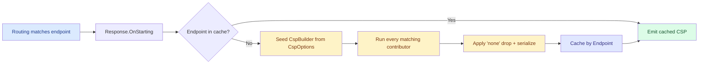

import { Aside } from "@astrojs/starlight/components";

You added Scalar to your ASP.NET Core API. You enabled `Granit.Http.SecurityHeaders`
(or another strict-by-default CSP middleware). You opened `/scalar` in the
browser. The page is blank. The console is red:

```text
Refused to execute inline script because it violates the following Content
Security Policy directive: "default-src 'none'".

Refused to load the font 'https://fonts.scalar.com/...' because it violates
the following Content Security Policy directive: "default-src 'none'".
```

You search the issue, end up on Stack Overflow, and reach for the usual fix —
relax the **Content Security Policy** in `appsettings.Development.json`:

```json title="The band-aid everyone reaches for"
{
  "SecurityHeaders": {
    "ContentSecurityPolicy": "default-src 'self'; script-src 'self' 'unsafe-inline'; style-src 'self' 'unsafe-inline'; font-src 'self' https://fonts.scalar.com; img-src 'self' data: https:; connect-src 'self'"
  }
}
```

Scalar renders again. Six months later, the same override has been
copy-pasted into every new service, the `'unsafe-inline'` from one HTML page
is now applied to **every JSON endpoint** in your API, and the strict
default you carefully chose at the start has quietly become folklore.

This is not a Granit problem. It is not a Scalar problem. It is the
**structural limit of treating CSP as a single application-wide string** —
and Granit 0.31 fixes it for good. This article walks through the pain,
the pattern, and the audit hook you can show your security team.

## Why a single CSP string can't survive contact with reality

A Content Security Policy is conceptually one rule per HTML response. The
ASP.NET Core machinery is route-shaped: each endpoint can have its own
metadata, its own auth requirements, its own response shape. Routes that
serve JSON, routes that serve HTML, and routes that serve binary downloads
have **fundamentally different CSP needs** — and yet most middleware
exposes CSP as a single string applied to every response.

The moment one package in your application mounts an HTML surface, you have
a structural conflict:

- **Strict everywhere** — Scalar (or your admin page, or your Keycloak silent-SSO iframe) breaks.
- **Relaxed everywhere** — `'unsafe-inline'` leaks into every API response. ASVS V14.4.7 starts caring. Your security team starts caring.

The override gets pushed to dev-only as a compromise. Then the override gets
mirrored to production for "consistency." Then the next framework package
ships another HTML route. The override grows another paragraph. **Nobody
remembers what the strict default looked like.**

The fix is not a better string. The fix is to stop treating CSP as a single
string at all.

## The pattern: packages declare, the framework composes

Granit 0.31 ships an inverted ownership model. The package that **mounts the
UI surface** owns the CSP relaxation **for that route only**. A small
contract lives in `Granit.Http.SecurityHeaders.Abstractions`:

```csharp title="ICspContributor.cs"
public interface ICspContributor
{
    string Name => GetType().Name;

    void Contribute(HttpContext context, CspBuilder builder);
}
```

A contributor is a tiny class — usually `internal sealed` — that says "on
routes matching X, add Y to the policy." Every package that needs a CSP
relaxation ships one. At response-emission time, the composer in
`Granit.Http.SecurityHeaders`:

1. Resolves the matched endpoint.
2. Seeds a `CspBuilder` from the typed base policy (`SecurityHeaders:Csp`).
3. Lets every contributor that applies layer its sources on top.
4. Emits a single `Content-Security-Policy` header for that response.
5. Caches the result keyed by the matched `Endpoint`.

Your `appsettings.json` keeps its strict default. **Unchanged. Forever.**

## For the consumer: literally nothing changes

If you're consuming Granit, you write zero CSP code. Reference the bundle,
use the middleware, you're done:

```csharp title="Program.cs"
var builder = WebApplication.CreateBuilder(args);

builder.AddGranit<AppModule>(granit => granit.AddApi());

var app = builder.Build();
app.UseGranitExceptionHandling();
app.UseGranitSecurityHeaders();
app.UseGranitApiDocumentation();   // Mounts /scalar
app.MapControllers();
app.Run();
```

Inside `UseGranitApiDocumentation`, the framework registers a
`ScalarCspContributor` automatically. The Scalar route gets exactly the
sources it needs (`'unsafe-inline'`, `https://fonts.scalar.com`, …). Every
other route — your API endpoints, your health checks, your auth callbacks —
keeps the strict baseline:

```text
default-src 'none'; base-uri 'none'; frame-ancestors 'none'
```

Open `/scalar` in your browser. It works. Open the `/api/v1/patients`
endpoint and inspect the response headers. The CSP is strict. No
`appsettings.Development.json` override. No `'unsafe-inline'` leaking into
your JSON responses. No band-aid to maintain.

## For framework authors: writing a contributor

If you publish a NuGet package that mounts an HTML route, you ship the
contributor alongside it. Total cost: one file, ~15 lines. Here is the
real implementation that ships with `Granit.Http.ApiDocumentation`:

```csharp title="ScalarCspContributor.cs"
internal sealed class ScalarCspContributor : ICspContributor
{
    public void Contribute(HttpContext context, CspBuilder builder)
    {
        if (context.GetEndpoint()?.Metadata.GetMetadata<ScalarApiReferenceMetadata>() is null)
        {
            return;
        }

        builder
            .AddDefaultSrc("'self'")
            .AddScriptSrc("'self'", "'unsafe-inline'")
            .AddStyleSrc("'self'", "'unsafe-inline'")
            .AddFontSrc("'self'", "data:", "https://fonts.scalar.com")
            .AddImgSrc("'self'", "data:", "https:")
            .AddConnectSrc("'self'");
    }
}
```

Two design choices worth noting:

- **Endpoint metadata, not URL paths.** The contributor branches on
  `Endpoint.Metadata`, not on `Request.Path`. The marker
  (`ScalarApiReferenceMetadata`) is attached when the route is mapped, and
  the composer caches results per `Endpoint`. URL renaming, route prefixes,
  versioning — none of it breaks the relaxation, because the metadata
  travels with the endpoint.
- **No-op when not matched.** If the contributor doesn't apply, `Contribute`
  returns immediately. Every contributor runs on every request, but the
  cost of "not me" is a single null-check.

Registration happens in the package's `Use*` extension, behind the same
gate that mounts the UI:

```csharp title="ApiDocumentationApplicationBuilderExtensions.cs"
public static IApplicationBuilder UseGranitApiDocumentation(this WebApplication app)
{
    if (!shouldEnableScalar) return app;

    app.MapScalarApiReference(/* ... */)
       .WithMetadata(new ScalarApiReferenceMetadata());

    var registry = app.Services.GetService<ICspContributorRegistry>();
    registry?.Add(new ScalarCspContributor());

    return app;
}
```

One source of truth: "Scalar is on" implies "Scalar's CSP relaxation is on,"
because both branches happen behind the same condition. Drop Scalar from
your build and the relaxation drops with it.

## For your own app: relax one route, leave the rest strict

The same interface is public, which means **your application can write
contributors too** — for routes that aren't owned by any framework package.

The canonical case: Keycloak's JS adapter loads `/silent-check-sso.html`
in a same-origin iframe to refresh tokens silently. The strict default
`frame-ancestors 'none'` blocks the iframe. The file lives in your SPA's
`public/` directory; no framework package can ship a contributor for it.

Six lines of code:

```csharp title="SilentCheckSsoCspContributor.cs"
internal sealed class SilentCheckSsoCspContributor : ICspContributor
{
    public void Contribute(HttpContext context, CspBuilder builder)
    {
        if (!context.Request.Path.Equals(
                "/silent-check-sso.html",
                StringComparison.OrdinalIgnoreCase))
        {
            return;
        }

        builder.AddFrameAncestors("'self'");
    }
}
```

```csharp title="Program.cs"
var registry = app.Services.GetService<ICspContributorRegistry>();
registry?.Add(new SilentCheckSsoCspContributor());
```

`frame-ancestors 'self'` is relaxed only on `/silent-check-sso.html`. Every
other route keeps `frame-ancestors 'none'`. Your global `XFrameOptions:
"DENY"` setting stays unchanged — for modern browsers, CSP
`frame-ancestors` supersedes `X-Frame-Options`, and the composer handles
that for you.

The pattern is the same whether you're consuming a Granit package, writing
one, or relaxing a single route in your own app. **The unit of CSP
composition is the route, never the application.**

## Verifying what's actually applied: the audit endpoint

"Trust me, the CSP is strict on every API route" is not a conversation that
ends well with a security auditor. `Granit.Http.SecurityHeaders.Endpoints`
ships an opt-in audit endpoint:

```csharp title="Program.cs"
app.MapGranitSecurityHeadersAudit();
// GET /security-headers/csp
// Gated by DiagnosticsPermissions.Monitoring.Read
```

Curl it from outside the deployment:

```json title="GET /security-headers/csp"
{
  "baseDirectives": {
    "default-src": ["'none'"],
    "base-uri": ["'none'"],
    "frame-ancestors": ["'none'"]
  },
  "contributors": [
    { "name": "ScalarCspContributor", "fullTypeName": "Granit.Http.ApiDocumentation.Internal.ScalarCspContributor" }
  ],
  "endpoints": [
    {
      "pattern": "/scalar",
      "headerName": "Content-Security-Policy",
      "composedCsp": "default-src 'self'; script-src 'self' 'unsafe-inline'; ..."
    },
    {
      "pattern": "/api/v1/patients/{id}",
      "headerName": "Content-Security-Policy",
      "composedCsp": "default-src 'none'; base-uri 'none'; frame-ancestors 'none'"
    }
  ]
}
```

Three concrete uses:

- **Security review** — auditors verify per-route CSP from a black-box
  position, no code access, no container access.
- **CI drift detection** — snapshot the response in your pipeline; fail the
  build if a contributor silently relaxes a route that shouldn't be
  relaxed.
- **Onboarding** — new developers see at a glance which routes are
  permissive and which aren't, without grepping the codebase.

The endpoint reuses the existing `DiagnosticsPermissions.Monitoring.Read`
permission — no new permission, no new ABAC policy, no new 18-language
localisation keys.

## How the composer keeps strict routes strict

The pattern only works if you can trust two things:

- A contributor can only relax CSP **on routes it owns**.
- No contributor (and no buggy upstream middleware) can sneak a relaxation
  onto your API routes.

The composer enforces both. Here's the per-request flow:



Three guarantees baked in:

- **The composer is the sole writer of `Content-Security-Policy`.** Any
  upstream code that wrote the header — a `[ResponseHeader]` attribute,
  output cache layer, another middleware — gets unconditionally
  overwritten. Browsers intersect multiple CSP headers and pick the
  strictest combination, which would silently neutralise relaxations and
  break the UI with no log line to explain why.
- **Contributors are pure functions of the endpoint.** The contract says
  contributors must branch only on `Endpoint.Metadata` and compile-time
  constants — not on the user, the tenant, or request headers. The cache
  is keyed by `Endpoint`, so request-scoped variation would leak across
  tenants once warm. Violations show up immediately in the audit endpoint
  (which under-reports them), making the bug visible.
- **You can opt a contributor out.** When an internal policy is stricter
  than the framework default — for instance, no `'unsafe-inline'` even in
  dev — disable the contributor by name in configuration:

  ```json title="appsettings.json — internal policy wins"
  {
    "SecurityHeaders": {
      "DisabledContributors": ["ScalarCspContributor"]
    }
  }
  ```

<Aside type="caution" title="Trap: `[ResponseHeader]` is silently overwritten">
If you previously set CSP via a `[ResponseHeader("Content-Security-Policy", ...)]`
attribute or another middleware, your value is **silently discarded** after
upgrading. This is intentional — the framework owns the header end-to-end —
but worth knowing when debugging an attribute that "doesn't take." If you
need unconditional control, set `Csp.RawOverride` to emit a string verbatim;
the composer will skip every contributor.
</Aside>

## Takeaways

- A single application-wide CSP string can't model a route-shaped reality.
  The moment one endpoint serves HTML, the global override starts.
- **Inverted ownership**: the package that mounts the UI declares its CSP
  relaxation via `ICspContributor`. Strict defaults stay strict on every
  other route.
- For consumers, **zero CSP code**: `UseGranitApiDocumentation` registers
  Scalar's contributor automatically. Your `appsettings.json` is untouched.
- For your own routes (Keycloak silent SSO, an admin page, anything),
  write a six-line contributor. Scoped to that route, no global impact.
- **Auditable from outside** the deployment via
  `GET /security-headers/csp`, gated by the existing diagnostics
  permission. Drop it into CI for drift detection.
- Three guarantees from the composer: sole writer of the header,
  contributors must be pure, opt-out by config name.

## Further reading

- [Security Headers — CSP contributors](/dotnet/security/security-headers/#csp-contributors) —
  full reference for `ICspContributor`, `CspBuilder`, `CspOptions`,
  `DisabledContributors`, and the audit endpoint.
- [API Documentation — CSP relaxation for Scalar](/dotnet/api/api-documentation/#csp-relaxation-for-scalar) —
  the `ScalarCspContributor` shipped with `Granit.Http.ApiDocumentation`
  and how to disable it.
- [Scalar Is the New Swagger UI](/blog/scalar-is-the-new-swagger-ui/) —
  the UI surface that motivated this redesign.
- [Adding Authentication with Keycloak in Granit](/blog/adding-authentication-with-keycloak-in-granit/) —
  the silent-SSO setup whose CSP need is solved by the consumer-side
  contributor.
