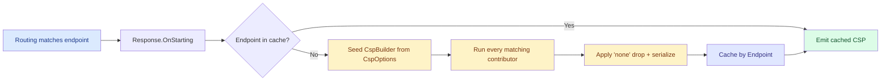

import { Aside } from "@astrojs/starlight/components";

`Content-Security-Policy` is two policies in one header. A strict API-grade
policy — `default-src 'none'; base-uri 'none'; frame-ancestors 'none'` — is
exactly right for the JSON endpoints that serve 99% of an API's traffic. The
moment a single route serves HTML (Scalar, an admin page, Keycloak's
silent-check-sso), the strict policy breaks the page, you relax the policy
application-wide in `appsettings.Development.json`, and the strict default is
now a strict default that nobody actually runs.

Granit 0.31 inverts the ownership model. The package that **mounts the UI
surface** declares its own CSP relaxation. The composer in
`Granit.Http.SecurityHeaders` reads the matched endpoint at response-emission
time, merges every contributor that applies, and emits a per-endpoint policy.
The consumer's `appsettings.json` keeps its strict default — unchanged,
unconditionally.

This article walks through the design: the `ICspContributor` interface that
makes the inversion possible, why it ships in a separate
`.Abstractions` package, the purity contract that lets the composer cache
aggressively, the escape hatches for stricter internal policies, and the
audit endpoint that gives security auditors a snapshot of the effective
per-route policy from outside the deployment.

## The pain — a single string, many surfaces

Before 0.31, `Granit.Http.SecurityHeaders` exposed CSP as a single string
property:

```json title="appsettings.json — old model"
{
  "SecurityHeaders": {
    "ContentSecurityPolicy": "default-src 'none'; frame-ancestors 'none'; base-uri 'none'"
  }
}
```

`Granit.Http.ApiDocumentation` mounts Scalar at `/scalar`. Scalar needs an
inline bootstrap script, inline styles, and `https://fonts.scalar.com`. The
strict default blocks all three, the Scalar page renders blank, the developer
opens the browser console, sees a wall of CSP violations, and ends up writing
this in `appsettings.Development.json`:

```json title="appsettings.Development.json — the band-aid"
{
  "SecurityHeaders": {
    "ContentSecurityPolicy": "default-src 'self'; script-src 'self' 'unsafe-inline'; style-src 'self' 'unsafe-inline'; font-src 'self' https://fonts.scalar.com; img-src 'self' data: https:; connect-src 'self'"
  }
}
```

This override now applies to **every endpoint** in development — the strict
policy on JSON endpoints disappears, replaced by `'unsafe-inline'` everywhere.
The override gets copy-pasted into every new service. When the next framework
package ships an HTML surface (a Razor consent UI, a job dashboard, a
documented BFF challenge page), the band-aid grows another paragraph. The
strict default becomes folklore.

The structural problem is ownership. **The consumer is forced to know which
packages need which CSP relaxations.** That coupling is wrong: the package
that mounts the UI knows exactly what it needs; the consumer doesn't, and
shouldn't have to.

## The inversion — `ICspContributor`

The new contract ships in `Granit.Http.SecurityHeaders.Abstractions`, a
zero-runtime-dependency contracts package:

```csharp title="ICspContributor.cs"
public interface ICspContributor
{
    string Name => GetType().Name;

    void Contribute(HttpContext context, CspBuilder builder);
}
```

A contributor is the unit of CSP composition: a small class — usually
`internal sealed` — that declares "on routes matching X, add Y to the
policy." The implementation for Scalar lives inside
`Granit.Http.ApiDocumentation`, alongside the code that mounts the UI:

```csharp title="ScalarCspContributor.cs"
internal sealed class ScalarCspContributor : ICspContributor
{
    public void Contribute(HttpContext context, CspBuilder builder)
    {
        if (context.GetEndpoint()?.Metadata.GetMetadata<ScalarApiReferenceMetadata>() is null)
        {
            return;
        }

        builder
            .AddDefaultSrc("'self'")
            .AddScriptSrc("'self'", "'unsafe-inline'")
            .AddStyleSrc("'self'", "'unsafe-inline'")
            .AddFontSrc("'self'", "data:", "https://fonts.scalar.com")
            .AddImgSrc("'self'", "data:", "https:")
            .AddConnectSrc("'self'");
    }
}
```

Registration happens in `UseGranitApiDocumentation`, gated by the same
condition that mounts the Scalar endpoint in the first place:

```csharp title="ApiDocumentationApplicationBuilderExtensions.cs"
public static IApplicationBuilder UseGranitApiDocumentation(this WebApplication app)
{
    if (!shouldEnableScalar) return app;

    app.MapScalarApiReference(/* ... */)
       .WithMetadata(new ScalarApiReferenceMetadata());

    var registry = app.Services.GetService<ICspContributorRegistry>();
    registry?.Add(new ScalarCspContributor());

    return app;
}
```

One source of truth: "Scalar is on" implies "Scalar's CSP relaxation is on,"
because both branches happen behind the same gate. The consumer's
`Program.cs` never mentions CSP — and never has to.

## Why a separate `.Abstractions` package

`Granit.Http.ApiDocumentation` references **only**
`Granit.Http.SecurityHeaders.Abstractions`, not the runtime middleware. The
runtime — middleware, options validators, HSTS extensions, composer — is
pulled in by the consumer's `Granit.Bundle.Essentials`. ApiDocumentation has
no opinion on whether the consumer wants Granit-managed security headers, an
external middleware, or none at all.

If `Granit.Http.SecurityHeaders` is absent from the host,
`GetService<ICspContributorRegistry>()` returns `null`, the registration
silently no-ops with a `LogDebug`, and Scalar renders against whatever CSP
(or absence thereof) the consumer has chosen. This mirrors the
`Microsoft.Extensions.Logging.Abstractions` pattern — a library can target
`ILogger` without forcing a logging provider.

The split has a second benefit: the `.Abstractions` package contains pure
contracts and a validating builder. No `InternalsVisibleTo`, no shared state,
no runtime dependencies beyond `Microsoft.AspNetCore.Http.Abstractions`. An
alternative composer implementation (a different middleware, a test harness,
a static analyzer) can consume the same contributors without touching
Granit's runtime.

## The composer and the per-endpoint cache

Composition happens inside `Response.OnStarting`, which fires **after**
routing has resolved the endpoint. The composer flow per request:



The cache key is `Endpoint` itself — the exact reference ASP.NET Core's
routing system holds, not the route pattern, not the URL. A 100-endpoint
application warms 100 cache slots and never recomposes again.

That cache only works if contributors are **pure functions of the matched
endpoint**. This is the purity contract, documented on `ICspContributor`:

<Aside type="caution">
Implementations MUST branch only on `context.GetEndpoint()?.Metadata` and
compile-time constants. Branching on the authenticated user, tenant,
request headers, or any other request-scoped state is forbidden — the cache
would leak that variation across tenants and users once it warms.
</Aside>

The cache is a `ConcurrentDictionary<Endpoint, string>`. It's cleared
automatically when `IOptionsMonitor<GranitSecurityHeadersOptions>` reports a
change (so toggling `DisabledContributors` at runtime takes effect without a
restart). A future `IsPure => false` opt-out is sketched in the source for
when a per-request nonce contributor lands, but **purity is the default and
the explicit contract today.**

## The composer owns the header

There is exactly one writer of `Content-Security-Policy` in a Granit
application: the composer. Before writing, it unconditionally removes any
existing CSP header from the response. Rationale: browsers intersect multiple
CSP headers and pick the **strictest** combination of every directive — which
silently neutralises the contributor's relaxation and produces UI breakage
that no log line explains.

<Aside type="caution" title="Trap — `[ResponseHeader]` is silently overwritten">
Any external `[ResponseHeader("Content-Security-Policy", ...)]` attribute,
output cache layer, or upstream middleware that writes CSP **will be silently
overwritten** by the composer. This is intentional — the framework owns the
header end-to-end — but surprising when you're debugging an attribute that
"doesn't take." If unconditional control is required, set
`CspOptions.RawOverride`; the composer will emit that string verbatim and
skip every contributor.
</Aside>

## Configuration surface

The base policy comes from `CspOptions`, bound from `SecurityHeaders:Csp`.
Named properties per directive — no `IDictionary<string, IList<string>>`,
because dictionary keys are typo-silent and environment-variable binding
across shells is fragile with hyphenated keys (`SecurityHeaders__Csp__Directives__script-src__0`
is asking for trouble).

```json title="appsettings.json — typed base policy"
{
  "SecurityHeaders": {
    "Csp": {
      "DefaultSrc": ["'self'"],
      "ScriptSrc": ["'self'"],
      "FontSrc": ["'self'", "https://fonts.granitfx.io"]
    },
    "DisabledContributors": []
  }
}
```

Defaults are deliberately strict: `DefaultSrc`, `BaseUri`, and
`FrameAncestors` all default to `['none']`; every other directive is empty
and inherits from `default-src 'none'` per CSP semantics. The composer drops
`'none'` from any directive that ends up containing real sources (CSP spec
rule — `'none'` cannot coexist).

Two escape hatches for the operator:

- **`DisabledContributors: ["ScalarCspContributor"]`** — opt out of a
  contributor by name when an internal policy is stricter than the framework
  default. Matched against `ICspContributor.Name` (defaults to the runtime
  type name via a C# default interface method).
- **`Csp.RawOverride: "..."`** — emergency override. Emitted verbatim,
  contributors skipped. A `LogWarning` fires at startup so the bypass is
  visible to operators; this is documented as a hatch for emergencies, not a
  permanent contract.

## A consumer-side worked example — Keycloak silent SSO

The pattern is not framework-only. The same interface lives in
`.Abstractions`, which means consumer applications can write their own
contributors without forking anything. Take Keycloak's JS adapter: it loads
`/silent-check-sso.html` in a same-origin iframe to refresh tokens silently.
The strict default `frame-ancestors 'none'` blocks the iframe.

```csharp title="SilentCheckSsoCspContributor.cs"
internal sealed class SilentCheckSsoCspContributor : ICspContributor
{
    public void Contribute(HttpContext context, CspBuilder builder)
    {
        if (!context.Request.Path.Equals(
                "/silent-check-sso.html",
                StringComparison.OrdinalIgnoreCase))
        {
            return;
        }

        builder.AddFrameAncestors("'self'");
    }
}
```

Register the contributor in `Program.cs`, scope the relaxation to that one
route, keep `frame-ancestors 'none'` everywhere else. For modern browsers,
CSP `frame-ancestors` supersedes the legacy `X-Frame-Options` — the global
`XFrameOptions: "DENY"` setting stays unchanged. The composer takes care of
the conflict-resolution semantics; the consumer writes six lines of code and
never edits the global policy again.

## The audit endpoint

`Granit.Http.SecurityHeaders.Endpoints` is a separately-packaged opt-in that
ships a single endpoint: `GET /security-headers/csp`. It returns the
effective per-endpoint CSP, the base directives, and the list of registered
contributors as a JSON snapshot:

```csharp title="Program.cs — opt-in audit endpoint"
app.MapGranitSecurityHeadersAudit();
```

```json title="GET /security-headers/csp"
{
  "baseDirectives": {
    "default-src": ["'none'"],
    "base-uri": ["'none'"],
    "frame-ancestors": ["'none'"]
  },
  "rawOverride": null,
  "reportOnly": false,
  "contributors": [
    { "name": "ScalarCspContributor", "fullTypeName": "Granit.Http.ApiDocumentation.Internal.ScalarCspContributor" }
  ],
  "endpoints": [
    {
      "httpMethods": ["GET"],
      "pattern": "/scalar",
      "displayName": "Scalar",
      "headerName": "Content-Security-Policy",
      "composedCsp": "default-src 'self'; script-src 'self' 'unsafe-inline'; ..."
    },
    {
      "httpMethods": ["GET"],
      "pattern": "/api/v1/patients/{id}",
      "displayName": "GET /api/v1/patients/{id}",
      "headerName": "Content-Security-Policy",
      "composedCsp": "default-src 'none'; base-uri 'none'; frame-ancestors 'none'"
    }
  ]
}
```

The endpoint is gated by `DiagnosticsPermissions.Monitoring.Read` — the same
permission already used by health checks and the diagnostics API. No new
permission, no new 18-language localisation keys, no new ABAC policy to
write.

A security auditor verifying the deployment doesn't need access to the
container, the source code, or the build pipeline. They `curl` the endpoint
from outside, pipe the response to `jq`, and compare against the
organisation's CSP baseline. Drift detection runs in CI by comparing two
snapshots.

There's a caveat, documented in the response payload and the OpenAPI
description: the audit synthesises requests carrying only the matched
endpoint. Contributors that respect the purity contract report identically
to runtime; contributors that branch on request-scoped state beyond
`Endpoint.Metadata` will under-report. That's a feature, not a bug — it's
also the diagnostic that surfaces purity violations during a security
review.

## Trade-offs and what's deferred

The pattern is **CSP-only by design**. Multi-package composition only makes
sense for headers with additive semantics — multiple sources can coexist in
one CSP directive. `X-Frame-Options`, `Referrer-Policy`, COOP/COEP/CORP are
scalar single-value headers where "combining two contributors" has no defined
meaning. They remain global scalar settings in
`GranitSecurityHeadersOptions`. `Permissions-Policy` technically qualifies
but no framework package currently needs to relax it; the generalisation
will land when a real case arrives.

`prefetch-src` is dropped (deprecated in CSP Level 3). `sandbox` is deferred
to a dedicated PR — its token-based semantics and "empty directive equals
maximum sandboxing" rule warrant a separate design pass.

Two runtime hardenings worth knowing:

- **Production + `'unsafe-inline'`** — when `IHostEnvironment.IsProduction()`
  is true and any contributor emits `'unsafe-inline'`, the composer logs a
  warning once per contributor at startup-equivalent time. ASVS V14.4.7
  considers `'unsafe-inline'` an XSS surface; the warning is a hint to
  migrate to nonces or hashes before that surface becomes an incident.
- **Nonce × `'unsafe-inline'` collision** — per CSP spec, a nonce or hash
  source suppresses `'unsafe-inline'` in the same directive. The composer
  detects the coexistence and logs a warning once per affected endpoint
  (cache-bounded). This is silent breakage in waiting; the log line catches
  it before browsers do.

## Takeaways

- A single application-wide CSP string forces consumers to know which
  packages need which relaxations. **Wrong ownership.**
- `ICspContributor` in `Granit.Http.SecurityHeaders.Abstractions` lets each
  package declare its own relaxation, scoped to the endpoint it owns via
  metadata.
- The composer runs in `Response.OnStarting` (after routing), caches the
  composed header per `Endpoint`, and is the **sole writer** of
  `Content-Security-Policy` — silently overwriting any upstream attempt to
  set it.
- **Purity contract**: contributors branch only on endpoint metadata. The
  cache enforces it via under-reporting in the audit endpoint, not via
  runtime guards.
- Operator escape hatches: `DisabledContributors` to opt a contributor out;
  `Csp.RawOverride` for emergencies.
- `Granit.Http.SecurityHeaders.Endpoints` ships a `/security-headers/csp`
  audit endpoint gated by the existing
  `DiagnosticsPermissions.Monitoring.Read` permission — auditable from
  outside the deployment, scriptable in CI.

## Further reading

- [Security Headers — CSP contributors](/dotnet/security/security-headers/#csp-contributors) —
  full reference for `ICspContributor`, `CspBuilder`, `CspOptions`, and the
  audit endpoint.
- [API Documentation — CSP relaxation for Scalar](/dotnet/api/api-documentation/#csp-relaxation-for-scalar) —
  the `ScalarCspContributor` and how to disable it.
- [Scalar Is the New Swagger UI — Here's How to Switch](/blog/scalar-is-the-new-swagger-ui/) —
  the UI surface that motivated the inversion.
- [100+ Packages, Zero Circular Dependencies](/blog/zero-circular-dependencies/) —
  why splitting `.Abstractions` from runtime is a recurring Granit pattern,
  not a one-off.
