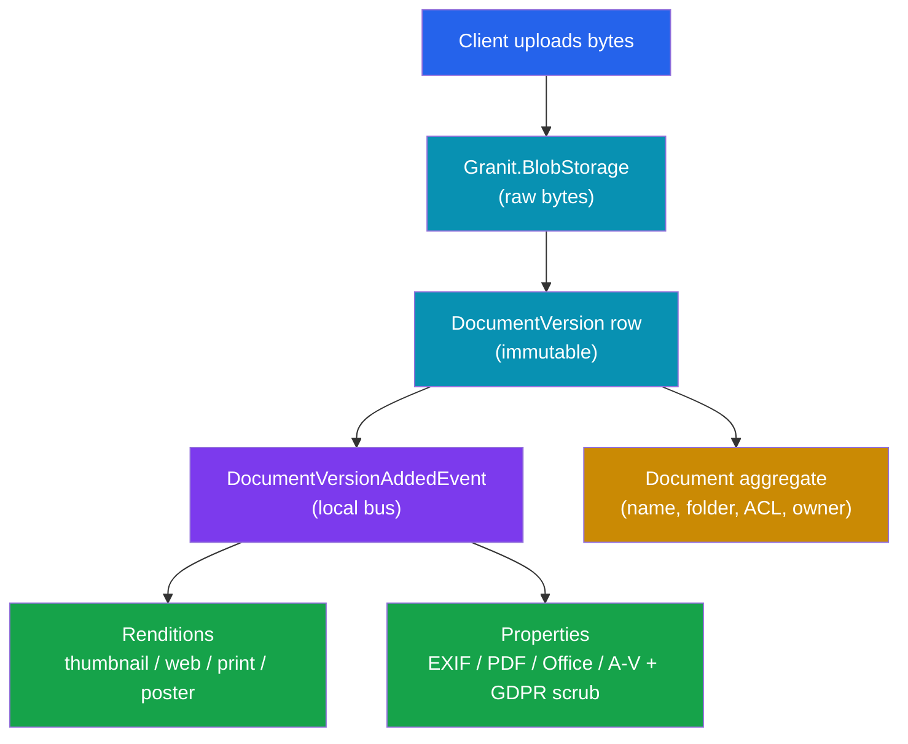
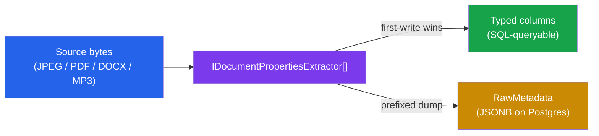

import { Aside, Tabs, TabItem } from "@astrojs/starlight/components";

A user uploads a 30 MB contract. You save the bytes. Ship it, right?

Then the list view needs a **thumbnail**. The reviewer wants a **PDF preview** in the browser without downloading 30 MB. Someone asks "which camera shot this photo?" and "who authored this Word file?" — so now you need **searchable metadata**. Finally, sales wants to email the contract to a client who has no account, and legal wants that link to **expire in 7 days**.

Storing the file was the easy 20%. The other 80% is the part every team reinvents — badly, three times, with three different leak vectors. This post shows how **document management in .NET** looks when renditions, properties, and secure public links are already solved: store a document, generate a thumbnail and a preview, attach typed metadata, and mint a time-limited signed link that never exposes your blob store.

## The three planes you actually need

Before any code, get the mental model right. A grown-up document system has three storage planes, and conflating them is the root cause of most homegrown messes.

| Plane | What lives here | Why separate |
| --- | --- | --- |
| Blob | The raw uploaded bytes | Cheap object storage, presigned, never touches your app tier |
| Version | One immutable row per upload | Version history, quota accounting |
| Document | The user-facing aggregate (name, folder, owner, ACL) | Permissions, trash, search |

`Granit.Documents` owns the top two planes and delegates the bytes to `Granit.BlobStorage`. It never stores a single byte itself. Around that core sit three **Business Feature** modules — Renditions, Properties, and Public Links — each in its own package with its own database context. They all react to the same `DocumentVersionAddedEvent`, and they run independently. That independence is the whole point: you reference the ones you need and none of the ones you don't.

<Aside type="note">
These document modules are **Business Features** — they live in the `granit-business`
repo, not in the framework core. Building Blocks ship with the framework; Business
Features are opt-in modules you compose on top. Don't conflate the two.
</Aside>

Here is the shape of the whole pipeline. One upload fans out into three parallel reactions.



## Wiring it up

The bad way to start a document feature is to hand-roll an upload controller, a thumbnail job, an EXIF parser, and a token scheme. That is four subsystems, four sets of bugs, and a weekend you never get back.

The good way is composition. Each concern is a package plus a one-line registration. Here is the full host wiring for the core plus all three feature modules:

```csharp title="Program.cs"
var builder = WebApplication.CreateBuilder(args);

// Core: documents + blobs + versions
builder.Services.AddGranitDocuments();
builder.AddGranitDocumentsEntityFrameworkCore(o => o.UseNpgsql(connString));

// Renditions: thumbnails, web previews, print, poster
builder.Services.AddGranitDocumentsRenditions();
builder.AddGranitDocumentsRenditionsEntityFrameworkCore(o => o.UseNpgsql(connString));
builder.Services.AddGranitDocumentsRenditionsWolverine();
builder.AddGranitImagingMagickNet();
builder.Services.AddGranitDocumentsRenditionsImaging();
builder.Services.AddGranitBrowsingPlaywright(o => o.Engine = BrowserEngine.Chromium);
builder.Services.AddGranitDocumentsRenditionsPdf();
builder.Services.AddGranitDocumentsRenditionsOffice();

// Properties: descriptive metadata + GDPR scrubs
builder.Services.AddGranitDocumentsProperties();
builder.AddGranitDocumentsPropertiesEntityFrameworkCore(o => o.UseNpgsql(connString));
builder.Services.AddGranitDocumentsPropertiesImaging();
builder.Services.AddGranitDocumentsPropertiesPdf();
builder.Services.AddGranitDocumentsPropertiesOffice();
builder.Services.AddGranitDocumentsPropertiesAudioVideo();
builder.Services.AddGranitDocumentsPropertiesBackgroundJobs();
builder.Services.AddGranitDocumentsPropertiesEndpoints();

var app = builder.Build();

app.MapGroup("/api")
   .MapGranitDocuments()
   .MapGranitDocumentsRenditions()
   .MapGranitDocumentsProperties();

app.Run();
```

Every `AddGranitDocumentsProperties*Xxx()` provider line is optional. Don't need audio and video metadata? Drop `AddGranitDocumentsPropertiesAudioVideo()` and the `TagLibSharp` dependency never enters your graph. Each provider package references exactly one third-party parser — the base contract references none of them. That is module isolation doing its job.

## Renditions: one thumbnail, five source formats

Here is the trap teams fall into. They wire up an image resizer for JPEGs, feel good, then a user uploads a `.docx`. Now they need a Word-to-image path. Then a PDF. Then a spreadsheet. Each format is a bespoke conversion, and the list view still can't render a uniform tile.

**Renditions** solve this with a provider chain. Each provider declares a single MIME-to-MIME hop:

| Source | Output | Provider |
| --- | --- | --- |
| `image/*` | `image/*` (resized, EXIF stripped) | `Granit.Documents.Renditions.Imaging` |
| `application/pdf` | `image/png` | `Granit.Documents.Renditions.Pdf` |
| Office (docx / xlsx / pptx + legacy + ODF + RTF) | `application/pdf` | `Granit.Documents.Renditions.Office` |

The `IRenditionPipeline` is a **BFS solver**: it finds the shortest chain from the source format to the target you asked for. A Word document becomes a WebP thumbnail through a three-hop chain that composes for free:

```text
docx → pdf → png → webp     (Office → Pdf → Imaging)
```

That is exactly the default `MaxChainLength` of 3. You register the edges; the solver builds the path. No branching on MIME type in your own code.

### The generation strategy that keeps uploads fast

Generating a rendition can be slow — LibreOffice converting a 50-page deck is not something you want blocking an HTTP request. So Granit splits the work into two paths.

**Inline for tiny image thumbnails.** For `image/*` uploads, `InlineThumbnailHandler` runs the resize in-band and lands a `Ready` thumbnail before the async handler even fires — but only if the encoded output stays under `InlineThumbnailMaxBytes` (default **100 KB**). Bigger outputs get dropped and deferred, so the upload latency stays predictable.

**Async for everything else.** `DocumentVersionAddedRenditionsHandler` asks the policy which renditions to build, then runs the pipeline per target with concurrency capped at `MaxConcurrentGenerations` (default 4). The default policy:

| Source | Renditions generated |
| --- | --- |
| `image/*` | Thumbnail + Web (`image/webp`) |
| `application/pdf` | Thumbnail |
| Office documents | Thumbnail |
| anything else | none |

Retrieving a rendition is one call to a presigned-URL endpoint — the bytes stream from storage, never through your app tier:

```csharp title="RenditionEndpoints.cs"
// GET /documents/{id}/renditions
//   -> lists every rendition row for the current version (any status)
// GET /documents/{id}/renditions/{type}/download?format=image/webp
//   -> returns a presigned URL for a Ready rendition
```

Both endpoints require `Documents.Documents.Read`. Pass `?format=` to disambiguate when several MIMEs are ready for the same type.

<Aside type="caution" title="User uploads are hostile input">
The Office and PDF providers shell out to large native engines, so Granit treats
both as adversarial. `soffice --headless` runs in a per-invocation temp profile with
a hard 60-second timeout, killed and cleaned up on overrun. The PDF provider never
parses PDFs in-process — it renders pages through a sandboxed Chromium engine and
fails fast at boot if no headless browser is registered. No LibreOffice or PDF library
is linked into the framework; only the LGPL binary is invoked at runtime.
</Aside>

## Properties: metadata you can actually query

Renditions give you a picture. **Properties** give you the facts behind it: the camera model, the page count, the PDF producer, the ID3 tags. Without them you cannot build "every photo shot with a Canon EOS R5" without a full-table scan and per-row JSON parsing.

The extractor chain mirrors the rendition one — a provider per source family, each pulling exactly one NuGet dependency:

| Source | Library | Typed columns |
| --- | --- | --- |
| `image/*` | `MetadataExtractor` | `Width`, `CameraMake`, `Iso`, `FNumber`, `TakenAt`, GPS |
| `application/pdf` | `PdfPig` | `PageCount`, `Title`, `Author`, `Producer` |
| OOXML | `DocumentFormat.OpenXml` | `PageCount`, `Title`, `Author`, `Revision` |
| `audio/*`, `video/*` | `TagLibSharp` | `DurationMs`, `Codec`, `Artist`, `Album` |

### Why not just dump JSON?

Two naive shapes both fail. **Blob-only** — store the raw dump, project nothing — is unsearchable. **Column-only** — typed columns, drop the raw dump — makes forensics impossible when an extractor improves six months later and there's no payload to backfill from.

Granit uses the shape Cloudinary, Bynder, and Adobe AEM Assets all converged on: **indexed projection plus raw archive**. Every well-known field lifts to a typed column so SQL can filter and sort on it, while the full extractor payload is preserved verbatim in a single raw column.



You read it back per version:

```csharp title="PropertiesEndpoints.cs"
// GET /documents/{id}/metadata
// Response: every typed column at the top level, plus the verbatim
// extractor payload under rawMetadata, keyed {extractor}:{tag}:
//   "exif:Make", "pdf:Producer", "office:Author", "audio:Artist"
```

### The GDPR scrub you didn't know you needed

Here's a fact most teams learn the hard way: **photos carry GPS coordinates by default**, and Office and PDF files embed author and last-editor names. Your users don't realise their tooling did that. Serve those bytes to an anonymous public link and you've leaked a home address.

The Properties module strips both on upload, before the bytes reach cold storage. `StripGpsHandler` performs **JPEG APP1 segment surgery** — it rewrites the GPS-IFD pointer tag to a benign id, leaving every other EXIF entry at its exact byte offset. It is **strictly no re-encode**: the pixels come out bit-identical, no Magick.NET round-trip. Then it swaps the version's blob atomically and emits `DocumentBlobScrubbedEvent` for the audit trail.

Both scrubs are on by default:

```csharp title="appsettings.json"
{
  "Documents": {
    "Properties": {
      "StripGpsOnUpload": true,
      "StripPersonalDataOnUpload": true,
      "MaxConcurrentExtractions": 4,
      "ExtractionTimeout": "00:00:30"
    }
  }
}
```

`StripPersonalDataOnUpload` nulls the `Author`, `Artist`, and `LastModifiedBy` columns and drops PII-bearing keys from the raw archive. Hosts that legitimately need attribution — photo-journalism, asset licensing — flip the flag off and accept the residual risk. Everyone else gets minimisation for free.

## Secure public links: sharing without leaking the store

Now the hard part. Sales wants to email that contract to a client with no account. The naive move is to hand out a presigned blob URL directly. Three problems land immediately: the URL exposes your storage backend, you can't revoke it, and you can't tell when it was used.

`Granit.Documents.PublicLinks` mints opaque, token-signed URLs with a real security model. The design decisions are the interesting part.

**The token is returned exactly once.** `CreateAsync` generates a random 32-byte token (256 bits, CSPRNG) and returns it in the create response. The database stores only its **HMAC-SHA256 hash** — a 32-byte digest in a unique-indexed column. There is no "show token again" endpoint, because there is nothing to show; the plaintext never persisted.

```csharp title="CreatePublicLink.cs"
// POST /documents/{id}/public-links
// Requires: DocumentsPublicLinks.PublicLinks.Create
// Body: { scope: "Download" | "View", ttl, maxUses }
//
// 201 Created:
// {
//   "url": "/p/aBc123...",      // token — shown exactly once
//   "expiresAt": "2026-08-23T…"
// }
```

**Every failure returns 404.** Invalid hash, expired, revoked, max-uses exhausted, document missing — all indistinguishable. No body tells an attacker which case they hit, so there's nothing to probe. A random 256-bit token plus a per-IP fixed-window rate limiter (default 60/min) makes enumeration a non-starter.

Here is the redemption flow. Notice the bytes never touch your app tier — the anonymous endpoint 302-redirects to a short-lived presigned URL.

```mermaid
sequenceDiagram
    participant Admin
    participant API as PublicLinks API
    participant Svc as IDocumentPublicLinkService
    participant Store as DbContext
    participant Anon as Anonymous Client
    participant Bus as Integration bus

    Admin->>API: POST /documents/{id}/public-links
    API->>Svc: CreateAsync (token + HMAC-SHA256)
    Svc->>Store: Insert link (hash, scope, expiresAt, maxUses)
    Svc-->>Admin: 201 { url: /p/{token} }

    Note over Admin,Anon: Token sent out-of-band (email, share)

    Anon->>API: GET /p/{token}
    API->>Svc: ResolveAndConsumeAsync(token, maskedIp, ua)
    alt revoked / expired / exhausted / unknown
        Svc-->>Anon: 404 Not Found
    else valid
        Svc->>Store: RegisterConsumption + SaveChanges
        Svc->>Bus: Publish DocumentPublicLinkConsumedEto
        Svc-->>Anon: 302 Redirect to presigned blob URL
    end

    style Admin fill:#2563eb,color:#ffffff
    style Anon fill:#7c3aed,color:#ffffff
    style Bus fill:#16a34a,color:#ffffff
```

**Consumption is audited without a framework audit table.** Every redemption raises `DocumentPublicLinkConsumedEto` after the consumption row is durably persisted — so a Wolverine-outbox host commits the message atomically with the use-count increment. The client IP arrives already masked to /24 (IPv4) or /48 (IPv6): enough precision for fraud forensics, minimised enough for GDPR.

```csharp title="PublicLinkAuditHandler.cs"
public sealed class PublicLinkAuditHandler
{
    public static Task HandleAsync(
        DocumentPublicLinkConsumedEto evt,
        IPublicLinkAuditLog log,
        CancellationToken ct) =>
        log.AppendAsync(evt, ct);
}
```

Retention policy, redaction, and SIEM routing stay in your host, not the framework. And the security discipline is enforced by tests: an architecture suite forbids any public `Token` or `TokenHash` member outside a tiny audited allowlist, and forbids either field from appearing in a `[LoggerMessage]` template. The token cannot leak into a log line, because the build fails if it could.

Configuration caps the blast radius:

```json title="appsettings.json"
{
  "Granit": {
    "Documents": {
      "PublicLinks": {
        "DefaultTtl": "7.00:00:00",
        "MaxTtl": "90.00:00:00",
        "DefaultMaxUses": null,
        "RateLimitPerMinute": 60,
        "SigningKey": "<bound from Vault — 32+ bytes>"
      }
    }
  }
}
```

`SigningKey` is the HMAC pepper, bound from Vault in production. The service **refuses to mint tokens when it's empty** — no accidentally-collidable tokens in dev config that ship to prod.

## Takeaways

- **Storing bytes is 20% of document management.** Renditions, metadata, and secure sharing are the 80% teams reinvent — treat them as first-class from day one.
- **Renditions are a provider chain, not a switch statement.** A BFS solver composes `docx → pdf → png → webp` for free; you register MIME-to-MIME edges, never branch on format.
- **Metadata wants both shapes.** Indexed typed columns keep admin grids fast; a verbatim raw archive keeps forensics and re-extraction possible. Pick both.
- **GDPR is upload-time, not an afterthought.** GPS and author scrubs run before bytes reach cold storage — bit-identical pixels, no re-encode — so a public link can't leak a location.
- **Secure links are a security model, not a URL.** HMAC-hashed tokens shown once, 404 on every failure, per-IP rate limiting, masked-IP audit events, and Vault-bound signing keys — enforced by architecture tests, not good intentions.

## Further reading

- [Documents](/dotnet/business/documents/) — the core aggregate, ACL inheritance, quota, and trash lifecycle.
- [Documents — Renditions](/dotnet/business/documents-renditions/) — the full provider matrix, sandboxing model, and configuration knobs.
- [Documents — Properties](/dotnet/business/documents-properties/) — the extractor chain, storage model, and GDPR scrub internals.
- [Documents — Public Links](/dotnet/business/documents-public-links/) — the token model, failure-mode envelope, and complete security posture.
- [HTML to PDF with PuppeteerSharp and Scriban](/blog/html-to-pdf-puppeteersharp-scriban-templates/) — the rendering neighbour when you need to generate documents, not just derive previews from them.
- [Crypto-Shredding: GDPR Erasure Without Deleting Rows](/blog/crypto-shredding-gdpr-erasure-without-deleting-rows/) — how erasure works once those documents carry personal data.
