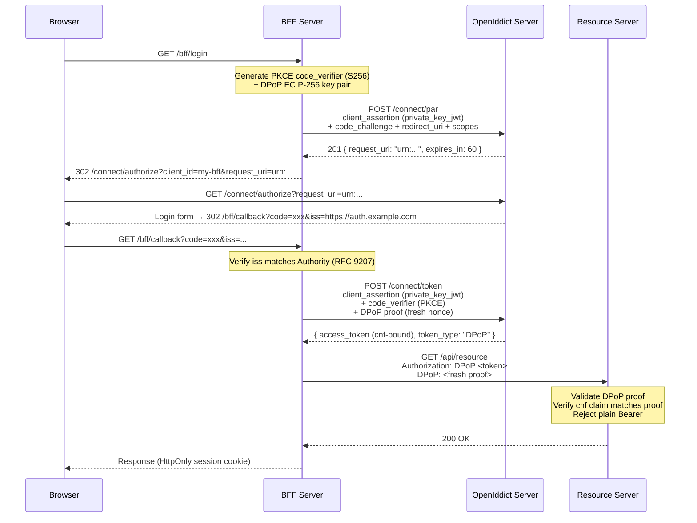

import { Aside, Tabs, TabItem } from "@astrojs/starlight/components";

Most teams discover FAPI 2.0 the same way: a compliance audit, an Open Banking integration requirement, or a healthcare customer's security questionnaire. The spec lists five mandatory constraints — PAR, DPoP, `private_key_jwt`, PKCE with S256, issuer verification — and the standard response is "add it to Q3 backlog."

Granit implements all five across the full stack: OpenIddict server, BFF proxy, and resource server validation. One config flag activates the server-side profile. The BFF and resource server each need a few JSON keys. No custom middleware, no RFC archaeology, no cryptography code.

## Why FAPI 2.0 exists

Standard OAuth 2.0 flows were not designed for environments where a stolen token means real financial or medical harm. FAPI 2.0 closes five specific attack vectors:

| Attack | What happens without mitigation | FAPI 2.0 fix |
|--------|----------------------------------|--------------|
| Authorization code interception | Attacker exchanges stolen code for tokens | PKCE with S256 (RFC 7636) |
| Parameter tampering in browser URL | Attacker modifies scopes or redirect URI | PAR (RFC 9126) — parameters sent via back-channel POST |
| Token replay from another device | Stolen access token used by attacker | DPoP (RFC 9449) — tokens bound to client's private key |
| Client secret leakage via proxy/WAF | Shared secret logged by infrastructure | `private_key_jwt` (RFC 7523) — no secret on the wire |
| IdP mix-up attack | Client sends authorization code to attacker's server | Issuer verification (RFC 9207) |

Each mitigation is a separate RFC. FAPI 2.0 makes all five mandatory and profiles exactly how they interact.

## Who needs it

FAPI 2.0 is explicitly required or strongly recommended in:

- **Open Banking** — PSD2 (EU), UK Open Banking, Berlin Group NextGenPSD2
- **Healthcare** — HL7 SMART on FHIR R2
- **Government identity** — eIDAS 2.0, Digital Identity frameworks
- **Insurance** — ACORD standards
- **Any API** handling financial transactions, health data, or government credentials

If none of these apply to you today, FAPI 2.0 is still worth understanding: it represents the current best-practice baseline for confidential OAuth 2.0 clients, and its patterns (DPoP, PAR) are being adopted in mainstream OAuth 2.1 profiles.

## The five requirements, mapped to Granit

| FAPI 2.0 requirement | RFC | Granit feature | Layer |
|----------------------|-----|----------------|-------|
| PKCE with S256 | RFC 7636 | `RequireProofKeyForCodeExchange()` — enforced by default | OpenIddict server |
| Pushed Authorization Requests | RFC 9126 | `RequirePar: true` (auto-set by `EnableFapi2Profile`) | OpenIddict server |
| Sender-constrained tokens via DPoP | RFC 9449 | `UseDPoP: true` on BFF frontend | BFF |
| DPoP enforcement on resource server | RFC 9449 | `RequireDPoP: true` | Resource server |
| `private_key_jwt` client authentication | RFC 7523 | `ClientAuthenticationMethod: PrivateKeyJwt` | BFF |
| Authorization response issuer verification | RFC 9207 | `RequireIssuerValidation: true` — default | BFF |
| Short-lived authorization codes (60s) | FAPI 2.0 SS5.3.2.1 | Auto-applied when `EnableFapi2Profile: true` | OpenIddict server |

PKCE is already enforced by default in every Granit OpenIddict deployment. Issuer verification is on by default in the BFF. FAPI 2.0 mode adds the remaining constraints.

## Enabling the profile

### Server

One flag on the OpenIddict server activates PAR enforcement and reduces authorization code lifetime to 60 seconds:

```json title="appsettings.json (identity server)"
{
  "OpenIddict": {
    "Issuer": "https://auth.example.com",
    "EnableFapi2Profile": true
  }
}
```

<Aside>
`EnableFapi2Profile` configures the **OpenIddict server only**. DPoP, `private_key_jwt`, and issuer verification must be configured separately on the BFF and resource server — see below.
</Aside>

### BFF

The BFF handles the authorization code flow on behalf of the SPA. For FAPI 2.0, it must use PAR, DPoP, and `private_key_jwt` instead of a shared client secret:

```json title="appsettings.json (BFF)"
{
  "Bff": {
    "Authority": "https://auth.example.com",
    "RequireIssuerValidation": true,
    "Frontends": [
      {
        "Name": "admin",
        "ClientId": "my-bff",
        "ClientAuthenticationMethod": "PrivateKeyJwt",
        "ClientSigningKeyJwk": "... EC P-256 private key JWK from Vault ...",
        "UsePushedAuthorizationRequests": true,
        "UseDPoP": true,
        "Scopes": ["openid", "profile", "email", "roles", "offline_access"]
      }
    ]
  }
}
```

<Aside type="caution">
Never store `ClientSigningKeyJwk` in `appsettings.json` for production. The private key must come from [Granit.Vault](/dotnet/data/vault/) or an environment variable:

```bash
export Bff__Frontends__0__ClientSigningKeyJwk='{"kty":"EC","crv":"P-256",...,"d":"..."}'
```
</Aside>

### Resource server

The API must reject plain Bearer tokens and require DPoP-bound tokens:

```json title="appsettings.json (API)"
{
  "Authentication": {
    "OpenIddict": {
      "Issuer": "https://auth.example.com",
      "Audience": "my-api",
      "RequireDPoP": true
    }
  }
}
```

### Seed the FAPI-compliant client

The OIDC application registered on the server must include the `ept:pushed_authorization` permission:

```json title="appsettings.json (identity server) — seeding"
{
  "OpenIddict": {
    "Seeding": {
      "Applications": [
        {
          "ClientId": "my-bff",
          "ClientSecret": null,
          "DisplayName": "My BFF (FAPI 2.0)",
          "SigningKeyJwk": "... EC P-256 public key JWK ...",
          "Permissions": [
            "ept:token", "ept:authorization", "ept:pushed_authorization", "ept:logout",
            "gt:authorization_code", "gt:refresh_token", "rst:code",
            "scp:openid", "scp:profile", "scp:email", "scp:roles", "scp:offline_access"
          ],
          "RedirectUris": ["https://app.example.com/bff/callback"],
          "PostLogoutRedirectUris": ["https://app.example.com/"]
        }
      ]
    }
  }
}
```

`ClientSecret: null` — with `private_key_jwt`, there is no shared secret. The client proves its identity by signing a JWT with its private key. The server verifies the signature against the registered `SigningKeyJwk` (public key only).

## How all five mechanisms work together

Here is the complete FAPI 2.0 flow with every protection layer active:



Each step closes a different attack vector:

1. **PAR** — authorization parameters never touch the browser URL
2. **`private_key_jwt`** — no shared secret, client identity proven by signature
3. **PKCE** — authorization code is bound to the original code verifier
4. **Issuer verification** — callback verifies the `iss` parameter matches the expected authority
5. **DPoP** — access token is bound to the BFF's private key; useless without it
6. **HttpOnly cookie** — the SPA never sees any token (see [Why Your React App Should Never Touch an Access Token](/blog/why-your-react-app-should-never-touch-an-access-token/))

## Compliance checklist

Use this table to verify your deployment against the FAPI 2.0 Security Profile before a conformance test:

| Requirement | RFC | Status in Granit | How to verify |
|-------------|-----|------------------|---------------|
| PKCE with S256 | RFC 7636 | Enforced by default | Send an auth request without `code_challenge` — expect `invalid_request` |
| PAR mandatory | RFC 9126 | Auto when `EnableFapi2Profile: true` | Send a direct `/connect/authorize` request — expect `400` |
| Auth code lifetime ≤ 60s | FAPI 2.0 SS5.3.2.1 | Auto when `EnableFapi2Profile: true` | Check `expires_in` on the PAR response |
| DPoP sender-constrained tokens | RFC 9449 | Set `UseDPoP: true` on BFF | Check `token_type: DPoP` in token response |
| DPoP enforcement on API | RFC 9449 | Set `RequireDPoP: true` on resource server | Send plain `Authorization: Bearer ...` — expect `401` |
| `private_key_jwt` client auth | RFC 7523 | Set `ClientAuthenticationMethod: PrivateKeyJwt` | Check that no `client_secret` is sent in token request |
| Issuer verification | RFC 9207 | Default on BFF | Tamper with `iss` in callback — expect `400` |
| Confidential client only | FAPI 2.0 SS5.3.1 | BFF enforces, SPA never receives tokens | Confirm SPA only has an HttpOnly session cookie |

## Token exchange for downstream services

In a microservices architecture, a backend service may need to call another API on behalf of the authenticated user. Token Exchange (RFC 8693) lets it exchange the incoming access token for a narrower, audience-restricted token — without exposing the user's full token to the downstream service.

Enable it on the server and grant the permission to your service:

```json title="appsettings.json"
{
  "OpenIddict": {
    "EnableTokenExchange": true,
    "Seeding": {
      "Applications": [
        {
          "ClientId": "my-backend-service",
          "Permissions": [
            "ept:token", "gt:client_credentials", "gt:token_exchange", "scp:api"
          ]
        }
      ]
    }
  }
}
```

## Reference tokens for strict compliance

For environments where instant revocation is non-negotiable (banking, healthcare), switch from self-contained JWTs to **opaque reference tokens**:

```json title="appsettings.json"
{
  "OpenIddict": {
    "UseReferenceTokens": true
  }
}
```

|  | JWT (default) | Reference token |
|--|---------------|-----------------|
| Validation | Offline (signature check) | DB lookup on every request |
| Revocation | Wait for expiry | Instant |
| Token size | ~1 KB | ~40 bytes |
| Performance | No DB call | +1 round-trip per request |

For high-traffic deployments with reference tokens, back the token store with Redis to avoid database pressure on every request.

## Takeaways

- FAPI 2.0 closes five specific OAuth 2.0 attack vectors: code interception, parameter tampering, token replay, credential leakage, and IdP mix-up.
- `EnableFapi2Profile: true` activates the server-side constraints (PAR mandatory, 60-second auth codes). PKCE is already enforced by default.
- DPoP and `private_key_jwt` must be configured on the BFF side — private keys come from Vault or environment variables, never `appsettings.json`.
- The resource server must set `RequireDPoP: true` to reject plain Bearer tokens.
- Token Exchange and reference tokens are available for microservice delegation and instant-revocation scenarios.

## Further reading

- [Pushed Authorization Requests (PAR)](/dotnet/security/openiddict/advanced/pushed-authorization-requests/) — how PAR works under the hood
- [DPoP — Proof-of-Possession](/dotnet/security/openiddict/advanced/proof-of-possession-dpop/) — token binding mechanics
- [Private Key JWT Authentication](/dotnet/security/openiddict/advanced/private-key-jwt-authentication/) — eliminate shared secrets
- [FAPI 2.0 Security Profile reference](/dotnet/security/openiddict/advanced/fapi-2-security-profile/) — full implementation guide
- [Build Your Own Identity Server in .NET](/blog/openiddict-self-hosted-identity-server-dotnet/) — set up Granit.OpenIddict from scratch
- [Why Your React App Should Never Touch an Access Token](/blog/why-your-react-app-should-never-touch-an-access-token/) — the BFF pattern explained
