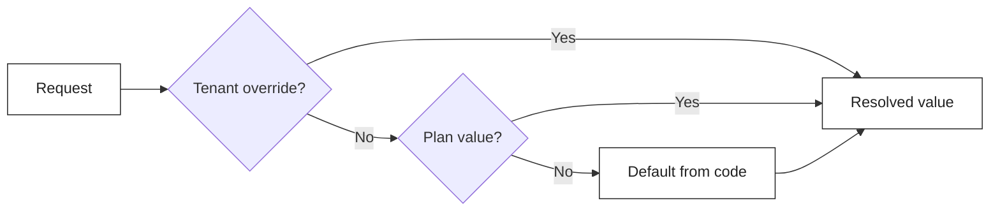

import { Aside } from '@astrojs/starlight/components';

A product manager asks: "Can we put VideoConference behind Premium, but enable it for Acme Corp because they're a beta partner?" You quote LaunchDarkly. They quote €18k/year for your tenant count. You quote Unleash. They ask why an internal feature flag needs an extra Postgres database and a separate UI. You quote `appsettings.json`. They ask how a sales rep is supposed to toggle it for one tenant from the admin UI.

This is the **SaaS feature flag** problem, and it is not the same problem as the one LaunchDarkly was designed for. LaunchDarkly excels at **rollout flags** (gradual release to 5% of traffic, kill switch for a buggy release). It is over-engineered for **commercial flags** (this feature is part of the Premium plan, this limit is 50 users on Starter and 10,000 on Enterprise).

For SaaS commercial flags, what you actually need is much simpler — and you can ship it inside your application in a weekend.

## The two kinds of feature flags

| Concern             | Rollout flag            | Commercial flag           |
| ------------------- | ----------------------- | ------------------------- |
| Lifetime            | Days to weeks           | Years                     |
| Scope               | Percentage of users     | Tenant + plan             |
| Who flips it        | Developer / SRE         | Sales / admin             |
| Tolerance for lag   | Seconds                 | Minutes is fine           |
| Audit               | Nice-to-have            | **Required** (compliance) |

**Use LaunchDarkly (or `Microsoft.FeatureManagement`) for rollouts.** Use a tenant-aware feature store for commercial flags. The two are not in competition — they answer different questions.

## What "good" looks like

A commercial feature flag system for SaaS needs four things:

1. **Cascading resolution** — Default → Plan → Tenant. The Premium plan enables `VideoConference`; Acme Corp gets it overridden to `true` regardless of plan.
2. **Strong typing** — Toggle, Numeric, Selection. `MaxUsersCount = 50`, not `"50"`. Compile-time errors when a flag changes shape.
3. **Declarative gates** — `.RequiresFeature("VideoConference")` on an endpoint, `[RequiresFeature]` on a message. 403 with a clear error code if disabled.
4. **Limit guards** — for numeric features, a check before creation. Block the 51st user creation on a 50-seat plan with `FeatureLimitExceededException`.

Everything else (UI, audit log, A/B testing, percentage rollouts) is a layer on top of these four.

## Defining features in code

Features belong in code, version-controlled, reviewable. The store ships the values; the **shape** of every flag lives next to the feature it gates.

```csharp title="AcmeFeatureDefinitionProvider.cs"
public sealed class AcmeFeatureDefinitionProvider : IFeatureDefinitionProvider
{
    public void Define(IFeatureDefinitionContext context)
    {
        FeatureGroupDefinition acme = context.AddGroup("Acme", "Acme Features");

        acme.AddToggle("Acme.VideoConference", defaultValue: false);
        acme.AddNumeric("Acme.MaxUsersCount", defaultValue: 5, min: 1, max: 10_000);
        acme.AddSelection("Acme.Theme", defaultValue: "light", allowed: ["light", "dark", "auto"]);
    }
}
```

Registration is one line:

```csharp title="Program.cs"
services.AddFeatureDefinitions<AcmeFeatureDefinitionProvider>();
```

This is the equivalent of the LaunchDarkly UI "create flag" form, except it ships through your PR review and your migration pipeline. Sales never accidentally renames a flag that breaks production.

## Cascading resolution — the heart of the system

When `IFeatureChecker.IsEnabledAsync("Acme.VideoConference")` is called, the lookup walks three layers and stops at the first hit:



That's it. Three layers. Implemented with two interfaces you provide — `IPlanIdProvider` (which plan is this tenant on?) and `IPlanFeatureStore` (what value does that plan assign to that feature?). Granit ships the tenant-override store, the cascading checker and the hybrid cache; you wire the plan resolver to your billing system (Stripe subscription, your own `Plans` table, whatever).

```csharp title="StripePlanIdProvider.cs"
public sealed class StripePlanIdProvider(ICurrentTenant tenant, IBilling billing) : IPlanIdProvider
{
    public async Task<string?> GetCurrentPlanIdAsync(CancellationToken ct) =>
        await billing.GetActivePlanAsync(tenant.Id, ct);
}
```

```csharp title="Program.cs"
services.AddScoped<IPlanIdProvider, StripePlanIdProvider>();
services.AddScoped<IPlanFeatureStore, MyPlanFeatureStore>();
```

## Gating ASP.NET Core endpoints

Granit is Minimal-API-first. The `.RequiresFeature()` endpoint filter — shipped in the framework-pure-friendly binding `Granit.Http.Features` — resolves the checker on every request and returns `403 Forbidden` with a structured `errorCode` when the feature is off:

```csharp title="Program.cs"
using Granit.Http.Features.AspNetCore;

app.MapPost("/consultations", StartConsultation)
   .RequiresFeature("Acme.VideoConference");
```

The 403 response uses RFC 7807 Problem Details. Your frontend reads `errorCode: "Features:NotEnabled"` and shows the "Upgrade to Premium" upsell page — no string parsing of error messages, no language guessing.

## Gating Wolverine message handlers

A user-facing 403 protects HTTP endpoints. But a feature might also gate an **asynchronous** action — a webhook delivery, a scheduled export. Reference `Granit.Features.Wolverine` and decorate the message:

```csharp title="GenerateExportCommand.cs"
using Granit.Features.Wolverine.Attributes;

[RequiresFeature("Acme.ExportPdf")]
public sealed record GenerateExportCommand(Guid TenantId);
```

The Wolverine middleware short-circuits the handler if the feature is off — no charge to the renderer pool, no half-completed export. Same `Granit.Features` core, a different transport binding.

## Enforcing numeric limits

`Acme.MaxUsersCount = 50` is only useful if something refuses the 51st user. The `IFeatureLimitGuard` is that something:

```csharp title="CreateUserHandler.cs"
public sealed class CreateUserHandler(IFeatureLimitGuard limits, IUserRepository users)
{
    public async Task HandleAsync(CreateUserCommand cmd, CancellationToken ct)
    {
        long current = await users.CountAsync(ct);
        await limits.CheckAsync("Acme.MaxUsersCount", current, ct);
        //  throws FeatureLimitExceededException -> HTTP 403 with errorCode "Features:LimitExceeded"

        await users.AddAsync(cmd.ToUser(), ct);
    }
}
```

The exception carries the limit value (`50`) and the current value (`50`). Your frontend can show "You've reached the 50 user limit on the Starter plan" without any extra round-trip.

## Performance: the hybrid cache that costs nothing

Naive feature resolution does two database queries per feature check. On a busy endpoint that calls `IsEnabledAsync` three times, that is six queries per request.

Granit's `IFeatureChecker` uses **`Granit.Caching`'s hybrid cache** (L1 in-memory + L2 distributed). A feature lookup is:

1. L1 (in-process `MemoryCache`) — ~50 ns
2. L2 (Redis, on miss) — ~1 ms, with **Redis pub/sub invalidation** on tenant override changes
3. Database — only on cold cache

The cost per `IsEnabledAsync` call after warmup is essentially free. Call it from a hot loop without thinking about it.

<Aside type="tip">
Override changes from the admin UI publish an invalidation event. Every pod in your cluster drops its L1 entry within milliseconds. No five-minute "wait for the cache to expire" gap.
</Aside>

## Audit and compliance — the part LaunchDarkly charges for

For SOC 2 and ISO 27001, every feature override change must be traceable: **who** changed **what**, **when**, **for which tenant**. Granit emits a `FeatureValueChanged` domain event on every override write, captured by the `Granit.Auditing` interceptor — same audit trail as any other entity write. No extra plumbing.

```text
2026-05-15T09:14:22Z  user=jane@acme.com  action=feature.override
  tenant=acme        feature=Acme.VideoConference  old=null  new=true
```

This is the silent reason most "let's build our own flags" projects end up replatforming onto LaunchDarkly after audit season. Build the audit trail from day one and the question never arises.

## When to still use LaunchDarkly

This pattern replaces commercial flags. It does **not** replace rollout flags. If you need:

- Gradual rollout to 5% / 10% / 50% of traffic
- Multivariate A/B testing with statistical attribution
- Client-side flag evaluation in a React Native app with millions of users
- A non-engineer to flip a flag without going through your admin UI

... then LaunchDarkly (or Unleash, or `Microsoft.FeatureManagement` with `IFeatureFilter`) is the right tool. The two stacks coexist happily — they answer different questions.

## Takeaways

- **Commercial flags ≠ rollout flags.** Don't pay for the wrong product.
- **Define features in code**, override them in storage. Code-first means PR review and migrations protect the contract.
- **Tenant → Plan → Default cascade** is the only resolution rule you need for SaaS pricing.
- **Use `[RequiresFeature]` for endpoints and handlers**, `IFeatureLimitGuard` for numeric limits. Structured 403 with `errorCode` for the frontend.
- **Hybrid cache (L1 + L2) with pub/sub invalidation** makes feature checks free at the call site.
- **Audit every override.** Your future SOC 2 auditor will thank you.

## Further reading

- [Granit.Features module](/dotnet/infrastructure/feature-flags/)
- [Granit.Caching — hybrid cache with Redis invalidation](/blog/hybrid-cache-redis-distributed-invalidation/)
- [RFC 7807 Problem Details](/blog/rfc-7807-problem-details-the-only-way-to-return-errors/)
- [SOC 2 Type 2 readiness for SaaS](/blog/soc2-type2-ready-saas-granit/)
