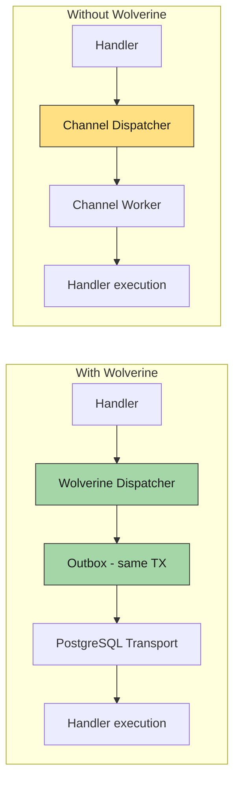

import { Aside } from '@astrojs/starlight/components';

A team ships an internal tool. Background jobs use the default in-memory `Channel<T>` dispatcher. It works, it is fast, the deploy is one pod. Six months later sales is selling it to two more departments, the deploy is two pods behind a load balancer, and the nightly export job runs **twice** every night. Two pods, one cron, two `INSERT`s into the customer's billing table.

The temptation is to bolt on a distributed lock. The right move is to upgrade the messaging substrate. **Wolverine + the PostgreSQL outbox** gives you exactly-once recurring jobs, at-least-once delivery, dead-letter queues, and crash-safe scheduling — without rewriting a single handler. The handler code that runs against `Channel<T>` in development runs against the durable outbox in production. This article walks the upgrade, what changes and what doesn't, and the failure modes that justify the cost.

## The five modules that play this trick

Five Granit modules ship two dispatchers behind one interface — an in-process `Channel<T>` default and a Wolverine package that swaps it out at DI registration:

| Module                  | In-process default                  | Wolverine package                                              |
| ----------------------- | ----------------------------------- | -------------------------------------------------------------- |
| `Granit.BackgroundJobs` | `ChannelBackgroundJobDispatcher`    | `Granit.BackgroundJobs.Wolverine`                              |
| `Granit.Notifications`  | `ChannelNotificationPublisher`      | `Granit.Notifications.Wolverine`                               |
| `Granit.Webhooks`       | `ChannelWebhookCommandDispatcher`   | `Granit.Webhooks.Wolverine`                                    |
| `Granit.Scheduling`     | In-process Cronos ticker            | `Granit.Scheduling.Wolverine`                                  |
| `Granit.Events`         | Synchronous `IDomainEvent` dispatch | `Granit.Events.Wolverine` (durable `IIntegrationEvent` outbox) |

`Granit.DataExchange` and `Granit.Persistence.Migrations` follow the same pattern. The consumer-facing interface — `IBackgroundJobDispatcher`, `INotificationPublisher`, `IWebhookPublisher`, `ICommandSender` — is identical in both modes. The implementation is a DI registration detail.



## The handler that works in both modes

This is the entire point. The handler does not know which dispatcher is registered:

```csharp title="DischargePatientHandler.cs"
[assembly: WolverineHandlerModule]

public static class DischargePatientHandler
{
    public static IEnumerable<object> Handle(
        DischargePatientCommand command,
        PatientDbContext db)
    {
        var patient = db.Patients.Find(command.PatientId)
            ?? throw new EntityNotFoundException(typeof(Patient), command.PatientId);

        patient.Discharge();

        // Domain event — local queue
        yield return new PatientDischargedEvent(patient.Id, patient.BedId);

        // Integration event — local channel OR durable outbox, depending on DI
        yield return new BedReleasedEto(
            patient.BedId, patient.WardId, DateTimeOffset.UtcNow);
    }
}
```

In Channel mode, the integration event is pushed into an in-memory `Channel<T>` and forgotten on crash. In Wolverine mode, it is persisted in the **same transaction** as the `UPDATE patients` write, delivered at-least-once, and retried with exponential backoff. The yield statements do not change.

## When `Channel<T>` is enough

The default is not a fallback to apologize for — it is a deliberate choice that fits a large class of projects:

* **Internal tools and small APIs**, single instance, fronted by a load balancer that only ever runs one pod
* **Development and CI environments** — no PostgreSQL transport tables, no outbox migration, faster startup
* **Prototypes** — get the feature working, ship the demo, defer durability
* **Workloads where in-flight loss on crash is acceptable** — analytics events, low-stakes notifications, cache warmups

The Channel dispatcher handles roughly **10,000 messages per second in-process**. That is not the limit; the limit is what your handlers can sustain. If you crash before they finish, the messages are gone — and for the workloads above, that is fine.

## When `Channel<T>` is wrong

The failure modes are not theoretical. Here is what the two modes do when the same handler throws.

### Channel mode — message lost

```csharp title="SendInvoiceNotificationHandler.cs"
public static async Task Handle(SendInvoiceNotificationCommand command)
{
    throw new SmtpException("Mail server unreachable");
    // The Channel worker catches the exception and logs it.
    // The message is gone. No retry. No dead letter. No record.
}
```

Timeline:

1. Exception is thrown.
2. `BackgroundJobWorker` logs the error.
3. Message is discarded — **permanently lost**.
4. The next message starts processing.

The customer never gets their invoice. The audit log has no record of the failed attempt.

### Wolverine mode — durable retry, then dead letter

```csharp title="Same handler, completely different outcome"
public static async Task Handle(SendInvoiceNotificationCommand command)
{
    throw new SmtpException("Mail server unreachable");
    // Wolverine catches the exception.
    // Retry 1 after 5s → Retry 2 after 30s → Retry 3 after 5min
    // If all retries fail → moved to dead-letter queue (PostgreSQL wolverine_dead_letters)
}
```

Timeline:

1. Exception thrown — envelope marked as failed.
2. Retry 1 after 5s.
3. Retry 2 after 30s.
4. Retry 3 after 5min.
5. Final failure → message moved to `wolverine_dead_letters`. Inspectable, replayable.

```json title="Default retry policy"
{
  "Wolverine": {
    "MaxRetryAttempts": 3,
    "RetryDelays": ["00:00:05", "00:00:30", "00:05:00"]
  }
}
```

The transient SMTP outage no longer destroys customer notifications. The "mail server was down for 4 minutes last Tuesday" incident becomes a non-event.

## The capabilities table

| Requirement                               | `Channel<T>` mode              | Wolverine mode             |
| ----------------------------------------- | ------------------------------ | -------------------------- |
| Fire-and-forget jobs                      | In-memory                      | Durable outbox             |
| Scheduled / recurring jobs                | `Task.Delay` (lost on crash)   | Cron + outbox (crash-safe) |
| At-least-once delivery                    | No                             | Yes                        |
| Transactional outbox                      | No                             | Yes                        |
| Distributed tracing across async handlers | No                             | Yes (context propagation)  |
| Horizontal scaling (multiple instances)   | In-process only                | PostgreSQL transport       |
| Dead-letter queue inspection              | No                             | Yes (admin endpoints)      |

The horizontal scaling row is where the "two pods, one cron, two executions" story dies. Wolverine's `SingularAgent` runs the scheduler on exactly one pod at a time, with leader election. The other pods sit idle on that workload until the leader dies.

## The upgrade, exactly

Two packages, one `[DependsOn]` change.

```csharp title="Before — Channel only"
[DependsOn(typeof(GranitBackgroundJobsModule))]
[DependsOn(typeof(GranitNotificationsModule))]
public class AppModule : GranitModule { }
```

```csharp title="After — Wolverine durable"
[DependsOn(typeof(GranitBackgroundJobsWolverineModule))]
[DependsOn(typeof(GranitNotificationsWolverineModule))]
[DependsOn(typeof(GranitWolverinePostgresqlModule))]
public class AppModule : GranitModule { }
```

The Wolverine modules transitively depend on their base modules. `GranitBackgroundJobsWolverineModule` pulls in `GranitBackgroundJobsModule` automatically — you do not list both. The DI registration for `IBackgroundJobDispatcher` is replaced with `WolverineBackgroundJobDispatcher` at module load time. The handler code is untouched.

Add the transport connection string:

```json title="appsettings.Production.json"
{
  "Wolverine:Postgresql": {
    "TransportConnectionString": "Host=db;Database=myapp;Username=app;Password=..."
  },
  "Wolverine": {
    "MaxRetryAttempts": 3,
    "RetryDelays": ["00:00:05", "00:00:30", "00:05:00"]
  }
}
```

That is the entire migration. Your handlers, your cron expressions, your notification templates, your validators — all unchanged.

## What you get on the way through

The outbox is the headline feature, but three more behaviors land on the same upgrade:

### 1. Atomic fan-out

A handler that returns `IEnumerable<object>` produces **multiple outbox messages atomically**. Either all of them are persisted, or none of them are. Webhook delivery fan-out, multi-channel notification dispatch, recurring job rescheduling — they all use this primitive. The handler returns N messages, the framework writes them in the same transaction as the business data, and the dispatcher delivers them after commit.

### 2. Context propagation across async boundaries

In an HTTP request, `ICurrentTenant`, `ICurrentUserService`, and the `Activity` (W3C `traceparent`) are all alive. Background handlers run outside the HTTP pipeline. Without help, they have no tenant, no user, no trace.

Wolverine fixes this by serializing the context onto the outgoing envelope as headers, then restoring it before the handler runs:

| Header         | Source                          | Behavior in handler                         |
| -------------- | ------------------------------- | ------------------------------------------- |
| `X-Tenant-Id`  | `ICurrentTenant.Id`             | `TenantContextBehavior` restores AsyncLocal |
| `X-User-Id`    | `ICurrentUserService.UserId`    | `UserContextBehavior` restores user override |
| `X-Actor-Kind` | `ICurrentUserService.ActorKind` | `User`, `ExternalSystem`, or `System`        |
| `traceparent`  | `Activity.Current?.Id`          | New `Activity` linked to the parent span    |

The audit interceptor populates `CreatedBy` and `ModifiedBy` correctly even in a background handler. Multi-tenant query filters apply the right tenant. Grafana/Tempo shows one continuous trace from the HTTP request through every async handler it triggered. None of this happens in Channel mode — and reconstructing it by hand is a multi-week project.

### 3. Validation rejection without retries

FluentValidation runs as bus middleware **before** the handler executes. A `ValidationException` bypasses the retry policy entirely and goes straight to the error queue. Retrying a structurally invalid message is pointless — and Wolverine knows it.

```csharp title="DischargePatientCommandValidator.cs"
public class DischargePatientCommandValidator
    : AbstractValidator<DischargePatientCommand>
{
    public DischargePatientCommandValidator()
    {
        RuleFor(x => x.PatientId).NotEmpty();
    }
}
```

The Channel mode runs the same validator but treats failure like any other exception — log and discard. Same code, very different behavior on the wire.

## The five questions the answer is "yes" to

Skip the upgrade if every answer is no. Do the upgrade if any one is yes:

* Do you run more than one instance, and does any background work need to run on exactly one of them?
* Does any handler send something a customer expects — an invoice, a webhook, a payment confirmation?
* Does your audit story require that every triggered side effect either succeeds or appears in a dead-letter queue?
* Do you want `CreatedBy` and `ModifiedBy` to be correct in background handlers without writing context propagation yourself?
* Do your distributed traces currently break the moment a message is dispatched?

For ISO 27001 environments, the third question is mandatory. For SOC 2 Type 2 environments, the second usually is too. We covered both in [SOC 2 Type 2-ready SaaS with Granit](/blog/soc2-type2-ready-saas-granit/).

## The escape hatch — per-tenant outbox

For the strictest multi-tenant isolation, the outbox can live in the tenant's own database:

```csharp title="AppModule.cs — per-tenant outbox"
[DependsOn(typeof(GranitWolverinePostgresqlModule))]
public class AppModule : GranitModule
{
    public override void ConfigureServices(ServiceConfigurationContext context)
    {
        context.Builder.AddGranitWolverineWithPostgresqlPerTenant<AppDbContext>();
    }
}
```

Each tenant's messages persist in their own database — the strongest ISO 27001 isolation, at the cost of more transport connections. Not needed for shared-database multi-tenancy with row-level filtering (the default), but available when the regulator asks.

## Three takeaways

* **The handler is the same in both modes.** Start with `Channel<T>`, ship, learn the workload, upgrade to Wolverine when durability becomes non-negotiable. No rewrite tax for picking the simpler default first.
* **Two pods, one cron is the canonical "you need Wolverine" moment.** The day you horizontally scale a recurring job, you need leader election. `SingularAgent` ships exactly that.
* **The outbox is the headline; context propagation is the sleeper hit.** `CreatedBy`/`ModifiedBy` in background handlers, distributed traces that survive async boundaries, tenant filters that apply in workers — none of it is free in Channel mode.

## Further reading

* [Wolverine optionality reference](/dotnet/concepts/wolverine-optionality/) — the full capability table
* [Wolverine messaging reference](/dotnet/infrastructure/wolverine-messaging/) — handlers, validation, outbox, claim check
* [Messaging concepts](/dotnet/concepts/messaging/) — domain events vs integration events, context propagation
* [Background jobs without Hangfire](/blog/background-jobs-wolverine-cronos-no-hangfire/) — the recurring-job side of the upgrade
* [CQRS without MediatR](/blog/cqrs-without-mediatr-how-granit-uses-wolverine/) — why Wolverine sits where MediatR used to
* [ADR-005: Wolverine + Cronos](/dotnet/architecture/adr/005-wolverine-cronos/) — the original decision
