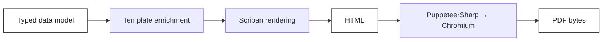

import { Aside } from '@astrojs/starlight/components';

A finance team asks for a PDF invoice. You reach for `iText` and remember the AGPL clause. You try `QuestPDF` and discover its commercial license starts at €500/year for serious use. You try `DinkToPdf` and find it abandoned. Meanwhile your designers can already produce a perfect HTML invoice in fifteen minutes with Tailwind.

The answer most teams converge on is the same one a browser already solves: **render HTML to PDF via headless Chromium**. It is free, the design tooling is universal, and the output is pixel-perfect — including web fonts, SVG charts, gradients and right-to-left text. The catch is that the production pipeline (browser pool, template engine, culture fallback, data enrichment, error handling) is non-trivial.

This article walks through the pipeline that ships with Granit — **PuppeteerSharp** for rendering, **Scriban** for templating — and explains what every step is actually doing.

## Why HTML-to-PDF over iText / QuestPDF

| Approach            | License        | Designer can edit | Web fonts / Tailwind | Charts (SVG) |
| ------------------- | -------------- | ----------------- | -------------------- | ------------ |
| iText 7+            | AGPL or paid   | No                | No                   | Manual       |
| QuestPDF (Community)| MIT under 1M$  | No (C# DSL)       | Bundled only         | Manual       |
| HTML + headless Chromium | Free      | Yes               | Yes                  | Native       |

The win is not the license — it's **the designer loop**. A designer hands you an HTML mockup, you bind variables, ship. The next iteration is a CSS tweak, not a six-method `QuestPDF.Compose(...)` chain.

The cost is the runtime: you need a Chromium binary, a pool of browser instances, and a strategy for rendering timeouts. The next section walks through both.

## The pipeline in four stages



Every stage is replaceable:

1. **Data model** — your typed `InvoiceData` record. Compiler-checked.
2. **Enrichment** — `ITemplateDataEnricher<InvoiceData>` injects cross-cutting fields (tenant name, currency, logo URL) without polluting your domain model.
3. **Template rendering** — Scriban turns `{{ customer.name }}` into HTML. Culture-aware (fr-BE, en-US, …) with automatic fallback.
4. **PDF conversion** — Chromium renders the HTML and prints it to PDF, with headers, footers and page numbers.

## The Hello-World

```csharp title="Program.cs"
services.AddGranitBrowsingPuppeteerSharp();   // browser pool
services.AddGranitDocumentGenerationPdf();    // HTML -> PDF renderer
services.AddGranitTemplatingScriban();        // {{ template }} engine
```

That's the wiring. Now the template:

```html title="Templates/Invoice.html"
<!DOCTYPE html>
<html lang="{{ culture }}">
<head>
  <meta charset="utf-8">
  <style>
    body { font-family: 'Inter', sans-serif; color: #1a1a1a; }
    .total { font-size: 1.5rem; font-weight: 700; }
  </style>
</head>
<body>
  <h1>Invoice {{ invoice.number }}</h1>
  <p>{{ customer.name }} — {{ customer.vat_number }}</p>
  <table>
    {{ for line in invoice.lines }}
    <tr>
      <td>{{ line.description }}</td>
      <td>{{ line.amount | format_currency culture }}</td>
    </tr>
    {{ end }}
  </table>
  <p class="total">Total: {{ invoice.total | format_currency culture }}</p>
</body>
</html>
```

And the call site:

```csharp title="InvoiceService.cs"
public sealed class InvoiceService(IDocumentGenerator generator)
{
    private static readonly DocumentTemplateType<InvoiceData> Template =
        new("invoice", DocumentFormat.Pdf);

    public async Task<byte[]> RenderAsync(InvoiceData invoice, CancellationToken ct)
    {
        DocumentResult result = await generator.GenerateAsync(Template, invoice, cancellationToken: ct);
        return result.Content;
    }
}
```

Three layers. Each one is replaceable on its own.

## Configuring the PDF output

Headers, footers, paper size and margins are bound from configuration. No code change needed to switch from A4 to Letter, or from 10 mm to 25 mm margins.

```json title="appsettings.json"
{
  "DocumentGeneration": {
    "Pdf": {
      "PaperFormat": "A4",
      "Landscape": false,
      "MarginTop": "20mm",
      "MarginBottom": "15mm",
      "MarginLeft": "15mm",
      "MarginRight": "15mm",
      "PrintBackground": true,
      "RenderTimeoutMs": 30000,
      "FooterTemplate": "<div style='font-size:9px;width:100%;text-align:center;color:#999'>Page <span class='pageNumber'></span> / <span class='totalPages'></span></div>"
    }
  }
}
```

Footers support Chromium's built-in template variables — `pageNumber`, `totalPages`, `title`, `url`, `date`. Anything more dynamic (a per-tenant logo) belongs in the HTML body, not the footer template, so you can use the full template engine.

## The two production traps

### Trap 1 — Chromium download at startup

By default PuppeteerSharp downloads Chromium on first run. That is fine on a dev machine and catastrophic in a Kubernetes pod: pod restarts during a deploy can stampede the download and exhaust bandwidth, or fail entirely behind a corporate proxy.

The fix is to **bundle Chromium in the container image** and tell PuppeteerSharp where it lives:

```dockerfile title="Dockerfile"
FROM mcr.microsoft.com/dotnet/aspnet:10.0
RUN apt-get update && apt-get install -y chromium && rm -rf /var/lib/apt/lists/*
ENV PUPPETEER_EXECUTABLE_PATH=/usr/bin/chromium
```

```csharp title="Program.cs"
services.AddGranitBrowsingPuppeteerSharp(configurePuppeteer: opts =>
{
    opts.ChromiumExecutablePath = "/usr/bin/chromium";
    opts.SkipChromiumDownload = true;
});
```

Cold start drops from ~30s to ~200 ms. Bandwidth cost drops to zero.

### Trap 2 — One browser per request

A naive implementation launches Chromium per render. That costs ~300 ms of process startup, ~80 MB of RAM, and exhausts file descriptors under load. The fix is a **pooled browser**: keep N Chromium instances warm, serve M pages each, recycle.

```csharp title="Program.cs"
services.AddGranitBrowsingPuppeteerSharp(configureBrowsing: opts =>
{
    opts.MaxBrowsers = 2;          // total Chromium processes
    opts.MaxPagesPerBrowser = 8;   // concurrent renders per process
});
```

At `MaxBrowsers=2, MaxPagesPerBrowser=8` a single 1 vCPU pod can sustain ~50 invoices/sec, with each render under 200 ms once the pool is warm.

<Aside type="caution">
Do not run Chromium with `--no-sandbox` in production unless you have a strong threat model. The default sandbox protects you from malicious HTML — and if your template ever interpolates untrusted user input, that's a real concern. Granit ships sandbox enabled; opt out only when you control every byte of the rendered HTML.
</Aside>

## Localization without copies

A multi-tenant SaaS in three languages does not need three templates. The Granit template resolver walks the culture chain and picks the most specific match available:

```text
Templates/
  invoice.html              (fallback)
  invoice.fr.html           (French, any region)
  invoice.fr-BE.html        (French, Belgium — VAT 21%, BE date format)
```

Render with `culture: "fr-BE"` and you get the Belgian template. Render with `"fr-FR"` and you fall back to the generic French one. The lookup is cached.

Currency, dates and numbers are formatted by the template engine using the same culture — never hand-roll `string.Format("{0:C}", ...)` in the data layer, because that pins the format to the server's culture, not the tenant's.

## What about accessibility (PDF/UA, tagged PDF)?

PuppeteerSharp drives Chromium, which produces unstructured PDFs. If you need **PDF/A-2** (long-term archiving, ISO 27001), **PDF/UA** (accessibility) or digital signatures, you need a post-processor like **iText** or **pdfcpu**. Granit ships a `PdfA` post-processor that takes the Chromium output and emits a PDF/A-2b file with embedded fonts.

For the 95% case — invoices, monthly statements, shipping labels, signed contracts before notarisation — the raw Chromium output is fine, and an order of magnitude faster to ship.

## Takeaways

- **HTML-to-PDF wins on the designer loop.** A CSS tweak is faster than a `Composer` rewrite.
- **Pool your browsers and bundle Chromium.** Cold-start one-render-per-request is the slowest possible architecture.
- **Configure paper, margins and footers from `appsettings.json`.** No code change to switch from invoice to delivery note format.
- **Lean on a real template engine** (Scriban, Razor) instead of `string.Replace`. Loops, filters, culture-aware formatting come for free.
- **PDF/A and accessibility are post-processing concerns.** Generate the visual PDF first, transform it second.

## Further reading

- [Granit.DocumentGeneration overview](/dotnet/building-blocks/document-generation/)
- [Granit.Browsing — pooled headless browsers](/dotnet/infrastructure/browsing/)
- [Localization and culture fallback](/dotnet/infrastructure/localization/)
- [Multi-channel notifications](/blog/multi-channel-notifications-dotnet/)
