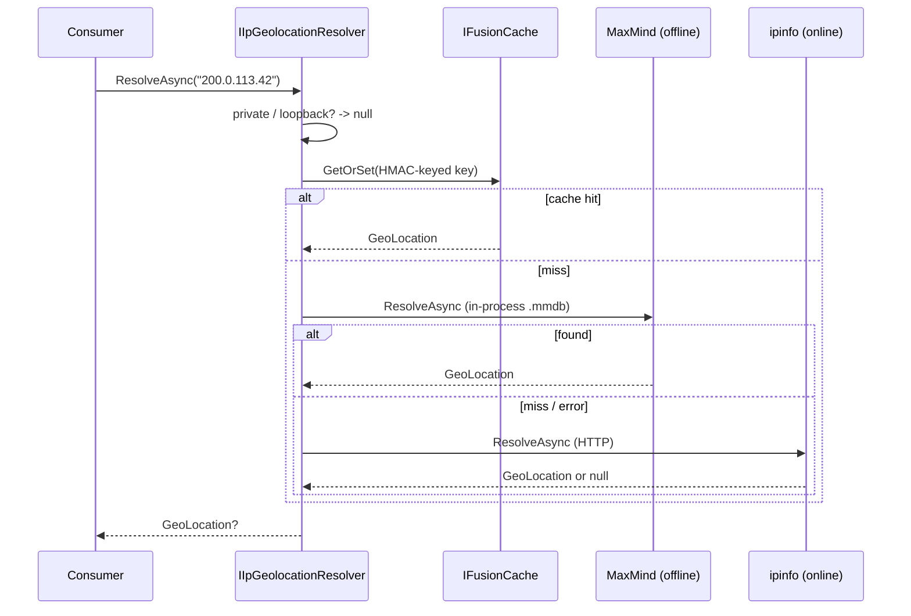

import { Aside, Tabs, TabItem } from '@astrojs/starlight/components';

A user logs in from Brussels. Eight minutes later, the same account authenticates from São Paulo. No flight covers that gap. Your session-anomaly check should fire — but only if it knows that `200.0.113.x` means *São Paulo* and `91.0.113.x` means *Brussels*.

So you reach for IP geolocation. And immediately hit the real question, the one nobody puts in the README: **do you ship a local database, or call a remote API?** It looks like a footnote. It is actually a decision about latency, cost, privacy, and what breaks at 3 a.m. when a third party rate-limits you.

This post lays out the honest trade-off between the two, the GDPR trap that lives in *both*, and how the new `Granit.IpGeolocation` modules let you stop choosing and run both behind one interface.

## Two ways to turn an IP into a place

Every geolocation strategy collapses into one of two shapes:

- **Local lookup** — you ship a binary database (`.mmdb` from MaxMind GeoIP2 or DB-IP) inside your deployment and resolve in-process. No network, no third party at request time.
- **Remote lookup** — you call an HTTP API (ipinfo.io, ip-api.com, IP2Location) per IP. Nothing to ship; someone else keeps the data fresh.

The naive instinct is "an API is simpler, I'll just call it." Sometimes right. Often the most expensive choice you can make. Let's price both honestly.

## Option A — the local MaxMind database

A `.mmdb` file is a memory-mapped, prefix-tree-indexed database purpose-built for IP range lookups. You load it once at startup; every resolution after that is a pointer walk through RAM.

```csharp title="Program.cs"
var builder = WebApplication.CreateBuilder(args);

builder.AddGranit(granit => granit.AddModule<AppModule>());
builder.AddGranitIpGeolocationMaxMind();

var app = builder.Build();
app.UseGranit();
app.Run();
```

```json title="appsettings.json"
{
  "IpGeolocation": {
    "MaxMind": {
      "DatabasePath": "/var/lib/geoip/GeoLite2-City.mmdb",
      "ReloadOnChange": true,
      "FileAccess": "Memory"
    }
  }
}
```

`FileAccess: "Memory"` loads the whole file into RAM and **releases the OS handle**, so a sidecar can atomically swap the database on disk while the app keeps serving. `ReloadOnChange` picks up the new file without a restart.

**What you get:**

- **Microsecond lookups.** No network hop, no per-request latency, no tail-latency spikes from someone else's slow API. A lookup costs roughly what a dictionary access costs.
- **No rate limit, no per-call cost.** Resolve a billion IPs; the marginal price is zero. This is the only sane option for high-volume paths — fraud scoring on every request, enriching every log line.
- **Privacy by construction.** The IP never leaves your process. There is no third party to trust, no data-processing agreement to sign, no IP shipped across the Atlantic to a service whose sub-processors you don't control.
- **Works offline / air-gapped.** No egress, no dependency on an external uptime you don't own.

**What it costs you:**

- **You own the freshness.** The free GeoLite2 database refreshes roughly weekly; IP-to-city mappings drift as blocks get reassigned. A stale file silently degrades accuracy. You need a cron job (or a sidecar) pulling updates, plus a license key.
- **Disk and memory.** A city-level database is tens of megabytes resident. Negligible on a server, real in a memory-constrained function.
- **Accuracy ceiling.** Free tiers are country-accurate and *city-ish*. Street-level or ISP/ASN data, VPN/proxy flags, and connection-type signals live behind MaxMind's paid GeoIP2 or DB-IP's commercial tiers.

<Aside type="tip">
For most server-side use — anomaly detection, log enrichment, coarse fraud heuristics — a local city database is the right **default**. You almost never need street-level precision to flag "logged in from a country this account has never touched."
</Aside>

## Option B — the remote API

Here you ship nothing. You make an HTTP call and let the provider keep the data current.

```csharp title="Program.cs"
builder.AddGranitIpGeolocationIpInfo();
```

```json title="appsettings.json"
{
  "IpGeolocation": {
    "IpInfo": {
      "ApiToken": "${IPINFO_TOKEN}",
      "Timeout": "00:00:03"
    }
  }
}
```

The token is sent as a `Bearer` header; the lookup is size-bounded, auto-redirect is disabled, and failures are logged **without** the request URI (which carries the IP — a small detail that matters, see below).

### The free tier

Free API tiers are genuinely useful — and quietly constrained:

- **Rate limits.** ip-api.com's free endpoint allows on the order of ~45 requests/minute and is **non-commercial use only**. ipinfo.io's free token grants roughly 50,000 lookups/month. Both are fine for a low-traffic admin panel and a disaster for a per-request hot path. Burst past the limit and you get throttled or blocked — exactly when traffic spikes.
- **No SLA.** It's free; it can change, degrade, or vanish. Building a security control on an unpaid third party is a control you don't actually own.
- **Latency and failure as a request dependency.** Every lookup is now a network round-trip that can time out. Your geolocation is only as available as their API and your egress path.

### The paid tier

Paid plans buy away most of the pain — and add a line item:

- **Higher/removed limits, an SLA, commercial licensing.** You can call it on real traffic.
- **Richer data.** ASN, ISP, VPN/proxy/Tor detection, connection type, sometimes carrier — signals a free `.mmdb` won't give you.
- **Always fresh.** No file to update; the provider owns accuracy.

But: **cost scales with volume** (you pay per lookup or per tier), the **third-party dependency is now load-bearing**, and — the part teams forget — **every IP you resolve is personal data you are now sending to an external processor**. That's a GDPR data-flow you must document, with a DPA, sub-processor list, and a transfer mechanism if they're outside the EU.

## The honest comparison

| Dimension | Local `.mmdb` (MaxMind / DB-IP) | Free API | Paid API |
|---|---|---|---|
| **Per-lookup latency** | Microseconds (in-process) | Network round-trip | Network round-trip |
| **Throughput** | Unlimited | Rate-limited (~45/min, ~50k/mo) | High / metered |
| **Marginal cost** | Zero | Zero (non-commercial) | Per-lookup / tiered |
| **Data freshness** | You update it (≈ weekly) | Provider-managed | Provider-managed |
| **Accuracy** | Country + city | Country + city | + ASN, VPN/proxy, ISP |
| **Privacy** | IP never leaves process | **IP sent to third party** | **IP sent to third party** |
| **Availability** | Yours | Their uptime + your egress | Their SLA + your egress |
| **Ops burden** | Ship + refresh the file | None | None |
| **Best for** | High-volume, privacy-sensitive | Low-traffic, occasional | Rich data, commercial volume |

There is no universal winner. There is a winner *for your traffic shape and your compliance posture*.

## The trap that lives in both: your cache key

Here's the part that has nothing to do with local-vs-remote and bites everyone.

You will cache geolocation results — positive *and* negative — because resolving the same IP twice is waste. The obvious cache key is the IP, or a hash of it. And the moment that cache is shared across pods (Redis), you've built a **reverse lookup table for personal data**.

An IP address is personal data under GDPR. Hash it with plain SHA-256 and you've changed nothing that matters: the entire IPv4 space is only 2³² ≈ 4.3 billion values. Anyone holding a cache dump — a leaked Redis snapshot — can brute-force every key back to its originating IP in minutes. Your "anonymized" cache de-anonymizes itself.

`Granit.IpGeolocation` closes this with a configurable knob. Set a secret and the key derivation switches from a bare SHA-256 to **HMAC-SHA-256**, keyed by something an attacker doesn't have:

```json title="appsettings.json"
{
  "IpGeolocation": {
    "CacheKeySecret": "${IPGEO_CACHE_KEY_SECRET}",
    "CacheDuration": "01:00:00",
    "ResolvePrivateAddresses": false
  }
}
```

Source the secret from [HashiCorp Vault](/dotnet/data/vault/) and keep it stable across every instance that shares the cache. Without it, the resolver logs a one-time warning telling you exactly this — because a privacy feature that leaks the identifier it was meant to soften is worse than no feature at all.

<Aside type="caution">
This is why "I'll just hash the IP" is not a privacy strategy. Unkeyed hashing of a small input space is reversible. Keyed hashing — HMAC with a secret you control — is not. The difference is the whole point.
</Aside>

## Why choose? Run both behind one resolver

The best part of treating this as a *decision* is that you don't have to make it permanently. Both providers in Granit implement the same `IIpGeolocationProvider` and sit behind one `IIpGeolocationResolver`. Your code depends only on the interface and a provider-agnostic read-model:

```csharp title="SessionEnricher.cs"
public sealed class SessionEnricher(IIpGeolocationResolver resolver)
{
    public async Task<GeoLocation?> LocateAsync(string? ip, CancellationToken ct)
        => await resolver.ResolveAsync(ip, ct); // null for private / unparseable IPs
}
```

`GeoLocation` is a record where every field is optional — a country-only source leaves `City` and the coordinates `null`; a richer one fills them in. The consumer never knows or cares which provider answered.

Now register **both** and order them. MaxMind answers in-process for free; ipinfo is the fallback only when the local file has no hit:

```csharp title="Program.cs"
builder.AddGranitIpGeolocationMaxMind(); // fast, offline, free
builder.AddGranitIpGeolocationIpInfo();  // online fallback for misses
```

```json title="appsettings.json"
{
  "IpGeolocation": {
    "ProviderOrder": ["MaxMind", "IpInfo"]
  }
}
```



You get the local database's economics on the 99% of traffic it covers, and the API's freshness only on the long tail it misses — and you pay the API's rate limit and latency only on that tail. The resolver short-circuits private, loopback, and link-local addresses to `null`, never throws, and the result is cached (with that HMAC-keyed key) so a fallback miss costs once, not every request.

This is exactly what feeds Granit's [user-session anomaly detection](/dotnet/security/user-sessions/) — the "Brussels then São Paulo" check from the opening — without that code ever knowing whether the location came from a file on disk or an HTTP call.

## A decision framework

Skip the agonizing. Pick by traffic shape:

- **High volume, every request, privacy-sensitive** (fraud scoring, log enrichment, anomaly detection) → **local `.mmdb`**. Microsecond lookups, zero marginal cost, no IP leaves your process.
- **Low traffic, occasional lookups, non-commercial** (an internal admin panel, a side project) → **free API**. Nothing to ship or refresh; the rate limit is invisible at your volume.
- **You need ASN / VPN / proxy / ISP signals, on commercial traffic** → **paid API**, ideally as the *fallback* behind a local database so you only pay for the misses.
- **Anything compliance-graded** → local first, and whatever you cache, **key it with HMAC**.

## Takeaways

- **Local vs remote is a latency-cost-privacy decision, not a footnote.** A `.mmdb` gives microsecond, zero-cost, in-process lookups; an API ships nothing but adds a rate-limited, paid, third-party dependency that sees every IP.
- **Free API tiers are for low traffic.** Rate limits and non-commercial terms make them a poor fit for per-request hot paths.
- **Caching IP geolocation is a GDPR landmine.** An unkeyed hash of an IP is reversible from a cache dump; HMAC-keyed cache keys are the fix, not optional.
- **You don't have to choose permanently.** One resolver, a provider fallback chain — local for the common case, API for the tail — keeps consumers provider-agnostic.
- **The location is the easy part; the privacy posture is the hard part.** Get the cache key right and the rest is configuration.

## Further reading

- [IP Geolocation — source-agnostic IP → location](/dotnet/security/ip-geolocation/) — the full module reference, providers, and config keys
- [User Sessions — anomaly detection & risk scoring](/dotnet/security/user-sessions/) — the impossible-travel check this feeds
- [Caching with HybridCache + Redis](/blog/hybrid-cache-redis-distributed-invalidation/) — the two-tier cache backing geolocation results
- [Secrets management with HashiCorp Vault](/blog/secrets-management-with-hashicorp-vault-in-dotnet-10/) — where to source the `CacheKeySecret`
