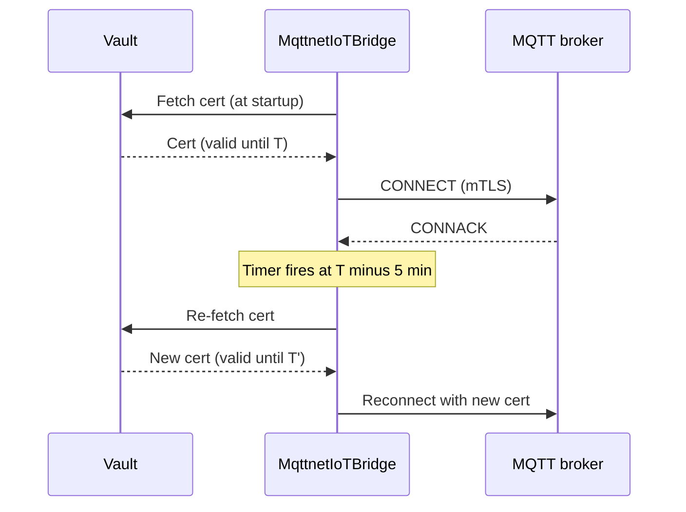
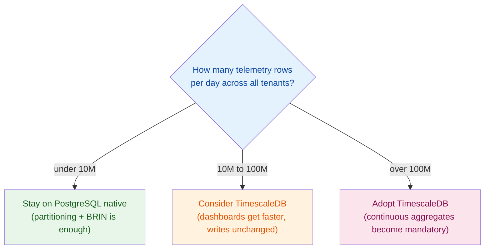

import { Aside } from "@astrojs/starlight/components";

A fleet of 5,000 temperature sensors publishes every 10 seconds over MQTT. Your
.NET backend speaks HTTP. So the plan becomes: stand up a small Node service
with `mqtt.js` to bridge broker to webhook, or worse, let it grow into "the IoT
microservice" nobody wants to touch. Six months later that sidecar owns
reconnect logic, TLS certificate rotation, and the only code in the company that
understands your device topic scheme — in a different language, with its own
deploy pipeline, on-call rotation, and set of 3 a.m. pages.

None of that plumbing is IoT-specific. It's the same three problems every
webhook integration has — signature validation, deduplication, backpressure —
plus one MQTT-specific one: a long-lived broker connection that has to survive
network flaps and certificate rotation without dropping messages. `Granit.IoT`
solves all four in .NET, and — this is the part that matters — funnels MQTT and
HTTP webhook traffic into the **exact same downstream pipeline**, so switching
transport later never touches your domain code.

## Why not just run a sidecar

The sidecar looks free at first: `npm install mqtt`, thirty lines to subscribe
and forward, done. What it actually costs shows up later:

- **A second cert rotation story.** Your .NET services already load secrets
  from Vault. The sidecar needs its own client, its own rotation timer, and
  its own incident when someone forgets to wire it up and a cert expires at
  2 a.m.
- **No shared dedup.** MQTT redelivery, broker retries, and network flaps
  push the same reading twice. If dedup lives in the sidecar and your
  webhook path has its own, you now maintain the same idempotency logic
  twice, in two languages.
- **A parsing boundary nobody owns.** The sidecar forwards *something* —
  raw JSON, a Base64 blob — to your API. The API team and the sidecar team
  now have an informal contract instead of a compiler-checked one.

`Granit.IoT.Mqtt` removes the sidecar by putting the broker connection inside
the same process as the rest of your domain code, sharing the same
ingestion pipeline as webhook-based providers (Scaleway, AWS IoT Core).

## One pipeline, two transports

Whether telemetry arrives over MQTT or an HTTP webhook, it goes through the
same three-stage flow before anything touches your domain:


The webhook path (`POST /iot/ingest/{source}`) runs the same
validate → parse → dedup → publish sequence, swapping HMAC/SigV4 signature
validation for the MQTT bridge's mTLS handshake at the transport layer.
Downstream code — the Wolverine handler, the threshold evaluator, the
notification bridge — never knows which transport a reading arrived over.
Both produce the same normalized shape:

```csharp title="ParsedTelemetryBatch.cs"
public sealed record ParsedTelemetryBatch(
    string MessageId,
    string DeviceExternalId,
    DateTimeOffset RecordedAt,
    IReadOnlyDictionary<string, double> Metrics,
    string Source,
    IReadOnlyDictionary<string, string>? Tags);
```

## Wiring the MQTT bridge

Two packages, both explicitly opt-in — neither ships with the base IoT
bundle, since not every deployment needs a broker connection:

```bash
dotnet add package Granit.IoT.Mqtt.Mqttnet
```

```csharp title="Program.cs"
builder.AddGranit(granit => granit
    .AddIoT());

builder.Services.AddGranitIoTMqtt();          // abstractions + parser
builder.Services.AddGranitIoTMqttMqttnet();   // MQTTnet implementation
```

`GranitIoTMqttMqttnetModule` registers a hosted service — the broker
connection opens on startup and closes on shutdown, using
[MQTTnet](https://github.com/dotnet/MQTTnet) underneath. Configuration is
strict about transport security:

```json title="appsettings.json"
{
  "IoT": {
    "Mqtt": {
      "BrokerUri": "mqtts://mqtt.example.com:8883",
      "ClientId": "granit-iot",
      "DefaultQoS": 1,
      "MaxPayloadBytes": 262144,
      "KeepAliveSeconds": 60
    }
  }
}
```

<Aside type="caution" title="Plain mqtt:// is rejected at startup">
IoT brokers frequently sit on the public internet. The options validator
rejects any `BrokerUri` that isn't `mqtts://` before the host even attempts a
connection — there's no accidental clear-text mode to forget to turn off in
production.
</Aside>

The client certificate itself is loaded from `Granit.Encryption.Vault`, never
from disk or configuration, and re-fetched automatically ahead of its expiry:



That sequence is the one that used to be a 3 a.m. page — "expired cert took
down the IoT fleet" — and it's now a background timer nobody thinks about.
Reconnection on transient network failure uses exponential backoff capped at
30 seconds; only a terminal auth or certificate error moves the connection to
a `Faulted` state that needs a human.

## Deduplication without inventing a scheme

MQTT QoS 1 guarantees at-least-once delivery — which means "at least" can be
more than once during a broker failover or a slow ACK. The dedup key is the
**transport** message ID (the MQTT packet identifier, or a provider's
`X-Message-Id` header for webhook sources), backed by Redis `SETNX` with a
5-minute TTL:

```csharp title="IInboundMessageDeduplicator.cs"
public interface IInboundMessageDeduplicator
{
    Task<bool> TryAcquireAsync(string sanitizedMessageId, CancellationToken ct = default);
}
```

<Aside type="note" title="Why this fails open, not closed">
If Redis is unreachable, the deduplicator returns `true` — process the
message anyway. A duplicate reading persisted twice is a minor nuisance; a
dropped real reading is a gap in the fleet's history. Availability wins over
strict idempotency here, and the `granit.iot.ingestion.duplicate_skipped`
counter still reflects what Redis actually observed when it was reachable.
</Aside>

This is deliberately a **transport**-level guard, not a business one — it
stops the same MQTT packet from being processed twice, not a device from
legitimately sending two readings a second apart. Business-key idempotency
(one row per `device, timestamp`) belongs in the Wolverine handler, which runs
the persist, the heartbeat update, and the threshold evaluation inside a
single transaction — if publishing a threshold breach fails, the whole thing
rolls back and Wolverine retries the message, so there's no half-written
state to reconcile by hand.

## Landing it: PostgreSQL first, TimescaleDB when it matters

Every reading lands as one row, metrics in a single JSONB column — atomic
writes, indexable per-metric queries. The question that actually needs a
decision is which backend serves the reads:



Below ~10M rows/day, `Granit.IoT.EntityFrameworkCore.Postgres` — a BRIN index
on `recorded_at` (10x smaller than B-tree for append-only data), a GIN index
on the JSONB `metrics` column, and monthly RANGE partitioning — is enough. A
Sunday-night background job provisions the next two months of partitions
automatically, so writes never fail at a month boundary, and dropping a
month-old partition at your GDPR retention deadline is an O(1) operation
instead of a `DELETE` that scans a billion-row table.

Past that, `Granit.IoT.EntityFrameworkCore.Timescale` converts the table to a
hypertable and adds hourly/daily continuous aggregates. The difference isn't
subtle: on a 100-million-row table, a 7-day `MAX(temperature)` query for one
device drops from roughly 1.5 seconds against the raw hypertable to about
4 milliseconds against the continuous aggregate, because the aggregation
already happened incrementally instead of at query time.

<Aside type="tip" title="Check your managed database before committing">
AWS RDS and Aurora PostgreSQL don't offer the `timescaledb` extension as of
this writing; Azure Flexible Server and self-hosted PostgreSQL do. If you're
on a managed service without it, the fallback is Timescale Cloud, a
self-managed instance, or staying on vanilla PostgreSQL with `pg_partman` —
confirm against your provider's current extension list before designing
around either backend.
</Aside>

## Alerting without hardcoded thresholds

The handler that persists each reading also evaluates it against a threshold,
by default sourced from `Granit.Settings` rather than a config file or an
`if`-chain buried in a handler:

```csharp title="IDeviceThresholdEvaluator.cs"
public interface IDeviceThresholdEvaluator
{
    Task<IReadOnlyList<TelemetryThresholdExceededEto>> EvaluateAsync(
        Guid deviceId, Guid? tenantId,
        IReadOnlyDictionary<string, double> metrics,
        DateTimeOffset recordedAt,
        CancellationToken ct = default);
}
```

Settings resolve as `IoT:Threshold:{metricName}` — for example
`IoT:Threshold:temperature = 28.5` — through the cascade **User → Tenant →
Global → Configuration → Default**. That means an operator can raise the
alert threshold for one unusually warm greenhouse sensor without touching the
baseline every other device in the tenant uses, and a breach flows straight
into the same fan-out engine that handles every other notification in the
system.

## Takeaways

- **MQTT and webhook telemetry should share one pipeline.** Splitting them
  means maintaining dedup, parsing, and threshold logic twice — pick a
  normalized shape (`ParsedTelemetryBatch`) once and let every transport
  produce it.
- **A sidecar in another language is a second on-call surface**, not a free
  lunch. Keeping the broker connection in-process removes a cert-rotation
  story, a dedup implementation, and an informal parsing contract you'd
  otherwise maintain twice.
- **Dedup transport IDs, not business keys.** Business-level idempotency
  belongs in the transactional handler; transport-level dedup just stops a
  redelivered packet from being processed twice.
- **Partitioning is a day-1 decision, not a day-100 migration.** Enabling it
  on a populated table means a data-copy migration — decide before your
  first production-scale insert.
- **TimescaleDB is a read-speed decision, not a write-speed one.** Writes are
  unchanged; continuous aggregates are what turn a 1.5-second dashboard query
  into a 4-millisecond one.

## Further reading

- [MQTT Transport](/dotnet/iot/mqtt/) — broker compatibility matrix, full configuration reference
- [IoT Telemetry Ingestion](/dotnet/iot/telemetry-ingestion/) — the shared validate/parse/dedup/publish pipeline
- [Time-Series Storage](/dotnet/iot/time-series/) — PostgreSQL native vs TimescaleDB, indexes, partitioning
- [Idempotency Keys: Why Every POST Should Be Retry-Safe](/blog/idempotency-keys-why-every-post-should-be-retry-safe/) — the business-key half of the dedup story
- [Secrets Management with HashiCorp Vault in .NET 10](/blog/secrets-management-with-hashicorp-vault-in-dotnet-10/) — the Vault-backed cert rotation the MQTT bridge builds on
