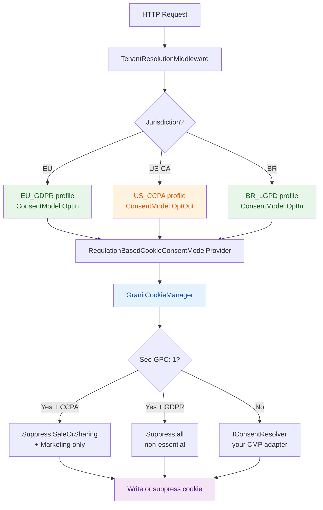

import { Aside, Tabs, TabItem } from '@astrojs/starlight/components';

Your SaaS ships to France, California, and Brazil. Three jurisdictions. Three different cookie consent requirements:

- **France (GDPR)** — cookies blocked until the user explicitly accepts. Opt-in.
- **California (CCPA)** — cookies active by default; user can opt out of sale/sharing. Opt-out.
- **Brazil (LGPD)** — like GDPR. Opt-in again.

The naive solution is an `if (region == "EU")` somewhere near your banner logic. That check grows. It gets copied. Six months later, nobody knows which branch covers which jurisdiction, and your CCPA opt-out toggle silently also blocks analytics in France.

Granit solves this at the framework layer. The consent model — opt-in, opt-out, hybrid — is derived automatically from a **regulation profile** tied to the current tenant's jurisdiction. Your application code never branches on a regulation name.

## The cookie layer: a strict registry

Before talking about regulation-aware consent, let's establish the foundation: `Granit.Http.Cookies`.

Every cookie your application sets must be **declared at startup** with a category. Writing an undeclared cookie throws `UnregisteredCookieException`. There is no way to sneak a cookie in at runtime.

```csharp title="AppModule.cs"
[DependsOn(typeof(GranitHttpCookiesModule))]
public class AppModule : GranitModule
{
    public override void ConfigureServices(ServiceConfigurationContext context)
    {
        context.Services.AddGranitCookies(cookies =>
        {
            cookies.RegisterCookie(new CookieDefinition(
                "session_id", CookieCategory.StrictlyNecessary,
                retentionDays: 1, isHttpOnly: true,
                purpose: "Session identification"));

            cookies.RegisterCookie(new CookieDefinition(
                "_ga", CookieCategory.Analytics,
                retentionDays: 365, isHttpOnly: false,
                purpose: "Google Analytics user identifier"));

            cookies.RegisterCookie(new CookieDefinition(
                "ad_pref", CookieCategory.Marketing,
                retentionDays: 180, isHttpOnly: false,
                purpose: "Advertising preferences"));
        });
    }
}
```

The five **cookie categories** map directly to GDPR/CCPA classifications:

| Category | Consent required | Typical use |
|---|---|---|
| `StrictlyNecessary` | Never | Session, CSRF, authentication |
| `Preferences` | Yes | Language, theme |
| `Analytics` | Yes | First-party usage tracking |
| `Marketing` | Yes | Advertising, retargeting |
| `SaleOrSharing` | Yes | CCPA "Do Not Sell or Share" |

Use `IGranitCookieManager` — not `IResponseCookies` — to write cookies. The manager checks the registry, verifies consent for the cookie's category, and applies security defaults (`Secure`, `SameSite`, `MaxAge`) automatically.

```csharp title="SessionService.cs"
public class SessionService(IGranitCookieManager cookieManager)
{
    public async Task SetSessionAsync(HttpContext ctx, string sessionId)
    {
        // Checks registry + consent; throws if cookie is not declared
        await cookieManager.SetCookieAsync(ctx, "session_id", sessionId);
    }
}
```

<Aside type="tip">
Framework modules auto-register their own cookies. `GranitHttpCookiesModule` registers the antiforgery cookie. `GranitOpenIddictEntityFrameworkCoreModule` registers the identity cookies. You never manually declare framework cookies — only your application's own.
</Aside>

## The regulation engine: 14 built-in profiles

`Granit.Privacy.Regulations` ships **14 regulation profiles** across two support tiers:

| Tier | Regulations |
|---|---|
| **Tier 1** — fully supported | EU GDPR, UK GDPR, Brazil LGPD, USA CCPA/CPRA, Canada PIPEDA, Quebec Law 25, Switzerland nFADP |
| **Tier 2** — configurable | China PIPL, India DPDPA, Japan APPI, South Korea PIPA, Australia Privacy Act, South Africa POPIA, Thailand PDPA |
| **Tier 3** — extensible | Any custom regulation via `IRegulationProfileProvider` |

Each profile is an immutable `PrivacyRegulationProfile` that includes, among other things, the **consent model** for cookies:

| Regulation | Consent model |
|---|---|
| EU GDPR, UK GDPR, Brazil LGPD | `OptIn` — cookies blocked until consent |
| USA CCPA/CPRA | `OptOut` — cookies allowed; user can opt out of sale/sharing |
| Some US states | `Hybrid` — opt-in for sensitive categories, opt-out for the rest |

### Per-tenant resolution

The resolver follows a four-step priority chain:

1. `ICurrentTenant.Jurisdiction` populated by `TenantResolutionMiddleware` — no extra DB call
2. `Privacy:Regulations:TenantRegulations[<tenantId>]` — config override
3. `Privacy:Regulations:DefaultRegulation` — global fallback
4. `InvalidOperationException` — fail-fast if nothing resolves

```json title="appsettings.json"
{
  "Privacy": {
    "Regulations": {
      "DefaultRegulation": "EU_GDPR",
      "TenantRegulations": {
        "b1e9a7c4-5d22-4f08-8a13-6c4e9f2b0d77": "US_CCPA",
        "8f3c1d2a-0b44-4e7a-9c61-2f0a5b7d1e90": "BR_LGPD"
      }
    }
  }
}
```

Your California tenant gets `OptOut`. Your Brazilian tenant gets `OptIn`. Your European default stays `OptIn`. No application code changed.

## The bridge: connecting regulations to the cookie layer

Here is the architectural question: `Granit.Http.Cookies` is a general HTTP concern. `Granit.Privacy.Regulations` is a privacy concern. They should not depend on each other. How does the cookie manager know which consent model to apply?

Through a **bridge package** that depends on both:

```text
Granit.Http.Cookies
  defines:  ICookieConsentModelProvider (interface)

Granit.Privacy.Regulations.Cookies (bridge)
  implements: RegulationBasedCookieConsentModelProvider
  reads:      IPrivacyRegulationResolver → PrivacyRegulationProfile
  maps:       ConsentModel → CookieConsentMode
```

Wiring it up is one line:

```csharp title="AppModule.cs"
context.Services.AddGranitRegulationCookiesBridge();
```

This replaces the default `NullCookieConsentModelProvider` with the regulation-aware provider. From this point, `GranitCookieManager` consults the current tenant's regulation profile on every request to decide whether to apply opt-in enforcement or opt-out suppression.

The result is memoized in `HttpContext.Items` — the resolver is called once per request, not once per cookie write.

<Aside type="note">
Without the bridge, the system is safe by default. `NullCookieConsentModelProvider` returns `null`, GPC suppression is skipped, and `IConsentResolver` governs consent as usual. Adding the bridge upgrades to full regulation-aware behavior.
</Aside>

## GPC: the signal that overrides the banner

**Global Privacy Control** (`Sec-GPC: 1`) is a browser-level signal that the user prefers not to have their data sold or shared. Several US state laws — CPRA, Colorado CPA, Connecticut CTDPA — treat it as a legally binding opt-out.

`GranitCookieManager` reads the signal automatically via `IGlobalPrivacyControlSignal` and suppresses cookies based on the active regulation:

| Regulation | GPC active | Effect |
|---|---|---|
| CCPA (OptOut) | Yes | Suppresses `SaleOrSharing` + `Marketing` only |
| GDPR (OptIn) | Yes | Suppresses ALL non-essential categories |
| Hybrid | Yes | Suppresses `SaleOrSharing` + `Marketing` only |
| Any | No | Falls through to `IConsentResolver` |

<Aside type="caution">
CCPA + GPC suppresses `SaleOrSharing` and `Marketing`, but **not** `Analytics`. GPC means "Do Not Sell", not "Do Not Track". First-party analytics cookies survive a GPC signal under CCPA.
</Aside>

### Publishing the GPC discovery document

Honoring the `Sec-GPC` header is the inbound side. The GPC spec also defines an outbound declaration at `/.well-known/gpc.json` — a public attestation that your site honors the signal. Several US states recognize it as the canonical opt-in to GPC enforcement.

```csharp title="Program.cs"
app.MapGranitPrivacy();
app.MapGranitPrivacyGpcDiscovery();   // /.well-known/gpc.json
```

```json title="appsettings.json"
{
  "Privacy": {
    "GpcDiscovery": {
      "Enabled": true,
      "LastUpdate": "2026-01-15"
    }
  }
}
```

`LastUpdate` is a **legal anchor**, not a build date. It pins the interpretation of your declaration to the GPC spec version in force at that moment. Do not auto-default it to today's date — that silently moves the anchor on every deploy. The framework refuses to start if `Enabled` is `true` and `LastUpdate` is not set.

## The React side: a pluggable CMP adapter

The frontend mirrors the backend architecture. `@granit/cookies` defines a `CookieConsentProvider` interface. `@granit/react-cookies` wraps it into a React context. **The CMP is a plug** — swap any consent management platform by implementing the interface.

```ts title="cookie-consent-provider.ts"
interface CookieConsentProvider {
  init(): Promise<void>;
  getConsents(): ConsentState;
  onConsentChange(callback: (consents: ConsentState) => void): () => void;
  setConsent(category: CookieCategory, granted: boolean): void;
  setAllConsents(granted: boolean): void;
  hasConsented(): boolean;
}
```

The backend exposes its cookie registry via `GET /api/v1/cookies/config` (from `Granit.Http.Cookies.Endpoints`). A CMP adapter fetches this config at init time and uses it to build its own service map — so cookie definitions live in one place, the .NET registry, and propagate automatically to the UI.

### Implementing a custom adapter

```ts title="my-cmp-adapter.ts"
import type { CookieConsentProvider, CookieConsentConfig, ConsentState } from '@granit/cookies';

export function createMyCmpProvider(
  options: { loadConfig: () => Promise<CookieConsentConfig> }
): CookieConsentProvider {
  let consents: ConsentState = {
    strictly_necessary: true,
    preferences: false,
    analytics: false,
    marketing: false,
  };
  const listeners = new Set<(s: ConsentState) => void>();

  return {
    async init() {
      const config = await options.loadConfig();
      // initialize your CMP with config.cookies and config.services
      // subscribe to your CMP's consent-change events and update `consents`
    },
    getConsents: () => consents,
    onConsentChange(cb) {
      listeners.add(cb);
      return () => listeners.delete(cb);
    },
    setConsent(category, granted) {
      consents = { ...consents, [category]: granted };
      listeners.forEach(cb => cb(consents));
    },
    setAllConsents(granted) {
      consents = {
        strictly_necessary: true,
        preferences: granted,
        analytics: granted,
        marketing: granted,
      };
      listeners.forEach(cb => cb(consents));
    },
    hasConsented: () => Object.values(consents).some(Boolean),
  };
}
```

Wire it into the app:

```tsx title="App.tsx"
import { CookieConsentProvider } from '@granit/react-cookies';
import { createMyCmpProvider } from './my-cmp-adapter';

const cmp = createMyCmpProvider({
  loadConfig: () => fetch('/api/v1/cookies/config').then(r => r.json()),
});

export function App({ children }: { children: React.ReactNode }) {
  return (
    <CookieConsentProvider provider={cmp}>
      {children}
    </CookieConsentProvider>
  );
}
```

Anywhere in the component tree, read consent state with `useCookieConsent()`:

```tsx title="AnalyticsLoader.tsx"
import { useCookieConsent } from '@granit/react-cookies';

export function AnalyticsLoader() {
  const { consents, isLoaded } = useCookieConsent();

  if (!isLoaded || !consents.analytics) return null;
  return <script src="/analytics.js" />;
}
```

## The full picture



## Key takeaways

- **Declare every cookie at startup** with a category. `UnregisteredCookieException` prevents undeclared cookies at runtime — compliance is enforced, not hoped for.
- **14 regulation profiles** ship built-in. GDPR opt-in, CCPA opt-out, LGPD opt-in — and 11 more. No hardcoded `if (region == "EU")` branches.
- **The bridge package** connects the cookie layer to the regulation engine without coupling them — one `AddGranitRegulationCookiesBridge()` call wires it all.
- **GPC is handled automatically** per regulation: CCPA suppresses sale/sharing, GDPR suppresses everything non-essential.
- **The React CMP layer is a plug.** Implement `CookieConsentProvider` from `@granit/cookies` to connect any consent management platform.

## Further reading

- [Cookies overview](/dotnet/compliance/cookies/) — package structure, `CookieDefinition`, module setup
- [Consent models & GPC](/dotnet/compliance/cookies/consent/) — `IConsentResolver`, opt-in/opt-out, GPC discovery document
- [Regulation Bridge](/dotnet/compliance/cookies/regulation-bridge/) — `RegulationBasedCookieConsentModelProvider` internals
- [Multi-Regulation Engine](/dotnet/compliance/privacy/regulations/) — all 14 profiles, custom profiles, per-tenant resolution
- [Blog: GDPR by Design](/blog/gdpr-by-design/) — the broader privacy architecture in Granit
