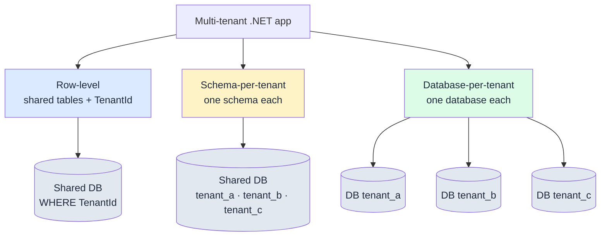

import { Aside, Tabs, TabItem } from "@astrojs/starlight/components";

Picture the support ticket you never want to read: **"Why can I see another
company's invoices in my dashboard?"** One missing `WHERE TenantId = @tenant`
and your SaaS has a data breach, a GDPR notification clock ticking, and a churned
customer. Multi-tenancy in .NET is not a feature you bolt on — it is an isolation
decision you make once and enforce everywhere.

There are exactly three ways to isolate tenant data in a relational database.
This post walks through all three, the trade-offs that actually matter (blast
radius, cost, noisy neighbours, backup granularity, migration path), and then
shows how Granit makes the safe default automatic — and how you escalate to
strict isolation without rewriting your data layer.

## The three isolation strategies

Every multi-tenant design collapses to one question: **where is the tenant
boundary drawn?** At the row, at the schema, or at the database.

### Row-level: a discriminator column

Every tenant shares the same tables. A `TenantId` column tags each row, and every
single query carries a `WHERE TenantId = @current` predicate. This is the cheapest
model to run: one connection pool, one migration, one backup.

The catch is that isolation lives entirely in your code. Forget the predicate on
**one** query — a report, an admin screen, a background job — and you leak across
tenants. There is no database-level wall to catch the mistake.

### Schema-per-tenant

Each tenant gets its own PostgreSQL schema (`tenant_a.invoices`,
`tenant_b.invoices`) inside a shared database. Isolation is stronger: a query
scoped to the wrong schema returns nothing rather than another tenant's rows. You
also get per-schema backup and restore.

The cost is operational. Every schema change now runs N times, once per tenant
schema, and connection pooling gets tricky — a pooled connection remembers the
last tenant's `search_path`, so you **must** reset it on every checkout or you
recreate the row-level leak with extra steps.

### Database-per-tenant

Each tenant gets a physically separate database, often on separate infrastructure.
This is the strongest isolation: a bug literally cannot reach another tenant's
data because it lives in a different database. You get per-tenant backup, restore,
point-in-time recovery, and even per-tenant geographic residency.

You pay for it in fixed cost and orchestration. A thousand tenants means a
thousand databases to provision, migrate, monitor, and back up. Connection-string
routing becomes a first-class concern.



### The trade-offs, side by side

| Concern | Row-level | Schema-per-tenant | Database-per-tenant |
|---------|-----------|-------------------|---------------------|
| **Blast radius** of a bug | All tenants | Usually one | One |
| **Per-tenant cost** | Fractions of a cent | Low | High (fixed floor) |
| **Noisy neighbour** | Yes — shared tables/indexes | Partial | None |
| **Backup / restore granularity** | All-or-nothing | Per schema | Per tenant |
| **Migration effort** | 1 run | N runs, one DB | N runs, N DBs |
| **Tenant count that stays sane** | 100k+ | Hundreds to low thousands | Tens to low hundreds |
| **Data residency per tenant** | No | No | Yes |

There is no universally correct row in that table. Most SaaS products start at
**row-level** because it scales to tens of thousands of tenants on one database,
and escalate a **specific** subset of data — or a specific regulated customer — to
stricter isolation. The mistake is picking the strongest model on day one and
drowning in operational cost for a product with forty tenants.

## How Granit does row-level by default

Granit's default is row-level isolation, but with the discriminator predicate
enforced by the framework rather than by your discipline. Three pieces cooperate:
a marker interface, a global query filter, and an interceptor.

### Mark the entity

Implement `IMultiTenant` on any entity that belongs to a tenant. The contract is
a single nullable `Guid` — never a `string`:

```csharp title="Invoice.cs"
using Granit.Domain;
using Granit.MultiTenancy;

public sealed class Invoice : FullAuditedEntity, IMultiTenant
{
    public Guid? TenantId { get; set; }
    public decimal Total { get; set; }
    public string Reference { get; set; } = string.Empty;
}
```

You never assign `TenantId` yourself. On insert, the `AuditedEntityInterceptor`
reads the ambient `ICurrentTenant` and stamps `TenantId` onto every `IMultiTenant`
entity in the `Added` state — the same interceptor pass that sets `CreatedAt` and
`CreatedBy`. Forgetting to set the tenant is not a failure mode that exists.

### Let the query filter add the WHERE

Here is the bad way — the one that ships the breach. You scatter the predicate by
hand, and isolation holds only as long as every developer remembers it forever:

```csharp title="LeakyInvoiceQueries.cs"
// DON'T: one forgotten .Where and you cross tenants
var invoices = await db.Invoices
    .Where(i => i.TenantId == tenantId) // easy to forget on the next query
    .ToListAsync(cancellationToken);
```

The good way is to write no predicate at all. When your `DbContext` calls
`ApplyGranitConventions` in `OnModelCreating`, Granit registers a **named** EF Core
10 query filter (`GranitFilterNames.MultiTenant`) for every `IMultiTenant` entity.
The filter expression is `e.TenantId == currentTenant.Id`, re-evaluated per query
from `ICurrentTenant`:

```csharp title="InvoicingDbContext.cs"
using Granit.DataFiltering;
using Granit.MultiTenancy;
using Granit.Persistence.EntityFrameworkCore.Extensions;
using Microsoft.EntityFrameworkCore;

public sealed class InvoicingDbContext(
    DbContextOptions<InvoicingDbContext> options,
    ICurrentTenant? currentTenant = null,
    IDataFilter? dataFilter = null) : DbContext(options)
{
    public DbSet<Invoice> Invoices => Set<Invoice>();

    protected override void OnModelCreating(ModelBuilder modelBuilder)
    {
        base.OnModelCreating(modelBuilder);
        modelBuilder.Entity<Invoice>(e => e.ToTable("invoices"));

        // Registers soft-delete, multi-tenant, and the rest of the named filters
        modelBuilder.ApplyGranitConventions(currentTenant, dataFilter);
    }
}
```

Now the query has no tenant clause in your code, yet the SQL always carries one:

```csharp title="InvoiceQueries.cs"
// The MultiTenant filter injects WHERE TenantId = @current automatically
var invoices = await db.Invoices
    .ToListAsync(cancellationToken)
    .ConfigureAwait(false);
```

The isolation moved from "every developer, every query, forever" to "one call in
`OnModelCreating`". That is the whole point of a global query filter. The same
mechanism drives soft delete and GDPR processing restriction — see
[the interceptor stack post](/blog/soft-deletes-audit-trails-query-filters-interceptor-stack/)
for how these filters compose on one entity.

<Aside type="danger" title="Never call IgnoreQueryFilters() without arguments">
`.IgnoreQueryFilters()` with no arguments disables **every** filter, including the
multi-tenant one — a cross-tenant leak in one keystroke. Always name the filter you
mean to bypass: `.IgnoreQueryFilters([GranitFilterNames.SoftDelete])`. An
architecture test fails the build if the parameterless form appears anywhere in
`src`.
</Aside>

### What happens in host context

When no tenant is active — a host administrator, a system job — `ICurrentTenant.Id`
is `null`, so the filter becomes `WHERE TenantId IS NULL` and returns no tenant
data. That is the correct **safe default**: absence of a tenant means you see
nothing, not everything. Cross-tenant access is then an explicit, auditable opt-in
(via `EfStoreBase.Query(db)` or `IDataFilter.Disable<IMultiTenant>()`), never an
accident. The full mechanics live in the
[query filters reference](/dotnet/data/query-filters/).

## Escalating to strict isolation

Row-level is the right default, but some data has no business relying on a runtime
predicate. Blobs, PII, encrypted columns, anything a regulator will ask about — you
want a guarantee, not a convention. That is where you swap one line.

When you register the context, use `AddGranitIsolatedDbContext<T>` instead of
`AddGranitDbContext<T>`:

```csharp title="InvoicingModule.cs"
public override void ConfigureServices(ServiceConfigurationContext context)
{
    // Strict: refuses to run without an active tenant
    context.Services.AddGranitIsolatedDbContext<InvoicingDbContext>(options =>
    {
        options.UseNpgsql(
            context.Configuration.GetConnectionString("Default"));
    });
}
```

The difference is behavioural, not cosmetic:

- `AddGranitDbContext<T>` — the default. Wires the interceptors, applies the
  filters, and leaves host context free to bypass the tenant filter deliberately.
- `AddGranitIsolatedDbContext<T>` — forces **every** query through
  `ICurrentTenant`, **throws** if no tenant is active, and **refuses host-side
  bypass** entirely. There is no code path that reads this data without a tenant.

That last point is the guarantee row-level alone cannot give you: a host admin,
a stray background job, a forgotten `Disable<IMultiTenant>()` — none of them can
read an isolated context's data, because the context aborts rather than serve a
query with no tenant. In Granit itself, several framework modules that store
per-tenant blobs, PII, or encrypted data register this way, and `[Encrypted]`
fields are only allowed on entities owned by an isolated context — an architecture
test enforces it. You get the operational simplicity of one shared database with a
hard floor under the data that matters.

## The mechanical path to database-per-tenant

Sometimes a single customer signs a contract that says "our data lives in its own
database, in our region." You do not want that clause to trigger a rewrite. In
Granit the isolation topology is configuration, not code, because the data layer
already routes everything through `ICurrentTenant`.

The strategy is chosen through `TenantIsolationStrategy`:

<Tabs>
<TabItem label="Shared database (default)">

```json title="appsettings.json"
{
  "TenantIsolation": {
    "Strategy": "SharedDatabase"
  }
}
```

Row-level. One database, the `MultiTenant` query filter does the work.

</TabItem>
<TabItem label="Schema per tenant">

```json title="appsettings.json"
{
  "TenantIsolation": {
    "Strategy": "SchemaPerTenant"
  },
  "MultiTenancy:TenantSchema": {
    "NamingConvention": "TenantId",
    "Prefix": "tenant_"
  }
}
```

A schema activator sets the connection's `search_path` per tenant on every
connection open. Granit ships `PostgresqlTenantSchemaActivator`,
`MySqlTenantSchemaActivator`, and `OracleTenantSchemaActivator`.

</TabItem>
<TabItem label="Database per tenant">

```json title="appsettings.json"
{
  "TenantIsolation": {
    "Strategy": "DatabasePerTenant"
  }
}
```

An `ITenantConnectionStringProvider` resolves each tenant to its own connection
string, so the DbContext connects to a physically separate database.

</TabItem>
</Tabs>

<Aside type="caution" title="Schema activators must reset on every connection">
Pooled connections retain the previous tenant's schema. A schema activator that
does not run on every connection checkout re-introduces the exact cross-tenant
leak you moved to schema isolation to avoid.
</Aside>

Because your entities, DbContexts, and queries do not change between these modes,
onboarding an isolated customer becomes provisioning, not development.
`ITenantProvisioner` (and the built-in `AutoTenantProvisioner`) creates the new
schema or database and runs its migrations when a tenant is created. Seed data
that must run per tenant goes through `ITenantDataSeedContributor` so it lands in
the right scope. The application code that reads an `Invoice` is byte-for-byte
identical whether that invoice lives in a shared table or a dedicated database.

This is the same isolation philosophy that makes Granit modules extractable into
microservices: each module already owns its DbContext, migrations, and filters,
so moving its data is mechanical. If that idea is new to you, start with
[isolated DbContext per module](/blog/isolated-dbcontext-per-module/) and the
[case for the modular monolith](/blog/why-modular-monolith/).

## Takeaways

- **Pick isolation by blast radius and cost, not by instinct.** Row-level scales to
  tens of thousands of tenants on one database; database-per-tenant buys hard
  isolation and per-tenant residency at a high fixed cost. Most products start at
  row-level and escalate a subset.
- **Row-level isolation is only as safe as your weakest query.** Let a global query
  filter add the `WHERE TenantId` — never scatter the predicate by hand.
- **Granit's default is enforced row-level:** `IMultiTenant` + `ICurrentTenant` +
  the `MultiTenant` query filter, with the `AuditedEntityInterceptor` stamping
  `TenantId` on insert. No tenant means you see nothing — the safe default.
- **Escalate specific data with one line.** `AddGranitIsolatedDbContext<T>` throws
  without an active tenant and refuses host bypass — the guarantee row-level cannot
  give.
- **Database-per-tenant is configuration, not a rewrite.** Flip
  `TenantIsolationStrategy`, let `ITenantConnectionStringProvider` and
  `ITenantProvisioner` route and provision. Your query code never changes.

## Further reading

- [Multi-tenancy concept](/dotnet/concepts/multi-tenancy/) — the isolation
  strategies and tenant resolution in depth
- [Query filters](/dotnet/data/query-filters/) — named filters, host-admin bypass,
  and why parameterless `IgnoreQueryFilters()` is banned
- [Persistence reference](/dotnet/data/persistence/) — `AddGranitDbContext` vs
  `AddGranitIsolatedDbContext`, schema activators, tenant provisioning
- [Adding persistence guide](/dotnet/getting-started/adding-persistence/) — wire
  EF Core, interceptors, and conventions from scratch
- [Isolated DbContext per module](/blog/isolated-dbcontext-per-module/) — the
  isolation pattern that makes tenant and module extraction mechanical
- [Soft deletes and the interceptor stack](/blog/soft-deletes-audit-trails-query-filters-interceptor-stack/)
  — how the tenant filter composes with soft delete and audit
- [Why a modular monolith](/blog/why-modular-monolith/) — the architectural case
  for drawing boundaries early
