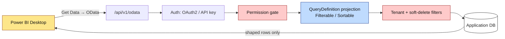

import { Aside, Tabs, TabItem, Steps } from "@astrojs/starlight/components";

It is the third quarter in a row. Someone in finance opens a ticket: *"Can we get
the invoice numbers in Power BI, refreshed daily?"* Last time you wrote a scheduled
job that dumped a CSV to a share. The time before that, a stored procedure against a
read replica. Both worked for a month, then a schema change broke them, and here you
are again.

There is a better answer, and it is not another export. You expose a **governed OData
v4 feed** from your .NET application, hand finance a URL, and let Power BI pull live
data on its own schedule — through the exact same tenant, soft-delete, and permission
filters your application already enforces. No replica. No nightly job. No bespoke
pipeline to rot.

This is Layer 3 of Granit's analytics stack. Let's build it.

## The trap: raw SQL and raw entities

The two obvious shortcuts are both liabilities.

**Granting BI tools read-only SQL access** to a replica feels efficient until the day
a custom view forgets a `WHERE tenant_id = …` clause and one tenant sees another's
data. The replica also skips your `IsDeleted = 0` filter, so deleted rows resurface in
reports. Any holder of the SQL credential reads everything, none of it hits your audit
log, and your database schema quietly becomes a public contract that every internal
refactor can break.

**Serializing EF entities straight to the wire** is the application-layer version of
the same mistake — lazy-loading surprises, over-exposed columns, and a data shape
welded to your persistence model. We covered why that is a bad idea in
[Never Return EF Entities](/blog/never-return-ef-entities/); the reasoning applies
doubly when the consumer is an external BI tool you do not control.

<Aside type="caution" title="Direct SQL replica access is forbidden">
  In Granit, OData is the only sanctioned BI bridge. Every OData request flows
  through the same pipeline as your grid endpoints, inheriting tenant filtering,
  soft-delete, per-EntitySet permissions, audit, and rate limiting. Punching a
  SQL hole around that pipeline is explicitly out of bounds.
</Aside>

## Where OData fits in the analytics stack

Granit's BI story is three additive layers, each useful on its own:

- **Layer 1 — inline metrics.** A single governed number: "12 unpaid invoices".
- **Layer 2 — composable dashboards.** Widget grids built from those metrics.
- **Layer 3 — the OData v4 connector.** Full, filterable row sets for Power BI,
  Excel, and Tableau.

The rule of thumb decides for you. If the consumer is your own UI and the answer is
one aggregated number, reach for [inline metrics](/dotnet/business/analytics/inline-metrics/).
If the consumer is an external BI tool that needs tabular data and benefits from
`$filter` / `$select` / `$top` composition, reach for the OData feed. This post is
about the third layer, but the two work together — more on that below.

## Shape the feed, don't expose the table

The single most important design decision: **an OData EntitySet is backed by a
`QueryDefinition<T>`, not by an EF entity.** The `QueryDefinition` is the same shaping
primitive that powers your admin grids — it declares which columns are projected,
which are filterable, and which are sortable. Power BI only ever sees that projection.

```csharp title="InvoiceQueryDefinition.cs"
public sealed class InvoiceQueryDefinition : QueryDefinition<Invoice>
{
    public InvoiceQueryDefinition()
    {
        Column(i => i.Number).Filterable().Sortable();
        Column(i => i.Status).Filterable();
        Column(i => i.IssuedAt).Filterable().Sortable();
        Column(i => i.AmountRemaining).Sortable();
        // Internal columns (RowVersion, CreatedByUserId, raw notes) are simply
        // never declared — they cannot leak into the feed.
    }
}
```

The consequences are load-bearing. A `$filter` on a column that is not
`.Filterable()` returns `400 Bad Request`. An `$orderby` on a non-`.Sortable()`
column does the same. There is no "select star" — if a column is not in the
definition, it does not exist as far as the feed is concerned. Your persistence model
stays free to change; the contract is the `QueryDefinition`.

## Wire it up

With the shape defined, exposing it is two calls in `Program.cs`. Add the service,
then map the endpoint and declare each EntitySet with the hardening you want.

```csharp title="Program.cs"
builder.Services.AddGranitODataExposure();

app.MapGranitODataEndpoints("/api/v1/odata", opts =>
{
    opts.EntitySet<Invoice, InvoiceQueryDefinition>("Invoices")
        .RequirePermission("OData.Invoicing.Invoices.Read")
        .ExpandWhitelist("Customer")
        .EnableCount();
});
```

Every guardrail here is a deliberate, secure-by-default choice:

- **`RequirePermission`** gates the set behind `OData.Invoicing.Invoices.Read`. Note
  the `OData.` prefix — these permissions are intentionally separate from the admin
  grid's `Invoicing.Invoices.Read`, so a scoped BI token cannot double as interactive
  admin access (ISO 27001 A.9.4 least-privilege).
- **`$expand` is disabled by default.** `?$expand=Customer` returns `400` unless the
  navigation is on the whitelist. The whitelist is per-EntitySet and accepts dotted
  paths (`.ExpandWhitelist("Lines.Product")` also permits `Lines`); each level counts
  against `MaxExpansionDepth`.
- **`$count` is opt-in.** Without `.EnableCount()`, `?$count=true` returns `400` —
  huge tables would otherwise face a full-table scan on every refresh.
- **`$top` is silently capped** to `MaxTop` (default 5000). Above the cap, the
  response carries the `OData-MaxTop-Applied` header so observability tooling can spot
  a misconfigured refresh job. Without `$top`, the server returns at most `PageSize`
  rows (default 1000) and emits `@odata.nextLink` for pagination — Power BI walks it
  transparently.

## The security pipeline, visualized

The value of the feed is what happens *before* Power BI ever sees a row. Tenant
filter, soft-delete, and per-EntitySet permission run first, on the server, every
time.



The blue box is the shaping layer; the red boxes are security. Power BI evaluates its
DAX locally on whatever survives that gauntlet — it never sees rows it should not.

## Authentication: pick the label that matches your identity stack

Power BI's auth picker for an OData source offers several labels, and the right one
depends on how you have wired Granit identity.

| Granit auth | Power BI method | When to use |
| ----------- | --------------- | ----------- |
| OIDC / OAuth2 (Entra ID, Keycloak, OpenIddict, Cognito…) | **Organizational account** | Interactive analysts in Power BI Desktop. It is OAuth2 Authorization Code + PKCE under the hood — works against any standards-compliant IdP, not just Microsoft. |
| API key (`Granit.Authentication.ApiKeys`) | **Web API** | Power BI Service scheduled refresh, headless integrations. Use a dedicated service-principal key, never a personal one. |
| Anonymous | **Anonymous** | Public reference-data feeds only — and only when the EntitySet opted in with `.AllowAnonymousAccess()`. |

<Aside type="caution" title="Basic and Windows auth will fail">
  Granit's OData layer does not accept HTTP Basic or Windows authentication. Pick
  either in Power BI and the request returns `401 Unauthorized` no matter what
  credentials you supply.
</Aside>

## Rate limits keep a runaway refresh from starving analysts

Power BI Service refresh jobs hit the feed periodically — as often as every 30 minutes
for shared workspaces — issuing one request per EntitySet per partition. The
`granit-odata` policy, declared under `RateLimiting:Policies` in `appsettings.json`,
keeps that in check. A sensible baseline: **60 requests/minute per tenant** for
interactive analysts, **600/minute** for service accounts.

When the bucket empties, the server returns `429 Too Many Requests` with a
`Retry-After` header. Power BI Desktop surfaces this as *"OData service returned: too
many requests"*; Power BI Service marks the refresh failed after three retries. The
fix is almost always to move unattended refresh jobs onto a dedicated service
principal with the wider quota, so an eager schedule can't crowd out humans.

## Connect Power BI in a few clicks

<Steps>

1. **Ship the connection descriptor.** The framework repo includes a
   `granit-showcase.pbids` file — a machine-readable "connect to this data source"
   descriptor. Point its URL at your deployment:

   ```jsonc
   {
     "version": "0.1",
     "connections": [
       {
         "details": {
           "protocol": "odata",
           "address": { "url": "https://your-app.example.com/api/v1/odata" }
         },
         "options": {},
         "mode": "DirectQuery"
       }
     ]
   }
   ```

2. **Open it.** Double-click the `.pbids`. Power BI Desktop launches and prompts for
   authentication.

3. **Sign in.** Choose *Organizational account → Sign in* and complete the OAuth2 flow
   against your Granit host's identity provider. (No `.pbids`? Use *Get Data → OData
   feed → Basic*, paste the URL, then *Sign in with Organizational account* — same
   result.)

4. **Pick your tables.** The Navigator lists every EntitySet you have permission to
   read. Tick `Invoices`, hit *Load*, and you are querying live data.

</Steps>

If the Navigator shows no EntitySets, the calling identity is missing read permission
on every set, or authentication completed against the wrong tenant. A `403` on a
specific set means that identity lacks that EntitySet's `OData.{Module}.{Entity}.Read`
permission.

## The queries Power BI actually sends

Under the hood, Power BI composes standard OData v4. These fold cleanly onto the
Granit filter pipeline:

```http
GET /api/v1/odata/Invoices?$filter=Status eq 'Open'&$select=Number,IssuedAt,AmountRemaining&$top=500&$orderby=IssuedAt desc
```

Two edges are worth warning analysts about, because `$filter` is *translated* to the
framework's query engine, not passed through raw:

- **Case-insensitive text filters** fold to `tolower(...)`, which is rejected. Model
  text columns with a consistent case, or filter client-side.
- **Date-hierarchy drill-downs** fold to `year(...)` / `month(...)`, also rejected.
  Use explicit ranges instead:

  ```text
  $filter=IssuedAt ge 2026-01-01 and IssuedAt lt 2027-01-01
  ```

A rejected fold does not break the report — Power BI falls back to client-side
filtering, it just transfers more rows. From there, DAX measures run locally over the
shaped set:

```text
% Unpaid = DIVIDE(
    CALCULATE(COUNTROWS('Invoices'), 'Invoices'[Status] = "Open"),
    COUNTROWS('Invoices'))
```

Because Granit metric names follow the same *Subject + Aggregation* pattern as DAX
measures (see the [analytics conventions](/dotnet/business/analytics/)), an analyst
migrating a Power BI model onto the feed lands on familiar vocabulary.

## When one number beats a whole table

Not every request needs a feed. If finance wants "unpaid invoices across the whole
platform" as a single tile in a host dashboard — not a table to slice — the right tool
is a Layer 1 [inline metric](/dotnet/business/analytics/inline-metrics/), which
aggregates through the same pipeline and returns one governed value from
`POST /api/{version}/analytics/metrics/{name}`.

```csharp title="UnpaidInvoiceCountMetricDefinition.cs"
public sealed class UnpaidInvoiceCountMetricDefinition : MetricDefinition<Invoice, int>
{
    public override string Name => "Granit.Invoicing.UnpaidInvoiceCountMetric";
    public override MetricValueKind ValueKind => MetricValueKind.Count;
    public override AggregateFunction Aggregation => AggregateFunction.Count;
    public override Expression<Func<Invoice, bool>>? BaseFilter
        => i => i.Status == InvoiceStatus.Open;
    public override Expression<Func<Invoice, DateTimeOffset>>? PeriodSelector
        => i => i.IssuedAt!.Value;
    public override bool IsHigherBetter => false;
}
```

Reach for the OData feed when the consumer needs full row sets to pivot; reach for a
metric when the answer is a number.

## Crossing tenants — deliberately

Most BI is tenant-scoped: an analyst sees only their tenant's rows, which is the whole
point. But a SaaS operator sometimes needs data *across* tenants — MRR rolled up over
the customer base, compliance audit trails, capacity planning. For that, and only
that, `Granit.Http.ODataExposure` ships a **second mount** with three strict startup
gates that make every cross-tenant exposure an auditable opt-in.

```csharp title="Program.cs"
app.MapGranitODataHostEndpoints("/api/v1/odata/host", opts =>
{
    opts.EntitySet<Invoice, InvoiceQueryDefinition>("InvoicesAllTenants")
        .RequirePermission("OData.Host.Invoicing.Invoices.Read")   // must be Host side
        .AcknowledgeCrossTenantExposure(q =>
            q.IgnoreQueryFilters([GranitFilterNames.MultiTenant]))  // explicit bypass
        .ExpandWhitelist("Customer");
});
```

The bypass is a lambda you write at the call site, not a flag buried in a builder — a
reviewer reading `Program.cs` sees the tenant filter being lifted, in code, on screen.
The permission must resolve to `MultiTenancySides.Host`, anonymous access is
unavailable here, and any `IMultiTenant` entity *requires* the acknowledgement or the
app fails to start. The full mechanics live in the
[OData host-feed](/dotnet/business/analytics/odata-host-feed/) guide. If your answer to
*"why bypass the tenant filter?"* is anything other than *"a host operator
legitimately needs cross-tenant data"*, fix the tenant context instead.

## Takeaways

- **Hand out a URL, not an export.** An OData feed replaces the recurring
  build-a-bespoke-export cycle with a live endpoint Power BI refreshes on its own
  schedule.
- **Back EntitySets with a `QueryDefinition`, never a raw EF entity.** The projection
  is your contract; undeclared columns simply do not exist to the feed.
- **Security runs server-side, first.** Tenant, soft-delete, and permission filters
  apply before Power BI sees a row — the same pipeline as your grids, with a distinct
  `OData.` permission namespace.
- **Defaults are hardened.** `$expand`, `$count`, and uncapped `$top` are off until
  you opt in; rate limits and `Retry-After` protect you from runaway refresh jobs.
- **Cross-tenant is a separate, gated mount.** The host-feed exists so the tenant-feed
  never has to compromise.

## Further reading

- [Analytics — overview](/dotnet/business/analytics/) — the three-layer BI stack and package structure.
- [OData feed — Power BI / Excel / Tableau](/dotnet/business/analytics/odata-power-bi/) — the full connector reference, auth table, and troubleshooting.
- [OData host-feed](/dotnet/business/analytics/odata-host-feed/) — cross-tenant BI for host operators, with its three strict gates.
- [Inline metrics](/dotnet/business/analytics/inline-metrics/) — Layer 1 KPIs when the answer is one number.
- [Never Return EF Entities](/blog/never-return-ef-entities/) — why shaping the wire contract matters.
- [RFC 7807 Problem Details](/blog/rfc-7807-problem-details-the-only-way-to-return-errors/) — how the same API surface reports the `400` / `429` you'll meet here.
