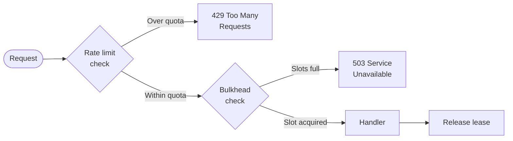

import { Aside, Tabs, TabItem } from "@astrojs/starlight/components";

Your API is under attack — but not from a hacker. The threat is Tenant B, your best enterprise customer, whose overnight batch job fires 4,000 export requests per minute against an endpoint rated for 500. Every other tenant on the platform slows to a crawl. Support tickets start arriving at 8 AM.

Rate limiting would have stopped the 4,000 requests per minute. But there is a second problem rate limiting does not solve: what happens to the 50 requests that *are* within quota but all arrive at the same millisecond, each spawning a heavy database query? Your thread pool saturates. The response time climbs from 120 ms to 18 seconds. Other tenants time out. Same outcome, different cause.

**These are two distinct failure modes.** Granit ships a dedicated solution for each.

## Two axes of protection

Before configuring anything, it helps to understand why both patterns are necessary and why neither alone is sufficient.

| | Rate limiting | Bulkhead isolation |
|---|---|---|
| **Axis** | Time (requests per window) | Concurrency (simultaneous in-flight) |
| **Question answered** | "How many requests in the last minute?" | "How many requests are running right now?" |
| **Failure response** | `429 Too Many Requests` | `503 Service Unavailable` |
| **Counter storage** | Redis (shared across pods) | In-memory (per pod) |
| **Protects against** | Sustained overload, noisy neighbors | Thundering herd, slow-handler exhaustion |
| **Granit package** | `Granit.Http.RateLimiting` | `Granit.Http.Bulkhead` |

A tenant can stay within their rate limit (say, 1,000 req/min) and still DoS your service by sending all 1,000 requests in a 100 ms burst. Rate limiting measures volume across time; bulkhead isolation caps simultaneous depth. You need both.

## Rate limiting in Granit

`Granit.RateLimiting` is **framework-pure** — no ASP.NET Core dependency. The counters, algorithms, quota providers, and `TenantPartitionedRateLimiter` all live in the core package. The HTTP enforcement and Wolverine enforcement ship as separate transport bindings.

### Installation

```bash
dotnet add package Granit.Http.RateLimiting      # HTTP endpoints
dotnet add package Granit.RateLimiting.Wolverine  # Wolverine message handlers
```

```csharp title="AppModule.cs"
[DependsOn(
    typeof(GranitHttpRateLimitingModule),
    typeof(GranitRateLimitingWolverineModule))]
public sealed class AppModule : GranitModule { }
```

### Choosing an algorithm

Four algorithms ship out of the box. The right one depends on what you are protecting:

| Algorithm | Redis structure | Use case |
|---|---|---|
| `SlidingWindow` | Sorted set (`ZADD` + `ZREMRANGEBYSCORE`) | Public APIs — maximum precision, default |
| `FixedWindow` | Counter (`INCR` + `PEXPIRE`) | Simple counters, lowest memory |
| `TokenBucket` | Hash with refill | Export jobs — controlled burst allowance |
| `Concurrency` | — | Simultaneous in-flight cap (no time window) |

Each algorithm is implemented as a **Lua script executed atomically by Redis**. Timestamps come from `redis.call('TIME')` — server-side — so clock drift between pods never causes inconsistent counters.

### Configuring policies

```json title="appsettings.json"
{
  "RateLimiting": {
    "Enabled": true,
    "KeyPrefix": "rl",
    "BypassRoles": ["SystemAdmin"],
    "FallbackOnCounterStoreFailure": "Deny",
    "Policies": {
      "api-default": {
        "Algorithm": "SlidingWindow",
        "PermitLimit": 1000,
        "Window": "00:01:00",
        "SegmentsPerWindow": 6
      },
      "api-sensitive": {
        "Algorithm": "TokenBucket",
        "TokenLimit": 50,
        "TokensPerPeriod": 10,
        "ReplenishmentPeriod": "00:00:10"
      },
      "auth": {
        "Algorithm": "FixedWindow",
        "PermitLimit": 5,
        "Window": "00:15:00",
        "PartitionBy": "Ip"
      }
    }
  }
}
```

The `auth` policy partitions by IP instead of tenant — the right call for pre-authentication endpoints where you have no tenant context yet.

### Applying to endpoints and handlers

<Tabs>
<TabItem label="HTTP endpoints">

```csharp title="Program.cs"
using Granit.Http.RateLimiting.AspNetCore;

app.MapGet("/api/v1/appointments", ListAppointmentsAsync)
    .RequireGranitRateLimiting("api-default");

app.MapPost("/api/v1/payments", ProcessPaymentAsync)
    .RequireGranitRateLimiting("api-sensitive");

app.MapPost("/api/v1/auth/login", LoginAsync)
    .RequireGranitRateLimiting("auth");
```

</TabItem>
<TabItem label="Wolverine handlers">

```csharp title="GenerateExportCommand.cs"
using Granit.RateLimiting.Wolverine.Attributes;

[RateLimited("api-default")]
public sealed record GeneratePatientExportCommand(Guid PatientId);
```

```csharp title="WolverineSetup.cs"
opts.Policies.AddMiddleware<RateLimitMiddleware>(
    chain => chain.MessageType
        .GetCustomAttributes(typeof(RateLimitedAttribute), true).Length > 0);
```

</TabItem>
</Tabs>

When a request exceeds the limit, the HTTP binding returns a `429` with `Retry-After` and an RFC 7807 body. The Wolverine binding throws `RateLimitExceededException`, which plugs naturally into Wolverine's retry policies.

```json
{
  "status": 429,
  "title": "Too Many Requests",
  "detail": "Too many requests. Please retry later.",
  "limit": 1000,
  "remaining": 0,
  "retryAfter": 10
}
```

### Per-tenant partitioning — the noisy neighbor fix

Every counter is partitioned by tenant by default. The Redis key structure uses **hash tags** for Cluster slot co-location:

| `PartitionBy` | Key pattern | Use case |
|---|---|---|
| `Tenant` (default) | `rl:{tenantId}:api-default` | Shared tenant quota |
| `TenantAndIp` | `rl:{tenantId}:1.2.3.4:api` | Per-IP within a tenant |
| `Ip` | `rl:{1.2.3.4}:auth` | Pre-auth endpoints |
| `User` | `rl:{userId}:export` | Per-user quota |
| `TenantAndUser` | `rl:{tenantId}:userId:api` | Per-user within a tenant |

Tenant A and Tenant B each have their own counters. A misconfigured batch job on Tenant A cannot consume Tenant B's quota.

### Dynamic quotas by pricing plan

When `UseFeatureBasedQuotas` is enabled, `PermitLimit` is resolved at runtime from `Granit.Features` instead of static config. The convention-based feature name is `RateLimit.{policyName}`:

```csharp title="FeatureDefinitions.cs"
context.Add(
    new FeatureDefinition(
        "RateLimit.api-default",
        FeatureValueType.Numeric(defaultValue: 60, min: 10, max: 10_000)));
```

The Features resolution chain (Default → Plan → Tenant override) lets you ship differentiated quotas without code changes:

| Plan | `RateLimit.api-default` | `RateLimit.api-sensitive` |
|---|---|---|
| Free | 60 req/min | 5 req/min |
| Pro | 500 req/min | 50 req/min |
| Enterprise | 5,000 req/min | 500 req/min |

## Bulkhead isolation in Granit

`Granit.Http.Bulkhead` is built on .NET 10's `System.Threading.RateLimiting.ConcurrencyLimiter`. It limits how many concurrent operations a single tenant can have **in flight at the same time**. When the limit is reached, excess requests are rejected immediately — no queuing, no waiting — so you never hide a latency problem behind a growing queue.

<Aside type="note">
Bulkhead is in-memory and per-pod. With N pods and `PermitLimit = P`, a tenant can use up to N × P concurrent operations cluster-wide. For distributed concurrency quotas, combine with [Rate Limiting](/dotnet/api/rate-limiting/).
</Aside>

### Installation

```bash
dotnet add package Granit.Http.Bulkhead
```

```csharp title="AppModule.cs"
[DependsOn(typeof(GranitHttpBulkheadModule))]
public sealed class AppModule : GranitModule { }
```

### Configuring policies

```json title="appsettings.json"
{
  "Bulkhead": {
    "Enabled": true,
    "BypassRoles": ["SystemAdmin"],
    "Policies": {
      "api": {
        "PermitLimit": 20,
        "QueueLimit": 5,
        "QueueTimeout": "00:00:30"
      },
      "import": {
        "PermitLimit": 2,
        "QueueLimit": 0
      },
      "report-generation": {
        "PermitLimit": 3,
        "QueueLimit": 0
      }
    }
  }
}
```

`QueueLimit: 0` means reject immediately when all slots are taken — the right default for CPU- or DB-heavy operations where queuing only delays failure. For the general `api` policy, a short queue (`QueueLimit: 5`, `QueueTimeout: 30s`) gives healthy clients a brief grace period under momentary spikes.

### Applying to endpoints and handlers

<Tabs>
<TabItem label="HTTP endpoints">

```csharp title="Program.cs"
app.MapGet("/api/v1/patients", GetPatientsAsync)
    .RequireGranitBulkhead("api");

app.MapPost("/api/v1/import", ImportDataAsync)
    .RequireGranitBulkhead("import");

app.MapPost("/api/v1/reports/generate", GenerateReportAsync)
    .RequireGranitBulkhead("report-generation");
```

</TabItem>
<TabItem label="Wolverine handlers">

```csharp title="ImportDataCommand.cs"
[Bulkhead("import")]
public record ImportDataCommand(Guid TenantId, Stream Data);
```

```csharp title="WolverineSetup.cs"
opts.Policies.AddMiddleware<BulkheadMiddleware>(
    chain => chain.MessageType
        .GetCustomAttributes(typeof(BulkheadAttribute), true).Length > 0);
```

</TabItem>
</Tabs>

`RequireGranitBulkhead` acquires a lease before the handler runs and releases it in a `finally` block — the permit is always returned, even on unhandled exceptions. When the bulkhead is full, `BulkheadRejectedException` is mapped to **503 Service Unavailable**.

## Putting them together

Rate limiting and bulkhead isolation are complementary, not redundant. The typical production setup applies both to the same endpoint: rate limiting caps *volume over time*, bulkhead caps *depth at any instant*.

```csharp title="Program.cs"
app.MapGet("/api/v1/appointments", ListAppointmentsAsync)
    .RequireGranitRateLimiting("api-default")   // 1,000 req/min per tenant (Redis)
    .RequireGranitBulkhead("api");              // 20 concurrent per tenant (in-memory)

app.MapPost("/api/v1/import", ImportDataAsync)
    .RequireGranitRateLimiting("api-sensitive") // token bucket, controlled burst
    .RequireGranitBulkhead("import");           // max 2 simultaneous imports
```

The failure cascade now looks like this:



Rate limiting fires first (cheap Redis check). Only requests that pass the quota check compete for bulkhead slots.

## Failure behavior when Redis is down

Rate limiting depends on Redis. When the counter store is unavailable, two behaviors are available:

| `FallbackOnCounterStoreFailure` | Behavior | When to choose |
|---|---|---|
| `Deny` (default) | Systematic 429 | Security-first — no unmetered traffic |
| `Allow` | Request allowed + warning | Availability-first — quota enforcement is secondary |

Bulkhead is unaffected by Redis availability — it is entirely in-memory.

## Observability

`Granit.Http.Bulkhead` emits OpenTelemetry metrics out of the box:

| Metric | Type | Description |
|---|---|---|
| `granit.bulkhead.leases.active` | UpDownCounter | Currently active leases per policy and tenant |
| `granit.bulkhead.requests.rejected` | Counter | Rejected requests (bulkhead full) |

Both metrics carry `policy` and `tenant_id` attributes, so you can alert on a per-tenant surge without aggregating across the platform. A spike in `granit.bulkhead.requests.rejected` for a single tenant is the early warning signal that rate limiting alone would have hidden until the `429`s started.

## Key takeaways

- **Rate limiting and bulkhead isolation solve different problems.** Rate limiting caps volume over time (time axis); bulkhead caps simultaneous depth (concurrency axis). You need both.
- **Granit's rate limiting is Redis-backed and per-tenant by default.** Counters are partitioned with hash tags so Tenant A and Tenant B never share quota.
- **Lua scripts make counting atomic.** Server-side timestamps (`redis.call('TIME')`) eliminate clock-drift bugs across pods.
- **Bulkhead is in-memory and per-pod.** It protects the thread pool from thundering-herd spikes that a time-window quota cannot catch.
- **Dynamic quotas via `Granit.Features` let you ship tier-based rate limits without code changes.** Define a `RateLimit.{policyName}` Numeric feature and the quota follows the tenant's plan.
- **Both patterns work on HTTP endpoints and Wolverine message handlers** with the same configuration, so batch jobs and background workers are protected with the same primitives.

## Further reading

- [Rate Limiting reference](/dotnet/api/rate-limiting/) — algorithms, key partitioning, configuration reference
- [Bulkhead reference](/dotnet/api/bulkhead/) — concurrency limiter, queue options, OTel metrics
- [Bulkhead Isolation pattern](/dotnet/architecture/patterns/bulkhead-isolation/) — the full pattern including queue partitioning, circuit breakers, and SemaphoreSlim anti-stampede
- [Feature Flags](/dotnet/infrastructure/feature-flags/) — plan-based dynamic quotas
- [ADR-062: framework-pure core + transport bindings](/dotnet/architecture/adr/062-framework-pure-core-transport-bindings/) — why the core carries no ASP.NET Core dependency
