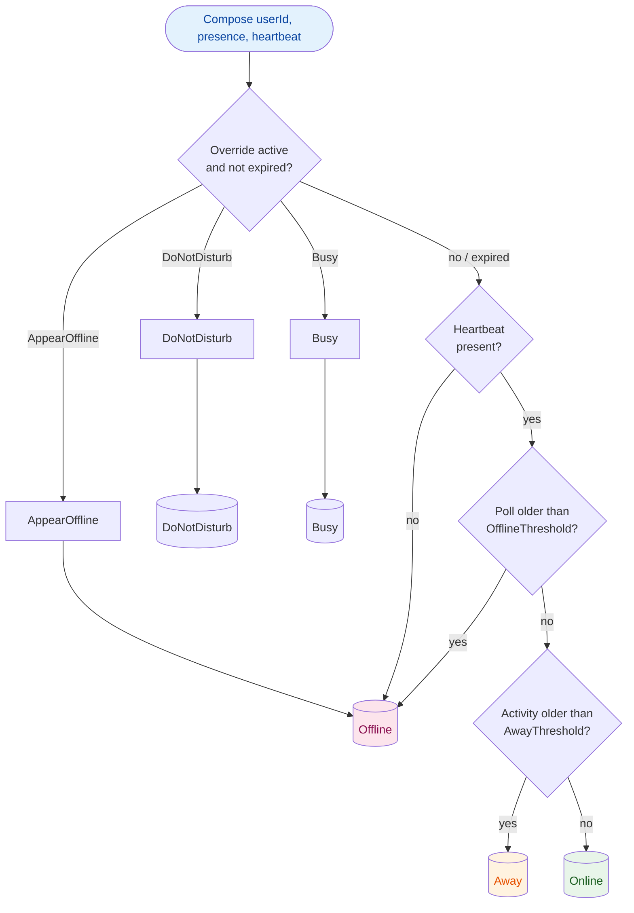
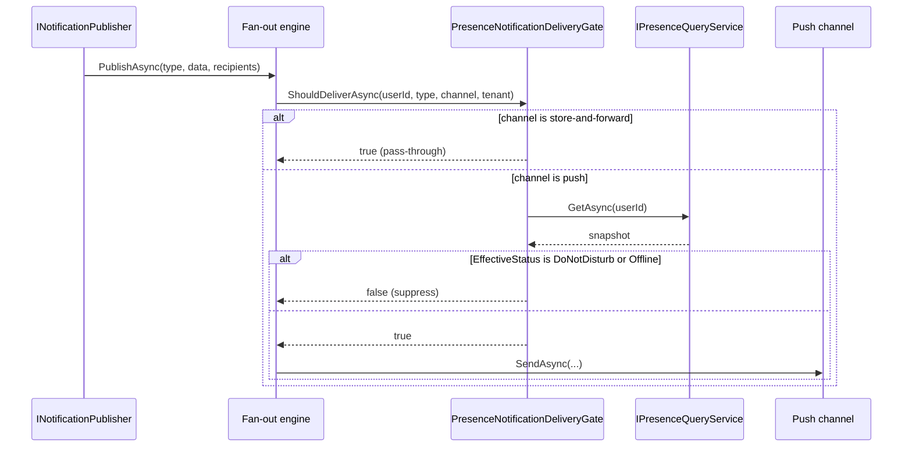
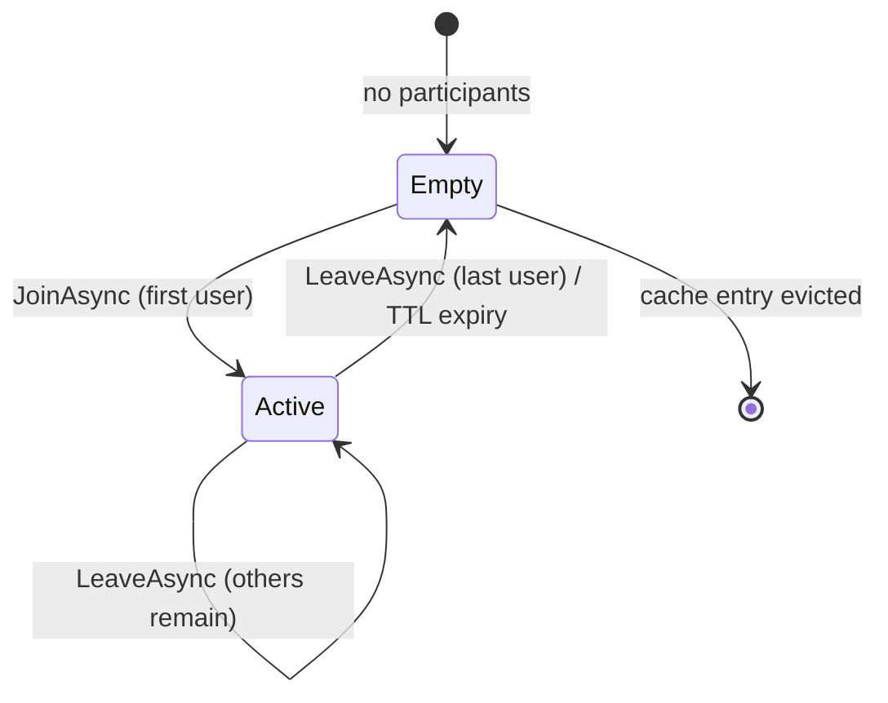

import { Aside, Tabs, TabItem } from "@astrojs/starlight/components";

A user opens three tabs of the same dashboard. Tab one is active, tabs two and
three are backgrounded. Your naive presence tracker polls all three, sees one
"active" report and two "idle for 40 seconds" reports arrive within the same
second, and flips the user's status to Away — while they're staring right at
the screen. Scale that to a second server behind a load balancer and you get a
worse bug: a colleague on pod B sees the user as offline for up to a minute
after they logged in on pod A, because nothing told pod B a heartbeat arrived.

Every team that ships a "who's online" indicator hits both bugs, then usually
builds a *second*, subtly different tracker six months later for "who's
currently viewing this document" — the Google Docs face-pile. Granit.Presence
is the primitive that solves the first problem correctly and generalizes to
the second for free.

## The bad way: two hand-rolled trackers, one Redis key scheme

A typical first pass looks like this — one `SETEX` call per heartbeat, one
`GET` per read, and a status derived inline wherever it's needed:

```csharp title="NaivePresenceService.cs"
public class NaivePresenceService(IDistributedCache cache)
{
    public async Task PingAsync(Guid userId, int idleSeconds)
    {
        // Last write wins — a backgrounded tab reporting a long idle
        // period right after the active tab reported zero flips the
        // status back to "away" a second after "online".
        await cache.SetStringAsync(
            $"presence:{userId}",
            DateTimeOffset.UtcNow.AddSeconds(-idleSeconds).ToString("O"),
            new DistributedCacheEntryOptions { SlidingExpiration = TimeSpan.FromSeconds(90) });
    }
}
```

This compiles, ships, and works in the demo. It breaks on three things every
production app eventually hits: multi-tab flapping (no merge rule, so whichever
tab's poll lands last wins), multi-pod visibility (plain `IDistributedCache`
has no fan-out — a colleague hitting a different pod reads stale state until
their own TTL expires), and manual overrides (Do Not Disturb has to be bolted
on as a second cache key with its own precedence rules, which nobody gets
right the first time). Then, a few sprints later, someone builds an entirely
separate "who's editing this page" service — a second cache key scheme, a
second controller, a second set of DTOs — because it *looks* unrelated to the
online/offline indicator. It isn't.

## Two dimensions, one primitive

`Granit.Presence` splits the problem along its natural seam instead of
building two unrelated services:

| Dimension | Question | Scope |
|-----------|----------|-------|
| **User-global presence** | Is this person reachable, and through which channels? | One status per human |
| **Resource-scoped rooms** | Who else is looking at this resource right now? | 1-to-N users per `(Kind, Id)` |

Both ride the **same FusionCache backplane, options, and diagnostics meter** —
there is nothing extra to install for rooms once user-global presence is
wired up. The module ships as four packages so you only pay for what you use:
core tracking (`Granit.Presence`, in-memory by default), EF Core persistence
of the manual override, HTTP endpoints, and a notification-gate bridge.

## Fixing the multi-tab flap with a MAX merge

Instead of last-write-wins, the tracker reconstructs each tab's
`LastActivityUtc` as `now − idleDuration` and merges with the existing entry
using a deterministic rule:

```text
LastActivityUtc := MAX(existing.LastActivityUtc, now − idleDuration)
```

A backgrounded tab reporting 40 seconds of idle time can never roll the status
backwards past what the active tab already reported. No front-end
coordination between tabs is required — the merge happens server-side, once,
in `FusionCachePresenceTracker.RecordPollAsync`.

`EffectiveStatus` then folds the heartbeat and a persisted manual override
into one snapshot:



The manual override (`Available`, `Busy`, `DoNotDisturb`, `AppearOffline`)
always wins over the heartbeat while it's active and not expired — a user who
sets Do Not Disturb before a meeting doesn't get overridden back to `Online`
by their own idle browser tab.

## Wiring it up

Three composition levels, each an explicit opt-in:

<Tabs>
<TabItem label="1. In-memory (dev)">

```csharp title="AppModule.cs"
[DependsOn(typeof(GranitPresenceModule))]
public sealed class AppModule : GranitModule { }
```

Single-pod, no persistence — fine for local dev and tests.

</TabItem>
<TabItem label="2. + EF Core persistence">

```csharp title="AppModule.cs"
[DependsOn(
    typeof(GranitPresenceModule),
    typeof(GranitPresenceEntityFrameworkCoreModule))]
public sealed class AppModule : GranitModule
{
    public override void ConfigureServices(ServiceConfigurationContext context)
    {
        context.Builder.AddGranitPresenceEntityFrameworkCore(
            opts => opts.UseNpgsql(context.Configuration
                .GetConnectionString("Presence")));
    }

    public override void OnApplicationInitialization(ApplicationInitializationContext context)
    {
        context.App.MapGranitPresence();
    }
}
```

The heartbeat stays cache-only by design — persisting a value that changes
every 30-60 seconds would generate roughly one write per active user per
polling cycle for data that's meaningless after a pod restart anyway. Only the
manual override is durable.

</TabItem>
<TabItem label="3. + Notification gate">

```csharp title="AppModule.cs"
[DependsOn(
    typeof(GranitPresenceModule),
    typeof(GranitPresenceEntityFrameworkCoreModule),
    typeof(GranitPresenceNotificationsModule),
    typeof(GranitNotificationsModule))]
public sealed class AppModule : GranitModule { /* … */ }
```

Once loaded, the fan-out engine consults `PresenceNotificationDeliveryGate` on
every delivery attempt. Push channels (`SignalR`, `Sse`, web `Push`,
`MobilePush`) are suppressed for recipients in `DoNotDisturb` or `Offline`;
store-and-forward channels (`InApp`, `Email`, `Sms`, `WhatsApp`, `Zulip`) keep
delivering so the user finds them when they come back. Security alerts can opt
out of the gate entirely via `AllowDoNotDisturbBypass`.



</TabItem>
</Tabs>

## The second dimension comes free: resource rooms

The Google Docs face-pile — who else has this page open — is not a separate
feature to build. It's the same tracker, addressed by a `(Kind, Id)` pair
instead of a user ID:

```csharp title="CmsPageEditorService.cs"
public sealed class CmsPageEditorService(IResourcePresenceTracker rooms)
{
    private const string Kind = "cms.page";

    public Task<ResourceRoom> OpenAsync(Guid pageId, Guid userId, CancellationToken ct)
    {
        var room = new ResourceRef(Kind, pageId.ToString());
        return rooms.JoinAsync(room, userId, """{"tab":"content"}""", ct);
    }

    public Task CloseAsync(Guid pageId, Guid userId, CancellationToken ct) =>
        rooms.LeaveAsync(new ResourceRef(Kind, pageId.ToString()), userId, ct);
}
```



A room has no explicit creation or deletion step — it springs into existence
when the first user joins and evaporates when the last one leaves or times
out. There's no database row and no cleanup job: **closing the laptop is a
valid "leave"**, handled entirely by cache TTL expiry.

Rooms are deliberately *informational*, never blocking. If you need to
actually prevent two people from clobbering the same field, that's a
different, complementary primitive (pessimistic edit locking) — rooms answer
"who is here", not "who holds the pen".

## What this replaces in practice

The migration story is concrete, not hypothetical. A team that had already
hand-rolled a page-editing presence service — an interface, a `FusionCache`
implementation, a controller, DTOs, tests, roughly 300 lines — collapsed it
to this:

```csharp title="Program.cs"
// Delete the custom module. Map the framework endpoints instead:
endpoints.MapGranitPresence(); // mounts /presence/rooms/{kind}/{id}

// Standardize the resource kind as a constant:
public const string CmsPageKind = "cms.page";

// userId is already resolved by the Granit.Identity pipeline —
// no need to thread it through manually.
```

~300 lines of bespoke tracking, caching, and HTTP plumbing became one endpoint
mapping and a constant. The one thing that migration surfaced worth calling
out: the in-house version stored the editor's display name in the cursor
payload. The framework's metadata contract explicitly forbids that — keep
participant metadata PII-free.

## Going multi-pod

Everything above works out of the box on a single pod. The moment you scale
horizontally, load `Granit.Caching.StackExchangeRedis` so FusionCache's Redis
L2 backplane propagates heartbeats and room joins between hosts:

<Aside type="caution" title="Without the Redis backplane">
A heartbeat recorded on pod A is invisible to pod B for the L1 cache TTL —
users hitting different pods see different effective statuses for the same
person, and startup checks log a warning when they detect this combination in
a multi-pod deployment.
</Aside>

This is the same L1 + L2 + backplane pattern used everywhere else Granit
needs cross-pod cache coherence — see
[HybridCache + Redis: Solving Distributed Cache Invalidation](/blog/hybrid-cache-redis-distributed-invalidation/)
for the general mechanism.

## Takeaways

- **Presence has two orthogonal questions**, not one: "is this person
  reachable" (user-global) and "who's looking at this resource" (rooms). Model
  them as one primitive with two addressing schemes, not two services.
- **Multi-tab flapping needs a merge rule.** A `MAX(existing, now − idle)`
  fold, computed server-side, eliminates the backgrounded-tab-wins bug without
  any client coordination.
- **The heartbeat should never be persisted.** It's meaningless after a
  restart and would cost one write per active user per polling cycle. Only
  the manual override needs a durable row.
- **Cross-pod visibility is not optional past one instance.** A cache without
  a backplane silently degrades to "presence per pod," which looks fine in
  staging and breaks the first day you scale out.
- **Rooms are awareness, not enforcement.** They never block a write — that's
  a deliberately separate, complementary primitive.

## Further reading

- [Presence — Online/Away/DnD with Push Suppression](/dotnet/infrastructure/presence/) — full reference
- [Resource Presence Rooms](/dotnet/infrastructure/presence/resource-rooms/) — the face-pile primitive in depth
- [Granit.Caching with Redis backplane](/dotnet/infrastructure/multi-tenancy/cache/) — required for multi-pod presence
- [SSE vs SignalR vs WebSockets](/blog/sse-vs-signalr-vs-websockets/) — picking the transport that pushes the presence updates
- [Multi-Channel Notifications in .NET](/blog/multi-channel-notifications-dotnet/) — where the presence delivery gate plugs in
