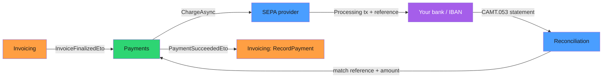

import { Aside, Tabs, TabItem } from "@astrojs/starlight/components";

Your EU customer signs up for a 49 €/month plan. The invoice finalizes. And now — because every .NET billing tutorial reaches for the same three logos — you route the money through a payment processor incorporated in Delaware, hosted on us-east-1, subject to the Cloud Act.

For a euro moving from one European IBAN to another, that is an odd amount of American jurisdiction.

Here is the claim this article defends: **you do not need a US payment gateway for European recurring billing**. **SEPA credit transfer** and **SEPA direct debit** are bank rails, not gateway products. With a provider-agnostic payment layer, collecting a `sepa .net` payment is a first-class path with **zero external dependency** — and the very same code can still route cards to Stripe the day you actually need them.

## Providers are executors, not the abstraction

Most payment SDKs invert the dependency the wrong way. Your domain ends up importing `Stripe.net`, your invoice logic learns what a `PaymentIntent` is, and the gateway's vocabulary leaks into every layer. Swapping it later is a rewrite.

Granit.Payments flips it. The framework owns the abstraction; providers are **executors with declared capabilities**. Every integration — Stripe, Mollie, and the two self-hosted SEPA providers alike — implements one contract:

```csharp title="IPaymentProvider.cs"
public interface IPaymentProvider
{
    string Name { get; }

    IReadOnlyList<PaymentMethodDescriptor> SupportedMethods { get; }

    Task<IReadOnlyList<PaymentMethodCatalogEntry>> GetCatalogAsync(
        CancellationToken cancellationToken = default);

    Task<PaymentProviderChargeResult> ChargeAsync(
        PaymentChargeRequest request, CancellationToken cancellationToken = default);

    Task<PaymentProviderRefundResult> RefundAsync(
        PaymentRefundRequest request, CancellationToken cancellationToken = default);

    Task<PaymentProviderStatus> GetStatusAsync(
        string providerTransactionId, CancellationToken cancellationToken = default);
}
```

Nothing in this interface mentions HTTP, an API key, or a US cloud. A provider that calls Stripe over the wire and a provider that writes a PAIN.008 batch file to your own bank satisfy the exact same shape. That is what makes SEPA a peer of the card processors instead of a bolt-on.

The host decides which providers to register. Each tenant then maps a **method type** to a provider id in configuration:

```json title="appsettings.json"
{
  "Payments": {
    "ProviderMappings": {
      "Card": "stripe",
      "SepaDebit": "sepa-direct-debit",
      "BankTransfer": "sepa-transfer",
      "Ideal": "mollie"
    }
  }
}
```

Delete the `Card` and `Ideal` lines and you have a fully sovereign deployment: no Stripe package loaded, no outbound call leaving your infrastructure. Add them back the day a customer wants to pay by card. The domain code that collects an invoice never changes — it asks the resolver for "whatever executes `sepa_debit` for this tenant" and gets back an `IPaymentProvider`.

## Capabilities are declared, then selected

A provider that merely *exists* is not enough. The checkout must know that **SEPA direct debit is EUR-only, works across the SEPA zone, and needs a mandate** — before it offers the method to a customer who would otherwise hit an inscrutable rejection at the last click.

So capability is **data, not code branching**. Each provider declares what it can do as a `PaymentMethodCapability` across four independent axes:

```csharp title="PaymentMethodCapability.cs"
public sealed record PaymentMethodCapability(
    IReadOnlySet<string> SupportedCountries,
    IReadOnlySet<string> SupportedCurrencies,
    PaymentMethodSequenceType SupportedSequenceTypes,
    IReadOnlyDictionary<string, PaymentMethodAmountBound> AmountBounds);
```

The SEPA direct debit method fills those axes with the reality of the rail — the SEPA zone, the euro, and the fact that it is a **mandate-backed sequence** (a first collection, then recurring ones), never a one-off:

```csharp title="SepaDirectDebitCatalog.cs"
var sepaDebit = new PaymentMethodCapability(
    SupportedCountries: PaymentMethodCountries.SepaZone,
    SupportedCurrencies: PaymentMethodCurrencies.EurOnly,
    SupportedSequenceTypes:
        PaymentMethodSequenceType.First | PaymentMethodSequenceType.Recurring,
    AmountBounds: NoBounds);
```

That `SupportedSequenceTypes` flag is the whole recurring-billing story in one line. The sequence axis is a `[Flags]` enum — `OneOff`, `First`, `Recurring` — and the availability filter uses **bitwise containment**: a checkout asking for `Recurring` against a card capability that only supports `OneOff` is rejected, and a checkout asking for a one-shot `OneOff` against SEPA direct debit is rejected too, because you cannot collect a mandate-backed method as a single ad-hoc charge.

Selection then reads like a query, not a switch statement:

```csharp title="RecurringCheckout.cs"
var context = new PaymentAvailabilityContext(
    CountryCode: "BE",
    CurrencyCode: "EUR",
    Amount: 49m,
    SequenceType: PaymentMethodSequenceType.Recurring);

// Only methods whose declared capability accepts (BE, EUR, 49 €, Recurring)
var methods = await resolver.GetAvailableProvidersAsync(tenantId, context, ct);

// Resolve the concrete executor for the chosen method type
var provider = await resolver.ResolveAsync(tenantId, "sepa_debit", ct);
```

The `IPaymentProviderResolver` reads the active configuration and intersects each provider's capability **snapshot** — captured when the admin activated the method — with the request context. The hot path never calls a provider API to decide availability, which is exactly why it stays fast and works offline for the self-hosted rails. The full snapshot-versus-context model lives in the [availability & provider catalog](/dotnet/saas/payments/availability/) reference.

<Aside type="tip" title="Granit is the source of truth">
External providers are executors, not the ledger. Granit owns subscription and payment
status; Stripe and Mollie only *do the move*. That inversion is what lets a tenant run
Card via Stripe and BankTransfer via a self-hosted SEPA provider at the same time —
and what lets you drop the external ones entirely.
</Aside>

## Collecting an invoice over SEPA — no gateway in sight

Now the part the logos-first tutorials never show: money actually moving, with nothing leaving your datacenter.

Two self-hosted SEPA providers ship with the framework, and both implement `IPaymentProvider` end to end:

<Tabs>
  <TabItem label="SEPA Transfer (SCT)">

`Granit.Payments.SepaTransfer` collects by **credit transfer**. `ChargeAsync` does not call anyone — it returns a **pending** transaction carrying a **structured reference** (Belgian OGM-VCS or SEPA RF), which the customer includes when they push the money to your beneficiary IBAN. The `SepaTransferCheckoutSessionFactory` renders a hosted page showing the IBAN and that reference. No API key exists because there is no API.

  </TabItem>
  <TabItem label="SEPA Direct Debit (SDD)">

`Granit.Payments.SepaDirectDebit.Builtin` **pulls** the money against a signed mandate. `ChargeAsync` creates a collection in `Processing` state and the `Pain008Generator` emits a PAIN.008 batch you hand to your own bank. No hosted gateway, no Cloud Act exposure for the payment data.

  </TabItem>
</Tabs>

Both leave the transaction in **`Processing`**, because bank rails are asynchronous — the answer arrives hours or days later on a **CAMT.053 account statement**. That statement is where the transaction resolves. The `Camt053Parser` (shared between both SEPA providers) reads the `camt.053.001.xx` file, and the `DefaultBankReconciliationProcessor` matches each entry against open transactions **by reference and amount**, promoting `Processing → Succeeded`.

Follow the whole path for one finalized invoice:



Every arrow on that diagram is inside your infrastructure or between you and your bank. There is no fifth participant sitting in another jurisdiction.

## The event flow: two modules, one integration event each way

Payments does not reach into Invoicing, and Invoicing does not reach into Payments. They **choreograph** through integration events on the Wolverine outbox — the same decoupling that makes a module extractable into its own service.

When an invoice finalizes, Invoicing publishes `InvoiceFinalizedEto`. Payments listens and, if the invoice's collection method is `Auto`, charges the tenant's saved default method:

```csharp title="AutoChargeOnInvoiceHandler.cs"
public async Task HandleAsync(InvoiceFinalizedEto message, CancellationToken ct)
{
    PaymentMethod? defaultMethod = await paymentMethodReader
        .GetDefaultForTenantAsync(message.TenantId, ct);

    // No saved method → invoice stays Open for manual payment. No exception.
    if (defaultMethod is null)
        return;

    var provider = await resolver.ResolveAsync(
        message.TenantId, defaultMethod.Type, ct);

    await provider.ChargeAsync(
        new PaymentChargeRequest(message.InvoiceId, message.Amount, message.Currency),
        ct);
}
```

If that default method is `sepa_debit`, the charge creates a `Processing` collection and the handler returns. Days later the reconciliation processor matches the CAMT.053 entry and the transaction transitions to `Succeeded`. Only *then* does Payments publish `PaymentSucceededEto`, which Invoicing consumes to `RecordPayment` and close the invoice. A failed collection publishes `PaymentFailedEto` instead, and Invoicing keeps the invoice **Open** for dunning.

<Aside type="caution" title="Payments has zero references to Subscriptions">
Payments only ever talks to Invoicing. The cascade back to Subscriptions rides on
Invoicing's own `InvoicePaidEto`. That indirection is deliberate — a 100% credit note
can mark an invoice paid with *no* payment at all, and a subscription that listened
directly for `PaymentSucceededEto` would never renew in that case.
</Aside>

## Idempotent by construction, retry-safe by design

Asynchronous bank rails multiply the ways a message can arrive twice. A statement gets re-imported. A retry job fires while the first attempt is still in flight. This is where a naive integration double-charges — and where the design earns its keep.

**Reconciliation is naturally idempotent.** Matching happens by structured reference and amount against **open** transactions. Re-import yesterday's CAMT.053 and every entry that already promoted its transaction to `Succeeded` finds nothing open to match. The statement is a set of facts, and applying the same fact twice is a no-op.

**The state machine refuses illegal repeats.** A `PaymentTransaction` only moves `Processing → Succeeded` once; a second `MarkSucceeded` on an already-terminal transaction has nothing to do.

**Inbound webhooks — for the providers that have them — dedupe insert-first.** `ProcessedWebhookEvent` carries a unique constraint on `(ProviderName, ProviderEventId)`; the handler inserts *before* dispatching, and a duplicate simply hits the constraint and returns `200 OK`. Race-condition safe without a lock.

**Charge endpoints require an idempotency key.** The `POST /api/payments/charge` and checkout endpoints are decorated with `Granit.Http.Idempotency`, so a client retry replays the original response instead of issuing a second collection. If that pattern is new to you, start with [idempotency keys: why every POST should be retry-safe](/blog/idempotency-keys-why-every-post-should-be-retry-safe/).

**Dunning retries pin the original provider.** Each transaction stores both its `ProviderName` and `MethodType`. When a collection fails, those values ride the `PaymentFailedEto → RetryPaymentPayload` chain into the next `InitiatePaymentCommand`, so a retry 14 days later hits the **exact same executor** — even if the tenant re-mapped their providers in between.

Put together, replay safety is not something you remember to add at the call site. It is a property of the transaction aggregate, the reconciliation matcher, and the endpoint middleware working together.

## Where the IBANs actually live

One sovereignty detail worth calling out, because it is where self-hosted SEPA gets legally serious. The **creditor** IBAN that signs a PAIN.008 batch, the **debtor** IBAN a mandate authorizes, and the **beneficiary** IBAN a customer transfers to are not host `appsettings` values. They are **per-tenant, encrypted snapshots** stamped from the centralized bank-accounts referential.

The subtlety: a signed mandate keeps its **own** encrypted copy of the debtor IBAN and never re-reads it. Mutating the source account later cannot silently invalidate a legally-signed artefact — the snapshot is the SEPA-local source of truth. The full model, the mandate snapshot, and the migration note for adopters are in the [SEPA configuration](/dotnet/saas/payments/sepa-configuration/) reference.

## Takeaways

- **A euro between two European IBANs needs no US gateway.** SEPA credit transfer and direct debit are first-class, zero-dependency payment paths — critical for HDS and sovereign hosting.
- **Providers are executors behind one `IPaymentProvider` contract.** Stripe, Mollie, and the self-hosted SEPA providers are interchangeable; the invoice-collection code never learns any provider's vocabulary.
- **Capability is declared data, not `if` branches.** A `PaymentMethodCapability` across country, currency, sequence, and amount axes drives selection, so a mandate-only method never reaches a one-off checkout.
- **Bank rails are async, and the design embraces it.** Charges land in `Processing`; a CAMT.053 statement reconciles them to `Succeeded` by reference and amount — an operation that is idempotent by construction.
- **Retry-safety is a property, not a call-site habit.** The state machine, insert-first webhook dedupe, `[Idempotent]` endpoints, and provider-pinned dunning make double-collection structurally hard.

## Further reading

- [Payments — provider-agnostic processing](/dotnet/saas/payments/) — the `IPaymentProvider` model, the transaction FSM, and webhook dedupe in full.
- [Providers — Stripe, Mollie, SEPA](/dotnet/saas/payments/providers/) — every built-in provider and how to add your own.
- [SEPA configuration](/dotnet/saas/payments/sepa-configuration/) — per-tenant creditor/beneficiary accounts and the immutable signed mandate.
- [SaaS & commerce overview](/dotnet/saas/) — the seven modules and the event choreography that ties them together.
- [Usage-based billing in .NET: metering to invoice](/blog/usage-based-billing-dotnet-metering-to-invoice/) — how the invoices you collect here get their line items.
- [Subscription billing in .NET: proration and dunning](/blog/subscription-billing-dotnet-proration-dunning/) — what happens when a SEPA collection fails.
