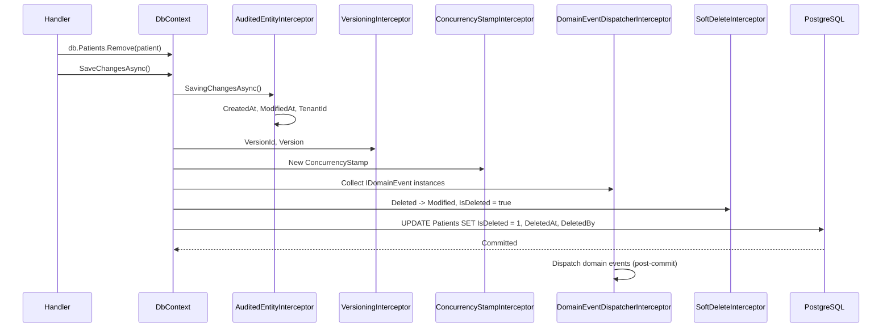

import { Aside } from '@astrojs/starlight/components';

A developer reviews a pull request. The query is `db.Patients.Where(p => p.Status == "active").ToListAsync(ct)`. It looks fine. It ships. Two months later, the GDPR audit asks why deleted patients appear in an export. The answer: someone forgot `&& !p.IsDeleted`. Someone always forgets.

This is the wrong abstraction. **Audit fields, soft delete, and tenant isolation are invariants, not conventions.** An invariant the application enforces by hand is an invariant that breaks the day a junior developer joins the team. The right answer is to put the rule where it cannot be skipped: in the EF Core `SaveChanges` pipeline and in a global query filter that ships with every entity.

Granit ships five interceptors and one filter, in a deterministic order, wired automatically by `AddGranitDbContext<T>`. This article walks the full stack — what each piece does, why the order matters, and the two .NET 10 EF Core operations that bypass everything.

## The stack, in order

Every `SaveChangesAsync` call walks five interceptors. The order is fixed and load-bearing:

| Order | Interceptor                        | Behavior                                                                                                |
| ----- | ---------------------------------- | ------------------------------------------------------------------------------------------------------- |
| 1     | `AuditedEntityInterceptor`         | Populates `CreatedAt`, `CreatedBy`, `ModifiedAt`, `ModifiedBy`, auto-generates `Id`, injects `TenantId` |
| 2     | `VersioningInterceptor`            | Sets `VersionId` and `Version` on `IVersioned` entities                                                 |
| 3     | `ConcurrencyStampInterceptor`      | Regenerates `ConcurrencyStamp` on `IConcurrencyAware` entities                                          |
| 4     | `DomainEventDispatcherInterceptor` | Collects domain events before save, dispatches after commit                                             |
| 5     | `SoftDeleteInterceptor`            | Converts `DELETE` to `UPDATE` on `ISoftDeletable` entities                                              |

The query filter is the other half of the contract. `ApplyGranitConventions` walks the model at startup and applies `WHERE IsDeleted = false AND Activated = true AND TenantId = @currentTenant` to every entity that implements the right marker interface. Read queries do not opt in — they opt out, with `IDataFilter.Disable<ISoftDeletable>()`.



## AuditedEntityInterceptor — never write `CreatedAt = …` again

The interceptor reads three abstractions from DI:

* `IClock.Now` — `DateTimeOffset` in UTC. Never `DateTime.UtcNow`, never `DateTime.Now` (the analyzer `GRSEC001` will fail your build).
* `ICurrentUserService.UserId` — the JWT subject claim. Falls back to `"system"` for background work without a propagated user.
* `IGuidGenerator` — sequential GUIDs ordered for clustered indexes, not random `Guid.NewGuid()`.

On `EntityState.Added`, it sets `CreatedAt`, `CreatedBy`, auto-generates `Id` if `Guid.Empty`, and injects `TenantId` if the entity implements `IMultiTenant` and the property is null. On `Modified`, it **protects** `CreatedAt`/`CreatedBy` against overwrite and sets `ModifiedAt`/`ModifiedBy`.

The handler never touches audit fields:

```csharp title="DischargePatientHandler.cs"
public static async Task Handle(
    DischargePatientCommand command,
    PatientDbContext db,
    CancellationToken ct)
{
    var patient = await db.Patients.FindAsync([command.PatientId], ct)
        ?? throw new EntityNotFoundException(typeof(Patient), command.PatientId);

    patient.Discharge();
    await db.SaveChangesAsync(ct);
    // ModifiedAt = clock.Now (UTC)
    // ModifiedBy = currentUser.UserId (from JWT or X-User-Id header)
    // TenantId   = unchanged (protected)
}
```

## SoftDeleteInterceptor — DELETE never reaches the wire

`db.Patients.Remove(patient)` does not emit a SQL `DELETE`. The interceptor sees `EntityState.Deleted`, flips it to `Modified`, and sets `IsDeleted = true`, `DeletedAt = clock.Now`, `DeletedBy = currentUser.UserId`.

```text
DELETE FROM Patients WHERE Id = @id
  ↓ intercepted ↓
UPDATE Patients SET IsDeleted = true, DeletedAt = @now, DeletedBy = @userId WHERE Id = @id
```

It must run **last**. Once it converts `Deleted` to `Modified`, the earlier interceptors would re-stamp `ModifiedAt`/`ModifiedBy` — which is exactly what we want for the deletion to show up in the audit trail with the right actor and timestamp.

The matching query filter is invisible. `db.Patients.ToListAsync(ct)` becomes `SELECT * FROM Patients WHERE IsDeleted = false` at SQL translation time. To see deleted rows for an audit export:

```csharp title="ExportDeletedPatientsHandler.cs"
public static async Task<List<Patient>> Handle(
    ExportDeletedPatientsQuery query,
    PatientDbContext db,
    IDataFilter dataFilter,
    CancellationToken ct)
{
    using (dataFilter.Disable<ISoftDeletable>())
    {
        return await db.Patients
            .Where(p => p.IsDeleted)
            .ToListAsync(ct);
    }
}
```

The scope is request-bound. Leak it and you ship a regression.

## VersioningInterceptor and ConcurrencyStampInterceptor — the two flavors of "don't lose data"

These two are often confused. They solve different problems.

**Versioning** is about history. An `IVersioned` entity keeps every revision. On insert, the interceptor assigns a `VersionId` (a stable GUID shared by every version of the same logical record) and computes the next `Version` number. Modifications are explicit: create a new row with the same `VersionId` and `Version = max + 1`. Old rows stay. The grid view filters to `MAX(Version)` per `VersionId`.

**Concurrency** is about lost updates. An `IConcurrencyAware` entity carries a `ConcurrencyStamp` (a GUID string mapped to a 36-character column with `.IsConcurrencyToken()`). The interceptor regenerates it on every write. EF Core adds it to the `WHERE` clause:

```sql
UPDATE Orders
SET Status = @newStatus, ConcurrencyStamp = @newStamp
WHERE Id = @id AND ConcurrencyStamp = @originalStamp
```

If two users load the same order and both save, the second `UPDATE` matches zero rows. EF Core throws `DbUpdateConcurrencyException`, mapped to **HTTP 409 Conflict** by `EfCoreExceptionStatusCodeMapper`. The handler does not catch it — the framework returns the right status code.

For disconnected updates (a CQRS command that loads a fresh entity in a new `DbContext`), the original stamp from the client must be set explicitly:

```csharp title="UpdateOrderStatusHandler.cs"
public static async Task Handle(
    UpdateOrderStatusRequest request,
    OrderDbContext db,
    CancellationToken ct)
{
    var order = await db.Orders.FindAsync([request.Id], ct)
        ?? throw new EntityNotFoundException(typeof(Order), request.Id);

    order.Status = request.NewStatus;

    // Tell EF Core what the client believes the current stamp is
    db.Entry(order)
        .Property(e => e.ConcurrencyStamp)
        .OriginalValue = request.ConcurrencyStamp;

    await db.SaveChangesAsync(ct);
}
```

Use the `IConcurrencyStampRequest` interface on your DTOs so the convention is explicit.

## DomainEventDispatcherInterceptor — atomic, post-commit

Domain events should fire **after** the transaction commits. Otherwise a downstream handler reads the database, sees no row, and reports the wrong thing — or worse, sees the row, sends the welcome email, and the transaction then rolls back.

The interceptor splits the work across three hooks:

1. **`SavingChanges`** — scans the change tracker for `IDomainEventSource` entities, collects their events, clears the entity-side queues.
2. **`SavedChanges`** — calls `IDomainEventDispatcher.DispatchAsync` after PostgreSQL confirms the commit.
3. **`SaveChangesFailed`** — discards the events. The transaction rolled back; the events never happened.

Without Wolverine, `NullDomainEventDispatcher` is registered (no-op). With `Granit.Events.Wolverine`, `WolverineDomainEventDispatcher` routes events to the local in-process queue `"domain-events"` — same transaction boundary, retries, no external transport. The full upgrade to durable cross-module integration events is a separate concern (we cover it in [From Channels to Wolverine](/blog/from-channels-to-wolverine-upgrading-messaging/)).

## The two .NET 10 escape hatches that bypass everything

`ExecuteUpdateAsync` and `ExecuteDeleteAsync` are the EF Core 7+ features for set-based updates. They emit raw SQL straight to the database — **no change tracker, no interceptors**.

For an audited update, you must set the audit fields yourself:

```csharp title="DeactivatePatientsHandler.cs — bypasses interceptors"
// Wrong — audit fields never set, modifications invisible to the audit trail
await db.Patients
    .Where(p => p.TenantId == tenantId && p.LastVisit < cutoff)
    .ExecuteUpdateAsync(s => s.SetProperty(p => p.Status, PatientStatus.Inactive), ct);
```

```csharp title="DeactivatePatientsHandler.cs — correct"
await db.Patients
    .Where(p => p.TenantId == tenantId && p.LastVisit < cutoff)
    .ExecuteUpdateAsync(s => s
        .SetProperty(p => p.Status, PatientStatus.Inactive)
        .SetProperty(p => p.ModifiedAt, clock.Now)
        .SetProperty(p => p.ModifiedBy, currentUser.UserId), ct);
```

For a soft delete, do not call `ExecuteDeleteAsync` — it emits a physical DELETE that destroys the audit row:

```csharp title="ArchiveOldPatientsHandler.cs"
// Wrong — physical DELETE, no audit row, ISO 27001 audit fails
await db.Patients.Where(p => p.LastVisit < cutoff).ExecuteDeleteAsync(ct);

// Correct — explicit soft delete via ExecuteUpdate
await db.Patients
    .Where(p => p.LastVisit < cutoff)
    .ExecuteUpdateAsync(s => s
        .SetProperty(p => p.IsDeleted, true)
        .SetProperty(p => p.DeletedAt, clock.Now)
        .SetProperty(p => p.DeletedBy, currentUser.UserId), ct);
```

<Aside type="caution" title="Concurrency stamp is also bypassed">
`ExecuteUpdateAsync` does not regenerate `ConcurrencyStamp` and does not check it. For entities where lost updates are unacceptable, prefer the change tracker over the set-based API — or accept that bulk operations skip optimistic concurrency.
</Aside>

## What you get for free

Two counters land in your OpenTelemetry pipeline without any code:

| Metric                                   | Tags                                              | Use                                                  |
| ---------------------------------------- | ------------------------------------------------- | ---------------------------------------------------- |
| `granit.persistence.entity.audited`      | `tenant_id`, `operation` (`created` / `modified`) | Write throughput per tenant                          |
| `granit.persistence.entity.soft_deleted` | `tenant_id`                                       | Soft-delete spikes (mass-deletion or data corruption) |

Plot both in Grafana. The first tells you which tenants are growing. The second is a leading indicator for problems: a 10x jump on a single tenant overnight is almost never legitimate.

## Three things to remember

* **`AddGranitDbContext<T>` wires all five interceptors.** Register a raw `AddDbContext<T>` and you get none of them. The diagnostic is `Granit.Persistence.Diagnostics.MissingInterceptorWarning` — fix it.
* **`SoftDeleteInterceptor` runs last on purpose.** It rewrites entity state. Anything that needs the original `EntityState.Deleted` must come before.
* **`ExecuteUpdateAsync` and `ExecuteDeleteAsync` skip everything.** Use them for set-based work, but set the audit fields explicitly and never `ExecuteDeleteAsync` on `ISoftDeletable` entities.

The compliance story writes itself when the framework writes it for you. The 3-year ISO 27001 audit trail is not a feature flag — it is the default path, and the wrong path requires deliberate effort.

## Further reading

* [Interceptors reference](/dotnet/data/interceptors/) — full API surface of the five interceptors
* [Query filters reference](/dotnet/data/query-filters/) — named filters, runtime bypass, EF Core translations
* [Soft delete pattern](/dotnet/architecture/patterns/soft-delete/) — pattern card with sequence diagrams
* [GDPR by Design](/blog/gdpr-by-design/) — the privacy patterns this stack enforces
* [Stop using DateTime.Now](/blog/stop-using-datetime-now/) — why `IClock` exists and the analyzer that enforces it
