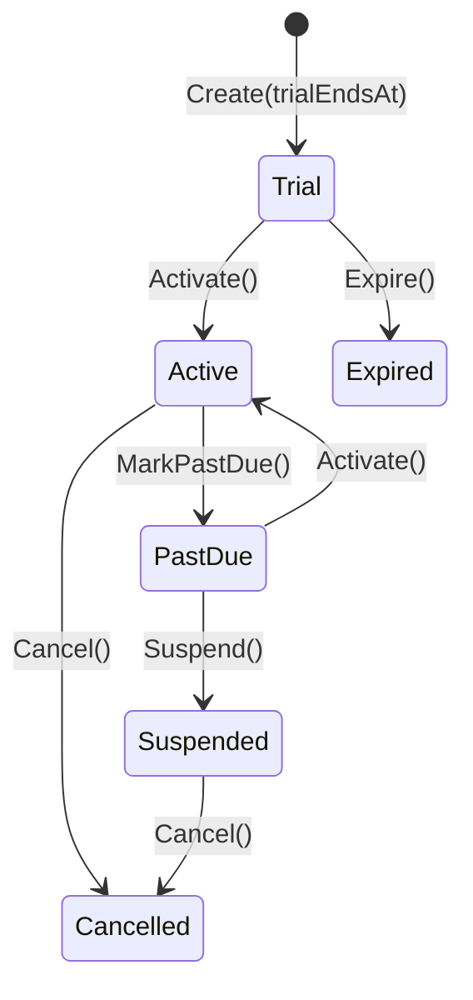
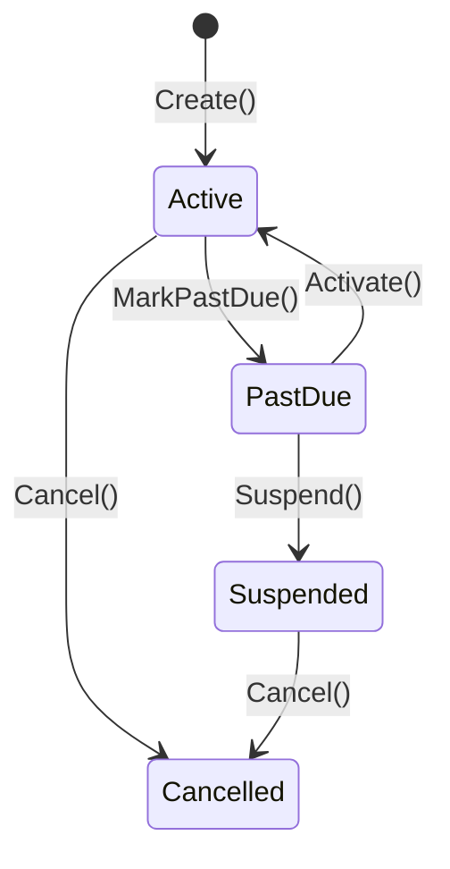
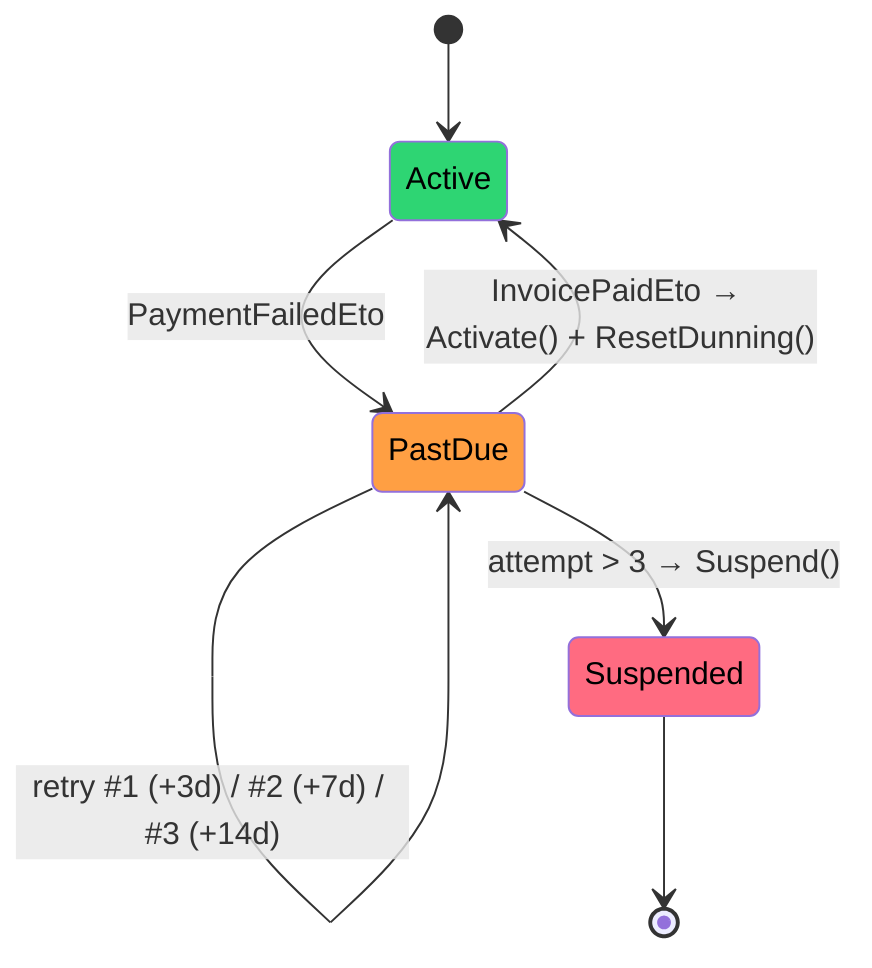

import { Aside, Tabs, TabItem } from "@astrojs/starlight/components";

A customer on your **Starter** plan (€9/month) clicks **Upgrade to Pro** (€29/month) on day 20 of a 30-day cycle. What do you charge them, right now, today?

If your answer is "€29", you just billed them twice for the same ten days. If your answer is "nothing until next cycle", they get Pro features free for ten days and your revenue reporting drifts. The correct answer is **€6.67** — and computing it is where most homegrown **subscription billing** code quietly falls apart.

This is the part billing vendors hide behind a checkbox labeled "proration: on". This post walks through the arithmetic, the scheduled downgrade that must *not* happen immediately, the **dunning** flow when a card declines, and the credit ledger that catches the overpayment nobody planned for. Every code sample uses real [Granit.Subscriptions](/dotnet/saas/subscriptions/), [Granit.Scheduling](/dotnet/infrastructure/scheduling/), and [Granit.CustomerBalance](/dotnet/saas/customer-balance/) APIs.

## The naive mid-cycle upgrade

Here is the version that ships in the first sprint and haunts you for a year:

```csharp title="NaiveUpgrade.cs"
public async Task UpgradeAsync(Guid subscriptionId, PlanId newPlan)
{
    var subscription = await reader.GetAsync(subscriptionId);
    subscription.ChangePlan(newPlan);

    // Charge the new plan's full price. Immediately.
    await messageBus.SendAsync(new CreateInvoiceCommand(
        TenantId: subscription.TenantId,
        Currency: subscription.Currency,
        CollectionMethod: CollectionMethod.Auto,
        BillingReason: BillingReason.SubscriptionCycle,
        LineItems: [new("Pro Plan", 1, 29.99m, InvoiceSourceType.Subscription)],
        PeriodStart: clock.Now,
        PeriodEnd: subscription.CurrentPeriod.End));
}
```

Three bugs, all invisible in the demo:

- The customer already paid €9 for the current period. You never credited the **unused portion**. They paid twice for the same days.
- You charged the **full** €29.99 for ten days of Pro, not the ten-day slice.
- Their next billing cycle still renews on the original anchor date, so the following invoice is also wrong.

Proration exists to make a plan change **revenue-neutral for the time already paid**. It is not a Granit feature you switch on — it is arithmetic you compute and feed into the same [`CreateInvoiceCommand`](/dotnet/saas/invoicing/) the billing orchestrator uses. Let's do the arithmetic.

## Proration is just arithmetic (in C#)

A plan change mid-cycle produces two line items on one immediate invoice: a **credit** for the unused days of the old plan, and a **charge** for the remaining days of the new plan. The unit of proration is the day fraction.

```csharp title="ProrationCalculator.cs"
public sealed record ProrationResult(decimal Credit, decimal Charge)
{
    public decimal NetAmount => Charge - Credit;
}

public sealed class ProrationCalculator(IClock clock)
{
    public ProrationResult ForPlanChange(
        SubscriptionPeriod period,
        decimal oldPlanPrice,
        decimal newPlanPrice)
    {
        var totalDays = (period.End - period.Start).TotalDays;
        var remainingDays = (period.End - clock.Now).TotalDays;
        var fraction = (decimal)(remainingDays / totalDays);

        // Credit the unused slice of the old plan, charge the same slice of the new one.
        var credit = Math.Round(oldPlanPrice * fraction, 2);
        var charge = Math.Round(newPlanPrice * fraction, 2);
        return new ProrationResult(credit, charge);
    }
}
```

Inject [`IClock`](/blog/background-jobs-wolverine-cronos-no-hangfire/) instead of reading `DateTimeOffset.UtcNow` — Granit's analyzer bans `DateTime.Now` outright, and it makes this class trivially unit-testable with `FakeTimeProvider`. For our Starter → Pro example on day 20 of 30, the fraction is `10/30`, giving a credit of **€3.00** and a charge of **€9.67**: a net immediate charge of **€6.67**.

Now feed that into a real invoice. The credit line rides on `InvoiceSourceType.Credit`; the new charge on `InvoiceSourceType.Subscription`:

```csharp title="ProratedUpgrade.cs"
public async Task UpgradeAsync(Subscription subscription, Plan newPlan)
{
    var oldPrice = await pricing.ResolveBasePriceAsync(
        subscription.PlanId, subscription.Currency, BillingInterval.Monthly);
    var newPrice = await pricing.ResolveBasePriceAsync(
        newPlan.Id, subscription.Currency, BillingInterval.Monthly);

    var p = proration.ForPlanChange(subscription.CurrentPeriod, oldPrice, newPrice);

    await messageBus.SendAsync(new CreateInvoiceCommand(
        TenantId: subscription.TenantId,
        Currency: subscription.Currency,
        CollectionMethod: CollectionMethod.Auto,
        BillingReason: BillingReason.SubscriptionCycle,
        LineItems: [
            new($"Unused Starter credit ({p.Credit:C})", 1, -p.Credit, InvoiceSourceType.Credit),
            new("Pro Plan — prorated remainder", 1, p.Charge, InvoiceSourceType.Subscription),
        ],
        PeriodStart: clock.Now,
        PeriodEnd: subscription.CurrentPeriod.End,
        IdempotencyKey: $"upgrade-{subscription.Id}-{subscription.CurrentPeriod.End:yyyyMMdd}"));

    subscription.ChangePlan(newPlan.Id);
}
```

The **`IdempotencyKey`** is not optional decoration. If the user double-clicks Upgrade, or Wolverine retries the handler after a transient DB fault, the same key means Invoicing recognizes the duplicate and creates the invoice exactly once. Every billing-side command in Granit is designed to be retry-safe for exactly this reason — see [idempotency keys](/blog/idempotency-keys-why-every-post-should-be-retry-safe/).

<Aside type="note">
`IPricingResolver` reads prices from the plan's `PlanPrice` entries in the
subscription's own currency. Never hardcode `29.99m` at the call site — a plan
can carry different `PlanPrice` rows per currency and interval, and grandfathered
subscriptions pin a specific price version.
</Aside>

## Upgrades are immediate, downgrades wait

Here is the rule everyone learns the hard way: **upgrades apply now, downgrades apply at period end.** If a customer downgrades from Pro to Starter on day 20, you do not yank Pro features away — they paid through the end of the cycle. The change is *scheduled*.

Granit has two tools for this, and they solve different shapes of the problem.

For a **future-dated one-shot** — "on the 1st, move tenant X to Starter" — use [Granit.Scheduling](/dotnet/infrastructure/scheduling/). You define a typed payload and let the scheduler fire it exactly once at the target instant:

```csharp title="ScheduledDowngrade.cs"
public sealed record ApplyPlanChangePayload(
    Guid TenantId, Guid SubscriptionId, Guid NewPlanId) : IScheduledPayload;

public sealed class DowngradeService(IScheduler scheduler, ICurrentTenant tenant)
{
    public Task<ScheduledActionId> ScheduleDowngradeAsync(
        Subscription subscription, PlanId targetPlan, CancellationToken ct) =>
        scheduler.ScheduleAsync(
            new ApplyPlanChangePayload(
                tenant.Id!.Value, subscription.Id, targetPlan.Value),
            subscription.CurrentPeriod.End,          // fires at period boundary
            correlationId: $"subscription:{subscription.Id}",
            ct);
}
```

If the customer changes their mind before the boundary, you `CancelAsync(actionId)` or `RescheduleAsync(actionId, newDate)` — the scheduled action is a first-class, cancellable entity, not a fire-and-forget timer. The scheduler also survives process restarts and uses an **atomic claim** so a catch-up job and the original Wolverine message can never both execute the same downgrade.

For **recurring, calendar-shaped** changes — a promotional plan that applies for three months then reverts — reach for `SubscriptionPhase` instead. A subscription carries zero or more phases, each covering a half-open `[StartDate, EndDate)` window that pins a plan, an optional override price, and an optional discount:

```csharp title="PromotionalPhase.cs"
subscription.SchedulePhase(SubscriptionPhase.Create(
    startDate: clock.Now.AddMonths(3),
    endDate:   clock.Now.AddMonths(6),
    planId:    promotionalPlanId,
    overridePriceId: null,
    discountPercent: 20m));   // 20% off for 3 months, starting 3 months out
```

At billing time the orchestrator calls `subscription.GetActivePhase(clock.Now)`. When a phase covers "now", its plan, price, and discount win; when none does, it falls back to the subscription's base plan. Scheduling is for a single dated jump; phases are for a pre-declared timeline.

## Trials, and why the FSM matters

A subscription is not a boolean. It is a **finite state machine**, and trials are the reason. A plan with `trialDays: 14` starts in `Trial`, not `Active`, and the states you can reach differ from a no-trial subscription.

<Tabs>
<TabItem label="With trial">



</TabItem>
<TabItem label="Direct (no trial)">



</TabItem>
</Tabs>

Every transition method is **idempotent**: it returns `bool` — `true` if the state actually changed, `false` if you were already there. That single design choice kills a whole class of bugs. When Stripe and your own background job both report the same trial expiry, calling `Expire()` twice is harmless. No webhook ping-pong, no double-firing of downstream events.

## When the card declines: dunning

Renewal day arrives, the card is charged, and it declines. This happens to roughly **1 in 10** recurring charges in the wild — expired cards, insufficient funds, issuer fraud holds. If your reaction is to cancel the subscription on the first failure, you just churned a paying customer over a temporary hiccup. **Dunning** is the disciplined retry-and-escalate flow that recovers most of them.

In Granit it is event-driven. A `PaymentFailedEto` lands, the handler marks the subscription past due, increments the dunning counter, and schedules the next retry — using the **same provider and payment method** as the original charge:



The retry cadence is deliberate — **3 days, then 7, then 14** — spacing attempts across likely paydays and card-refresh windows rather than hammering a dead card every hour:

```csharp title="PaymentFailedHandler.cs"
public static async Task HandleAsync(
    PaymentFailedEto message,
    IDunningService dunning,
    CancellationToken ct)
{
    // MarkPastDue() + IncrementDunningAttempt(), then either schedule the next
    // retry (+3 / +7 / +14 days) or Suspend() once attempt > 3.
    await dunning.HandlePaymentFailureAsync(
        message.SubscriptionId, message.ProviderName, message.MethodType, ct);
}
```

The escape hatch runs the other direction. When any retry finally succeeds, Invoicing publishes `InvoicePaidEto`, and the subscription reactivates and resets its dunning counter:

```csharp title="InvoicePaidHandler.cs"
public static async Task HandleAsync(
    InvoicePaidEto message,
    ISubscriptionReactivationService reactivation,
    CancellationToken ct)
{
    // Activate() + ResetDunning() — the subscription is healthy again.
    await reactivation.ReactivateAsync(message.SubscriptionId, ct);
}
```

Two subtleties save you in production. First, the handler catches `DbUpdateConcurrencyException`: if two webhook deliveries for the same failed invoice arrive at once, only one dunning increment sticks and the other is skipped with a warning — no double-escalation. Second, **Subscriptions listens to `InvoicePaidEto`, never `PaymentSucceededEto`.** That distinction matters more than it looks, and the credit ledger is why.

## Overpayment, credit notes, and the balance ledger

Consider: a customer disputes a €29 invoice, you issue a €29 credit note, and the invoice is marked **Paid with zero payment**. If Subscriptions had subscribed to `PaymentSucceededEto`, it would never renew — no payment ever happened. Because it listens to `InvoicePaidEto`, applying the credit note renews the subscription correctly. This is why the two events are kept separate across the whole [SaaS ecosystem](/dotnet/saas/).

Now the mirror case: **overpayment**. A customer pays €30 on a €29 invoice, or a €29 credit lands on an invoice that was already paid. Invoicing detects `AmountPaid + AmountCredited > Total`, tracks the excess, and publishes `OverpaymentDetectedEto`. You do not refund €1 through the card network and eat the fee. You credit it to the tenant's balance:

```csharp title="OverpaymentHandler.cs"
public static async Task HandleAsync(
    OverpaymentDetectedEto message,
    IOverpaymentCreditService overpayment,
    CancellationToken ct)
{
    await overpayment.CreditOverpaymentAsync(
        message.TenantId, message.Currency, message.Amount, message.InvoiceId, ct);
}
```

[Granit.CustomerBalance](/dotnet/saas/customer-balance/) is a **per-tenant, per-currency credit ledger** — an append-only `BalanceAccount` with a cached running total and an immutable `BalanceTransaction` per movement. It is not a wallet or an e-money system; it holds accounting credits that are **applied before the next PSP charge**. That interception happens through a strategy, `IInvoicePrePaymentProcessor`: install the module and it deducts available credit first, sending only the remainder to the payment provider. Skip the module and a pass-through sends the full amount. No cascading events, no race between "deduct credit" and "charge card".

Promotional credits work the same way, with one twist — they **expire**. A `BalanceTransaction` carries an `ExpiresAt`, and grants set `Source = Promotional`:

```csharp title="GrantPromoCredit.cs"
// POST /api/{version}/customer-balance/credit  (permission: CustomerBalance.Credits.Manage)
{
  "currency": "EUR",
  "amount": 10.00,
  "source": "Promotional",
  "expiresAt": "2026-09-30T23:59:59Z"
}
```

A background scan reclaims what nobody spent. `ICreditExpirationService.ExpireCreditsAsync()` debits expired promotional credit off each balance and publishes `CreditExpiredEto`, so a €10 welcome credit does not sit on your books forever:

```csharp title="CreditExpirationScan.cs"
public interface ICreditExpirationService
{
    Task<int> ExpireCreditsAsync(CancellationToken cancellationToken = default);
}
```

Every movement — overpayment surplus, promo grant, invoice deduction, expiration — is one immutable row tagged with its `Source` and an optional `ReferenceId` back to the originating invoice or refund. When finance asks "why does tenant X have €7.33 of credit", the answer is a single `SELECT`, not an archaeology dig through payment logs.

## Takeaways

- **Proration is arithmetic, not a feature.** Compute a day-fraction credit for the old plan and a charge for the new one, then feed both as line items into `CreateInvoiceCommand`. Upgrades bill immediately; downgrades wait for period end.
- **Schedule the downgrade — don't apply it now.** Use `IScheduler` for a dated one-shot change or `SubscriptionPhase` for a pre-declared promotional timeline. Both are cancellable and restart-safe.
- **A subscription is a state machine.** Trials add states; idempotent `bool`-returning transitions make webhook double-delivery harmless.
- **Dunning recovers revenue.** Retry on a 3/7/14-day cadence with the original payment method before suspending, and reactivate on `InvoicePaidEto` — not `PaymentSucceededEto`.
- **Overpayments belong in a ledger, not the card network.** `Granit.CustomerBalance` credits the surplus per tenant, applies it before the next charge, and expires promotional credit on schedule — with a full audit trail.

## Further reading

- [Subscriptions — plans, seats & billing orchestration](/dotnet/saas/subscriptions/)
- [Customer Balance — the credit ledger](/dotnet/saas/customer-balance/)
- [Catalog — the shared Product aggregate](/dotnet/saas/catalog/)
- [SaaS & Commerce ecosystem overview](/dotnet/saas/)
- [Scheduling — one-shot future actions](/dotnet/infrastructure/scheduling/)
- [Usage-based billing: from metering to invoice](/blog/usage-based-billing-dotnet-metering-to-invoice/)
- [SEPA Direct Debit in .NET: sovereign payments](/blog/sepa-direct-debit-dotnet-sovereign-payments/)
- [VAT and sales tax for .NET SaaS](/blog/vat-sales-tax-dotnet-saas/)
