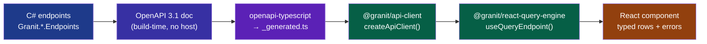

import { Aside, Tabs, TabItem } from "@astrojs/starlight/components";

A developer renames one property on the backend. `CustomerName` becomes `ClientName` because a product manager decided "client" reads better. The C# compiles. The tests are green. The PR merges and deploys on a Friday afternoon.

Monday morning, the support queue fills up. The React app renders **"undefined"** where the customer name should be, and every create form throws a 500 because it still POSTs `customerName` — a field the API no longer knows. Nothing broke at compile time on either side. The **contract drifted silently**, and the only place it surfaced was production.

This is the tax you pay for a **type-safe API client for React** that is actually two disconnected type systems: C# on one side, a hand-written `fetch` wrapper on the other, held together by hope and stringly-typed URLs. This article shows how to delete that tax. You will wire a typed HTTP client, generate TypeScript types straight from your .NET contracts, handle errors as structured RFC 7807 problem details, and get caching plus invalidation from a query engine that mirrors your backend — all so a rename fails your **frontend build**, not your users.

## Why hand-written fetch wrappers always drift

Here is the code every project starts with. It looks harmless.

```ts title="api/customers.ts — the drift trap"
export async function getCustomer(id: string) {
  const res = await fetch(`/api/v1/customers/${id}`);
  if (!res.ok) throw new Error("Request failed");
  return res.json() as Promise<{
    id: string;
    customerName: string; // hand-copied from a Swagger page in March
    createdAt: string;
  }>;
}
```

Count the ways this lies to you. The return type is a **hand-typed guess** — TypeScript will happily believe `customerName` exists forever, because nothing checks it against the real response. The error path collapses every failure into a generic `Error`, throwing away the status code, the validation details, and the trace ID. And the URL is a magic string with no relationship to the route the backend actually exposes.

The type annotation is the dangerous part. It is not *derived* from anything. It is a **snapshot of what the API looked like when someone last copied it**. The compiler defends it as if it were fact. So when the backend renames the field, your editor keeps autocompleting `customer.customerName` with full confidence, and the bug ships green.

You cannot review your way out of this. The fix is structural: the **backend contract has to be the source of truth**, and the frontend types have to be generated from it — never transcribed.

## The contract is the source of truth

Granit ships a [build-time OpenAPI contract generator](/contributing/openapi-contract-generator/) that emits one OpenAPI 3.1 document per endpoints module — with no running host, no database, no broker. The `granit-front` React companion then runs [`openapi-typescript`](https://openapi-ts.dev/) over each document to emit per-module generated types (for example `@granit/{module}/types/_generated.ts`).

The payoff is a closed loop. When a backend contract change regenerates a type that no longer matches your frontend code, **`tsc` fails downstream**. The rename that used to reach production now stops a CI build with a red squiggle under `customer.customerName`.



Nothing in that chain is hand-copied. The `.NET` route shape flows all the way to the JSX, and every arrow is checked by a compiler. Let's build each stage.

## Step 1: the typed HTTP client

The foundation is [`@granit/api-client`](/frontend/api/http-client/), an Axios factory that pre-wires the concerns you would otherwise reinvent per project: Bearer token injection, an optional `X-Tenant-Id` header, and a 401 interceptor for back-channel logout.

```ts title="lib/api.ts"
import { createApiClient } from "@granit/api-client";

export const api = createApiClient({
  baseURL: import.meta.env.VITE_API_URL,
  timeout: 15_000, // optional, default: 10_000 ms
});
```

That is the whole setup. Notice what is **not** here: no token plumbing, no interceptor boilerplate. The instance injects `Authorization: Bearer <token>` automatically once a token getter is registered — and `@granit/react-authentication` wires that getter for you during Keycloak init. Your React code never sees, stores, or forwards a token, which is exactly the property you want (more on why in [Why Your React App Should Never Touch an Access Token](/blog/why-your-react-app-should-never-touch-an-access-token/)).

Now bind the client to your **generated** types. `@granit/api-client` ships `createMutator()`, an [orval](https://orval.dev/docs/guides/custom-client/)-compatible mutator that reuses every interceptor and returns `response.data` directly, so codegen'd hooks call your configured instance instead of a raw Axios:

```ts title="lib/mutator.ts"
import { createApiClient, createMutator } from "@granit/api-client";

const api = createApiClient({ baseURL: import.meta.env.VITE_API_URL });

// Codegen (orval) calls this — same interceptors, unwraps response.data
export const customInstance = createMutator(api);
export default customInstance;
```

<Aside type="caution" title="Type int64 fields as string | number">
When you consume the generated types, resist the urge to "clean up" `int64` fields.
Granit types `long` as `string | number` on purpose — JavaScript's `Number` precision
tops out at 2^53, so a large `long` (think `sizeBytes`, `durationMs`) serializes as a
**string** to stay lossless. `openapi-typescript` generates that union for you from the
schema. Narrowing it to `number` reintroduces a precision bug the contract was
protecting you from.
</Aside>

## Step 2: typed errors, not `catch (e) { }`

The generic `throw new Error("Request failed")` from the bad example is where most of your production debugging time disappears. A failure could be a validation problem the user can fix, an expired session, a domain rule violation, or a timeout — and the naive wrapper flattens all four into one useless string.

Granit models errors as **structured classes** that pair with the [RFC 7807 Problem Details](/blog/rfc-7807-problem-details-the-only-way-to-return-errors/) returned by the .NET backend. Three of them cover the field:

```ts title="lib/errors.ts (from @granit/api-client)"
class HttpError extends Error {
  readonly name = "HttpError";
  readonly status: number;
  readonly problemDetails?: ProblemDetails; // the RFC 7807 body
}

class ValidationError extends Error {
  readonly name = "ValidationError";
  readonly details?: {
    fieldErrors?: Readonly<Record<string, readonly string[]>>;
  };
}

class TimeoutError extends Error {
  readonly name = "TimeoutError";
  readonly timeoutMs: number;
}
```

Now your error handling can branch on **what actually went wrong** instead of guessing from a message string. The `ProblemDetails` body carries a `traceId` you can surface to users for support and correlate in Grafana, plus a domain `errorCode` like `"Appointment:SlotUnavailable"` you can switch on:

```tsx title="components/CustomerForm.tsx"
import { HttpError, ValidationError, TimeoutError } from "@granit/api-client";

async function save(input: CreateCustomer) {
  try {
    await api.post("/api/v1/customers", input);
  } catch (err) {
    if (err instanceof ValidationError) {
      // Map field-level errors straight onto the form
      for (const [field, messages] of Object.entries(err.details?.fieldErrors ?? {})) {
        form.setError(field, { message: messages[0] });
      }
      return;
    }
    if (err instanceof HttpError && err.problemDetails?.errorCode === "Customer:DuplicateEmail") {
      form.setError("email", { message: "That email is already registered." });
      return;
    }
    if (err instanceof TimeoutError) {
      toast.error(`Request timed out after ${err.timeoutMs / 1000}s. Try again.`);
      return;
    }
    // Everything else: show the trace ID so support can find it in Grafana
    const traceId = err instanceof HttpError ? err.problemDetails?.traceId : undefined;
    toast.error(traceId ? `Something went wrong. Reference: ${traceId}` : "Something went wrong.");
  }
}
```

Every branch here is **type-checked**. `err.details?.fieldErrors` is a known shape, `err.timeoutMs` is a `number`, and `err.problemDetails?.errorCode` is the same string your backend emits. No more `(e as any).response?.data?.errors?.[0]?.message` archaeology.

## Step 3: the query engine — caching and invalidation for free

Fetching a single record is the easy half. Real screens are **lists**: tables with filters, sorting, pagination, and a create button that has to refresh the grid after a successful write. Hand-rolling that means a `useEffect`, a loading flag, an error flag, a page-number state, and a manual refetch after every mutation — the exact soup that spawns stale-data bugs.

[`@granit/react-query-engine`](/frontend/data/query-engine/) is a headless data grid system that mirrors `Granit.QueryEngine` on the backend and wraps everything in TanStack Query. Point it at an endpoint's base path and it manages the full query state machine for you.

<Tabs>
<TabItem label="Bad — hand-rolled">

```tsx title="CustomerList.tsx — the useEffect soup"
function CustomerList() {
  const [rows, setRows] = useState<any[]>([]); // any → drift is invisible
  const [page, setPage] = useState(1);
  const [loading, setLoading] = useState(false);

  useEffect(() => {
    setLoading(true);
    fetch(`/api/v1/customers?page=${page}`)
      .then((r) => r.json())
      .then((d) => setRows(d.items)) // no cache, no invalidation, no types
      .finally(() => setLoading(false));
  }, [page]);
  // ...and now wire refetch-after-create by hand, and get it wrong
}
```

</TabItem>
<TabItem label="Good — query engine">

```tsx title="CustomerList.tsx"
import { QueryProvider, useQueryEndpoint } from "@granit/react-query-engine";
import { api } from "../lib/api";
import type { components } from "@granit/customers/types/_generated"; // generated from the .NET contract

type Customer = components["schemas"]["CustomerDto"];

function CustomerTable() {
  const { params, query, setPage, toggleSort, setSearch } =
    useQueryEndpoint<Customer>();

  if (query.isLoading) return <Spinner />;
  if (query.error) return <ErrorBanner error={query.error} />;

  const page = query.data; // PagedResult<Customer> — fully typed
  return (
    <>
      <SearchBox onChange={setSearch} />
      <table>
        <thead>
          <tr>
            <th onClick={() => toggleSort("clientName")}>Name</th>
            <th onClick={() => toggleSort("createdAt")}>Created</th>
          </tr>
        </thead>
        <tbody>
          {page?.items.map((c) => (
            <tr key={c.id}>
              <td>{c.clientName}</td>
              <td>{c.createdAt}</td>
            </tr>
          ))}
        </tbody>
      </table>
      <Pager page={params.page ?? 1} hasMore={page?.hasMore} onChange={setPage} />
    </>
  );
}

function CustomerList() {
  return (
    <QueryProvider config={{ client: api, basePath: "/api/v1/customers" }}>
      <CustomerTable />
    </QueryProvider>
  );
}
```

</TabItem>
</Tabs>

This is where the drift scenario from the intro finally bites at the **right time**. If the backend renamed `customerName` to `clientName`, the generated `Customer` type changes, and the good version already reads `c.clientName`. Had you not updated it, `c.customerName` would be a **red compile error** — not an "undefined" cell in production.

The `useQueryEndpoint` hook returns a typed `PagedResult<Customer>` and dispatchers for the whole state machine — `setPage`, `setPageSize`, `setSearch`, `setFilters`, `toggleSort`, `setGroupBy`, and more. Filter, search, and preset changes **automatically reset to page 1**, so you never show an empty page 7 of a freshly filtered list. The result shape is honest about counting, too:

```ts title="PagedResult<T> (from @granit/query-engine)"
interface PagedResult<T> {
  readonly items: readonly T[];
  readonly totalCount: number | null; // null under cursor pagination or skipTotalCount
  readonly hasMore: boolean;          // always computed — safe for "Load more" UIs
  readonly nextCursor?: string;       // opaque; never parse it
}
```

### Invalidation is the part you keep getting wrong by hand

The classic stale-data bug: a user creates a customer, the POST succeeds, but the list still shows the old rows because nothing told it to refetch. TanStack Query under the hood means the query engine already caches by a structured key, so **invalidation is a first-class operation** rather than a manual `setRows` you forget half the time.

The `useSavedViews` hook shows the pattern — full CRUD where each mutation invalidates the cache automatically:

```tsx title="components/SaveViewButton.tsx"
import { useSavedViews } from "@granit/react-query-engine";

function SaveViewButton({ name }: { name: string }) {
  const { views, create } = useSavedViews();

  return (
    <button
      disabled={create.isPending}
      onClick={() => create.mutate({ name, isShared: false, isDefault: false })}
    >
      {create.isPending ? "Saving…" : "Save current view"}
      {/* views.data refreshes on its own once the mutation settles */}
    </button>
  );
}
```

You get `create.isPending`, `create.error` (typed), and automatic cache refresh — the three things you have to remember to wire by hand every single time otherwise.

One more freebie: `useQueryMeta()` fetches the backend's **column metadata** (filterable fields, sortable fields, display hints) with `staleTime: Infinity`, because the schema is stable per deployment. That means your grid can render the right filter operators and cell formatters — currency, percentage, relative time — driven by what the .NET model declares, not by a duplicated frontend config that, yes, would also drift.

## Takeaways

- **A hand-typed return annotation is a lie the compiler defends.** If your frontend types are transcribed from a Swagger page instead of generated from the contract, a backend rename ships green and 500s in production.
- **Make the .NET contract the single source of truth.** Granit's build-time OpenAPI generator plus `openapi-typescript` turns your endpoints into `_generated.ts` types, so a contract break fails `tsc` — not your users.
- **Configure the HTTP client once.** `createApiClient()` pre-wires Bearer tokens, tenant headers, and 401 handling; `createMutator()` plugs it into codegen so generated calls reuse your interceptors.
- **Handle errors as structured RFC 7807, not strings.** `HttpError`, `ValidationError`, and `TimeoutError` let you branch on status, `fieldErrors`, `errorCode`, and `traceId` with full type safety.
- **Let the query engine own list state.** `useQueryEndpoint` gives you typed rows, pagination, sorting, and TanStack-Query caching with automatic invalidation — deleting the `useEffect` soup where stale-data bugs live.

## Further reading

- [API Client — Type-Safe HTTP for React & TS](/frontend/api/http-client/) — the full `@granit/api-client` reference: factory, error classes, idempotency, test utilities.
- [QueryEngine — Filters, Sorting & Pagination for React](/frontend/data/query-engine/) — every hook and type behind the headless data grid.
- [Frontend Quick Start](/frontend/getting-started/quick-start/) — wire the logger, auth, and typed API client into a Vite/React 19 app in five steps.
- [OpenAPI Contract Generator](/contributing/openapi-contract-generator/) — how the per-module contracts are emitted at build time and why `int64` fields are `string | number`.
- [RFC 7807 Problem Details: The Only Way to Return Errors](/blog/rfc-7807-problem-details-the-only-way-to-return-errors/) — the backend side of the typed-error story.
- [Why Your React App Should Never Touch an Access Token](/blog/why-your-react-app-should-never-touch-an-access-token/) — why the client injects tokens for you instead of your code holding them.
