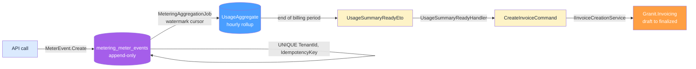
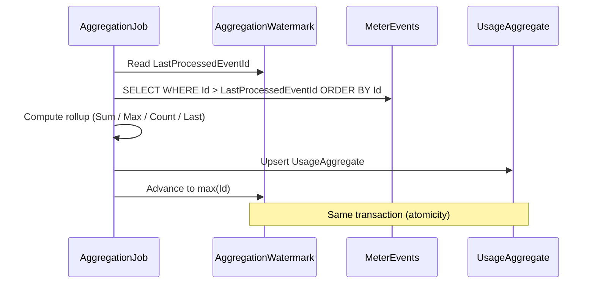

import { Aside } from "@astrojs/starlight/components";

Picture a customer on your API plan. They send **15,000 requests** on the 3rd,
then a burst of **40,000** on the 4th when their nightly batch job misfires and
retries every call twice. At the end of the month you owe them one invoice line:
"API Calls: 47,231 requests." Not 94,462 (the retries were duplicates). Not
15,000 (you did not lose the burst). Exactly the requests that count.

Getting that one number right is the entire problem of **usage-based billing**.
Most teams reach for Stripe Metering or Metronome to avoid it. You do not have
to. This post builds the whole **metered billing** pipeline in .NET, in-process:
event ingest, idempotent dedupe, a watermark cursor that never double-counts,
quota threshold alerts, and finally an invoice — no external metering vendor
in the loop.

## Why the naive counter fails

The first instinct is a running total. One row per meter, `UPDATE` it on every
call.

```csharp title="NaiveUsageCounter.cs"
// Do not do this.
public async Task RecordCallAsync(Guid tenantId)
{
    var counter = await db.UsageCounters
        .SingleAsync(c => c.TenantId == tenantId);
    counter.Total += 1;          // lost update under concurrency
    await db.SaveChangesAsync(); // one write lock per API call
}
```

Three failure modes, all of which you will hit in production:

- **Lost updates.** Two requests read `Total = 100`, both write `101`. You just
  lost a billable event. Under real traffic this is not rare — it is constant.
- **Write contention.** Every API call now serializes on one row's lock. Your
  metering layer becomes the bottleneck for the thing it is measuring.
- **No idempotency.** The client's retry increments the counter a second time.
  That is the 94,462 number — you billed the customer for their bug.

A counter cannot be both accurate and fast. The fix is to stop mutating shared
state on the hot path entirely.

## Append-only events plus a watermark

**Granit.Metering** records usage as **append-only time-series data**. Every
call becomes an immutable `MeterEvent` row. Nothing is updated, so there is no
lock to contend on and no update to lose. Aggregation happens later, off the
hot path, driven by a **watermark cursor** that guarantees no double-counting.

Here is the shape of the pipeline, end to end.



Five stages: ingest, dedupe, rollup, summary event, invoice. Let's walk each.

## Stage 1 — define and publish a meter

A `MeterDefinition` declares **what** you measure and **how** it aggregates. It
follows a `Draft → Published → Archived` lifecycle; only **Published** meters
accept ingestion.

```csharp title="ApiCallsMeter.cs"
var meter = MeterDefinition.Create(
    Guid.NewGuid(), "API Calls", "requests",
    AggregationType.Sum, "HTTP API request counter",
    productId: catalogProductId);   // optional Granit.Catalog.Product reference

meter.Publish();   // Draft → Published; ingestion now accepted
```

`AggregationType.Sum` adds up every event quantity in the period — the right
choice for request counts. The other modes cover the rest of the usual
scenarios: `Max` (peak concurrent seats), `Count` (events regardless of
quantity), `Last` (gauge-style storage size), and `CountDistinct` (unique
active users, keyed on a JSON path inside the event metadata).

Setting `productId` is worth the extra argument. It is a soft reference to a
`Granit.Catalog.Product`, and it means the eventual invoice line stays
attributable to a stable catalog item even after a meter rename — the whole
`event → metric → product → invoice line` chain becomes SQL-queryable.

## Stage 2 — record events, deduped by idempotency key

Recording is a bulk insert, not a read-modify-write. Each event carries an
**idempotency key**, and deduplication happens at the persistence layer via a
`UNIQUE (TenantId, IdempotencyKey)` index. Duplicates are silently ignored —
the insert-first pattern.

```csharp title="UsageRecorder.cs"
public sealed class UsageRecorder(IMeterEventRecorder recorder, IClock clock)
{
    public Task RecordApiCallAsync(Guid meterId, string requestId, string route)
    {
        var evt = MeterEvent.Create(
            Guid.NewGuid(),
            meterId,
            idempotencyKey: $"req-{requestId}",   // stable per logical call
            quantity: 1m,
            timestamp: clock.Now,
            metadata: $$"""{"endpoint":"{{route}}","method":"GET"}""");

        return recorder.RecordAsync(evt);
    }
}
```

The idempotency key is what kills the retry double-count from the opening
scenario. When the customer's batch job resends `req-8842`, the second insert
hits the unique index and is dropped. The event is recorded **exactly once**,
no matter how many times the client retries.

`IClock` (never `DateTime.Now`) keeps the timestamp UTC and testable. For
high-throughput ingest, `IMeterEventRecorder.RecordBatchAsync` takes a whole
batch and deduplicates the same way — one round trip for thousands of events.

<Aside type="tip" title="Two layers of idempotency">
The HTTP endpoint `POST /api/{version}/metering/events` adds a second,
complementary layer: a required `Idempotency-Key` header dedupes the entire
request envelope (proxy retries, SDK retries), while the per-event key handles
safe partial-overlap retries at the database. If you are fuzzy on why a POST
needs this at all, read
[Idempotency Keys: Why Every POST Should Be Retry-Safe](/blog/idempotency-keys-why-every-post-should-be-retry-safe/).
</Aside>

## Stage 3 — watermark rollup, guaranteed no double-count

Now the number-crunching. The `MeteringAggregationJob` runs hourly and rolls
raw events into `UsageAggregate` rows. The trick is the **watermark cursor**:
an `AggregationWatermark` per meter that stores the id of the last event it
processed.



The aggregate upsert and the watermark advance commit in **one transaction**.
That single fact is what makes the pipeline correct:

- **Crash mid-batch?** The watermark did not advance, so the next run
  re-processes from the same point. No double-counting.
- **No `IsAggregated` flag on events.** That would demand `UPDATE` locks and
  break the append-only model — exactly the contention you escaped in stage 2.
- **Events are never mutated.** The cursor moves; the data stays immutable.

You do not write this job — it ships in `Granit.Metering.BackgroundJobs` on a
`0 */1 * * *` cron. If you need an on-demand pass (say, before closing a
billing period), `IAggregationRunner.RunAsync` aggregates pending events for
all active meters against the same watermark, so a manual run and the hourly
run can never conflict.

Reading the rolled-up numbers back is a query, not a scan over raw events:

```csharp title="UsageQuery.cs"
public sealed class UsageQuery(IUsageReader usage)
{
    public Task<UsageAggregate?> CurrentApiCallsAsync(Guid meterId) =>
        usage.GetCurrentAsync(meterId);   // current billing period rollup
}
```

Real usage data is messy — a device syncs offline events a week late, or you
find a client that was double-reporting. The module handles both without
touching the append-only stream. `POST /events/backfill` accepts events up to
365 days old and auto-recomputes the affected hourly buckets; deprecating a
single event marks it discarded for billing while preserving the row for audit.
Both operations take a transaction-scoped advisory lock per meter and tenant, so
they can never race the hourly aggregator. Corrections are a cold path, not a
scramble.

## Stage 4 — enforce quotas with threshold alerts

Usage-based billing without quota enforcement is an unbounded bill waiting to
surprise someone. `IQuotaChecker` answers "how close is this tenant to their
limit?" by summing hourly aggregates within the current billing period.

```csharp title="QuotaGate.cs"
public sealed class QuotaGate(IQuotaChecker quotaChecker)
{
    public async Task<bool> CanServeAsync(
        Guid tenantId, Guid meterId, CancellationToken ct)
    {
        QuotaStatus status = await quotaChecker.CheckAsync(tenantId, meterId, ct);
        // QuotaStatus { MeterName, CurrentUsage, Limit, PercentUsed, IsExceeded }
        return !status.IsExceeded;
    }
}
```

The billing-period boundaries come from `IBillingPeriodProvider`. Standalone,
it defaults to `CalendarMonthBillingPeriodProvider` (1st to last of the month).
Add `Granit.Subscriptions` and `SubscriptionBillingPeriodProvider` takes over,
aligning quota windows to each tenant's actual subscription cycle — no config
change, just the module being present.

You rarely want customers to discover a limit by hitting a wall. The
`QuotaThresholdCheckJob` runs every 15 minutes and publishes two events:
`QuotaThresholdReachedEto` at 80% (configurable) and `QuotaExceededEto` at 100%.

```json title="appsettings.json"
{
  "Granit": {
    "Metering": {
      "ThresholdPercentage": 80
    }
  }
}
```

Wire those events to the notification module and the customer gets an email at
80% — long before the overage lands on an invoice. That is the difference
between a happy upgrade and a support ticket.

## Stage 5 — turn the summary into an invoice

When a billing-period aggregation completes, Metering publishes
`UsageSummaryReadyEto`. This is the seam between usage and money.
**Subscriptions** consumes it, reads the rolled-up totals through
`IUsageReader`, and emits a `CreateInvoiceCommand` — the same decoupled command
any module uses to create an invoice, so Metering never references Invoicing
directly.

```csharp title="UsageSummaryReadyHandler.cs"
public sealed class UsageSummaryReadyHandler(IMessageBus messageBus)
{
    public Task HandleAsync(UsageSummaryReadyEto summary)
    {
        var command = new CreateInvoiceCommand(
            TenantId: summary.TenantId,
            Currency: "EUR",
            CollectionMethod: CollectionMethod.Auto,
            BillingReason: BillingReason.SubscriptionCycle,
            LineItems:
            [
                new("Pro Plan — Monthly", 1, 29.99m, InvoiceSourceType.Subscription),
                new("API Calls: 47,231 requests", 47231, 0.001m, InvoiceSourceType.Usage),
            ],
            PeriodStart: summary.PeriodStart,
            PeriodEnd: summary.PeriodEnd,
            IdempotencyKey: $"usage-{summary.TenantId}-{summary.MeterId}-{summary.PeriodEnd:yyyyMMdd}");

        return messageBus.SendAsync(command);
    }
}
```

Two details carry weight here.

The **`IdempotencyKey`** on the command means a handler retry cannot mint a
second invoice for the same tenant, meter, and period. The idempotency
discipline from stage 2 follows the data all the way to the ledger — the same
principle, applied at every hop.

The **`Usage` line item** is not a loose string. Per the source convention,
usage lines carry the originating `MeterDefinition.Id`, and the meter's
`ProductId` rides along on `UsageSummaryReadyEto.MeterProductId` onto the
invoice line. Your finance team can trace a single invoice line back through the
product, the meter, and the exact events that produced it.

From there, `Granit.Invoicing` owns the lifecycle: `IInvoiceCreationService`
creates the draft, calculates tax, generates a gap-free number, and finalizes —
`Draft → Open`, financial fields frozen, ISO 27001 audit trail written. The
invoice is now immutable and ready for collection.

## What you did not build

Step back and count what this pipeline gave you that a metering vendor would
have charged for:

- A **high-throughput ingest path** with zero lock contention, because events
  are append-only.
- **Exactly-once accounting** from two idempotency layers plus a transactional
  watermark — the retry storm from the opening scenario resolves to the correct
  47,231.
- **Quota enforcement with early-warning alerts** at 80% and 100%, aligned to
  the real subscription cycle when Subscriptions is present.
- A **decoupled, idempotent path to an invoice** where every line is traceable
  back to its source events by construction.

All of it in-process, in your own database, under Apache-2.0 — no
Stripe Metering, no Metronome, no per-event vendor fee, no PII leaving your
tenancy.

## Key takeaways

- **Never count usage with a mutable counter.** Append-only `MeterEvent` rows
  plus a watermark rollup beat `UPDATE`-per-call on accuracy and throughput at
  the same time.
- **Idempotency is the whole game.** A stable per-event key turns a retry storm
  into no-ops; carry the same discipline to `CreateInvoiceCommand`.
- **The watermark is your correctness guarantee.** Aggregate and cursor commit
  in one transaction, so a crash re-processes cleanly and never double-counts.
- **Enforce quotas before the bill, not after.** Threshold events at 80% and
  100% turn overages into upgrade conversations, not disputes.
- **Usage-based billing needs no metering vendor.** `Granit.Metering` and
  `Granit.Invoicing` cover ingest to invoice in your own process.

## Further reading

- [Metering — Usage Tracking & Quota Enforcement](/dotnet/saas/metering/) — the
  full module reference: aggregation types, recompute, backfill, deprecate.
- [Invoicing — Invoices, Credit Notes & Partial Payments](/dotnet/saas/invoicing/) —
  lifecycle, line item sources, and the decoupled `CreateInvoiceCommand`.
- [SaaS & Commerce — Ecosystem Overview](/dotnet/saas/) — how Metering,
  Subscriptions, Invoicing, and Payments choreograph via integration events.
- [Idempotency Keys: Why Every POST Should Be Retry-Safe](/blog/idempotency-keys-why-every-post-should-be-retry-safe/) —
  the pattern that makes ingest exactly-once.
- [Subscription Billing in .NET: Proration and Dunning](/blog/subscription-billing-dotnet-proration-dunning/) —
  the fixed-charge half of the invoice this pipeline produces.
- [SEPA Direct Debit in .NET: Sovereign Payments](/blog/sepa-direct-debit-dotnet-sovereign-payments/) —
  collecting the invoice without a US payment vendor.
