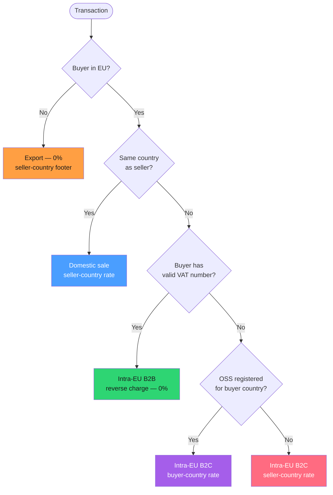

import { Aside } from "@astrojs/starlight/components";

An auditor is sitting across from your finance lead. She pulls invoice `INV-2024-000317`, issued eighteen months ago in Germany at 19% VAT. She opens your admin panel, finds the same invoice, and it now shows **21%**. The number moved. In her world, that is not a rounding quirk — it is a **fabricated fiscal record**, and it just turned a routine review into a full-scope audit.

Nobody wrote a bug that says "recompute old invoices." It happened because someone rendered the invoice detail page by calling the tax engine live, with today's rates, against a document that was frozen a year and a half ago. That is the single most expensive mistake in SaaS billing, and almost every homegrown billing system makes it.

This article is about **VAT calculation in .NET** done properly: resolving the right rate for EU cross-border sales, handling B2B reverse charge and US sales-tax nexus, and — most importantly — freezing the result onto the invoice so history stays history. The code samples use [Granit.Tax](/dotnet/saas/tax/) and [Granit.Invoicing](/dotnet/saas/invoicing/), but the principles apply to any billing stack.

## Why "just multiply by the rate" is a trap

Here is the naive version everyone starts with. It looks reasonable.

```csharp title="NaiveTaxService.cs"
// DON'T DO THIS
public decimal CalculateVat(decimal amount, string countryCode)
{
    var rate = countryCode switch
    {
        "DE" => 0.19m,
        "FR" => 0.20m,
        "BE" => 0.21m,
        _ => 0.21m,
    };
    return amount * rate;
}
```

Count the ways this is wrong. It hardcodes rates that **change** — Germany ran a temporary 16% rate through the second half of 2020, and Luxembourg cut its standard rate to 16% for all of 2023. It ignores whether the buyer is a **business with a valid VAT number** (which usually means *zero* VAT via reverse charge). It has no concept of the **One-Stop Shop** for cross-border B2C. It cannot express US sales tax, which is not a percentage of a country but a stack of state, county, and city rates driven by **nexus**. And it is called at render time, so every historical invoice silently inherits today's answer.

The real model has three moving parts you must separate: **rate resolution** (what rate applies to this transaction, on this date, in this jurisdiction), **classification** (is this domestic, intra-EU B2B, intra-EU B2C, or an export), and **snapshotting** (writing the answer down so it never moves again).

## Classification: the decision that sets the rate

Before you can pick a rate, you have to classify the transaction. For EU VAT the logic is a decision tree, and getting the branches right is most of the battle.



Granit ships this exact tree as a **pure, stateless rule engine** — no I/O, no dependency injection, so it is trivial to unit-test against every jurisdiction combination.

```csharp title="EuVatRuleEngine.cs (framework)"
TaxCalculationContext context = EuVatRuleEngine.Classify(
    sellerCountry: "BE",
    buyerCountry: "DE",
    buyerHasValidVat: true,          // validated against VIES
    ossEnabled: true,
    ossCountries: new HashSet<string> { "FR", "DE", "NL" });

// context.TransactionType   → TransactionType.IntraCommunityB2B
// context.Exemption         → TaxExemptionReason.ReverseCharge
// context.RateCountryCode   → "DE"  (jurisdiction context for the footer)
```

The result is a `TaxCalculationContext` carrying the `TransactionType` (`DomesticSale`, `IntraCommunityB2B`, `IntraCommunityB2C`, or `Export`), whether the sale is B2B, the `TaxExemptionReason`, and the **country whose rate applies**. Notice that reverse charge still records the buyer country — you need that jurisdiction on the document footer to print the legally required note ("VAT reverse-charge per Art. 196").

### B2B reverse charge hinges on a *valid* VAT number

The word "valid" is load-bearing. A buyer can type any string into a VAT-number field. If you apply 0% reverse charge on an **unvalidated** number and it turns out to be fake, the VAT liability is *yours* — you were supposed to collect it and you didn't.

That is why classification takes `buyerHasValidVat`, not `buyerVatNumber`. The validation is a separate online check against **VIES** (the EU's VAT Information Exchange System):

```csharp title="ITaxIdValidator.cs (framework)"
public interface ITaxIdValidator
{
    string Name { get; } // "vies", "stripe-tax", "hmrc"

    Task<TaxIdValidationResult> ValidateAsync(
        string taxId, string countryCode,
        CancellationToken cancellationToken = default);
}
```

The built-in `EuVatTaxCalculator` wires this together: it validates the buyer's VAT number, feeds the boolean into the rule engine, then resolves the rate. Only a confirmed-valid number unlocks reverse charge.

<Aside type="caution" title="VIES goes down. Plan for it.">
VIES has real downtime. Granit's `AllowOfflineFallback` option (default `true`)
lets a well-formed number pass an offline format check when VIES is unreachable,
and every VIES request identifier is stored for the audit trail. Decide
deliberately: fall back and risk a bad number, or block the sale until VIES
returns. Silence is not an option — the choice has money attached.
</Aside>

## Rate resolution: never hardcode, always date-scoped

Rates are data, not code. Granit resolves them through `ITaxRateProvider`, and the signature encodes the two things a naive lookup forgets: **the date** and **the customer**.

```csharp title="ITaxRateProvider.cs (framework)"
Task<TaxRateEntry?> GetRateAsync(
    string countryCode,
    DateTimeOffset asOf,        // the rate effective on THIS date
    PartyId? partyId = null,    // customer-level overrides (exempt, reverse charge)
    CancellationToken cancellationToken = default);
```

The `asOf` parameter is why Germany's 2020 rate cut does not corrupt a 2019 invoice: you ask for the rate that was effective *then*, not now. A `TaxRateEntry` carries the standard rate plus reduced, super-reduced, and parking rates, each with an `EffectiveFrom`/`EffectiveTo` window.

The `partyId` parameter handles the customer dimension. A charity, an NGO, or a public body can be **blanket VAT-exempt** regardless of country. In Granit that lives on the customer as a `TaxStatus` value object:

```csharp title="SetCustomerTaxStatus.cs"
// An intra-EU business customer eligible for reverse charge
party.SetTaxStatus(TaxStatus.Create(
    reverseCharge: true,
    vatin: "DE811234567",
    evidenceBlobId: registrationExcerptId)); // supporting paperwork in blob storage

// A wholly VAT-exempt public body
party.SetTaxStatus(TaxStatus.Create(isExempt: true));
```

When a `partyId` is supplied and the status yields a zero rate, `GetRateAsync` returns `StandardRate = 0` while keeping the country populated — so the calculation is 0% but the footer still shows the jurisdiction and the reason.

### What about US sales tax?

EU VAT and US sales tax are **different problems**, not one problem with a different rate. Sales tax is destination-based, stacks state + county + city + special-district rates, and only applies where you have **nexus** — a physical presence, or economic activity above a state threshold (commonly \$100,000 in sales or 200 transactions).

You do not want to maintain thousands of US jurisdiction rates by hand. Granit's answer is the **provider-agnostic** design: the self-hosted `Granit.Tax.Builtin` provider covers EU VAT, and `Granit.Tax.Stripe` covers US sales tax through Stripe's Tax API. Both implement the same `ITaxCalculator`, so switching is a module swap, not a code change:

```csharp title="Program.cs"
builder.AddGranitTax(); // base abstractions + metrics

// EU-only, self-hosted: register GranitTaxBuiltinModule (auto-discovered)
// Need US sales tax too? Register GranitTaxStripeModule instead —
// ITaxCalculator and ITaxIdValidator are swapped automatically.
```

Your invoicing code never learns which provider answered. It calls `ITaxCalculator.CalculateAsync` and gets a `TaxResult` back either way.

## The golden rule: snapshot at finalization

Now the part that saves you from the auditor. Tax must be computed **once**, on the draft, and then **frozen** onto the invoice at finalization. It must never be recomputed for a document that has already been issued.

Granit models this with the invoice lifecycle. A `Draft` invoice is mutable; once it transitions to `Open`, all financial fields are immutable. Here is the flow inside the invoice creation service, using the real API:

```csharp title="InvoiceCreation.cs (framework flow)"
// 1. Build the tax request from the draft's line items
var taxRequest = new TaxRequest(
    LineItems: invoice.LineItems
        .Select(li => new TaxLineItem(li.Description, li.Quantity * li.UnitPrice, TaxCode: null))
        .ToList(),
    SellerAddress: billingSnapshot,
    BuyerAddress: billingSnapshot,
    BuyerPartyId: party.Id);

// 2. Compute tax — provider resolves rate as-of clock.Now, honouring party status
TaxResult taxResult = await taxCalculator.CalculateAsync(taxRequest, cancellationToken);

// 3. FREEZE it onto the draft
invoice.SetTaxTotal(taxResult.TotalTax);

// 4. Finalize — Draft → Open. Financial fields are now immutable.
invoice.Finalize(documentNumber, now, dueAt: now.AddDays(30), billingAddressSnapshot);
```

The magic is not in step 2 — it is in what step 4 forbids. Once the invoice is `Open`, any attempt to change a financial field hits the `EnsureDraft()` guard and throws:

```csharp title="Invoice.cs (framework)"
public void SetTaxTotal(decimal taxTotal)
{
    EnsureDraft(); // throws InvalidOperationException if not Draft
    TaxTotal = taxTotal;
    Total = Subtotal + TaxTotal;
    RecalculateAmounts();
}

private void EnsureDraft()
{
    if (Status != InvoiceStatus.Draft)
    {
        throw new InvalidOperationException(
            $"Document '{Id}' is in '{Status}' status. Only Draft documents can be modified.");
    }
}
```

This is the structural fix. Your invoice detail page cannot "accidentally" recompute tax, because the recompute path is **closed by construction** — the domain refuses the mutation. To display invoice `INV-2024-000317`, you read its stored `TaxTotal`, `Subtotal`, and per-line `TaxRate`. There is no live tax call anywhere on the read path.

<Aside type="tip" title="Rate resolution and the snapshot are two different clocks">
The provider resolves the rate as of the finalization instant (`clock.Now`).
The invoice then stores that resolved number forever. Later, when the rate table
gains a new entry, only *new* drafts see it — every issued invoice already wrote
its answer down. That is the whole trick: resolve late, freeze early, never
recompute.
</Aside>

The same discipline protects the **billing address**. `Finalize` snapshots the party's live billing address into the invoice, because the jurisdiction that determined the tax must be the one printed on the legal document — even if the customer moves next year.

## Putting it together: one B2B cross-border sale

Trace a concrete case. Your company is registered in Belgium. A German business with a validated VAT number buys a €100 Pro plan.

1. **Validate** — `ITaxIdValidator.ValidateAsync("DE811234567", "DE")` hits VIES; `IsValid` is `true`.
2. **Classify** — buyer in EU, different country, valid VAT → `IntraCommunityB2B`, exemption `ReverseCharge`.
3. **Resolve** — because the exemption is not `None`... it stays 0%. The rate lookup is skipped; `TaxTotal` is €0.00.
4. **Freeze** — `SetTaxTotal(0m)`, then `Finalize`. The invoice is issued at **€100.00, 0% VAT**, with the reverse-charge note and the German jurisdiction on the footer.

Change one input — the buyer is a German *consumer* with no VAT number, and you are OSS-registered for Germany — and the same pipeline produces `IntraCommunityB2C` at Germany's 19% rate: **€119.00**. Same code, different classification, correct answer both times. And once issued, neither invoice will ever move again.

## Takeaways

- **Separate the three concerns.** Rate resolution (date + jurisdiction), classification (domestic / B2B reverse charge / B2C / export), and snapshotting are distinct — collapsing them is where naive billing breaks.
- **Reverse charge needs a *validated* VAT number.** Validate against VIES before applying 0%; an unvalidated number leaves the liability on you. Plan explicitly for VIES downtime.
- **Rates are date-scoped data, never hardcoded constants.** Resolve with an `asOf` date so historical rate changes never touch old invoices.
- **EU VAT and US sales tax are different engines.** Keep them behind one `ITaxCalculator` abstraction and pick the provider (self-hosted vs Stripe Tax) per need.
- **Snapshot tax at finalization and make recompute impossible.** Freeze `TaxTotal` onto the invoice, close the mutation path with a domain guard, and read stored values on every display path.

## Further reading

- [Tax — VAT calculation, validation and compliance](/dotnet/saas/tax/) — the full `Granit.Tax` reference
- [Invoicing — invoices, credit notes and partial payments](/dotnet/saas/invoicing/) — the lifecycle that freezes your tax
- [SaaS and Commerce ecosystem overview](/dotnet/saas/) — how tax, invoicing, and payments fit together
- [Subscription billing in .NET: proration and dunning](/blog/subscription-billing-dotnet-proration-dunning/) — the billing cycle that creates these invoices
- [Usage-based billing in .NET: from metering to invoice](/blog/usage-based-billing-dotnet-metering-to-invoice/) — metered line items feeding the same tax pipeline
- [GDPR by design](/blog/gdpr-by-design/) — the compliance-by-default philosophy behind the framework
