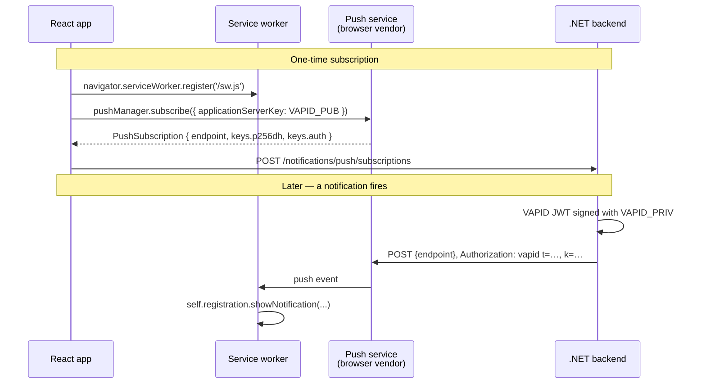

import { Aside } from '@astrojs/starlight/components';

A European bank wants real-time alerts in the browser. The product team picks Firebase Cloud Messaging, the security team picks it apart in review. FCM routes through Google infrastructure in the United States — for a regulated EU institution, that is a problem the legal department will not sign off on. The fallback is SignalR, but SignalR cannot wake a closed tab. The team ships polling instead, and the alerting story is "every 30 seconds, please refresh."

There is a third path that most .NET teams skip past. **W3C Web Push (RFC 8030/8291/8292) with VAPID authentication** delivers wake-up payloads to the browser through the user agent's own push service — Mozilla autopush for Firefox, Microsoft for Edge, Google for Chrome. Each browser vendor routes its own traffic. No FCM credential file. No US cloud dependency for an EU-only product. No third-party SDK on the frontend.

This article shows the full setup: VAPID key generation, the `Granit.Notifications.WebPush` channel, the React hook from `@granit/react-notifications-web-push`, and the 30-line service worker that turns a payload into a system notification.

## VAPID in one diagram

VAPID — Voluntary Application Server Identification — replaces the FCM API key. Instead of authenticating against a vendor, the application signs each push request with an ECDSA private key the browser already trusts (because the subscription contains the matching public key).



The subscription's `endpoint` is opaque to your backend — it points to the user agent's push service. The `p256dh` and `auth` keys are used to encrypt the payload so the push service cannot read it (ECDH + AES-128-GCM, RFC 8291).

## Generate VAPID keys, once

VAPID keys are an ECDSA P-256 pair encoded as URL-safe base64. Generate once per environment, store the private half in the secret manager, ship the public half to the frontend at runtime.

```bash title="Generate the pair"
npx web-push generate-vapid-keys
# Public Key:  BFx...
# Private Key: yhA...
```

```json title="appsettings.Production.json"
{
  "Notifications": {
    "Push": {
      "VapidSubject": "mailto:admin@clinic.example.com",
      "VapidPublicKey": "BFx...",
      "VapidPrivateKey": "vault:secret/data/webpush#private-key"
    }
  }
}
```

<Aside type="caution" title="Never commit the private key">
The private key is the only thing standing between an attacker and arbitrary push delivery to every user who has ever subscribed. Use Vault, AWS Secrets Manager, or Azure Key Vault — never plain `appsettings.json` outside development.
</Aside>

The `VapidSubject` must be a contactable URI (`mailto:` or `https:`). Browser push services use it to reach you when your subscriptions misbehave — high error rates can result in your subject getting rate-limited or temporarily blocked.

## Wire the .NET channel

The Web Push channel is a single package and a single registration call:

```bash
dotnet add package Granit.Notifications.WebPush
```

```csharp title="AppModule.cs"
[DependsOn(
    typeof(GranitNotificationsEntityFrameworkCoreModule),
    typeof(GranitNotificationsEndpointsModule))]
public sealed class AppModule : GranitModule
{
    public override void ConfigureServices(ServiceConfigurationContext context)
    {
        context.Services.AddGranitNotificationsPush();
    }
}
```

```csharp title="Program.cs"
app.MapGranitNotifications();
```

That registers the push channel against `Lib.Net.Http.WebPush` and exposes two endpoints under `/notifications/push/subscriptions` — POST to register a subscription, DELETE to unregister.

## Define a notification, ship it everywhere

Web Push is one delivery channel among seven (in-app, email, SMS, WhatsApp, SignalR, SSE, Web Push, mobile push). The notification definition declares which channels are eligible:

```csharp title="OrderShippedNotification.cs"
public sealed class OrderShippedNotification : NotificationType<OrderShippedData>
{
    public static readonly OrderShippedNotification Instance = new();

    public override string Name => "Orders.Shipped";
    public override NotificationSeverity DefaultSeverity => NotificationSeverity.Info;
    public override IReadOnlyList<string> DefaultChannels =>
    [
        NotificationChannels.InApp,
        NotificationChannels.Email,
        NotificationChannels.Push,
    ];
}

public sealed record OrderShippedData
{
    public required string OrderId { get; init; }
    public required string TrackingNumber { get; init; }
}
```

The publish site is one call regardless of channel count:

```csharp title="OrderService.cs"
public sealed class OrderService(INotificationPublisher notifications)
{
    public async Task ShipOrderAsync(Order order, CancellationToken ct)
    {
        // ... business logic ...

        await notifications.PublishAsync(
            OrderShippedNotification.Instance,
            new OrderShippedData
            {
                OrderId = order.Id.ToString(),
                TrackingNumber = order.TrackingNumber,
            },
            recipientUserIds: [order.CustomerId],
            ct);
    }
}
```

The fan-out engine dispatches to every channel the user has enabled in their preferences. Users who installed the PWA and subscribed to push get the browser notification; users who only check email get an email; users with both get both — and the in-app inbox keeps a record regardless.

## The browser side, in three pieces

The frontend needs three things: a service worker, a subscription handshake, and a UI button.

### 1. The service worker

The push service delivers a small encrypted payload — the browser decrypts it with the subscription key, then forwards it to your service worker as a `push` event. Your job is to convert that into a system notification.

```js title="public/sw.js"
self.addEventListener('push', (event) => {
  if (!event.data) return;

  const payload = event.data.json();
  // payload contains { title, body, icon, data: { url } }
  // No PII — only a reference. Details are fetched after the user clicks.

  event.waitUntil(
    self.registration.showNotification(payload.title, {
      body: payload.body,
      icon: payload.icon ?? '/icon-192.png',
      badge: '/badge-72.png',
      data: payload.data,
    }),
  );
});

self.addEventListener('notificationclick', (event) => {
  event.notification.close();
  const url = event.notification.data?.url ?? '/';
  event.waitUntil(clients.openWindow(url));
});
```

<Aside type="caution" title="Wake-up payloads only">
The push payload is decrypted on the user's device, but it lives briefly in the push service queue. Treat it as semi-public: ship a reference (`{ orderId, url }`) and fetch the full content from your authenticated API after the user clicks. This is what makes Web Push ISO 27001-friendly — the framework enforces it for FCM and Azure Notification Hubs too.
</Aside>

### 2. The subscription handshake

The React hook from `@granit/react-notifications-web-push` handles the entire dance — request permission, subscribe via `PushManager`, convert the URL-safe VAPID key to a `Uint8Array`, POST the subscription to the backend.

```tsx title="EnablePushButton.tsx"
import { useWebPush } from '@granit/react-notifications-web-push';
import { api } from './api-client';

const VAPID_PUBLIC_KEY = import.meta.env.VITE_VAPID_PUBLIC_KEY;

export function EnablePushButton() {
  const { isSupported, permission, isSubscribed, loading, subscribe, unsubscribe } =
    useWebPush({
      vapidPublicKey: VAPID_PUBLIC_KEY,
      apiClient: api,
      basePath: '/notifications',
      serviceWorkerPath: '/sw.js',
    });

  if (!isSupported) {
    return <p>Your browser does not support Web Push.</p>;
  }

  if (permission === 'denied') {
    return <p>Notifications blocked. Enable them in browser settings.</p>;
  }

  return isSubscribed ? (
    <button onClick={unsubscribe} disabled={loading}>Disable push</button>
  ) : (
    <button onClick={subscribe} disabled={loading}>Enable push</button>
  );
}
```

Under the hood the hook calls `registerPushSubscription(client, basePath, subscription)` with the standard `PushSubscriptionJSON` payload (`endpoint`, `keys.p256dh`, `keys.auth`). The backend deserializes, validates, and stores it against `ICurrentUserService.UserId`.

### 3. The VAPID public key

Ship it as build-time configuration. The Vite env variable above (`VITE_VAPID_PUBLIC_KEY`) is replaced at build time with the same value you put under `Notifications:WebPush:VapidPublicKey` in `appsettings.json`. Public key in both places; private key only in the secret manager.

## What you get for free

* **At-least-once delivery** — every push attempt is recorded in `NotificationDeliveryAttempt`. Transient failures retry with exponential backoff (10s, 1min, 5min, 30min, 2h). After 5 attempts the envelope lands in the Wolverine dead-letter queue.
* **Per-user opt-out** — `AllowUserOptOut = true` on the notification definition exposes a toggle in the preferences UI (`useNotificationPreferences()`). Set it to `false` for security-critical notifications (breach alerts, deletion confirmations) and the toggle disappears.
* **Per-tenant isolation** — push subscriptions are tenant-scoped via `IMultiTenant` on the subscription entity. A user belonging to two tenants needs two subscriptions.
* **OpenTelemetry traces** — every fan-out and delivery is a span (`notifications.fanout`, `notifications.deliver`). The `notifications.channel` tag tells you which channels are flaky.

## Subscription lifecycle, in one paragraph

Browsers expire push subscriptions. Chrome rotates them on a schedule; Firefox on permission revocation; Safari on extended inactivity. The push service responds to your POST with `410 Gone` for an expired endpoint. Granit's channel maps `410` to a subscription deactivation — the next call to `unregisterPushSubscription` cleans the row. The frontend hook reads `pushManager.getSubscription()` on mount and re-subscribes if the user agent has rotated the key, so the recovery is automatic without any user-visible failure.

## Three takeaways

* **VAPID removes the FCM dependency.** Each browser vendor runs its own push service. A European product can deliver browser notifications without routing through US infrastructure.
* **Payloads are wake-up signals.** Send a reference and fetch the body from your authenticated API on click. Never put PII in a push payload — the framework enforces this for mobile push, and you should enforce it for Web Push too.
* **The React hook does the dance.** `useWebPush` handles permission, subscription, key conversion, and backend registration. The .NET side is one `AddGranitNotificationsPush()` call. The custom code you write is the 30-line service worker and the notification definition.

## Further reading

* [Notification channels reference](/dotnet/infrastructure/notifications/sms-push-realtime/) — Web Push alongside the other six channels
* [Notifications configuration](/dotnet/infrastructure/notifications/configuration/) — VAPID options, health checks, OpenTelemetry
* [Set up notifications guide](/dotnet/guides/set-up-notifications/) — full step-by-step with all channels
* [Multi-channel notifications in .NET](/blog/multi-channel-notifications-dotnet/) — the fan-out engine that drives this
* [SSE vs SignalR vs WebSockets](/blog/sse-vs-signalr-vs-websockets/) — when Web Push isn't the right tool
