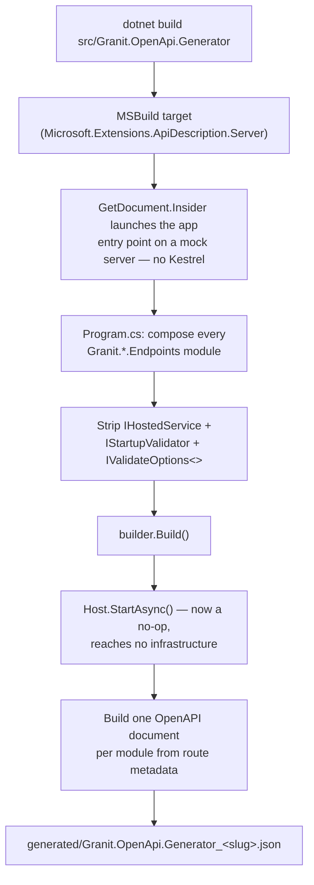

import { Aside, Steps, Tabs, TabItem } from "@astrojs/starlight/components";

`Granit.OpenApi.Generator` is a **build-only** project that composes every
`Granit.*.Endpoints` module and emits **one OpenAPI 3.1 document per module** at
build time — with no running web host and no infrastructure (no database, Vault,
object store, or message broker). The generated JSON is the contract that
`granit-front` turns into TypeScript types, so the two repos never drift.

This page has two audiences:

- **Framework contributors** who maintain or extend the generator — read all of it,
  especially [Keeping it complete](#keeping-it-complete) and the
  [two gotchas](#two-gotchas).
- **Frontend developers** who consume the generated artifacts — jump to
  [Integer handling](#integer-handling-for-frontend-consumers) and
  [Artifacts and consumption](#artifacts-and-consumption).

<Aside type="caution" title="This is tooling, not a module">
`Granit.OpenApi.Generator` is **never published as a NuGet package**
(`IsPackable=false`) and lives in the `src/Tooling` solution folder. It is not one of
the framework's published modules and is not counted in the package total. You never
reference it from an application — you only **build** it.
</Aside>

## Why a dedicated generator?

A Granit host serves its OpenAPI document at runtime from the live request pipeline
(see [API Documentation](/dotnet/api/api-documentation/)). That is perfect for
human exploration via Scalar, but a poor fit for a **codegen contract**:

- It needs a *running* host — with a database, Vault, and a broker wired up — just to
  read a static schema.
- A single host rarely composes *every* module, so no one document covers the whole
  framework surface.
- The output is one big document, not the per-package slices `granit-front` consumes.

The generator solves all three: it composes the full set of endpoints modules once,
runs **no infrastructure**, and writes one self-contained document per module.

## How it works

The generator never starts Kestrel. Build-time OpenAPI generation is driven by the
[`Microsoft.Extensions.ApiDescription.Server`](https://www.nuget.org/packages/Microsoft.Extensions.ApiDescription.Server)
package together with two MSBuild properties in the `.csproj`:

```xml
<OpenApiGenerateDocuments>true</OpenApiGenerateDocuments>
<OpenApiDocumentsDirectory>$(MSBuildProjectDirectory)/generated</OpenApiDocumentsDirectory>
```

At build, the `GetDocument.Insider` tool **launches the application entry point**
against a **mock server** (no sockets, no Kestrel) and calls `Host.StartAsync()`.
That means *all* startup logic runs — including `ValidateOnStart()` validators and
every `IHostedService.StartAsync()`. Left untouched, those would reach for real
infrastructure and the build would fail with no database in sight.

To keep generation **config-free and infra-free**, `Program.cs` strips three service
categories **before** `builder.Build()`. The OpenAPI document is assembled from
endpoint metadata in the request pipeline, so none of them are needed to produce it:

| Removed | Why it is safe to remove |
| ------- | ------------------------ |
| `RemoveAll<IHostedService>()` | The DB / Vault / Wolverine / seeder workers — nothing should *run*, only describe. |
| `RemoveAll<IStartupValidator>()` | Every `ValidateOnStart()` check — there is no real config to validate. |
| all `IValidateOptions<>` | Map-time options validators (e.g. `MapGranitBff` reads validated options while mapping routes). |

It then wires the two cheap, infra-free ASP.NET services the Granit OpenAPI
transformers assume a host has registered:

```csharp
builder.Services.AddAuthentication();
builder.Services.AddAuthorizationBuilder();
```

With those removals in place, `Host.StartAsync()` becomes an effective no-op and the
document is built purely from route metadata.



## Per-module slicing

Each module gets its own document, named by a **slug** (`blob-storage`,
`identity-local`, `bff`, …). Two pieces make a single composed app yield one
document per module:

<Steps>

1. **Stamp the routes.** Every module's routes are mounted under an empty-prefix
   group tagged with the slug:

   ```csharp
   module.Map(app.MapGroup(string.Empty).WithGroupName(module.Slug));
   ```

2. **Slice by group name.** Each document's `shouldInclude` predicate keeps only the
   endpoints whose group matches its slug:

   ```csharp
   builder.AddGranitOpenApiDocument(slug, slug, description => description.GroupName == slug);
   ```

</Steps>

`GroupName` — not the declaring assembly — is the correct discriminator. Shared-helper
endpoints such as `MapGranitQuery<T>` have their handler in
`Granit.QueryEngine.AspNetCore`, yet they belong in the **owning module's** document.
Because `WithGroupName` propagates to nested groups, those helper routes inherit the
module's slug and land in the right contract.

## The `AddGranitOpenApiDocument` API

The generator is built on a new public extension shipped in
`Granit.Http.ApiDocumentation`:

```csharp
public static IHostApplicationBuilder AddGranitOpenApiDocument(
    this IHostApplicationBuilder builder,
    string documentName,
    string title,
    Func<ApiDescription, bool> shouldInclude)
```

It registers **one** OpenAPI document that carries the **full Granit transformer
chain** (int32 normalization, RFC 7807 Problem Details schema, sorted tags, security
schemes, …) plus your custom slice predicate. Reach for it — instead of a bare
`AddOpenApi` — whenever you want **per-module or per-audience** documents that stay
faithful to what the framework actually serves. A bare `AddOpenApi` emits raw
ASP.NET Core output (for example `type: ["integer", "string"]` on every `int`; see
below).

<Aside type="note">
The existing per-version `AddGranitApiDocumentation()` is unchanged — keep using it
for the human-facing, Scalar-served documents on a normal host. `AddGranitOpenApiDocument`
is the lower-level primitive for slicing; both share the same transformer chain and
can be called together.
</Aside>

## Integer handling for frontend consumers

This is the one section every **frontend consumer** must read.

ASP.NET Core's native generator types every `int` as `type: ["integer", "string"]`,
because System.Text.Json accepts a number written as a JSON string on read. The
Granit transformer chain cleans this up — but treats 32-bit and 64-bit integers
**differently, on purpose**:

| .NET type | Generated schema | Type it in TypeScript as |
| --------- | ---------------- | ------------------------ |
| `int` / `int32` | normalized to `"integer"` (string variant + numeric pattern stripped) | `number` |
| `long` / `int64` | **keeps** the `integer \| string` union | `string \| number` (or `string`) |

The `int64` union is **deliberate, not a backend bug**. JavaScript's `Number`
precision tops out at 2^53, so a large `long` cannot round-trip as a JS number — the
backend serializes it as a **string** to stay lossless.

<Aside type="caution" title="Type int64 fields as string | number">
Never type an `int64` field as `number`. Fields like `deadLetterCount`, `sizeBytes`,
and `durationMs` arrive as `string | number` and **will** exceed `Number.MAX_SAFE_INTEGER`
in production. `openapi-typescript` generates the union for you from the schema —
do not "simplify" it away.
</Aside>

## Two gotchas

### BFF needs a stub frontend

`MapGranitBff` maps **one route group per configured `Bff:Frontends` entry**. With an
empty list it emits **zero paths**, so the generator ships a stub `appsettings.json`
with a single frontend:

```json
{
  "Bff": {
    "Frontends": [{ "Name": "app" }]
  }
}
```

It is the only config-collection-driven module that needs seed config — the stripped
options validators mean the values themselves never have to be real. The documented
JSON surface is `/bff/user` and `/bff/csrf-token`; the OIDC redirect routes
(`login` / `logout` / back-channel) are marked `ExcludeFromDescription` and do not
appear in the contract.

### Reflecting over every module at build time

Composing the full module graph reflects over **every** module's exported types at
build time. The generator carries **no** Wolverine reference of its own — two framework
decisions are what keep that reflection from blowing up:

1. **Resilient discovery scans.** `Granit.Reflection.SafeTypeLoader`
   (granit-dotnet#2541) returns an assembly's *loadable* types instead of letting
   `GetExportedTypes()` throw when a referenced dependency is not present. One awkward
   assembly can no longer take down a "scan every loaded assembly" discovery site.

2. **Wolverine stays loadable.** `Granit.Privacy` exposes **public** Wolverine sagas
   (its export and deletion sagas), so its public surface references Wolverine types. It
   references `WolverineFx` with **`PrivateAssets="analyzers"`**, which privatises *only*
   the Wolverine source generator — stopping a duplicate `GeneratedWolverineTypeLoader`
   (CS0436) conflict in downstream projects — while letting the **Wolverine runtime
   assembly flow transitively**. Consumers that reflect over Privacy's exported types
   (the generator, FluentValidation, Wolverine's own discovery) therefore find Wolverine
   loadable.

<Aside type="caution" title="Keep Privacy's WolverineFx at PrivateAssets=analyzers">
Do **not** re-broaden `Granit.Privacy`'s `WolverineFx` to `PrivateAssets="all"`. That
blocks the runtime asset, and every consumer reflecting over Privacy's exported saga
types then crashes with a `FileNotFoundException` for `Wolverine.dll` — the regression
granit-dotnet#2540 fixed. `WolverineCouplingTests` only guards against *direct* package
references, so it will **not** catch this transitive break.
</Aside>

## How to run it

```bash
# Emits ./generated/Granit.OpenApi.Generator_<slug>.json — one per module.
dotnet build src/Granit.OpenApi.Generator

# Force a regen when the build thinks it is up to date.
dotnet build src/Granit.OpenApi.Generator --no-incremental
```

<Aside type="danger" title="Build it — never run it">
Do **not** `dotnet run` the generator. Running it would start the web host instead of
triggering the build-time document target. Generation happens during `dotnet build`,
through the `GetDocument.Insider` MSBuild target.
</Aside>

## Artifacts and consumption

The generator writes one document per module to its `generated/` folder:

```text
generated/
  Granit.OpenApi.Generator_blob-storage.json
  Granit.OpenApi.Generator_identity-local.json
  Granit.OpenApi.Generator_bff.json
  …
```

These artifacts are **generated, not source** — `generated/` is gitignored and the
JSON is **never committed**. The pipeline is:

<Steps>

1. **CI builds the generator** and publishes the per-module JSON as artifacts.
2. **`granit-front` runs [`openapi-typescript`](https://openapi-ts.dev/)** over each
   document to emit per-module generated types (for example
   `@granit/{module}/types/_generated.ts`).
3. **`tsc` catches drift.** If a backend contract change regenerates a type that no
   longer matches the frontend code, the TypeScript compiler fails downstream — the
   contract break surfaces at build time, not in production.

</Steps>

## Keeping it complete

A new `.Endpoints` module that ships **without** being wired into the generator would
silently drop its contract from the artifacts — and from the `granit-front` type feed
— while the generator still builds green. The architecture test
`OpenApiGeneratorCompletenessTests` prevents that by failing the build unless **all
three** wiring points agree with the set of `src/Granit.*.Endpoints` projects on disk:

1. the **`.csproj`** `<ProjectReference>`s exactly the endpoints projects;
2. `GeneratorModule`'s `[DependsOn]` names each module (so its services are configured);
3. `GeneratorEndpoints.All` has one registry entry per module (so its routes are mounted).

<Aside type="tip" title="Shipping a new endpoints module?">
After adding `Granit.<Area>.Endpoints`, wire it into the generator in the same PR:
add the `<ProjectReference>`, a `typeof(...)` to `GeneratorModule`'s `[DependsOn]`,
and a `new("<slug>", e => e.MapGranit<Area>())` entry in `GeneratorEndpoints.All`.
The completeness test tells you exactly which of the three you missed.
</Aside>

## See also

- [API Documentation — Scalar & OpenAPI 3.1](/dotnet/api/api-documentation/) — the
  runtime side: the transformer chain and the human-facing Scalar UI.
- [Module Structure](/contributing/module-structure/) — anatomy of a
  `Granit.*.Endpoints` package.
- [Testing Guide](/contributing/testing-guide/) — how architecture tests like
  `OpenApiGeneratorCompletenessTests` are written.
- [Frontend HTTP Client](/frontend/api/http-client/) — the consuming side:
  `@granit/api-client` and the generated types.
