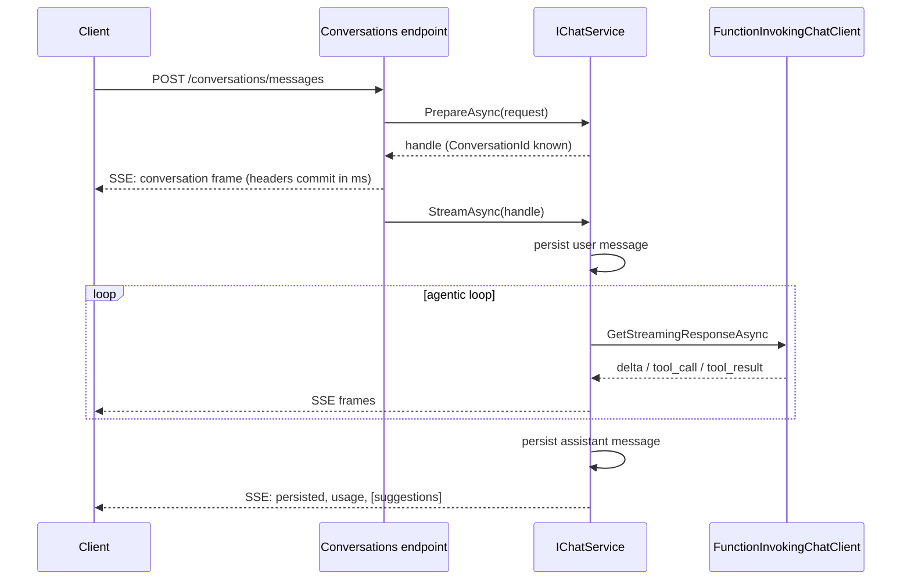
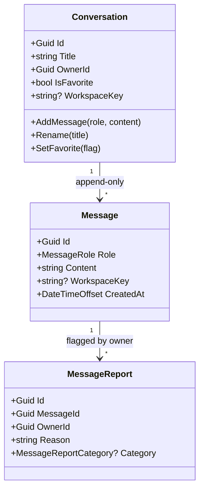

import { Tabs, TabItem, FileTree, Aside } from "@astrojs/starlight/components";

[Structured Completion](/dotnet/ai/structured-completion/) turns one prompt into one
typed object. **Agentic Chat** is the other shape of AI: a long-lived conversation where
the model thinks, calls your tools, streams its answer token-by-token, and occasionally
stops to ask the user a question. `Granit.AI.Chat` is the engine behind that experience —
the Claude.ai / ChatGPT interaction, owner-scoped and multi-tenant, sitting on the same
provider-agnostic [AI workspace](/dotnet/ai/setup/) as every other `.AI` module.

It is delivered as a **family of packages** so you compose only what you need: the core
domain and chat service, plus opt-in satellites for HTTP, persistence, attachments,
privacy, and retention.

<Aside type="note" title="Available from Granit 1.0">
Agentic streaming landed in [ADR-071](/dotnet/architecture/adr/071-agentic-chat-streaming/);
the conversation model, tool registry, and prompt catalog in
[ADR-067](/dotnet/architecture/adr/067-agentic-chat-tool-registry-prompt-catalog/).
</Aside>

## The package family

<FileTree>

- Granit.AI.Chat **core — domain, `IChatService`, extension seams**
- Granit.AI.Chat.Endpoints **REST + SSE streaming endpoints**
- Granit.AI.Chat.EntityFrameworkCore **conversation persistence (isolated DbContext)**
- Granit.AI.Chat.BlobStorage **resolve attachments from blob storage**
- Granit.AI.Chat.Privacy **GDPR export + right-to-erasure**
- Granit.AI.Chat.BackgroundJobs **retention cleanup (data minimization)**

</FileTree>

Each satellite references the core and activates a capability through DI composition —
the same soft-dependency rule as the rest of the framework. Install only what the
deployment needs.

## Setup

A working chat backend is the core module, persistence, and the HTTP surface. The core
module registers itself; the satellites expose explicit registration calls.

```csharp
// Program.cs
builder.AddGranitAI();                       // the provider-agnostic workspace layer
builder.AddGranitAIOllama();                 // or OpenAI / Azure OpenAI / Anthropic

// Conversation persistence — isolated, tenant-aware DbContext
builder.Services.AddGranitAIChatEntityFrameworkCore(
    shared => shared.UseNpgsql(connectionString));

// Attachments backed by Granit.BlobStorage (optional)
builder.Services.AddBlobStorageChatAttachments(options =>
{
    options.MaxAttachments = 3;
    options.MaxAttachmentBytes = 5 * 1024 * 1024; // 5 MiB
});

// GDPR participation (optional)
builder.Services.AddGranitPrivacy()
    .AddGranitAIChatPrivacyProvider();
```

```csharp
// Map the REST + SSE endpoints under /conversations
app.MapGranitConversations();
```

The core `GranitAIChatModule` registers `IChatService`, the workspace catalog, the
clarification tool, and the mention/suggestion/attachment resolvers — all scoped.

## How a turn works

The chat service is **two-phase** by design: a synchronous `PrepareAsync` that validates
and resolves context, then an `IAsyncEnumerable` `StreamAsync` that runs the agentic loop.
The split lets the endpoint map a bad request to a clean `404`/`422` **before** the SSE
stream opens — once bytes are flowing, you can no longer change the status code.

```csharp
namespace Granit.AI.Chat;

public interface IChatService
{
    Task<ChatSendHandle> PrepareAsync(
        ChatSendRequest request, CancellationToken cancellationToken = default);

    IAsyncEnumerable<ChatTurnUpdate> StreamAsync(
        ChatSendHandle handle, CancellationToken cancellationToken = default);
}
```

`PrepareAsync` checks that the target workspace is chat-capable, that the caller owns the
conversation, and resolves mentions, attachments, and prompt references into the per-turn
context. The returned `ChatSendHandle` already knows its `ConversationId` — even for a
brand-new conversation — so the endpoint can flush it immediately.



`StreamAsync` persists the **user** turn before the loop runs (so a mid-stream crash never
loses the question) and appends the **assistant** turn once the loop settles. Usage is
stamped even if the client disconnects mid-stream.

<Aside type="caution" title="Accepted data-loss window">
The assistant turn is persisted only after the stream settles. A server crash between
stream-end and persistence loses that one assistant message (it is regenerable); the user
turn and the conversation survive. This is a documented, accepted trade-off — see
[ADR-071](/dotnet/architecture/adr/071-agentic-chat-streaming/).
</Aside>

### The streaming updates

`StreamAsync` yields `ChatTurnUpdate` records, each tagged by `ChatTurnUpdateKind`:

| Kind | Carries | Meaning |
|------|---------|---------|
| `Delta` | `Delta` | One slice of assistant text |
| `ToolCall` | `ToolName`, `ToolCallId` | A tool started |
| `ToolResult` | `ToolName`, `ToolCallId`, `Succeeded` | A tool finished |
| `Completed` | `Result` (`ChatSendResult`) | Terminal — final answer, usage, suggestions, clarification |

The terminal `ChatSendResult` carries the final `Content`, `InputTokens` / `OutputTokens`,
the persisted message rows, any `SuggestedActions`, an optional `Clarification`, and
`MaxIterationsReached`.

## The SSE wire protocol

The endpoint projects those updates onto Server-Sent Events. The `conversation` frame is
flushed **first** — its id comes from the handle — so time-to-first-byte is milliseconds,
not the full agent duration. Tool frames carry **only** the tool name and call id, never
arguments or raw results (privacy); the client maps the name to a localized label.

| Frame | Payload | When |
|-------|---------|------|
| `conversation` | `conversationId` | first, immediately |
| `delta` | `content` | per assistant token |
| `tool_call` | `toolName`, `toolCallId` | a tool started |
| `tool_result` | `toolName`, `toolCallId`, `succeeded` | a tool finished |
| `persisted` | `messages` | terminal — the turn's two saved rows (user, then assistant) |
| `usage` | `inputTokens`, `outputTokens` | terminal |
| `suggestions` / `clarification` | … | terminal |
| `error` | `code` (`rate_limit`, `provider_unavailable`, `server_error`) | terminal, on failure |

Tool frames are **de-duplicated by call id** (streamed function-call fragments arrive in
pieces). No `thinking` frame is sent — the client derives a "Thinking…" indicator from a
`tool_result` not yet followed by a `delta`. Unknown frames are ignored by older clients,
so the protocol extends without breaking them.

## REST endpoints

`MapGranitConversations()` maps the full surface under `/conversations` (configurable via
`AIChatEndpointsOptions.RoutePrefix`). Every route is owner-scoped — a caller only ever
sees their own conversations.

| Method | Path | Permission | Purpose |
|--------|------|------------|---------|
| `GET` | `/` | `AIChat.Conversations.Read` | List the caller's conversations (newest first) |
| `POST` | `/` | `AIChat.Conversations.Manage` | Create a conversation |
| `GET` | `/{id}` | `AIChat.Conversations.Read` | Conversation metadata (messages paged separately) |
| `PUT` | `/{id}/title` | `AIChat.Conversations.Manage` | Rename |
| `PUT` | `/{id}/favorite` | `AIChat.Conversations.Manage` | Toggle favorite (idempotent) |
| `DELETE` | `/{id}` | `AIChat.Conversations.Delete` | Soft-delete |
| `GET` | `/{id}/messages` | `AIChat.Conversations.Read` | Keyset-paginated message page (newest first) |
| `POST` | `/messages` | `AIChat.Conversations.Send` | **Send a message, stream the answer over SSE** |
| `POST` | `/messages/{messageId}/report` | `AIChat.Conversations.Report` | Flag a message for review |
| `GET` | `/workspaces` | `AIChat.Conversations.Read` | List selectable chat workspaces |

The send endpoint is bound to the rate-limit policy **`ai-chat-send`**. The module wires
the policy but enforces nothing until the host configures it — bound the per-user model
spend to prevent "denial of wallet":

```json
"RateLimiting": {
  "Policies": {
    "ai-chat-send": { "PermitLimit": 20, "Window": "00:01:00", "PartitionBy": "User" }
  }
}
```

`SendMessageRequest` is validated before it reaches the service: message non-empty and
≤ 16 000 chars, ≤ 25 mentions, ≤ 5 prompt refs, and attachment count/type/size within the
configured attachment limits.

## The domain model

Three aggregates, all multi-tenant and owner-stamped. Messages are **append-only** —
there is no edit or in-place delete; a conversation is an immutable transcript.



`MessageRole` is `User`, `Assistant`, `System`, or `Tool`. `MessageReportCategory` is
`Inaccurate`, `Harmful`, or `Other`, and creating a report raises a
`ChatMessageReportedEvent` carrying only identifiers and the user's reason — never the
message content or any tool data.

The EF Core satellite registers an **isolated** `AIChatDbContext` and maps three tables
(`ai_chat_conversations`, `ai_chat_messages`, `ai_chat_message_reports`, prefix
configurable via `GranitAIChatDbProperties`). Conversations are indexed by
`(TenantId, OwnerId, CreatedAt)` for the "my conversations, newest first" query;
messages by `(ConversationId, CreatedAt)` for thread pagination. Two store seams sit on
top: `IConversationStore` (owner-scoped CRUD) and `IConversationDataStore`
(privacy/retention operations that deliberately cross the owner boundary).

## Extension points

The engine is generic; you make it useful by plugging in your application's context. Four
seams, all optional.

### Attachments

Implement `IAIAttachmentSource` to resolve an opaque reference into bytes; the framework
extracts the text and injects it as an **untrusted** context block. `Granit.AI.Chat.BlobStorage`
ships a ready-made source over `Granit.BlobStorage` — register it with
`AddBlobStorageChatAttachments`. To wire your own:

```csharp
public sealed class InvoiceAttachmentSource(IInvoiceStore store) : IAIAttachmentSource
{
    public async Task<AIAttachmentData?> GetAsync(
        string reference, CancellationToken cancellationToken = default)
    {
        var invoice = await store.FindPdfAsync(reference, cancellationToken)
            .ConfigureAwait(false);
        return invoice is null
            ? null // absent or not accessible under the caller's ACLs
            : new AIAttachmentData(invoice.Bytes, "application/pdf", invoice.FileName);
    }
}

builder.Services.AddGranitChatAttachments<InvoiceAttachmentSource>(options =>
    options.AllowedContentTypes.Add("application/pdf"));
```

`GranitAIChatAttachmentOptions` (config section `AI:Chat:Attachments`) defaults to
5 attachments, 10 MiB each, and a permissive set of text/Office/PDF MIME types.

### Mentions

When a user types `@Dr Smith`, the client sends an `AIMention(Type, Id)`. Implement
`IAIMentionContextResolver` to turn resolved mentions into a context block — and to enforce
ACLs by returning `null` for references the caller may not see:

```csharp
public sealed class DoctorMentionResolver(IDoctorReader doctors) : IAIMentionContextResolver
{
    public async ValueTask<string?> ResolveContextAsync(
        IReadOnlyList<AIMention> mentions, CancellationToken cancellationToken = default)
    {
        var doctor = mentions.FirstOrDefault(m => m.Type == "doctor");
        if (doctor is null) return null;
        var profile = await doctors.GetAsync(Guid.Parse(doctor.Id), cancellationToken)
            .ConfigureAwait(false);
        return profile is null ? null : $"Mentioned doctor: {profile.FullName}, {profile.Specialty}.";
    }
}
```

### Suggested actions

A provider returns **declarative** call-to-actions — deep links the UI renders as chips.
They are never auto-invoked; the user decides.

```csharp
public sealed class ConnectCalendarSuggestion : IAISuggestionProvider
{
    public ValueTask<IReadOnlyList<AISuggestedAction>> GetSuggestionsAsync(
        AISuggestionContext context, CancellationToken cancellationToken = default)
    {
        IReadOnlyList<AISuggestedAction> actions = context.Message.Contains("appointment")
            ? [new AISuggestedAction("calendar.connect", "Connect your calendar", "/settings/calendar")]
            : [];
        return ValueTask.FromResult(actions);
    }
}

builder.Services.AddGranitChatSuggestions(b => b.Add<ConnectCalendarSuggestion>());
```

### Clarifying questions

The engine registers a built-in `request_clarification` tool. When the model is
ambiguous, it calls the tool, which **halts the loop** and surfaces an
`AIClarificationRequest` (a `Question`, discrete `Options`, and an `AllowOther` flag)
instead of a final answer. The client renders the choices; the user's pick becomes the
next turn, and the loop resumes normally. No code on your side — it ships in the core.

## Per-user settings

Three user-scoped settings (prefix `Granit.AI.Chat.`, auto-discovered by the settings
module) shape every turn:

| Setting | Values | Effect |
|---------|--------|--------|
| `DefaultWorkspace` | a workspace name, or `Auto` | Which workspace a new conversation uses |
| `WebSearchPolicy` | `Deny` · `Allow` · `AlwaysAsk` | Whether the agent may search the web (default `Deny`) |
| `CustomContext` | free text, ≤ 4000 chars | Persistent user context injected each turn |

`IChatWorkspaceCatalog.GetSelectableWorkspacesAsync` returns `Auto` first, then every
chat-capable workspace — the same list the `/workspaces` endpoint serves.

## Privacy, retention & diagnostics

`Granit.AI.Chat.Privacy` plugs into the framework's GDPR pipeline via
`AddGranitAIChatPrivacyProvider()`. It exports a user's conversations, messages, and
report reasons as an `ai-chat-conversations.json` fragment (Articles 15/20) and
**hard-deletes** all of them on an erasure request (Article 17) — soft delete is forbidden
here, since a recoverable transcript is not erased. Attachment *content* is never exported;
it is transient and owned by blob storage.

`Granit.AI.Chat.BackgroundJobs` adds a distributed retention job. It is **opt-in**: set
`AI:Chat:Retention:RetentionDays` (default `0` disables cleanup) and conversations idle
past the window are purged in batches of `CleanupBatchSize` (default `500`).

The core emits OpenTelemetry under the `Granit.AI.Chat` activity source and meter:

| Metric | Meaning |
|--------|---------|
| `granit.ai.chat.conversation.created` | New conversations |
| `granit.ai.chat.turn.completed` | Completed turns |
| `granit.ai.chat.tokens.input` / `.output` | Token usage per turn |

All are tagged `tenant_id` (coalesced to `global`) and `workspace_key`.

## See also

- [Setup & Configuration](/dotnet/ai/setup/) — providers, workspaces, capability flags
- [Structured Completion](/dotnet/ai/structured-completion/) — typed single-shot output
- [API Endpoints](/dotnet/ai/endpoints/) — the non-agentic workspace chat/embedding proxy
- [ADR-067](/dotnet/architecture/adr/067-agentic-chat-tool-registry-prompt-catalog/) — conversation model, tool registry, prompt catalog
- [ADR-071](/dotnet/architecture/adr/071-agentic-chat-streaming/) — agentic streaming over SSE
