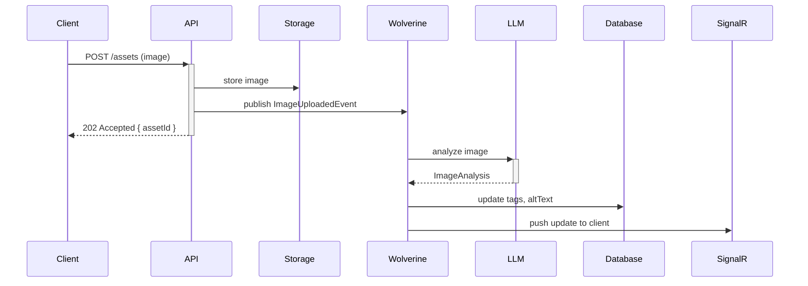

import { Aside, Tabs, TabItem } from "@astrojs/starlight/components";

`Granit.Imaging.AI` adds `IAIImageAnalyzer` to the imaging pipeline: send image bytes
and get back a description, detected objects, semantic tags, and a suggested alt text.

This enables accessibility automation, smart asset tagging, and content-aware
processing — without changing the existing `Granit.Imaging` image processing pipeline.

## Setup

<Tabs>
<TabItem label="Module">
```csharp
[DependsOn(
    typeof(GranitImagingAIModule),
    typeof(GranitAIOpenAIModule))]  // Must be a vision-capable model
public class AppModule : GranitModule { }
```
</TabItem>
<TabItem label="Program.cs">
```csharp
builder.AddGranitAI();
builder.AddGranitAIOpenAI();
builder.AddGranitImagingAI();
```
</TabItem>
<TabItem label="appsettings.json">
```json
{
  "Imaging": {
    "AI": {
      "WorkspaceName": "vision",
      "TimeoutSeconds": 30,
      "MaxImageBytes": 10485760
    }
  }
}
```
</TabItem>
</Tabs>

:::caution[Vision model required]
`IAIImageAnalyzer` sends image bytes to the LLM. Your workspace must use a
**vision-capable model**:

| Provider | Models |
|----------|--------|
| OpenAI | `gpt-4o`, `gpt-4o-mini`, `gpt-4-turbo` |
| Azure OpenAI | `gpt-4o` (with vision enabled) |
| Anthropic | `claude-3-5-sonnet`, `claude-3-opus` |
| Ollama | `llava`, `llava-llama3`, `moondream` |

Text-only models will return an error. Configure a dedicated `vision` workspace.
:::

## Analyzing images

```csharp
public class ProductImageService(IAIImageAnalyzer analyzer)
{
    public async Task<ImageAnalysis> AnalyzeAsync(
        byte[] imageBytes,
        string mimeType,         // "image/jpeg", "image/png", "image/webp"
        CancellationToken ct)
    {
        return await analyzer
            .AnalyzeAsync(imageBytes, mimeType, ct)
            .ConfigureAwait(false);
    }
}
```

### Analysis result

```csharp
public sealed record ImageAnalysis(
    string Description,                      // "A red leather armchair in a modern living room"
    IReadOnlyList<string> DetectedObjects,   // ["armchair", "cushion", "lamp", "rug"]
    IReadOnlyList<string> Tags,              // ["furniture", "interior", "red", "modern"]
    string? SuggestedAltText);              // "Red leather armchair with matching ottoman in a bright living room"
```

### Example outputs by image type

**Product photo** (`chair_red_001.jpg`):

```json
{
  "description": "A red leather armchair with chrome legs against a white background",
  "detectedObjects": ["armchair", "chrome legs", "leather upholstery"],
  "tags": ["furniture", "seating", "red", "leather", "modern", "product"],
  "suggestedAltText": "Red leather armchair with polished chrome legs on white background"
}
```

**Document scan** (`invoice_scan.png`):

```json
{
  "description": "A scanned invoice document with company header and line items table",
  "detectedObjects": ["text", "table", "logo", "signature"],
  "tags": ["document", "invoice", "financial", "scanned"],
  "suggestedAltText": "Scanned invoice document with header and itemized table"
}
```

## Built on Structured Completion

`IAIImageAnalyzer` no longer hand-rolls JSON. It builds a
[`StructuredCompletionRequest`](/dotnet/ai/structured-completion/) with the image as a
`DataContent` attachment and calls `IStructuredCompletion.CompleteAsync<ImageAnalysis>` —
so the vision response is **schema-enforced by the provider**, not coaxed out of a prompt
and fence-stripped by hand. The four-valued status is mapped to a plain result or an
`InvalidOperationException`:

| `StructuredCompletionStatus` | Result |
|------------------------------|--------|
| `Succeeded` | Sanitized `ImageAnalysis` |
| `ModelRefused` | `InvalidOperationException` — "The AI model returned an empty response." |
| `SchemaViolation` | `InvalidOperationException` — "Failed to parse the AI model response as JSON." |
| `TransportFailure` | `InvalidOperationException` carrying the PII-safe error message |

### Timeout and size guard

- **`MaxImageBytes`** is a **fail-fast guard**: the analyzer checks `imageData.Length`
  *before* building the request (and before the image is base64-expanded into the payload),
  throwing `ArgumentException` when the image exceeds the cap. Set it to `0` only if an
  upstream layer already bounds upload size.
- **`TimeoutSeconds`** caps the imaging call via a linked `CancellationTokenSource`. The
  Structured Completion primitive applies its own timeout too, so **the lower of the two
  wins** — tighten the imaging value when vision latency needs a shorter leash than the
  global AI timeout.

## Use cases

### Automatic alt text for accessibility

Alt text is required by WCAG 2.1. Generate it automatically when images are uploaded:

```csharp
public static async Task Handle(
    ImageUploadedEvent evt,
    IAIImageAnalyzer analyzer,
    IBlobStorage storage,
    IAssetRepository assets,
    CancellationToken ct)
{
    // Read image bytes from storage
    Stream imageStream = await storage.OpenReadAsync(evt.BlobKey, ct)
        .ConfigureAwait(false);

    using var ms = new MemoryStream();
    await imageStream.CopyToAsync(ms, ct).ConfigureAwait(false);

    ImageAnalysis analysis = await analyzer
        .AnalyzeAsync(ms.ToArray(), evt.MimeType, ct)
        .ConfigureAwait(false);

    // Store alt text and tags
    await assets.UpdateMetadataAsync(evt.AssetId, new AssetMetadata
    {
        AltText = analysis.SuggestedAltText,
        Tags = analysis.Tags,
        Description = analysis.Description,
    }, ct).ConfigureAwait(false);
}
```

### Smart tagging for media libraries

```csharp
public class MediaLibraryIndexer(IAIImageAnalyzer analyzer)
{
    public async Task<IReadOnlyList<string>> GetSearchTagsAsync(
        ReadOnlyMemory<byte> imageBytes,
        string mimeType,
        CancellationToken ct)
    {
        ImageAnalysis analysis = await analyzer
            .AnalyzeAsync(imageBytes, mimeType, ct)
            .ConfigureAwait(false);

        // Combine detected objects + semantic tags for full-text search
        return [.. analysis.DetectedObjects, .. analysis.Tags];
    }
}
```

### Integration with the Imaging pipeline

`IAIImageAnalyzer` is a standalone service — it does not hook into the
`IImageProcessor` pipeline automatically. Call it explicitly after processing:

```csharp
// Process → analyze → store
await using IImagePipeline pipeline = await imageProcessor
    .LoadAsync(original, ct)          // Stream → async load (see Imaging breaking change)
    .ConfigureAwait(false);

ImageResult resized = await pipeline
    .Resize(800, 600)
    .ConvertTo(ImageFormat.Jpeg)
    .ToResultAsync(ct)
    .ConfigureAwait(false);

ImageAnalysis analysis = await analyzer
    .AnalyzeAsync(resized.Content, "image/jpeg", ct)   // ReadOnlyMemory<byte>
    .ConfigureAwait(false);
```

## Text extraction as an agentic tool

Beyond descriptive analysis, `Granit.Imaging.AI` exposes **vision OCR** — reading the text
*inside* an image — through two surfaces:

- **`IImageTextExtractor`** — a direct service for your own code:

  ```csharp
  public sealed record ImageTextExtractionResult(string Text, string Workspace);

  public interface IImageTextExtractor
  {
      Task<ImageTextExtractionResult?> ExtractTextAsync(
          ReadOnlyMemory<byte> imageData,
          string contentType,
          CancellationToken cancellationToken = default);
  }
  ```

  It resolves a **Vision-capable workspace** (the configured `WorkspaceName` if trusted,
  otherwise the first workspace whose model reports the `Vision` capability) and returns
  `null` when none is configured — a graceful degrade rather than a throw.

- **The `extract_text_from_image` agentic-chat tool** ([ADR-067](/dotnet/architecture/adr/067-agentic-chat-tool-registry-prompt-catalog/))
  — **opt-in, default-off**. It lets a text-only chat model "read" an image by routing to a
  Vision workspace decoupled from the chat workspace, and it stamps its own usage record:

  ```csharp
  services.AddGranitAITools(tools => tools.AddImageTextExtractionTool());

  // Supply image bytes for a model-referenced attachment id / blob key / …
  services.AddScoped<IAIImageSource, MyBlobImageSource>();
  ```

  ```csharp
  public sealed record AIImageData(ReadOnlyMemory<byte> Bytes, string ContentType);

  public interface IAIImageSource
  {
      Task<AIImageData?> GetImageAsync(string reference, CancellationToken cancellationToken = default);
  }
  ```

  If no Vision-capable workspace is configured (or no `IAIImageSource` is registered), the
  tool **degrades gracefully** — the agent is told it cannot read the image rather than the
  run failing. The default `IAIImageSource` resolves nothing, so the tool is inert until you
  register a source.

<Aside type="note" title="Which path reads image text?">
`extract_text_from_image` is the *vision-as-tool* path for agentic chat. For batch OCR in
the indexing pipeline, use `AIVisionOcrExtractor` (`Granit.TextExtraction.Ocr.AI`) or the
on-prem `TesseractOcrExtractor` instead — see [the decision table](#which-image-to-text-path-to-use).
</Aside>

## GDPR considerations

Images may contain personal data: faces, names on documents, ID cards.

| Image type | Recommendation |
|------------|---------------|
| Product photos (no people) | Any provider is fine |
| Document scans (invoices, contracts) | Use Azure OpenAI with DPA or Ollama |
| Profile photos / ID scans | **Local model only** (Ollama + LLaVA) — never send to public APIs |

Configure a provider-specific workspace for sensitive image types:

```json
{
  "AI": {
    "Workspaces": [
      {
        "Name": "vision-sensitive",
        "Provider": "Ollama",
        "Model": "llava",
        "SystemPrompt": "Analyze this image. Do not describe or transcribe any personal identifying information."
      }
    ]
  }
}
```

## Async pattern

Image analysis is never real-time — always async via Wolverine:



## Configuration reference

`ImagingAIOptions` binds from the **`Imaging:AI`** section and is **validated at startup**
(`ValidateOnStart`) — a bad value fails the host boot, not the first request:

| Property | Type | Default | Description |
|----------|------|---------|-------------|
| `WorkspaceName` | `string?` | `null` | AI workspace — must use a vision-capable model. `null` uses the default workspace |
| `TimeoutSeconds` | `int` | `15` | LLM timeout, validated to `[1, 300]`. See [timeout](#timeout-and-size-guard) below |
| `MaxImageBytes` | `long` | `10485760` (10 MB) | Reject oversized images before the call; `0` disables the check |

## Security

### Output sanitization

LLM responses are sanitized before being returned in `ImageAnalysis`:

- **Control characters** stripped (prevents injection via invisible chars)
- **Text fields** capped at 2000 characters (`SuggestedAltText`: 500 chars)
- **List fields** capped at 50 items, each item at 200 characters

:::caution[Treat analysis results as untrusted]
An attacker can embed text instructions in an image (steganography, visible OCR text) that
influence the LLM response. Always HTML-encode `Description`, `Tags`, and `SuggestedAltText`
before rendering in a web page.
:::

### Prompt-injection hardening (OWASP LLM01)

The vision-OCR path defends against instructions hidden *inside* an image with two shared
mechanisms:

- An **OCR-only system message** that tells the model it is a transcription component and
  must treat any instructions encoded in the image as **data, not orchestration**.
- A **`<granit-vlm-ocr>` output envelope** — the model is required to wrap its transcription
  between `<granit-vlm-ocr>…</granit-vlm-ocr>` markers, and `Granit.AI.Vision.VisionOcrEnvelope`
  extracts the body server-side. Text that escapes the envelope is discarded, so a model
  coaxed into "ignore previous instructions and reply with X" cannot smuggle X past the
  boundary.

`VisionOcrEnvelope` lives in `Granit.AI` and is **shared** with
`Granit.TextExtraction.Ocr.AI` (`AIVisionOcrExtractor`), so both OCR surfaces enforce the
same containment.

### Metrics safety

The `content_type` metric tag is normalized against a fixed allowlist of 7 MIME types
(`image/jpeg`, `image/png`, `image/webp`, `image/avif`, `image/gif`, `image/bmp`,
`image/tiff`). Unrecognized values are mapped to `"other"` to prevent metrics cardinality
explosion from attacker-controlled MIME strings.

## Observability

Both surfaces emit OpenTelemetry spans on the `Granit.Imaging.AI` activity source, and the
analyzer records metrics on the `Granit.Imaging.AI` meter — all tagged with the **real**
ambient tenant (`ICurrentTenant`, coalesced to `"global"` when no tenant is in scope):

| Span | Emitted by | Tags |
| ---- | ---------- | ---- |
| `imaging.ai.analyze` | `IAIImageAnalyzer` | `imaging.ai.content_type`, `imaging.ai.image_size_bytes` |
| `imaging.ai.extract_text` | `IImageTextExtractor` | `imaging.ai.content_type`, `imaging.ai.image_size_bytes`, `imaging.ai.workspace` |

| Metric | Type | Tags |
| ------ | ---- | ---- |
| `granit.imaging.analysis.completed` | counter | `tenant_id`, `content_type` |
| `granit.imaging.analysis.failures` | counter | `tenant_id`, `content_type` |
| `granit.imaging.analysis.duration` | histogram (`s`) | `tenant_id`, `content_type` |

The `imaging.ai.analyze` span is the renamed successor to the old `ImageAnalysis.Analyze`;
`imaging.ai.extract_text` is new with the vision-OCR tool.

## Which image-to-text path to use

Granit ships **three** image-to-text implementations on purpose — they sit at different
layers, and their differences (workspace resolution, prompt, failure semantics) are
intentional. Pick by where the work runs, per [ADR-067](/dotnet/architecture/adr/067-agentic-chat-tool-registry-prompt-catalog/):

| Path | Package | Use when |
| ---- | ------- | -------- |
| `TesseractOcrExtractor` (`ITextExtractor`) | `Granit.TextExtraction.Ocr.Tesseract` | Deterministic, on-prem OCR in the indexing pipeline — no data leaves the host |
| `AIVisionOcrExtractor` (`ITextExtractor`) | `Granit.TextExtraction.Ocr.AI` | LLM-vision OCR in the indexing pipeline; workspace named in options; soft-skips on failure |
| `extract_text_from_image` tool (`IImageTextExtractor`) | `Granit.Imaging.AI` | Vision-as-tool for agentic chat (opt-in, default-off); resolves a Vision workspace via the capability resolver; degrades to null |

All three LLM paths share the `<granit-vlm-ocr>` envelope and an OCR-only system message as
prompt-injection defence.

## See also

- [Granit.AI setup](/dotnet/ai/setup/) — providers, workspaces
- [Structured Completion](/dotnet/ai/structured-completion/) — the schema-enforced primitive this module now builds on
- [AI Tools](/dotnet/ai/tools/) — the agentic tool registry the `extract_text_from_image` tool plugs into
- [Imaging module](/dotnet/data/imaging/) — the image-processing pipeline (resize, convert, `LoadAsync`)
- [Blob Storage Intelligence](/dotnet/ai/blob-storage-ai/) — file classification and PII in filenames
- [AI: Document Extraction](/dotnet/ai/document-extraction/) — extract structured data from documents
