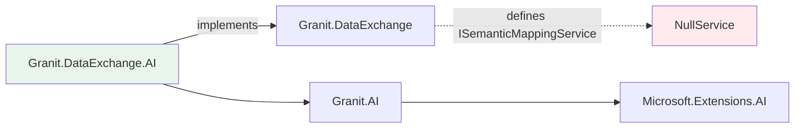

import { Tabs, TabItem } from "@astrojs/starlight/components";

The hard part of "putting AI in your app" is rarely the prompt. It's wiring an LLM
into a dozen modules without turning your code into a vendor SDK transcript, without
losing track of cost, and without failing a compliance audit. Granit treats AI as a
**provider-agnostic layer that enriches existing modules without modifying them**.
Every AI feature follows the same rule: the base module declares an extension point
with a null-object default; the `.AI` package activates the capability via DI
composition. Don't install the AI package — the module still works.

## What you can do with Granit.AI

| Capability | Module | What it does |
|------------|--------|-------------|
| **Chat & generation** | [Granit.AI](/dotnet/ai/setup/) | Workspace-managed access to `IChatClient` (OpenAI, Azure OpenAI, Anthropic, Ollama) |
| **Agentic chat** | [AI.Chat](/dotnet/ai/agentic-chat/) | Streaming, tool-using conversations — owner-scoped, attachments, @mentions, SSE |
| **Agentic tools** | [AI.Tools](/dotnet/ai/tools/) | Permission-gated tool registry + the think-call-execute loop, with built-in RAG search |
| **Prompt catalogue** | [AI.Prompts](/dotnet/ai/prompts/) | Reusable, versioned, categorised prompt templates with seeded defaults |
| **REST API** | [AI.Endpoints](/dotnet/ai/endpoints/) | Workspace CRUD, usage analytics, chat/embedding proxy with SSE |
| **Natural language query** | [QueryEngine.AI](/dotnet/ai/natural-language-query/) | Users type "unpaid invoices from last week" → structured filters |
| **Semantic search** | [AI.VectorData](/dotnet/ai/semantic-search/) | Find documents by meaning, build RAG knowledge bases |
| **Import mapping** | [DataExchange.AI](/dotnet/ai/import-mapping/) | Automatically map messy CSV/Excel columns to your entity properties |
| **Document extraction** | [AI.Extraction](/dotnet/ai/document-extraction/) | Turn a PDF invoice into a typed `InvoiceData` C# record |
| **Workflow decisions** | [Workflow.AI](/dotnet/ai/workflow-ai/) | AI recommends next transition, scores risk for auto-approval |
| **Notification content** | [Notifications.AI](/dotnet/ai/notifications-ai/) | Generate message body + route to optimal channel |
| **Timeline intelligence** | [Timeline.AI](/dotnet/ai/timeline-ai/) | Summarize audit trails, detect unusual activity patterns |
| **PII detection** | [Privacy.AI](/dotnet/ai/privacy-ai/) | Scan free-text fields for personal data (GDPR compliance) |
| **Content moderation** | [Validation.AI](/dotnet/ai/validation-ai/) | Detect toxic content, harassment, prompt injection in user input |
| **Blob classification** | [BlobStorage.AI](/dotnet/ai/blob-storage-ai/) | Tag uploaded files by category, detect PII in filenames |
| **Access anomalies** | [Authorization.AI](/dotnet/ai/authorization-ai/) | Detect suspicious access patterns in permission checks |
| **Log analysis** | [Observability.AI](/dotnet/ai/observability-ai/) | Summarize error batches, surface root cause insights |
| **Image analysis** | [Imaging.AI](/dotnet/ai/imaging-ai/) | Alt text generation, object detection, smart tagging |

## Core design principles

### 1. Provider-agnostic

Your application code depends on `IChatClient` (from Microsoft.Extensions.AI), not on
the OpenAI or Azure SDK. Swap providers per environment:

| Environment | Provider | Why |
|-------------|----------|-----|
| Development | Ollama | Free, local, no API key |
| Staging | OpenAI | Fast iteration, latest models |
| Production | Azure OpenAI | EU data residency, Managed Identity, DPA |

### 2. Soft dependency — zero coupling

AI packages reference existing modules, never the reverse:



Without the AI package installed, the module works normally. With it, AI activates.

### 3. GDPR & ISO 27001 by design

| Principle | How Granit.AI implements it |
|-----------|---------------------------|
| **Data minimization** | AI modules send only metadata to the LLM (column names, schema), never business data |
| **Audit trail** | Every AI interaction is logged (tenant, user, workspace, model, tokens, timestamp) |
| **Right to erasure** | Workspace and usage records support soft delete; vector embeddings are deletable |
| **Data residency** | Azure OpenAI for EU-only; Ollama for on-premise (data never leaves your server) |
| **Opt-in for sensitive data** | Preview rows in import mapping require explicit `IncludePreviewRows: true` |

### 4. Async-first (Wolverine)

AI calls are slow (200ms to 15s). Granit uses Wolverine for async execution:

| Use case | Execution | Why |
|----------|-----------|-----|
| Natural language query | Synchronous (~200ms) | User is waiting for search results |
| Import mapping | Synchronous (5-10s) | User is in the wizard, waiting for suggestions |
| Content moderation | Synchronous (2s, fail-open) | Must validate before persistence; timeout never blocks |
| Access anomaly detection | Synchronous (2s, fail-open) | Runs after auth check; never blocks access |
| Document extraction | **Async** (Wolverine handler) | 5-15s, client gets 202 Accepted + push notification |
| Blob classification | **Async** (Wolverine handler) | Upload should not wait for classification |
| Notification content | **Async** (Wolverine handler) | Generated after notification is queued |
| Workflow auto-approval | **Async** (Wolverine handler) | Runs on ApprovalRequested event |
| Timeline summarization | **Async** (Wolverine handler) | On-demand or scheduled, never interactive |
| PII detection (batch) | **Async** (Wolverine handler) | Scanning existing records at scale |
| Log analysis | **Async** (cron job) | Scheduled, batch analysis |
| Image analysis | **Async** (Wolverine handler) | Triggered after upload |
| Vector indexing | **Async** (Wolverine handler) | Batch operation, no user waiting |

## Quick start

The minimal setup to get AI working in your Granit application:

```csharp
// Program.cs
builder.AddGranitAI();
builder.AddGranitAIOllama();  // zero config for local dev
```

```bash
# Terminal: start Ollama
ollama pull llama3.1
ollama serve
```

Then inject `IAIChatClientFactory` in any service:

```csharp
public class MyService(IAIChatClientFactory chatFactory)
{
    public async Task<string> AskAsync(string question, CancellationToken ct)
    {
        IChatClient client = await chatFactory
            .CreateAsync(cancellationToken: ct)
            .ConfigureAwait(false);

        ChatResponse response = await client
            .GetResponseAsync(question, cancellationToken: ct)
            .ConfigureAwait(false);

        return response.Text;
    }
}
```

## Pages in this section

**User experience**

- [Agentic Chat](/dotnet/ai/agentic-chat/) — streaming, tool-using conversations with attachments and @mentions
- [AI Tools](/dotnet/ai/tools/) — the tool registry and agentic loop, with built-in RAG search
- [AI Prompts](/dotnet/ai/prompts/) — the reusable prompt-template catalogue
- [Natural Language Query](/dotnet/ai/natural-language-query/) — search with plain language
- [Semantic Search & RAG](/dotnet/ai/semantic-search/) — vector-based similarity search and knowledge bases

**Data ingestion**

- [Import Mapping](/dotnet/ai/import-mapping/) — AI-powered column mapping for CSV/Excel imports
- [Document Extraction](/dotnet/ai/document-extraction/) — structured data extraction from PDFs

**Business intelligence**

- [Workflow Decision Support](/dotnet/ai/workflow-ai/) — transition advisor and risk-based auto-approval
- [Notification Intelligence](/dotnet/ai/notifications-ai/) — AI-generated content and smart channel routing
- [Timeline Intelligence](/dotnet/ai/timeline-ai/) — audit trail summarization and anomaly detection

**Security & compliance**

- [PII Detection](/dotnet/ai/privacy-ai/) — scan text for personal data
- [Content Moderation](/dotnet/ai/validation-ai/) — detect toxic content and prompt injection
- [Blob Storage Intelligence](/dotnet/ai/blob-storage-ai/) — file classification and PII in filenames
- [Access Anomaly Detection](/dotnet/ai/authorization-ai/) — detect suspicious access patterns

**Operations**

- [Log Analysis](/dotnet/ai/observability-ai/) — batch log analysis and root cause insights
- [Image Analysis](/dotnet/ai/imaging-ai/) — alt text, object detection, smart tagging

For the core module reference (providers, workspaces, configuration), see
[Setup & Configuration](/dotnet/ai/setup/). Every feature above that returns a typed
object is built on one primitive — [Structured Completion](/dotnet/ai/structured-completion/),
the canonical, schema-enforced path for turning a prompt into a C# `T`.
