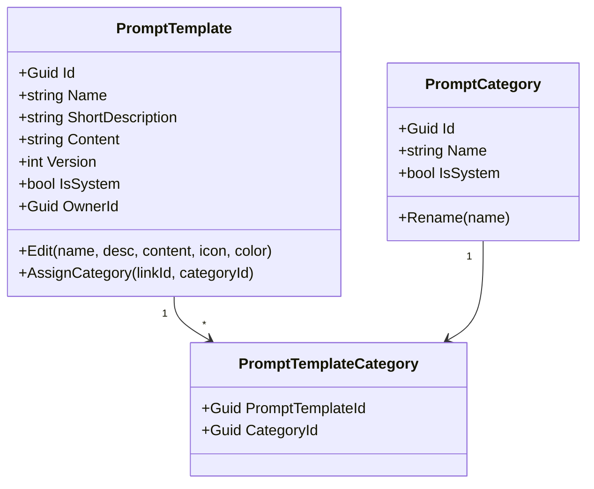

import { FileTree, Aside } from "@astrojs/starlight/components";

A good agentic answer often starts from a good prompt, and users should not have to
retype it. `Granit.AI.Prompts` is the **catalogue** the chat UI draws from: a library of
reusable, categorised prompt templates — "Summarize this", "Draft a reply", "Daily brief" —
that the framework seeds with sensible defaults and that users extend with their own. A
user picks a template in the [chat](/dotnet/ai/agentic-chat/) composer; its instruction
text is expanded into the turn.

<Aside type="note" title="Available from Granit 1.0">
The prompt catalogue is part of [ADR-067](/dotnet/architecture/adr/067-agentic-chat-tool-registry-prompt-catalog/).
</Aside>

## The package family

<FileTree>

- Granit.AI.Prompts **core — templates, categories, stores, seeding**
- Granit.AI.Prompts.Endpoints **REST catalogue + picker**
- Granit.AI.Prompts.EntityFrameworkCore **persistence + per-tenant seeding**
- Granit.AI.Prompts.Privacy **GDPR export + erasure of user-authored prompts**

</FileTree>

## The domain model

Two aggregates and a join entity. A `PromptTemplate` is either **system** (framework-seeded,
read-only, owned by no user) or **user-owned** (private, editable). Templates are
many-to-many with tenant-defined `PromptCategory` rows.



A template carries display metadata (`Icon`, `IconColor` as a validated `#RRGGBB[AA]`
`HexColor`) and a monotonically increasing `Version` — every `Edit()` bumps it, so a
client can detect a stale copy. Content is capped at 20 000 characters, the name at 200.

Persistence is an **isolated**, tenant-aware `AIPromptsDbContext` (table prefix
`ai_prompts_`): `ai_prompts_templates`, `ai_prompts_categories`, and the
`ai_prompts_template_categories` join (unique on `(PromptTemplateId, CategoryId)`).
Three seams sit on top — `IPromptTemplateStore` and `IPromptCategoryStore` (caller-scoped
reads: system prompts **plus** the caller's own), and `IPromptTemplateDataManager` for the
privacy module's owner-wide operations.

## Setup

```csharp
builder.Services.AddGranitAIPromptsEntityFrameworkCore(
    shared => shared.UseNpgsql(connectionString));

builder.Services.AddGranitPrivacy()
    .AddGranitAIPromptsPrivacyProvider();   // optional — GDPR participation
```

```csharp
app.MapGranitPrompts();   // REST catalogue under /prompts
```

The EF Core module also registers a per-tenant `PromptDataSeedContributor` that runs at
database initialization — see [Seeded prompts](#framework-seeded-prompts).

## REST endpoints

`MapGranitPrompts()` maps the catalogue under `/prompts` (configurable via
`AIPromptsEndpointsOptions`). Reads return system prompts plus the caller's own.

| Method | Path | Permission | Purpose |
|--------|------|------------|---------|
| `GET` | `/` | `AIPrompts.Templates.Read` | List the catalogue (summaries, system-first then by name) |
| `GET` | `/picker` | `AIPrompts.Templates.Read` | Catalogue grouped by category for the chat picker |
| `GET` | `/{id}` | `AIPrompts.Templates.Read` | One template, with full instruction text |
| `POST` | `/` | `AIPrompts.Templates.Manage` | Create a private template |
| `PUT` | `/{id}` | `AIPrompts.Templates.Manage` | Edit a template and bump its version |
| `POST` | `/{id}/customise` | `AIPrompts.Templates.Manage` | Copy a **system** template into an editable user-owned one |
| `DELETE` | `/{id}` | `AIPrompts.Templates.Delete` | Delete a user-owned template (system templates forbidden) |

`CreatePromptRequest` / `UpdatePromptRequest` share a shape (`Name`, `Content`,
`ShortDescription?`, `Icon?`, `IconColor?`, `CategoryIds?`); the validators enforce name
≤ 200, content ≤ 20 000, description ≤ 500, a valid hex colour, and ≤ 10 categories. A
request naming a non-existent category returns `422`.

### Copy-on-customise

System templates cannot be edited — that keeps the framework defaults stable across
upgrades. To tweak one, the client calls `POST /{id}/customise`, which clones the system
template (resolving its localized name/description and category links) into a fresh
user-owned template the caller then owns and can edit freely. Customising anything that is
not a system template returns `409`.

## Framework-seeded prompts

Four agentic templates ship in every tenant, seeded into the well-known **General**
category. They are written for the [tool loop](/dotnet/ai/tools/) — each instructs the
model to retrieve data via tools rather than wait for the user — and follow a
role · context · instructions · constraints · output structure.

| Prompt | Icon | Purpose |
|--------|------|---------|
| **Summarize** | sparkles | Synthesize referenced items into a TL;DR + key takeaways |
| **Draft** | pencil | Produce a structured, fact-checked written response |
| **Daily brief** | sun | Assemble today's schedule, participants, and recent activity |
| **Find related** | link | Surface and rank items related to the current context |

Seeding is **idempotent** and matched by a stable name key: a system prompt is created when
missing, version-bumped only when its framework definition changes, and **never** touches a
user's own copy. System prompt names and descriptions are localization keys, resolved per
request culture; user prompts store raw text.

## Admin & data exchange

Both aggregates expose a [query definition](/dotnet/building-blocks/query-engine/) and an
[export definition](/dotnet/ai/import-mapping/), so prompts and categories appear in the
admin grid (filter, sort, global search by name) and in the data-exchange surface without
extra wiring — `Granit.AI.Prompts.TemplatesQuery` and `Granit.AI.Prompts.CategoriesQuery`.

## Privacy

`AddGranitAIPromptsPrivacyProvider()` registers the `ai-prompts` provider in the GDPR
scatter-gather pipeline. On a data-export request it emits the user's **own** templates
(full instruction text, for audit); on an erasure request it **hard-deletes** them via
`IPromptTemplateDataManager.EraseOwnerAsync` — soft delete would leave authored content
recoverable. Framework-seeded system prompts are not personal data and are never exported
or deleted.

## See also

- [Agentic Chat](/dotnet/ai/agentic-chat/) — where a user picks a template per turn
- [AI Tools](/dotnet/ai/tools/) — the tool loop the seeded prompts are written for
- [Setup & Configuration](/dotnet/ai/setup/) — providers, workspaces, capability flags
- [ADR-067](/dotnet/architecture/adr/067-agentic-chat-tool-registry-prompt-catalog/) — conversation model, tool registry, prompt catalogue
