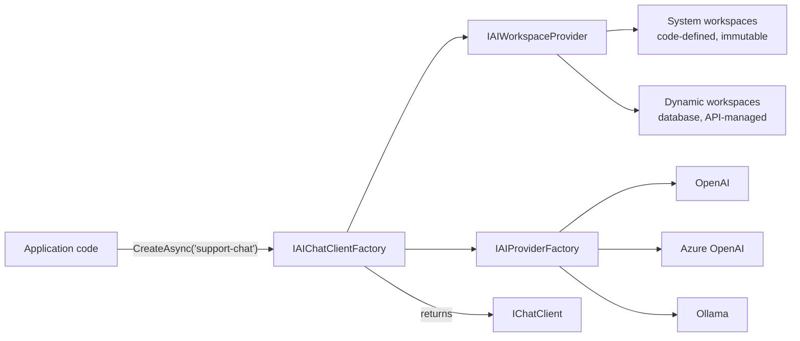

import { Tabs, TabItem, FileTree, Aside } from "@astrojs/starlight/components";

LLM features look easy in a prototype and turn ugly in production. You start with one
SDK. You add a second one for the EU region. The bill explodes because nothing tracks
tokens. A compliance auditor asks who called which model with what data — and no one
can answer. A vendor changes its pricing and you discover the integration is wired into
every service.

**Granit.AI** solves the production problem, not the prototype problem. Your application
code depends on `IChatClient` from `Microsoft.Extensions.AI` — never on an OpenAI or
Azure SDK. Providers swap per environment. Workspaces are named, multi-tenant, and
permission-scoped. Every call is metered. Every API key lives in a vault. Every model
swap is a one-line config change.

## What you get

| Pain | Granit.AI's answer |
|------|--------------------|
| Vendor lock-in | `IChatClient` abstraction — swap OpenAI ↔ Azure ↔ Ollama with one config setting |
| Hardcoded model parameters scattered across services | **Workspaces** — named configs (`document-extraction`, `support-chat`) bind provider, model, prompt, temperature |
| API keys in `appsettings.json` | First-class Vault integration with rotation |
| Untraceable LLM costs | Every call recorded with tenant, user, tokens, duration, estimated cost |
| Auditor: _"who asked the LLM about patient X?"_ | ISO 27001 audit trail with tenant + user + workspace + model on every interaction |
| No way to cap a runaway tenant | Per-tenant hourly quota with Skip/Reject behaviour |
| Prompt injection | `PromptBuilder` separates instructions from user data with sanitization + delimiters |

## Why Microsoft.Extensions.AI

`Microsoft.Extensions.AI` (Microsoft's official .NET 10 AI abstraction) is the standard
your code should depend on. It gives you the same middleware pipeline as
`Microsoft.Extensions.Logging`: logging, caching, OpenTelemetry, function calling — all
provider-agnostic.

| Approach | Pros | Cons |
|----------|------|------|
| Direct SDK (`OpenAI`, `Anthropic.SDK`…) | Full API access | Vendor lock-in, no middleware, each module reimplements integration |
| Custom abstraction (`ITextGenerationService`) | Full control | Isolated from .NET ecosystem, reinvents the wheel |
| **`Microsoft.Extensions.AI`** ✓ | .NET 10 standard, ~100 compatible packages, middleware pipeline | Newer API surface |

Granit.AI builds **on top** of it — adding the operational layer (workspaces, persistence,
tenancy, audit, quota, cost) that the abstraction alone doesn't provide.

## Package structure

<FileTree>

- Granit.AI/ Core abstractions, workspace + capability resolver, factories, quota guard
  - Granit.AI.OpenAI OpenAI provider (GPT-4o, o3/o4-mini, embeddings) + dynamic model catalog
  - Granit.AI.AzureOpenAI Azure OpenAI with `DefaultAzureCredential` + deployment catalog
  - Granit.AI.Anthropic Anthropic provider (Claude Opus/Sonnet/Haiku), chat completion only — no embeddings
  - Granit.AI.Ollama Local models via OllamaSharp (dev, on-premise, GDPR strict)
  - Granit.AI.EntityFrameworkCore Isolated DbContext for workspaces and usage records
  - Granit.AI.Extraction Structured document extraction (PDF → typed C# record)
  - Granit.AI.VectorData Multi-tenant vector storage for semantic search (RAG)
  - Granit.AI.Mcp Server-side MCP tool sources for AI agents
  - Granit.AI.Endpoints REST API: workspaces, provider discovery, usage query, chat & embedding proxy
- Granit.DataExchange.AI AI-powered column mapping for CSV/Excel import
- Granit.QueryEngine.AI Natural Language Query — phrases to structured filters

</FileTree>

| Package | Role | Depends on |
|---------|------|------------|
| `Granit.AI` | `IAIChatClientFactory`, `IAIWorkspaceManager`, `IAIQuotaGuard`, usage tracking | `Granit` |
| `Granit.AI.OpenAI` | OpenAI provider + `IAIModelCatalog` (live `/v1/models` listing) | `Granit.AI` |
| `Granit.AI.AzureOpenAI` | Azure OpenAI with API key or Managed Identity | `Granit.AI` |
| `Granit.AI.Anthropic` | Anthropic (Claude) provider, chat-only | `Granit.AI` |
| `Granit.AI.Ollama` | Local models, `/api/show` capability resolution, health check | `Granit.AI` |
| `Granit.AI.EntityFrameworkCore` | `AIDbContext`, `EfAIWorkspaceStore`, `EfAIUsageStore` | `Granit.AI`, `Granit.Persistence` |
| `Granit.AI.Endpoints` | Workspace CRUD, provider discovery, usage query, chat/embedding proxy | `Granit.AI`, `Granit.Authorization`, `Granit.QueryEngine.AspNetCore` |
| `Granit.AI.Extraction` | `IDocumentExtractor<T>` — structured output from documents | `Granit.AI` |
| `Granit.AI.VectorData` | `IVectorCollection<T>`, `ISemanticSearchService` for RAG | `Granit.AI` |
| `Granit.AI.Mcp` | `IMcpToolSourceProvider` — Model Context Protocol tools | `Granit.AI` |
| `Granit.DataExchange.AI` | `ISemanticMappingService` for import mapping | `Granit.AI`, `Granit.DataExchange` |
| `Granit.QueryEngine.AI` | `INaturalLanguageQueryTranslator` (NLQ → `QueryRequest`) | `Granit.AI`, `Granit.QueryEngine` |

## Pick your provider

Four providers ship in-box. They share the same `IAIProviderFactory` contract — pick
based on what the deployment environment requires, not on what your code expects.

| Provider | Best for | Auth | Model catalog |
|----------|----------|------|---------------|
| **Ollama** | Dev laptops, on-premise, strict GDPR (data never leaves) | None | Live via `GET /api/tags` (30s cache); capabilities from `/api/show` |
| **OpenAI** | Cloud SaaS, fast iteration, frontier models | API key | Live via `GET /v1/models`, enriched with known capabilities |
| **Azure OpenAI** | EU data residency, HDS, enterprise compliance | API key or Managed Identity | Configured deployments |
| **Anthropic** | Claude Opus/Sonnet/Haiku, extended thinking | API key | Static (no catalog API) |

<Aside type="note">
Mistral and other providers compatible with `Microsoft.Extensions.AI` can be plugged
in by implementing `IAIProviderFactory` (and optionally `IAIModelCatalog`). Only the
four above ship as first-party packages.
</Aside>

## Setup

<Tabs>
<TabItem label="Ollama (dev)">

```csharp
[DependsOn(typeof(GranitAIOllamaModule))]
public class AppModule : GranitModule;
```

```csharp
builder.AddGranitAI();
builder.AddGranitAIOllama();
```

No configuration needed — connects to `http://localhost:11434` with `llama3.1` by default.

```bash
# Start Ollama and pull the default model
ollama pull llama3.1
ollama serve
```

</TabItem>
<TabItem label="OpenAI">

```csharp
[DependsOn(typeof(GranitAIOpenAIModule))]
public class AppModule : GranitModule;
```

```csharp
builder.AddGranitAI();
builder.AddGranitAIOpenAI();
```

```json
{
  "AI": {
    "OpenAI": {
      "ApiKey": "<from-vault>",
      "DefaultModel": "gpt-4o",
      "DefaultEmbeddingModel": "text-embedding-3-small"
    }
  }
}
```

</TabItem>
<TabItem label="Azure OpenAI">

```csharp
[DependsOn(typeof(GranitAIAzureOpenAIModule))]
public class AppModule : GranitModule;
```

```csharp
builder.AddGranitAI();
builder.AddGranitAIAzureOpenAI();
```

```json
{
  "AI": {
    "AzureOpenAI": {
      "Endpoint": "https://my-resource.openai.azure.com",
      "DefaultDeployment": "gpt-4o",
      "DefaultEmbeddingDeployment": "text-embedding-3-small"
    }
  }
}
```

Leave `ApiKey` empty in production — `DefaultAzureCredential` (Managed Identity) is used
automatically. Zero secrets to rotate, zero secrets to leak.

</TabItem>
<TabItem label="Anthropic">

```csharp
[DependsOn(typeof(GranitAIAnthropicModule))]
public class AppModule : GranitModule;
```

```csharp
builder.AddGranitAI();
builder.AddGranitAIAnthropic();
```

```json
{
  "AI": {
    "Anthropic": {
      "ApiKey": "<from-vault>",
      "DefaultModel": "claude-sonnet-4-6"
    }
  }
}
```

Chat completion only — Anthropic does not provide an embedding API. For embeddings,
pair Anthropic for chat with OpenAI/Ollama for embeddings via a second workspace.

</TabItem>
</Tabs>

### Adding persistence

For production, add `Granit.AI.EntityFrameworkCore` to persist workspaces and track usage:

```csharp
[DependsOn(
    typeof(GranitAIOllamaModule),  // or any provider
    typeof(GranitAIEntityFrameworkCoreModule))]
public class AppModule : GranitModule;
```

```csharp
builder.AddGranitAI();
builder.AddGranitAIOllama();
builder.AddGranitAIEntityFrameworkCore(options =>
    options.UseNpgsql(builder.Configuration.GetConnectionString("AI")));
```

Without this package, Granit.AI runs with null implementations: workspaces are
code-only, usage records are discarded, the API still works. Add it the day you
need persistence — no code change, just a module reference.

<Aside type="caution">
Never store API keys in `appsettings.json` for production. Inject credentials from
[Granit.Vault](/dotnet/data/vault/) with dynamic rotation. Azure OpenAI? Use Managed
Identity and stop thinking about secrets entirely.
</Aside>

## Workspaces — the unit of configuration

A workspace is a named AI configuration: which provider, which model, which prompt,
which sampling parameters. Application code asks for a workspace by name. The factory
returns a configured `IChatClient`. The day you swap OpenAI for Azure, you change the
workspace — not the calling code.



### System workspaces (code-defined)

Declare workspaces that should not drift between environments — extraction pipelines,
internal classifiers, anything where a runtime change would be a defect:

```csharp
public class AppWorkspaceDefinitionProvider : IAIWorkspaceDefinitionProvider
{
    public void Define(IAIWorkspaceDefinitionContext context)
    {
        context.Add(new AIWorkspace
        {
            Name = "document-extraction",
            Provider = "AzureOpenAI",
            Model = "gpt-4o",
            SystemPrompt = "Extract structured data from documents. Return valid JSON only.",
            Temperature = 0.0f,
            MaxOutputTokens = 4096,
        });

        context.Add(new AIWorkspace
        {
            Name = "invoice-summary",
            Provider = "OpenAI",
            Model = "gpt-4o-mini",
            SystemPrompt = "Summarize invoices in three bullet points.",
            Temperature = 0.3f,
        });
    }
}
```

System workspaces take precedence over dynamic workspaces with the same name. The API
rejects modifications and deletions on system workspaces with **`422 Unprocessable
Entity`**.

### Dynamic workspaces (database-managed)

For per-tenant customization or runtime tuning, dynamic workspaces are persisted via
`Granit.AI.EntityFrameworkCore` and mutated through `IAIWorkspaceManager` — which
centralizes invariants (Dynamic-only guard, duplicate-name check):

```csharp
public class TenantOnboardingService(IAIWorkspaceManager workspaceManager)
{
    public async Task OnboardAsync(Tenant tenant, CancellationToken ct)
    {
        await workspaceManager.CreateAsync(new AIWorkspace
        {
            Name = $"tenant-{tenant.Slug}-chat",
            Provider = "AzureOpenAI",
            Model = "gpt-4o",
            SystemPrompt = tenant.SupportPersona,
            Temperature = 0.7f,
        }, ct).ConfigureAwait(false);
    }
}
```

Duplicate names are caught at the database level (unique constraint, `409 Conflict`).
Deactivating a workspace via `Activated = false` keeps it visible in the admin API but
prevents execution — chat and embedding factories throw
`AIWorkspaceNotActiveException` (`422`).

## Using AI in your modules

### Chat completion

```csharp
public class InvoiceSummaryService(IAIChatClientFactory chatClientFactory)
{
    public async Task<string> SummarizeAsync(Invoice invoice, CancellationToken ct)
    {
        IChatClient client = await chatClientFactory
            .CreateAsync("invoice-summary", ct)
            .ConfigureAwait(false);

        ChatResponse response = await client.GetResponseAsync(
            $"Summarize this invoice in 3 bullet points: {invoice.Description}",
            cancellationToken: ct)
            .ConfigureAwait(false);

        return response.Text;
    }
}
```

### Embedding generation

```csharp
public class PatientSearchService(IAIEmbeddingGeneratorFactory embeddingFactory)
{
    public async Task<Embedding<float>> EmbedAsync(string query, CancellationToken ct)
    {
        IEmbeddingGenerator<string, Embedding<float>> generator =
            await embeddingFactory.CreateAsync("embeddings", ct).ConfigureAwait(false);

        return await generator
            .GenerateEmbeddingAsync(query, cancellationToken: ct)
            .ConfigureAwait(false);
    }
}
```

### Graceful degradation

- No provider registered → `AIProviderNotRegisteredException` with a message naming
  the missing package.
- No persistence adapter → null stores; workspaces come from code definitions and
  usage records are discarded.
- Workspace deactivated → `AIWorkspaceNotActiveException` on execution (`422`).
- Quota exceeded → either skipped (returns no enrichment) or rejected, depending on
  `AIQuotaOptions.ExceededBehavior`.

## Model capabilities

Not every model can do every job. `gpt-4o` does vision, `text-embedding-3` does only
embeddings, `llama3.1:8b` doesn't do tool calling. `Granit.AI` resolves capabilities
from the provider's catalog at runtime and surfaces them on every workspace response —
so the frontend can show "Upload image" only when the model supports it.

| Capability | Type | Default |
|------------|------|---------|
| `Chat` | bool | `true` |
| `Embeddings` | bool | `false` |
| `Vision` | bool | `false` |
| `ImageGeneration` | bool | `false` |
| `Audio` | bool | `false` |
| `ToolUse` | bool | `false` |
| `Streaming` | bool | `true` |
| `StructuredOutput` | bool | `false` |
| `Extensions` | `IReadOnlySet<string>` | empty |

`Extensions` covers provider-specific features (web search, code interpreter, file
upload, citations…). Use `WellKnownAICapabilities` constants for portable lookups.

Ollama queries `/api/show` per model and maps `completion`, `embedding`, `vision`,
`tools` into the typed properties. OpenAI enriches its live `/v1/models` listing with
known capabilities. Azure OpenAI inspects configured deployments.

## Usage tracking and cost monitoring

Every `IChatClient` call is tracked when `GranitAIOptions.EnableUsageTracking` is `true`
(default). The `AIUsageRecord` captures:

| Field | Description |
|-------|-------------|
| `TenantId` | Tenant that made the request |
| `UserId` | User who triggered the AI call |
| `WorkspaceName` | Workspace used |
| `Provider` / `Model` | Provider and model identifier |
| `InputTokens` / `OutputTokens` | Token consumption |
| `EstimatedCost` / `CostCurrency` | Cost estimate and ISO 4217 currency code |
| `Duration` | Response time |
| `Timestamp` | When the interaction occurred (UTC) |

Streaming completions track usage at the end of the stream (Microsoft.Extensions.AI
emits a `UsageContent` final chunk). Records are persisted by
`Granit.AI.EntityFrameworkCore` and queryable through
[`GET /ai/usage`](/dotnet/ai/endpoints/) for billing dashboards, cost alerts, and
showback per tenant.

## Quotas — fail safe before it costs you money

A runaway tenant or a buggy loop can run up four-figure bills in an hour. `AIQuotaOptions`
caps requests per tenant per rolling hour. When the limit is hit, AI calls either:

- **Skip** (default) — the call returns a default result; the host operation
  (e.g. blob classification) succeeds without AI enrichment.
- **Reject** — the call throws, surfacing as `429 Too Many Requests`. Use for
  strict enforcement.

```json
{
  "AI": {
    "Quota": {
      "MaxRequestsPerTenantPerHour": 500,
      "ExceededBehavior": "Skip"
    }
  }
}
```

Set `MaxRequestsPerTenantPerHour: 0` (default) for unlimited.

## AI-powered modules

Each AI integration has its own page with examples, architecture diagrams, risk
analysis, and GDPR considerations:

| Module | Pain it solves | Page |
|--------|----------------|------|
| **DataExchange.AI** | Cryptic CSV columns like `Nom_Clt_V2_Final` | [AI: Import Mapping](/dotnet/ai/import-mapping/) |
| **AI.Extraction** | "Re-keying every invoice PDF wastes hours" | [AI: Document Extraction](/dotnet/ai/document-extraction/) |
| **QueryEngine.AI** | Users don't know how to build filters | [AI: Natural Language Query](/dotnet/ai/natural-language-query/) |
| **AI.VectorData** | Keyword search misses synonyms and intent | [AI: Semantic Search & RAG](/dotnet/ai/semantic-search/) |

### Soft dependency pattern

Every AI integration follows the same pattern — the existing module declares an
interface with a null-object default; the `.AI` package replaces it via DI:

```text
Granit.{Module}              → defines IService + NullService (no-op default)
                                no reference to AI

Granit.{Module}.AI           → implements AIService
  references Granit.{Module}    replaces via DI
  references Granit.AI
```

Without the AI package, the feature is silently skipped. With it, it activates. No
`if` statements, no feature flags — just DI composition.

## Configuration reference

### `GranitAIOptions` (section: `AI`)

| Property | Type | Default | Description |
|----------|------|---------|-------------|
| `DefaultWorkspace` | `string` | `"default"` | Workspace used when none is specified |
| `EnableUsageTracking` | `bool` | `true` | Track token consumption and cost |
| `EnableAuditTrail` | `bool` | `true` | Log every AI interaction (ISO 27001) |

### `AIQuotaOptions` (section: `AI:Quota`)

| Property | Type | Default | Description |
|----------|------|---------|-------------|
| `MaxRequestsPerTenantPerHour` | `int` | `0` | Per-tenant hourly quota; `0` = unlimited |
| `ExceededBehavior` | `enum` | `Skip` | `Skip` (graceful no-op) or `Reject` (`429`) |

### `OpenAIProviderOptions` (section: `AI:OpenAI`)

| Property | Type | Default | Description |
|----------|------|---------|-------------|
| `ApiKey` | `string` | — | Required. Inject from Vault |
| `Endpoint` | `string?` | `null` | Custom base URL (OpenAI-compatible proxies) |
| `DefaultModel` | `string` | `"gpt-4o"` | Fallback chat model |
| `DefaultEmbeddingModel` | `string` | `"text-embedding-3-small"` | Fallback embedding model |

### `AzureOpenAIProviderOptions` (section: `AI:AzureOpenAI`)

| Property | Type | Default | Description |
|----------|------|---------|-------------|
| `Endpoint` | `string` | — | Required. HTTPS URI of the Azure resource |
| `ApiKey` | `string?` | `null` | Leave empty in production → Managed Identity |
| `DefaultDeployment` | `string` | `"gpt-4o"` | Fallback deployment name |
| `DefaultEmbeddingDeployment` | `string` | `"text-embedding-3-small"` | Fallback embedding deployment |

### `OllamaProviderOptions` (section: `AI:Ollama`)

| Property | Type | Default | Description |
|----------|------|---------|-------------|
| `Endpoint` | `string` | `"http://localhost:11434"` | Ollama server URL |
| `DefaultModel` | `string` | `"llama3.1"` | Fallback model |

### `DataExchangeAIOptions` (section: `AI:DataExchange`)

| Property | Type | Default | Description |
|----------|------|---------|-------------|
| `WorkspaceName` | `string` | `"default"` | AI workspace for mapping suggestions |
| `TimeoutSeconds` | `int` | `10` | LLM call timeout |
| `MinConfidenceScore` | `double` | `0.6` | Minimum score to accept a suggestion |
| `IncludePreviewRows` | `bool` | `false` | Include sample data rows in prompt (GDPR opt-in) |
| `PreviewRowCount` | `int` | `5` | Number of preview rows when enabled |

### `ExtractionOptions` (section: `AI:Extraction`)

| Property | Type | Default | Description |
|----------|------|---------|-------------|
| `WorkspaceName` | `string` | `"default"` | AI workspace for extraction |
| `ReviewThreshold` | `double` | `0.7` | Below this confidence → `NeedsReview` status |
| `TimeoutSeconds` | `int` | `30` | Extraction timeout (OCR + LLM) |

### `QueryEngineAIOptions` (section: `AI:QueryEngine`)

| Property | Type | Default | Description |
|----------|------|---------|-------------|
| `WorkspaceName` | `string` | `"default"` | AI workspace for NLQ translation |
| `TimeoutSeconds` | `int` | `5` | NLQ should be fast — short timeout |

### `VectorDataOptions` (section: `AI:VectorData`)

| Property | Type | Default | Description |
|----------|------|---------|-------------|
| `EmbeddingWorkspace` | `string` | `"default"` | Workspace for embedding generation |
| `DefaultSearchLimit` | `int` | `10` | Default number of results |

## Compliance

### GDPR

- **Data minimization** — workspaces control what reaches the LLM via system prompts;
  no business data is sent without an explicit `IncludePreviewRows` opt-in.
- **Right to erasure** — workspace and usage records support soft delete; vector
  embeddings are deletable per tenant.
- **Data residency** — Azure OpenAI supports EU-only deployments; Ollama keeps every
  byte on-premise.
- **PII protection** — usage records store identifiers (tenant, user, workspace),
  never conversation content.

### ISO 27001

- **Audit trail** — every AI interaction is recorded with tenant, user, workspace,
  model, tokens, and timestamp.
- **Immutable records** — `AIUsageRecord` is `CreationAuditedEntity`; no update/delete
  surface.
- **Audited mutations** — workspace changes write `AuditedEntity` (`CreatedAt/By`,
  `ModifiedAt/By`).

## Database schema

When `Granit.AI.EntityFrameworkCore` is registered, two tables ship:

| Table | Entity | Purpose |
|-------|--------|---------|
| `ai_workspaces` | `AIWorkspaceEntity` | Dynamic workspace configurations (soft-deletable, audited) |
| `ai_usage_records` | `AIUsageRecordEntity` | Token consumption and cost tracking (immutable) |

Key indexes:

- `uq_ai_workspaces_tenant_name` — unique workspace name per tenant (enforces the
  `409 Conflict` on create at the DB level, not just at the manager level)
- `ix_ai_usage_records_tenant_workspace_date` — billing queries by workspace and period
- `ix_ai_usage_records_tenant_provider_model` — cost aggregation by provider/model

## PromptBuilder — defense against prompt injection

All AI integration modules use `PromptBuilder` to separate system instructions from
user-controlled data. This mitigates **OWASP LLM01 (Prompt Injection)** by wrapping
user input in structured `<data>` delimiters with sanitization:

```csharp
var pb = new PromptBuilder(maxInputLength: 50_000);

// Developer-controlled instructions (not sanitized)
pb.AppendInstruction("Analyze the following text for PII.");
pb.AppendInstruction("Return ONLY valid JSON.");

// User-controlled data (sanitized + truncated + delimited)
pb.AppendUserData("User ID", userId);
pb.AppendUserTextBlock("Document", documentText);

string prompt = pb.Build();
```

**Output:**

```text
Analyze the following text for PII.
Return ONLY valid JSON.
User ID: <data>user-123</data>
Document
<data>
The actual document text goes here, sanitized...
</data>
```

### Available methods

| Method | Use for |
|--------|---------|
| `AppendInstruction(text)` | System instructions (developer-controlled, not sanitized) |
| `AppendUserData(label, value)` | Short user values wrapped in `<data>` |
| `AppendUserTextBlock(label, text)` | Long text blocks wrapped in `<data>` |
| `AppendUserDataJson(label, value)` | JSON-encoded values (prevents structural breakout) |
| `AppendUserDataMap(label, pairs)` | Key-value maps in a `<data>` block |

### Protections

1. **Delimiter isolation** — user data in `<data>` blocks, instructions outside.
2. **Control-character stripping** — Unicode control characters, zero-width chars,
   and bidirectional overrides are stripped to defeat obfuscation-based injection.
3. **Tag neutralization** — XML/HTML-like tags in user input are stripped to prevent
   delimiter spoofing (`<data>`, `<system>`, `<tool>`, …).
4. **Length truncation** — configurable `maxInputLength` prevents denial-of-wallet.

:::tip
Use `PromptBuilder` in **all** code that sends user-controlled data to an LLM. All
built-in Granit AI modules already use it. If you build custom AI features, import
`Granit.AI.PromptBuilder` and follow the same pattern.
:::

## See also

- [AI: Endpoints](/dotnet/ai/endpoints/) — REST API, provider discovery, chat & embedding proxy
- [Data Exchange](/dotnet/building-blocks/data-exchange/) — import/export module where AI mapping plugs in
- [QueryEngine](/dotnet/building-blocks/query-engine/) — query engine where NLQ translates natural language
- [Persistence](/dotnet/data/persistence/) — isolated DbContext pattern, `ApplyGranitConventions`
- [Vault & Encryption](/dotnet/data/vault/) — secure API key storage with rotation
- [Observability](/dotnet/core/observability/) — OpenTelemetry integration for AI call tracing
- [Multi-tenancy](/dotnet/infrastructure/multi-tenancy/) — tenant-scoped workspace isolation
