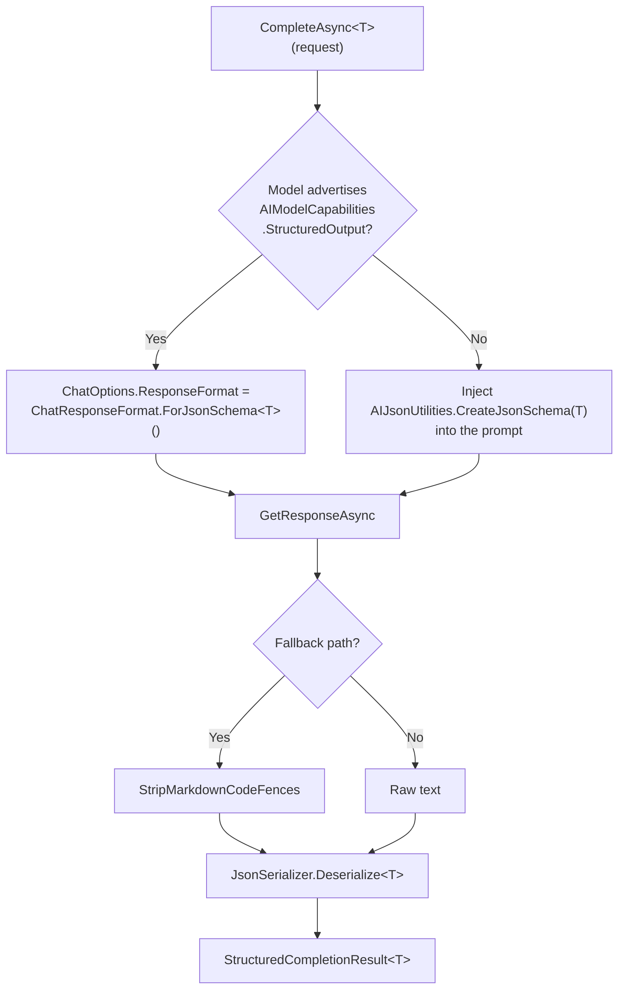

import { Tabs, TabItem } from "@astrojs/starlight/components";

Most "AI feature" code is not the prompt — it is the plumbing around it: send the
prompt, hope the model returns JSON, strip the Markdown fences it wrapped anyway,
deserialize, guess whether an empty answer was a refusal or a crash, and make sure a
parse error never logs the user's data. `IStructuredCompletion` is the framework
primitive that owns all of that, once, so every `.AI` module turns a prompt into a
typed `T` the same safe way.

It lives in **`Granit.AI`** and is the canonical path for typed output (ADR-064). Every
module that produces a structured object — translation suggestions, query filters,
moderation verdicts, document extraction — calls it instead of reaching for
`IChatClient.GetResponseAsync()` + a hand-rolled `JsonSerializer.Deserialize<T>()`.

## The interface

One injected service serves every result type — the generic is **per call**, not per
interface, so there is a single DI registration:

```csharp
namespace Granit.AI;

public interface IStructuredCompletion
{
    Task<StructuredCompletionResult<T>> CompleteAsync<T>(
        StructuredCompletionRequest request,
        CancellationToken cancellationToken = default)
        where T : class;
}
```

`AddGranitAI()` registers it (scoped). Inject it directly:

```csharp
public sealed class SeoMetadataGenerator(IStructuredCompletion completion)
{
    public async Task<SeoExtraction?> SuggestAsync(string pageBody, CancellationToken ct)
    {
        var request = new StructuredCompletionRequest
        {
            Instruction = "Generate SEO title, description, and keywords for the page.",
            Content = pageBody,
            ContentLabel = "Page body",
        };

        StructuredCompletionResult<SeoExtraction> result = await completion
            .CompleteAsync<SeoExtraction>(request, ct)
            .ConfigureAwait(false);

        return result.Status == StructuredCompletionStatus.Succeeded ? result.Value : null;
    }
}
```

## The request

`StructuredCompletionRequest` separates what the developer controls from what the user
controls — the framework's first line of defence against prompt injection
(OWASP LLM01):

| Member | Trust | Role |
|--------|-------|------|
| `Instruction` | **Developer** | The task prompt (e.g. a per-locale generation instruction). **Never sanitized** — appended verbatim. Supply only code- or template-controlled text. |
| `Content` | **Untrusted** | The text to analyze, or `null` for an attachment-only request. Sanitized and wrapped in a `<data>` block by the primitive before it reaches the model. |
| `ContentLabel` | Developer | Label for the `<data>` block (defaults to `"Document"`). |
| `Context` | **Untrusted** | Additional named sections (title, locale, source culture…). Each key is a developer label; each value is sanitized and delimited. |
| `Attachments` | **Trusted by caller** | Optional `IReadOnlyList<DataContent>` (Microsoft.Extensions.AI) of binary parts — images for a vision-capable model — appended to the user message *after* the prompt. Not routed through the `<data>` envelope, so the **caller owns size caps and provenance** (`Granit.Imaging.AI`, for example, enforces `MaxImageBytes` and a content-type allowlist). The type is pinned to `DataContent` so untrusted text can never be smuggled in as a raw message part. |
| `WorkspaceName` | Developer | Which AI workspace to run against. `null` uses the configured default. |

At least one of `Content` or `Attachments` must be supplied — a request with neither
throws `ArgumentException`. `Content` and `Attachments` compose: a request can carry
sanitized text *and* an image in the same call.

:::caution[Never route untrusted input through `Instruction`]
`Instruction` is appended to the prompt without sanitization. Putting user-supplied
text there defeats the `<data>`-block isolation applied to `Content` and reopens the
injection surface. Untrusted text always goes in `Content` (or `Context`).
:::

### Multimodal: typed output from an image

Set `Content` to `null` and pass the image bytes as an attachment to get a typed
result from a vision-capable model — the same schema-enforced path, no manual JSON.
This is how `Granit.Imaging.AI` turns a picture into a typed `ImageAnalysis`:

```csharp
var request = new StructuredCompletionRequest
{
    Instruction = "Describe the image, list detected objects, and suggest alt text.",
    Content = null,                                    // image-only — no text to analyze
    Attachments = [new DataContent(imageBytes, contentType)],  // "image/jpeg", "image/png", …
    WorkspaceName = "vision",
};

StructuredCompletionResult<ImageAnalysis> result = await completion
    .CompleteAsync<ImageAnalysis>(request, ct)
    .ConfigureAwait(false);
```

`DataContent` is trusted by the caller — enforce a size cap and a content-type
allowlist *before* building the request. `Granit.Imaging.AI` does exactly this (see
[Image Analysis](/dotnet/ai/imaging-ai/)).

## The result and its four-valued status

`StructuredCompletionResult<T>` carries the typed value plus the provenance a caller
needs to react — and to score, without re-issuing the call:

```csharp
public sealed record StructuredCompletionResult<T> where T : class
{
    public required StructuredCompletionStatus Status { get; init; }
    public T? Value { get; init; }                                  // non-null only on Succeeded
    public string? ModelId { get; init; }                           // provider-reported, for audit
    public string? ErrorMessage { get; init; }                      // always PII-safe
    public ChatFinishReason? FinishReason { get; init; }            // why the model stopped
    public IReadOnlyDictionary<string, object?>? Metadata { get; init; } // provider AdditionalProperties
    public UsageDetails? Usage { get; init; }                       // token usage, when reported
}
```

The status is **deliberately four-valued** — a single success/failure boolean cannot
drive a consumer's own status mapping:

| `StructuredCompletionStatus` | Meaning | Typical caller reaction |
|------------------------------|---------|-------------------------|
| `Succeeded` | Typed value present | Use `Value`. |
| `ModelRefused` | Model declined, returned empty, or hit a safety filter | No suggestion — fall back to a default, never an error. |
| `SchemaViolation` | Output did not match the schema / failed to deserialize | Log and fail; treat as a possible injection attempt. |
| `TransportFailure` | Timeout, provider, or network error | Retry / back off / degrade gracefully. |

```csharp
return result.Status switch
{
    StructuredCompletionStatus.Succeeded        => Map(result.Value!),
    StructuredCompletionStatus.ModelRefused     => DefaultSuggestion(),
    StructuredCompletionStatus.SchemaViolation  => None(),       // + injection metric
    StructuredCompletionStatus.TransportFailure => None(),       // retried by the caller's policy
    _                                           => None(),
};
```

`ErrorMessage` is always PII-safe: a `JsonException` or a provider 4xx can embed a
fragment of the (LLM-produced, possibly personal) payload, so the primitive surfaces a
fixed description and logs only the exception **type**, never its message.

## Provider-enforced schema, with a graceful fallback

This is the core of the value. The primitive does not ask the model for JSON in the
prompt and hope — it pins the schema at the provider when it can, and falls back to a
single audited in-prompt path when it cannot:



The capability is resolved per workspace via `IAIWorkspaceCapabilityResolver` against
the existing `AIModelCapabilities.StructuredOutput` flag. The upshot: **no consumer ever
strips a Markdown fence by hand again**, and the robust, provider-enforced path is the
default rather than the exception.

:::note[Schema shape constraints]
Provider-enforced strict schema rejects **dynamic-keyed objects** and **root-level
arrays**. Model your `T` as a fixed object — wrap a `Dictionary<string, string>` as a
list of `{ key, value }` items, and wrap a top-level `List<T>` in a holder object
(`{ "items": [...] }`). The four reshaped modules (Localization, DataExchange,
Notifications, QueryEngine) follow exactly this pattern.
:::

## Cross-cutting concerns the primitive owns

Routing every typed call through one place means the cross-cutting plumbing is applied
once, uniformly — including on paths that were untracked before:

| Concern | How |
|---------|-----|
| **Usage tracking** | Records token usage via `IAIUsageTracker` / `IAIUsageRecordFactory` — typed calls are now tracked, not just string completions. |
| **Quota guard** | Applies the tenant quota guard before the call; a denial returns `TransportFailure`. |
| **Timeout** | One global ceiling (`AI:StructuredCompletion:TimeoutSeconds`). Per-consumer deadlines stay caller-side via a linked `CancellationTokenSource`. |
| **Rate limiting** | `IAICallRateLimiter.TryAcquireAsync(bucketKey, maxCallsPerHour, ct)` — **caller-supplied cap**, so it stays a per-consumer concern. Not embedded in the primitive. |
| **Content sampling** | `AIContentSampler` truncates oversized content on a code-point boundary. |
| **PII redaction** | `IAIContentRedactor` seam (no-op by default) lets a host scrub content before it leaves the process. |

## Diagnostics

The primitive emits an `AIActivitySource` span (`ai.structured_completion`, tagged with
workspace, provider, model, and result type) and reuses the **existing** `AIMetrics`
counters rather than a parallel tree:

| Metric | Meaning |
|--------|---------|
| `granit.ai.requests.completed` | Tagged with an outcome (`succeeded`, `model_refused`, `schema_violation`, `transport_failure`, `quota_denied`). |
| `granit.ai.tokens.input` / `granit.ai.tokens.output` | Token usage, when the provider reports it. |
| `granit.ai.request.duration` | Wall-clock duration of the call. |

All are tagged `tenant_id` (coalesced to `"global"`). Each consuming module keeps its own
domain metrics (`{Module}AIMetrics`) on top.

## Relationship to Document Extraction

[Document Extraction](/dotnet/ai/document-extraction/) is now a **thin "document +
confidence" surface** over the primitive. `DefaultDocumentExtractor` delegates to
`IStructuredCompletion`, maps the status onto `ExtractionStatus`, and re-derives its
confidence estimate from the result's `FinishReason` and `Metadata`. The public
`IDocumentExtractor` contract and `ExtractionResult<T>` (data, confidence, warnings,
`ModelId`) are unchanged — extraction is one *layer* over structured completion, not a
competing path. Confidence stays an extraction concern: the primitive surfaces the
provenance, the extractor scores it.

## Migration notes (ADR-064)

If you maintain code on top of the older AI surface, three things moved when the
primitive landed.

### 1. The 13 `.AI` modules now route through the primitive

Every `.AI` module that produced typed output — `Localization.AI`, `Validation.AI`,
`Authorization.AI`, `Workflow.AI`, `Privacy.AI`, `BlobStorage.AI`, `QueryEngine.AI`,
`DataExchange.AI`, `Notifications.AI`, `Observability.AI`, `Timeline.AI`,
`LanguageDetection.AI`, `Indexing.AI` — was migrated off the
`IAIChatClientFactory` + `GetResponseAsync` + fence-strip + `Deserialize<T>` pattern onto
`IStructuredCompletion.CompleteAsync<T>`. Behavior is preserved per module; the fragile
plumbing (~100 LoC each) is gone. An architecture test now **forbids the bypass** so it
cannot silently return; `Granit.AI` (the primitive's own implementation) is the **only**
exemption. `Granit.Imaging.AI` — once exempt because the image rides as `DataContent` —
now routes its typed image analysis through the primitive too, since `Attachments` lets
the request carry binary parts (see [Multimodal](#multimodal-typed-output-from-an-image)).

### 2. Shared plumbing relocated into `Granit.AI`

The per-tenant rate limiter, content sampler, redactor seam, and untrusted-document
envelope moved up from `Granit.AI.Extraction` so every consumer shares one home (pre-1.0
namespace break):

| Type | Was | Now |
|------|-----|-----|
| `IAICallRateLimiter` / `AICallRateLimiter` | `Granit.AI.Extraction.RateLimiting` | `Granit.AI.RateLimiting` |
| `AIContentSampler` | `Granit.AI.Extraction.Sampling` | `Granit.AI.Sampling` |
| `IAIContentRedactor` | `Granit.AI.Extraction.Redaction` | `Granit.AI.Redaction` |
| `UntrustedDocumentEnvelope` | `Granit.AI.Extraction.Prompting` | `Granit.AI.Prompting` |

### 3. The distributed rate-limiter binding was renamed

The Redis-backed `IAICallRateLimiter` binding follows the relocated interface:

| | Was | Now |
|--|-----|-----|
| Package | `Granit.AI.Extraction.StackExchangeRedis` | `Granit.AI.StackExchangeRedis` |
| Module | `GranitAIStackExchangeRedisModule` | `GranitAIStackExchangeRedisModule` |
| DI helper | (extraction-scoped) | `services.AddGranitAIRedisRateLimiter(...)` |

This supersedes the rate-limiting arrangement described in
[ADR-062](/dotnet/architecture/adr/062-framework-pure-core-transport-bindings/). No net
package change — the binding is renamed, not added, and the primitive lives in the
existing `Granit.AI` package.

## See also

- [Setup & Configuration](/dotnet/ai/setup/) — providers, workspaces, capability flags
- [Document Extraction](/dotnet/ai/document-extraction/) — the confidence layer over the primitive
- [ADR-064](/dotnet/architecture/adr/064-structured-ai-output-primitive/) — the decision record
- [Structured Output pattern](/dotnet/architecture/patterns/structured-output/) — the underlying MEAI mechanism
