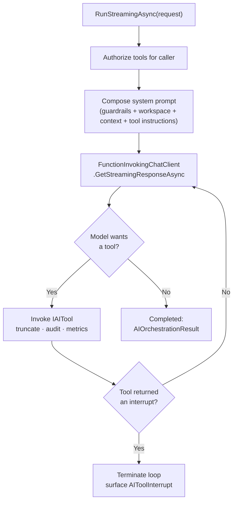

import { FileTree, Aside } from "@astrojs/starlight/components";

[Agentic Chat](/dotnet/ai/agentic-chat/) is the conversation; **AI Tools** is the engine
that makes it agentic. `Granit.AI.Tools` gives the model a set of functions it can call —
search a corpus, look up a patient, draft a notification — runs the
think → call → execute loop until the model has an answer, and streams every step. It is
a thin, opinionated layer over Microsoft.Extensions.AI's `FunctionInvokingChatClient`
that adds the things a framework needs and a raw loop does not: **per-tool authorization**,
result truncation, audit, guardrails, and a graceful interrupt.

<Aside type="note" title="Available from Granit 1.0">
The tool registry and orchestration model are [ADR-067](/dotnet/architecture/adr/067-agentic-chat-tool-registry-prompt-catalog/);
the streaming loop over `FunctionInvokingChatClient` is
[ADR-071](/dotnet/architecture/adr/071-agentic-chat-streaming/).
</Aside>

## The package family

<FileTree>

- Granit.AI.Tools **core — tool contract, registry, orchestrator, guardrails**
- Granit.AI.Tools.Search **ready-made RAG `search` tool over your corpora**

</FileTree>

## A tool is a self-describing class

A tool implements `IAITool` — it carries its own wire name, model-facing description, and
JSON-Schema parameters, and executes itself. There is no separate schema file or
registration manifest; the declaration the model sees is derived from the class.

```csharp
namespace Granit.AI.Tools;

public interface IAITool
{
    string Name { get; }                 // [a-zA-Z0-9_-]+, snake_case by convention
    string Description { get; }          // shown to the model
    JsonElement ParameterSchema { get; } // JSON Schema (object)

    ValueTask<AIToolResult> InvokeAsync(
        AIToolInvocationContext context, CancellationToken cancellationToken = default);
}
```

A worked example — a tool that looks up an appointment for the agent:

```csharp
public sealed class GetAppointmentTool(IAppointmentReader appointments)
    : IAITool, IAIToolInstructions
{
    public string Name => "get_appointment";
    public string Description => "Fetch an appointment by id, including patient and time.";
    public JsonElement ParameterSchema { get; } = JsonDocument.Parse("""
        { "type": "object",
          "properties": { "id": { "type": "string", "description": "Appointment id (GUID)." } },
          "required": ["id"], "additionalProperties": false }
        """).RootElement;

    // IAIToolInstructions — code-first usage guidance folded into the system prompt
    public string Instructions =>
        "Call get_appointment before answering questions about a specific booking.";

    public async ValueTask<AIToolResult> InvokeAsync(
        AIToolInvocationContext context, CancellationToken cancellationToken = default)
    {
        var id = context.Arguments.GetProperty("id").GetString();
        var appt = await appointments.FindAsync(Guid.Parse(id!), cancellationToken)
            .ConfigureAwait(false);
        return appt is null
            ? AIToolResult.Error("No appointment with that id.")
            : AIToolResult.Success($"{appt.PatientName} with Dr {appt.DoctorName} at {appt.StartsAt:f}.");
    }
}
```

`AIToolResult` has three factories: `Success(content)`, `Error(message)`, and
`Halt(kind, payload, content)` — the last one stops the loop and surfaces an
`AIToolInterrupt` to the caller instead of feeding the result back to the model (this is
how the clarification flow in chat works).

### Registration

`AddGranitAITools` opens a builder. Tools are scoped by default (`Add<T>()`); register a
stateless singleton with `Add(instance)`.

```csharp
builder.Services.AddGranitAITools(tools =>
{
    tools.Add<GetAppointmentTool>();
    tools.Add<DraftNotificationTool>();
});
```

The registry validates every tool on construction — a malformed name throws
`InvalidAIToolNameException`, a collision throws `DuplicateAIToolException`. Tools are
projected to `Microsoft.Extensions.AI` `AITool` declarations automatically.

## Per-tool authorization

A tool that mutates data or exposes sensitive records should be gated. Implement
`IGatedAITool` and the orchestrator declares it to the model **only** when the caller holds
the permission — an unauthorized tool is invisible, not merely refused.

```csharp
public sealed class CancelAppointmentTool : IAITool, IGatedAITool
{
    public string RequiredPermission => "Scheduling.Appointments.Cancel"; // Group.Resource.Action
    // ... Name, Description, ParameterSchema, InvokeAsync
}
```

`PermissionAIToolAuthorizer` batches the check through `IPermissionChecker`; ungated tools
are always available. The filter runs per turn, so a permission revoked between turns takes
effect immediately.

## The orchestration loop

`IAIToolOrchestrator` is the primitive. `RunStreamingAsync` yields updates as the loop
runs; `RunAsync` is a buffered drain over it.

```csharp
public interface IAIToolOrchestrator
{
    IAsyncEnumerable<AIOrchestrationUpdate> RunStreamingAsync(
        AIOrchestrationRequest request, CancellationToken cancellationToken = default);

    Task<AIOrchestrationResult> RunAsync(
        AIOrchestrationRequest request, CancellationToken cancellationToken = default);
}
```



`AIOrchestrationRequest` carries the `Messages` so far, the optional `WorkspaceName` and
tool subset, the user's custom context, and audit fields (`ConversationId`,
`InvokedPromptName`/`Version`). Updates are tagged `Delta`, `ToolCall`, `ToolResult`, or
`Completed`; the terminal `AIOrchestrationResult` reports the final `Content`, the full
transcript, `Iterations` / `MaxIterationsReached`, the `ToolInvocations` audit trail, token
usage, `Duration`, and any `Interrupt`.

Each tool result is truncated to `MaxToolResultCharacters` before it is fed back to the
model (the truncation is recorded in the audit outcome), and the loop is bounded by
`MaxIterations`.

| Option (`AI:Tools:Orchestration`) | Default | Effect |
|-----------------------------------|---------|--------|
| `MaxIterations` | `8` | Maximum model round-trips per turn |
| `MaxToolResultCharacters` | `8000` | Tool-result cap fed back to the model (`0` = unbounded) |

## System prompt, guardrails & reasoning

`IAISystemPromptComposer` layers the system prompt in a fixed precedence:

```text
framework guardrails  →  workspace system prompt  →  user custom context  →  per-tool instructions
```

The guardrails come from `IAIGuardrailProvider` — a **code-first, read-only** versioned
block (`framework.guardrails`, e.g. `1.2.0`) that a tenant cannot edit, so security rules
always lead. Each tool's `IAIToolInstructions.Instructions` is appended so the model knows
when to reach for it.

For reasoning models (DeepSeek-R1 and friends), `ReasoningTextFilter` strips
`<think>…</think>` blocks from both the streamed deltas and the persisted answer — the
saved transcript matches what the user saw.

## Diagnostics

OpenTelemetry under the activity source and meter `Granit.AI.Tools`:

| Metric | Kind | Meaning |
|--------|------|---------|
| `granit.ai.tools.invocations` | counter | Tool calls, tagged `tool` + `outcome` (`success`/`error`) |
| `granit.ai.tools.truncations` | counter | Results that hit the truncation cap, tagged `tool` |
| `granit.ai.tools.iterations` | histogram | Model round-trips per turn |

All tagged `tenant_id`.

## Ready-made: corpus search (RAG)

`Granit.AI.Tools.Search` ships a `search` tool so the agent can ground its answers in your
data — Retrieval-Augmented Generation without hand-writing the tool. You opt corpora in;
each becomes a distinct, ACL-bound `search_{name}` tool.

```csharp
builder.Services.AddGranitAITools(tools => tools.AddSearch(s =>
{
    // Semantic (vector) — carries similarity scores
    s.AddSemantic("guidelines", collectionName: "clinical-guidelines",
        description: "Clinical care guidelines.");

    // Full-text — tenant + per-record ACL applied by the search service
    s.AddFullText<Guid, InvoiceHit>("invoices",
        textSelector: hit => hit.Summary,
        idSelector: hit => hit.Id.ToString());
}));
```

The two strategies differ in what backs them and what they return:

| | `AddSemantic` | `AddFullText<TKey, TResult>` |
|--|---------------|------------------------------|
| Backed by | `ISemanticSearchService` + a vector collection | `ISearchService<TKey, TResult>` (full-text index) |
| Scoping | Tenant-scoped by the vector provider | Tenant + per-record ACL via the search service |
| Score | Similarity score per snippet | None (`Score` is `null`) |

Each tool exposes a `query` (required) and an optional `limit` parameter (clamped to
`MaxLimit`, defaulting to `DefaultLimit`) and returns ranked `SearchSnippet` records
(`Id`, `Text`, `Score`, `Source`). The tool instructs the model to cite the snippets and
not invent content beyond them.

| Option (`AI:Tools:Search`) | Default | Effect |
|----------------------------|---------|--------|
| `DefaultLimit` | `5` | Snippets returned when the model omits `limit` |
| `MaxLimit` | `20` | Hard ceiling per call |

## See also

- [Agentic Chat](/dotnet/ai/agentic-chat/) — the conversation engine that drives the orchestrator
- [AI Prompts](/dotnet/ai/prompts/) — reusable prompt templates the user picks per turn
- [Semantic Search & RAG](/dotnet/ai/semantic-search/) — the vector layer behind `AddSemantic`
- [Setup & Configuration](/dotnet/ai/setup/) — providers, workspaces, capability flags
- [ADR-067](/dotnet/architecture/adr/067-agentic-chat-tool-registry-prompt-catalog/) · [ADR-071](/dotnet/architecture/adr/071-agentic-chat-streaming/)
