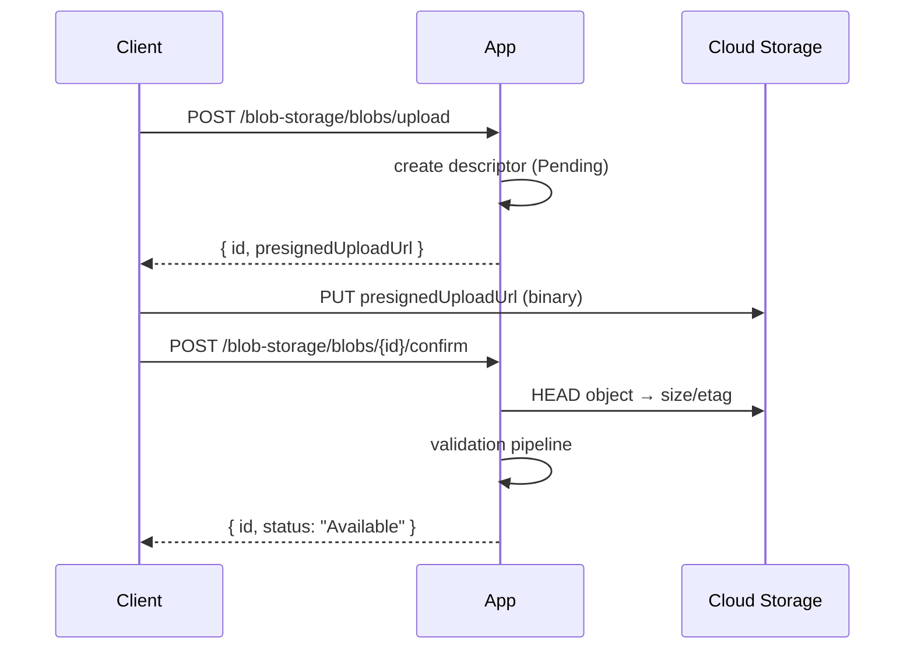

import { FileTree, Aside } from "@astrojs/starlight/components";

Uploading a file through your own server costs CPU you don't have, RAM that
should serve real requests, and bandwidth you already paid the cloud provider for.
The right move is direct-to-cloud: the client gets a presigned URL, uploads
straight to S3 / Azure Blob, and confirms back. That flow has three landmines: the
client can upload garbage and never confirm (orphans), the file can change between
upload and confirm (TOCTOU), and the secrets that signed the URL leak if you
hand-roll it.

**`Granit.BlobStorage.Endpoints`** is the admin API that handles the full lifecycle
correctly: initiate → presigned URL → client uploads → confirm with validation
pipeline → presigned download URL on demand → crypto-shred on delete → orphan
cleanup job. Every endpoint behind a permission policy, per-operation rate limit,
and OpenAPI-typed.

| Pain | This package's answer |
|------|----------------------|
| Streaming uploads through your server burns CPU/RAM | `POST /upload` returns a presigned URL — the client uploads direct-to-cloud |
| TOCTOU between upload and use | `POST /{id}/confirm` runs the validation pipeline before the descriptor becomes usable |
| Abandoned uploads accumulate forever | `POST /cleanup-orphans` finalises Pending/Uploading descriptors past TTL |
| "Delete" leaves shreddable data behind | Crypto-shred on delete, audit record retained |
| Need to expose a temporary download link | `POST /{id}/download-url` generates a short-lived presigned URL |
| Listing blobs requires custom paging | Built-in `MapGranitQuery<BlobDescriptor>` — filter, sort, paginate |

## Package structure

<FileTree>

- Granit.BlobStorage.Endpoints/
  - Endpoints/
    - BlobReadEndpoints.cs `GET /{id}`
    - BlobWriteEndpoints.cs `POST /upload`, `DELETE /{id}`
    - BlobOperationEndpoints.cs `confirm`, `download-url`, `cleanup-orphans`
  - Permissions/ `BlobStoragePermissions` + `BlobStorageRateLimitPolicies`
  - Options/ `BlobStorageEndpointsOptions`
- Granit.BlobStorage Core abstractions (`IBlobStorage`, `BlobDescriptor`)
- Granit.BlobStorage.EntityFrameworkCore Persistence + queryable source

</FileTree>

## Installation

```csharp
// Program.cs
app.MapGranitBlobStorage();

// With custom options:
app.MapGranitBlobStorage(opts =>
{
    opts.RoutePrefix = "admin/blobs";
    opts.TagName = "Storage";
});
```

All routes mount under `{RoutePrefix}/blobs/...`. With defaults the listing endpoint
sits at `GET /blob-storage/blobs?…`.

## Configuration

| Option | Default | Description |
|--------|---------|-------------|
| `RoutePrefix` | `"blob-storage"` | Outer route prefix |
| `TagName` | `"Blob Storage"` | OpenAPI tag for endpoint grouping |

Configuration section: `BlobStorageEndpoints`.

## Authorization

Two permissions, declared by `BlobStoragePermissionDefinitionProvider` and
auto-discovered by [`Granit.Authorization`](/dotnet/security/authorization/):

| Permission | Endpoints |
|------------|-----------|
| `BlobStorage.Administration.Read` | `GET /blobs/{id}`, `MapGranitQuery<BlobDescriptor>` |
| `BlobStorage.Administration.Manage` | `POST /upload`, `DELETE /{id}`, `POST /{id}/confirm`, `POST /{id}/download-url`, `POST /cleanup-orphans` |

Both permissions are scoped `MultiTenancySides.Both` — usable in tenant-scoped
admin UIs and host operator consoles alike.

:::tip[Grant model]
Grant `Read` to dashboard and audit roles. Reserve `Manage` for storage operators
and the upload flow of authenticated end-users.
:::

## Endpoint catalogue

### Read

| Method | Route | Description |
|--------|-------|-------------|
| `GET` | `/blobs/{id:guid}` | Get a blob descriptor by ID |
| `GET` | `/blobs` (via `MapGranitQuery<BlobDescriptor>`) | Filter, sort, paginate, groupBy on the descriptor |

### Upload flow

| Method | Route | Description |
|--------|-------|-------------|
| `POST` | `/blobs/upload` | Initiate a direct-to-cloud upload; returns a presigned URL + descriptor ID |
| `POST` | `/blobs/{id:guid}/confirm` | Confirm the upload completed; runs the validation pipeline (size, MIME, hash, MIME-sniff) |



### Operations

| Method | Route | Description |
|--------|-------|-------------|
| `POST` | `/blobs/{id:guid}/download-url` | Generate a short-lived presigned download URL |
| `DELETE` | `/blobs/{id:guid}` | Crypto-shred the encryption key; descriptor + audit record retained |
| `POST` | `/blobs/cleanup-orphans` | Finalise Pending/Uploading descriptors past TTL (e.g. browser closed mid-upload) |

## DTOs

| DTO | Direction | Used by |
|-----|-----------|---------|
| `BlobUploadInitiateRequest` | Input | `POST /upload` |
| `BlobUploadInitiateResponse` | Output | `POST /upload` — includes presigned URL |
| `BlobConfirmUploadRequest` | Input | `POST /{id}/confirm` |
| `BlobConfirmUploadResponse` | Output | `POST /{id}/confirm` — includes validation outcome |
| `BlobDownloadUrlRequest` | Input | `POST /{id}/download-url` |
| `BlobDownloadUrlResponse` | Output | `POST /{id}/download-url` — includes presigned URL |
| `BlobDeleteRequest` | Input | `DELETE /{id}` |
| `BlobDescriptorResponse` | Output | `GET /{id}` |
| `BlobCleanupOrphansResponse` | Output | `POST /cleanup-orphans` |

## Rate limiting

Every mutation endpoint is bound to a rate-limit policy. Configure the policies in
`Granit.RateLimiting`, then the endpoints apply them automatically via
`.RequireGranitRateLimiting(...)`:

| Endpoint | Policy constant | Config key | Recommended algorithm |
|----------|-----------------|------------|------------------------|
| `POST /upload`, `POST /{id}/confirm` | `BlobStorageRateLimitPolicies.Upload` | `blob-upload` | `TokenBucket` (burst-friendly) |
| `POST /{id}/download-url` | `BlobStorageRateLimitPolicies.Download` | `blob-download` | `SlidingWindow`, 100/min |
| `POST /cleanup-orphans` | `BlobStorageRateLimitPolicies.Admin` | `blob-admin` | `FixedWindow`, 10/min |

```json
{
  "RateLimiting": {
    "Policies": {
      "blob-upload":   { "Algorithm": "TokenBucket", "TokenLimit": 20, "TokensPerPeriod": 5, "ReplenishmentPeriod": "00:00:10" },
      "blob-download": { "Algorithm": "SlidingWindow", "PermitLimit": 100, "Window": "00:01:00" },
      "blob-admin":    { "Algorithm": "FixedWindow", "PermitLimit": 10,  "Window": "00:01:00" }
    }
  }
}
```

Rate-limited responses return `429 Too Many Requests` with `Retry-After`. See
[Rate Limiting](/dotnet/api/rate-limiting/) for partition strategies and dynamic
plan-based quotas.

## Validation

All request DTOs are auto-validated through `MapGranitGroup()`. Key rules:

- **Container names** — lowercase alphanumeric with hyphens, max 128 chars.
- **File names** — non-empty, max 1024 chars.
- **Content types** — valid MIME format (`type/subtype`).
- **File size** — must be positive.
- **Deletion reason** — max 500 chars (optional).

The **confirm pipeline** layers content-time validation on top: size cap per
container, declared vs. detected MIME consistency (`AppendUserData` style sniffing
to defeat extension spoofing), and SHA-256 hash check against the value declared at
initiation.

<Aside type="caution">
Direct-to-cloud uploads do not pass through your application's request pipeline.
Anti-malware scanning, MIME sniffing, and quota enforcement happen on `POST /confirm`
— treat a descriptor with `Status: Pending` as **untrusted** until confirmed.
</Aside>

## See also

- [Blob Storage (core)](/dotnet/data/blob-storage/) — providers, encryption, validation pipeline
- [Rate Limiting](/dotnet/api/rate-limiting/) — partition strategies, dynamic quotas
- [Authorization](/dotnet/security/authorization/) — permission grant administration
- [QueryEngine](/dotnet/building-blocks/query-engine/) — engine powering descriptor listing
