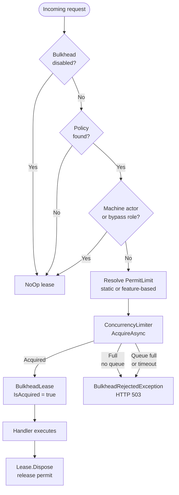

import { Aside } from "@astrojs/starlight/components";

`Granit.Bulkhead` provides per-tenant bulkhead isolation built on .NET 10's
`System.Threading.RateLimiting.ConcurrencyLimiter`. When a tenant has too many
concurrent operations in flight, excess requests are rejected immediately (HTTP 503)
rather than queued — preventing thread pool exhaustion without hiding latency problems.

The module follows the
[ADR-062](/dotnet/architecture/adr/062-framework-pure-core-transport-bindings/)
core + transport-binding layout: the algorithm is framework-pure, and each
enforcement point ships as a separate package.

:::note[Per-pod isolation]
Bulkhead is in-memory, per pod. With N pods and `PermitLimit = P`, a tenant can use up
to N × P concurrent operations cluster-wide. For distributed quotas, use
[Rate Limiting](/dotnet/api/rate-limiting/) (Redis-backed).
:::

## Choosing the right package

The limiter registry, quota providers, options, diagnostics, and
`TenantPartitionedBulkhead` live in the transport-agnostic core. Add the binding
that matches where you enforce the isolation.

| Package | Reference when | Brings in |
| ------- | -------------- | --------- |
| `Granit.Bulkhead` | Always — the core. Limiter registry, quota providers, options, metrics, 18-culture localization, `GranitBulkheadModule`. | `Granit`, `Granit.Features` |
| `Granit.Http.Bulkhead` | You isolate HTTP endpoints. Endpoint filter `.RequireGranitBulkhead("policy")` + the RFC 7807 mapper that turns `BulkheadRejectedException` into `503`. | core + `Granit.Http.ExceptionHandling` |
| `Granit.Bulkhead.Wolverine` | You isolate message handlers. `[Bulkhead("policy")]` + convention middleware. **No `WolverineFx` reference.** | core |

## Setup

Reference the binding(s) you need — each transport module pulls in the core
`GranitBulkheadModule` automatically via `[DependsOn]`.

```csharp
[DependsOn(
    typeof(GranitHttpBulkheadModule),        // HTTP endpoints
    typeof(GranitBulkheadWolverineModule))]  // Wolverine handlers
public class AppModule : GranitModule { }
```

```json
{
  "Bulkhead": {
    "Enabled": true,
    "BypassRoles": ["SystemAdmin"],
    "Policies": {
      "api": { "PermitLimit": 20, "QueueLimit": 5, "QueueTimeout": "00:00:30" },
      "import": { "PermitLimit": 2, "QueueLimit": 0 },
      "report-generation": { "PermitLimit": 3, "QueueLimit": 0 }
    }
  }
}
```

<Aside type="caution" title="Breaking — configuration section moved">
The section is `Bulkhead` (top-level), no longer `Http:Bulkhead`. The core is
transport-agnostic, so the section name dropped the `Http` prefix along with the
package split. See the [migration table](#migrating-from-granithttpbulkhead) below.
</Aside>

## Applying to endpoints

```csharp
app.MapGet("/reports", handler)
   .RequireGranitBulkhead("report-generation");

app.MapPost("/import", handler)
   .RequireGranitBulkhead("import");
```

`RequireGranitBulkhead` is an endpoint filter shipped by `Granit.Http.Bulkhead`.
It acquires a lease before the handler runs and releases it in a `finally`
block — the lease is always released, even on unhandled exceptions.

When the bulkhead is full, `BulkheadRejectedException` is thrown and mapped to
**503 Service Unavailable** by the RFC 7807 mapper registered by
`GranitHttpBulkheadModule` (via `Granit.Http.ExceptionHandling`).

## Applying to Wolverine messages

For background jobs and message handlers, use the `[Bulkhead]` attribute from
`Granit.Bulkhead.Wolverine.Attributes` and register the middleware once:

```csharp
using Granit.Bulkhead.Wolverine.Attributes;

// 1. Decorate the message
[Bulkhead("import")]
public record ImportDataCommand(Guid TenantId, Stream Data);

// 2. Register middleware in Wolverine setup
opts.Policies.AddMiddleware<BulkheadMiddleware>(
    chain => chain.MessageType
        .GetCustomAttributes(typeof(BulkheadAttribute), true).Length > 0);
```

The middleware follows Wolverine's before/after convention — the lease is released
after the handler completes, whether it succeeds or throws. Because the middleware
is discovered by convention and uses no Wolverine types, `Granit.Bulkhead.Wolverine`
carries **no `WolverineFx` package reference** — the host's Wolverine setup is enough.

## Configuration reference

### GranitBulkheadOptions

| Property | Default | Description |
|----------|---------|-------------|
| `Enabled` | `true` | Master switch — disabling returns `NoOp` leases for all policies |
| `BypassRoles` | `[]` | Roles that skip bulkhead checks. Machine actors always bypass regardless |
| `UseFeatureBasedQuotas` | `false` | Resolve `PermitLimit` dynamically from `Granit.Features` |
| `IdleTimeout` | `00:30:00` | Evict unused per-tenant limiters after this idle period |
| `CleanupInterval` | `00:05:00` | How often the background cleanup job runs |
| `Policies` | required | Named policy definitions (case-insensitive keys) |

### BulkheadPolicyOptions

| Property | Default | Range | Description |
|----------|---------|-------|-------------|
| `PermitLimit` | `10` | 1–10,000 | Max concurrent operations per tenant for this policy |
| `QueueLimit` | `0` | 0–10,000 | Max queued requests when slots are full. `0` = reject immediately |
| `QueueTimeout` | `00:00:30` | positive | Max wait in queue. Only applies when `QueueLimit > 0` |
| `FeatureName` | `null` | — | Numeric `Granit.Features` feature to override `PermitLimit` per plan |

## Bypass logic

Requests skip the bulkhead check when:

1. **Machine actors** — `ICurrentUserService.IsMachine = true` (always bypassed)
2. **Configured roles** — user is in a role listed in `BypassRoles`
3. **Disabled** — `Enabled = false`
4. **Unknown policy** — policy name not found in `Policies` (no-op, counted by
   `granit.bulkhead.policy.unknown`)

## Feature-based quotas

When `UseFeatureBasedQuotas = true`, the `PermitLimit` for each policy is resolved
dynamically from a `Granit.Features` Numeric feature before each acquisition:

```json
{
  "Bulkhead": {
    "UseFeatureBasedQuotas": true,
    "Policies": {
      "import": {
        "PermitLimit": 2,
        "FeatureName": "Bulkhead.ImportLimit"
      }
    }
  }
}
```

If the feature is not defined or `IFeatureChecker` is not registered, it falls back to
the static `PermitLimit` from configuration.

## Metrics

The core emits OpenTelemetry metrics via the `Granit.Bulkhead` meter:

| Metric | Type | Description |
|--------|------|-------------|
| `granit.bulkhead.leases.active` | UpDownCounter | Currently active leases |
| `granit.bulkhead.requests.rejected` | Counter | Requests rejected (bulkhead full) |
| `granit.bulkhead.requests.bypassed` | Counter | Acquire calls bypassed (machine actor or `BypassRoles` match) |
| `granit.bulkhead.requests.abandoned` | Counter | Acquire calls abandoned by the caller (client cancel) while queued |
| `granit.bulkhead.policy.unknown` | Counter | Acquire calls referencing a policy name absent from configuration |
| `granit.bulkhead.limiters.evicted` | Counter | Limiters evicted from the registry (idle sweep or LRU pressure) |

Lease and request metrics carry `policy` and `tenant_id` attributes.

<Aside type="caution" title="Breaking — meter and metric names moved">
The meter was renamed `Granit.Http.Bulkhead` → `Granit.Bulkhead` and every metric
dropped the `http` segment (`granit.http.bulkhead.*` → `granit.bulkhead.*`).
Update OpenTelemetry meter subscriptions and dashboard queries.
</Aside>

## Architecture



## Public API summary

| Type | Package | Description |
|------|---------|-------------|
| `GranitBulkheadModule` | `Granit.Bulkhead` | Core module class |
| `TenantPartitionedBulkhead` | `Granit.Bulkhead` | Core orchestrator — inject to acquire leases manually |
| `BulkheadLease` | `Granit.Bulkhead` | Disposable permit holder |
| `IBulkheadQuotaProvider` | `Granit.Bulkhead` | Override to provide dynamic limits |
| `BulkheadRejectedException` | `Granit.Bulkhead` | Thrown when bulkhead is full |
| `AddGranitBulkhead()` | `Granit.Bulkhead` | Core DI registration extension |
| `GranitBulkheadOptions` / `BulkheadPolicyOptions` | `Granit.Bulkhead` | Options (`Bulkhead` section) |
| `GranitHttpBulkheadModule` | `Granit.Http.Bulkhead` | HTTP binding module — wires the 503 mapper |
| `RequireGranitBulkhead()` | `Granit.Http.Bulkhead` | Endpoint filter extension (`Granit.Http.Bulkhead.AspNetCore`) |
| `AddGranitHttpBulkhead()` | `Granit.Http.Bulkhead` | HTTP binding DI registration |
| `GranitBulkheadWolverineModule` | `Granit.Bulkhead.Wolverine` | Wolverine binding module |
| `BulkheadAttribute` | `Granit.Bulkhead.Wolverine` | Message marker (`Granit.Bulkhead.Wolverine.Attributes`) |
| `BulkheadMiddleware` | `Granit.Bulkhead.Wolverine` | Wolverine before/after middleware |

## Migrating from Granit.Http.Bulkhead

`Granit.Http.Bulkhead` was a single ASP.NET-Core-coupled package before the
[ADR-062](/dotnet/architecture/adr/062-framework-pure-core-transport-bindings/)
split. These are breaking moves (pre-1.0):

| Was | Now |
| --- | --- |
| Configuration section `Http:Bulkhead` | `Bulkhead` |
| Meter `Granit.Http.Bulkhead`, metrics `granit.http.bulkhead.*` | Meter `Granit.Bulkhead`, metrics `granit.bulkhead.*` |
| One `GranitHttpBulkheadModule` with everything | Core `GranitBulkheadModule` + `GranitHttpBulkheadModule` / `GranitBulkheadWolverineModule` |
| `BulkheadAttribute` / `BulkheadMiddleware` in `Granit.Http.Bulkhead` | `Granit.Bulkhead.Wolverine` (+ `.Attributes` namespace) |
| Core types (`TenantPartitionedBulkhead`, options, exception) in `Granit.Http.Bulkhead` | `Granit.Bulkhead` |
| `RequireGranitBulkhead()` | Unchanged, still `Granit.Http.Bulkhead` |

<Aside type="note">
The core carries no ASP.NET Core `FrameworkReference`. A worker service or a
console host can reference `Granit.Bulkhead` (or its Wolverine binding) without
dragging in the web stack.
</Aside>

## See also

- [Rate Limiting](/dotnet/api/rate-limiting/) — distributed quota enforcement (Redis-backed), same package layout
- [ADR-062: framework-pure core + transport bindings](/dotnet/architecture/adr/062-framework-pure-core-transport-bindings/) — the layering convention
- [Exception Handling](/dotnet/api/exception-handling/) — Problem Details for 503 responses
- [Features](/dotnet/infrastructure/feature-flags/) — feature-based quota resolution
- [API & Http overview](/dotnet/api/) — all HTTP infrastructure packages
