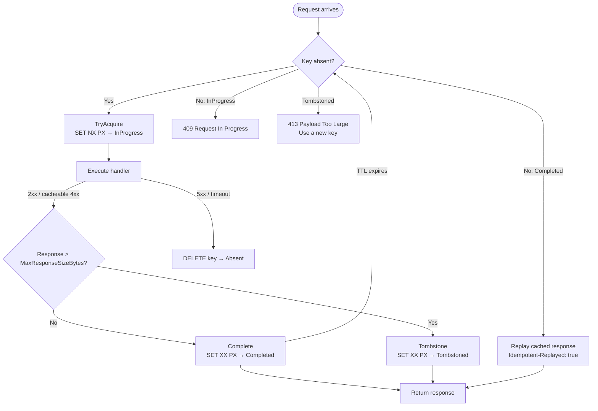

import { Aside } from "@astrojs/starlight/components";

Granit.Http.Idempotency provides Stripe-style HTTP idempotency middleware backed by
its own first-class store contract, `IIdempotencyStore`. Ensures that retried
POST/PUT/PATCH requests produce the same response without re-executing side effects.
Uses SHA-256 composite keys; the Redis provider encrypts entries at rest with
AES-256-GCM.

The `[Idempotent]` attribute and the `IIdempotencyMetadata` contract ship in a
dedicated contracts package, **`Granit.Http.Idempotency.Abstractions`**
(namespace `Granit.Http.Idempotency`). `*.Endpoints` packages that mark routes
as idempotent reference the contracts only — never the middleware package.

## Setup

```csharp
[DependsOn(typeof(GranitHttpIdempotencyModule))]
public class AppModule : GranitModule { }
```

```json
{
  "Http:Idempotency": {
    "HeaderName": "Idempotency-Key",
    "KeyPrefix": "idp",
    "CompletedTtl": "24:00:00",
    "InProgressTtl": "00:00:30",
    "ExecutionTimeout": "00:00:25",
    "MaxBodySizeBytes": 1048576
  }
}
```

In `Program.cs` (after authentication/authorization):

```csharp
app.UseAuthentication();
app.UseAuthorization();
app.UseGranitIdempotency(); // After auth so ICurrentUserService is populated
```

## The store contract

The middleware persists its state machine through **`IIdempotencyStore`** — a
first-class contract with atomic transition semantics, owned by the package
itself (the former `IConditionalCache` / `Granit.Caching` dependency is gone):

```csharp
public interface IIdempotencyStore
{
    bool IsDistributed { get; }
    string BackendName { get; }

    // Create-if-absent — the lock acquisition (Redis SET NX PX)
    Task<bool> TryAcquireAsync(string key, IdempotencyEntry entry, TimeSpan ttl, CancellationToken cancellationToken);

    Task<IdempotencyEntry?> GetAsync(string key, CancellationToken cancellationToken);

    // Set-if-present (SET XX PX) — never resurrect an expired key
    Task<bool> CompleteAsync(string key, IdempotencyEntry entry, TimeSpan ttl, CancellationToken cancellationToken);
    Task<bool> TombstoneAsync(string key, IdempotencyEntry entry, TimeSpan ttl, CancellationToken cancellationToken);

    Task DeleteAsync(string key, CancellationToken cancellationToken);
}
```

Two implementations ship:

| Store | Package | `IsDistributed` | Use |
| ----- | ------- | --------------- | --- |
| `InMemoryIdempotencyStore` | `Granit.Http.Idempotency` (default) | `false` | Development, single-replica hosts |
| `RedisIdempotencyStore` | `Granit.Http.Idempotency.StackExchangeRedis` | `true` | Production |

Custom stores must **not** re-namespace keys by tenant — the middleware already
partitions the composite key (see below).

**Fail-loud guard:** outside `Development`, the middleware refuses to start when
the registered store reports `IsDistributed = false`. An in-memory idempotency
store is per-replica: with more than one pod, a retry landing on another pod
re-executes the handler — double payment, double email. If a single-replica
deployment genuinely wants the in-memory store, opt in explicitly:

```json
{ "Http:Idempotency": { "AllowInMemoryStore": true } }
```

<Aside type="caution">
`AllowInMemoryStore = true` trades the at-most-once guarantee for zero
infrastructure. Never combine it with more than one replica.
</Aside>

## Redis provider

`Granit.Http.Idempotency.StackExchangeRedis` replaces the default store with
`RedisIdempotencyStore`. Transitions map to single atomic Redis commands
(`SET NX PX` to acquire, `SET XX PX` to complete/tombstone — no Lua). It reuses
an existing `IConnectionMultiplexer` when the host already registered one (e.g.
via `Granit.Caching.StackExchangeRedis`).

```csharp
[DependsOn(typeof(GranitHttpIdempotencyStackExchangeRedisModule))]
public class AppModule : GranitModule { }
```

```json
{
  "Http:Idempotency:Redis": {
    "Configuration": "redis.internal:6380",
    "InstanceName": "dd:",
    "RequireTls": true
  },
  "Cache:Encryption:Key": "BASE64_ENCODED_32_BYTE_KEY"
}
```

| Property | Default | Description |
| -------- | ------- | ----------- |
| `IsEnabled` | `true` | Toggle the module |
| `Configuration` | `"localhost:6379"` | StackExchange.Redis configuration string |
| `InstanceName` | `"dd:"` | Application-scoped key prefix |
| `RequireTls` | `true` | Force `Ssl = true` on the connection |

**Unconditional at-rest encryption.** Stored entries (status code, headers,
response body) are always encrypted with AES-256-GCM via `ICacheValueEncryptor`.
The base64 256-bit key comes from `Cache:Encryption:Key` — the same key
`Granit.Caching` uses. Outside `Development`, startup **fails closed** when the
key is missing (`RedisIdempotencyEncryptionStartupValidator`, no opt-out). In
Development a null encryptor passes plaintext through with a warning.

**Health check:** `AddGranitRedisIdempotencyHealthCheck()` registers a
`redis-idempotency` check (PING + latency, tags `readiness`/`startup`, degraded
above 100 ms by default).

## Marking endpoints as idempotent

```csharp
app.MapPost("/api/v1/invoices", CreateInvoice)
    .WithMetadata(new IdempotentAttribute { Required = true });

// Optional key — middleware is bypassed when header is absent
app.MapPut("/api/v1/invoices/{id}", UpdateInvoice)
    .WithMetadata(new IdempotentAttribute { Required = false });

// Custom TTL (2 hours instead of default 24h)
app.MapPost("/api/v1/payments", ProcessPayment)
    .WithMetadata(new IdempotentAttribute { CompletedTtlSeconds = 7200 });
```

## State machine



A **`Tombstoned`** entry means "this request executed successfully but the response
is too large to replay safely". The middleware still streams the full response to the
original caller; later retries with the same key get `413 Payload Too Large` —
preserving the at-most-once guarantee without paying the storage cost of a giant
cached payload.

## Composite key structure

The Redis key is partitioned by tenant, user, HTTP method, and route to prevent
cross-user key collisions:

```text
{prefix}:{tenantId|global}:{userId|anon}:{method}:{routePattern}:{sha256(idempotencyKeyValue)}
```

**Example:** `idp:global:d4e5f6a7:POST:/api/v1/invoices:a1b2c3d4e5f6...`

## Payload hash verification

The middleware computes a SHA-256 digest of the composite input (method + route +
idempotency key value + request body). On replay, if the payload hash does not match
the stored entry, the request is rejected with 422 to prevent key reuse with a
different body.

## Response caching rules

| Status code | Cached? | Rationale |
| ----------- | ------- | --------- |
| 2xx | Yes | Successful responses are replayed |
| 400, 404, 409, 410, 422 | Yes | Deterministic client errors |
| 401, 403 | No | Authentication state may change |
| 5xx | No | Lock is released for retry |
| 499 (client disconnect) | No | Response may be truncated |

## Error responses

| Scenario | Status | Title |
| -------- | ------ | ----- |
| Missing header (required) | 422 | Missing Idempotency-Key |
| Header value too long | 400 | Idempotency-Key exceeds `MaxKeyLength` (rejected before hashing or cache lookup) |
| Multipart request | 422 | Unsupported Content-Type |
| Key in progress (another pod) | 409 | Request In Progress (`Retry-After` header set) |
| Race on completed entry mid-execute | 409 | Concurrent request fail-fast |
| Payload hash mismatch | 422 | Idempotency Key Conflict |
| Replay of tombstoned response | 413 | Original response exceeded replay size limit — retry with a new key |
| Execution timeout | 503 | Execution Timeout |

Replayed responses include an `Idempotent-Replayed: true` header.

## Replay-header filter

Caching a response that contains per-request security artefacts (rotating session
cookies, CSRF tokens, `WWW-Authenticate` challenges) and replaying it to a later
retry would re-issue stale credentials to a new caller. The middleware filters a
default deny-list both **on capture** (entry stored without these headers) and **on
replay** (defence in depth):

| Excluded by default | Why |
|---------------------|-----|
| `Set-Cookie`, `Set-Cookie2` | Session rotation |
| `WWW-Authenticate`, `Proxy-Authenticate` | Auth challenges |
| `Authorization` | Echoed credentials |
| `Server`, `Date`, `Transfer-Encoding` | Per-response transport headers |

Add custom entries through configuration:

```csharp
services.Configure<IdempotencyOptions>(opts =>
    opts.ExcludedResponseHeaders.Add("X-Custom-Session-Token"));
```

## Configuration reference

| Property | Default | Description |
| -------- | ------- | ----------- |
| `HeaderName` | `"Idempotency-Key"` | HTTP header name |
| `KeyPrefix` | `"idp"` | Redis key prefix |
| `CompletedTtl` | `24:00:00` | TTL for completed entries |
| `TombstoneTtl` | `24:00:00` | TTL for tombstoned (oversized) entries — matched to `CompletedTtl` so retries within the normal window see a deterministic 413 |
| `InProgressTtl` | `00:00:30` | Lock TTL (must be > `ExecutionTimeout`) |
| `ExecutionTimeout` | `00:00:25` | Max handler execution time |
| `MaxBodySizeBytes` | `1048576` | Max request body size to hash (1 MiB) |
| `MaxResponseSizeBytes` | `262144` | Max response body stored for replay (256 KiB) — over this, entry is tombstoned |
| `MaxKeyLength` | `256` | Max length of the client-supplied header value (rejected with 400 above this) |
| `ShouldCacheStatusCode` | 2xx + {400, 404, 409, 410, 422} | Predicate controlling which status codes get cached |
| `ExcludedResponseHeaders` | See above | Headers filtered on capture + replay |
| `AllowInMemoryStore` | `false` | Allow a non-distributed `IIdempotencyStore` outside Development (per-replica store — see above) |

## Public API summary

| Category | Key types | Package |
| -------- | --------- | ------- |
| Modules | `GranitHttpIdempotencyModule`, `GranitHttpIdempotencyStackExchangeRedisModule` | -- |
| Contracts | `IdempotentAttribute`, `IIdempotencyMetadata` (namespace `Granit.Http.Idempotency`) | `Granit.Http.Idempotency.Abstractions` |
| Store | `IIdempotencyStore`, `IdempotencyEntry`, `IdempotencyState`, `IdempotencyTombstoneReason` | `Granit.Http.Idempotency` |
| Options | `IdempotencyOptions` (section `Http:Idempotency`) | `Granit.Http.Idempotency` |
| Options (Redis) | `RedisIdempotencyOptions` (section `Http:Idempotency:Redis`) | `Granit.Http.Idempotency.StackExchangeRedis` |
| Extensions | `AddGranitIdempotency()`, `UseGranitIdempotency()` | `Granit.Http.Idempotency` |
| Extensions (Redis) | `AddGranitRedisIdempotency()`, `AddGranitRedisIdempotencyHealthCheck()` | `Granit.Http.Idempotency.StackExchangeRedis` |

## See also

- [Caching module](/dotnet/data/caching/) -- `ICacheValueEncryptor` and the shared `Cache:Encryption:Key`
- [API & Http overview](/dotnet/api/) -- All HTTP infrastructure packages
- [Blog: Idempotency keys: why every POST should be retry-safe](/blog/idempotency-keys-why-every-post-should-be-retry-safe/) -- the rationale and patterns behind this module's design
