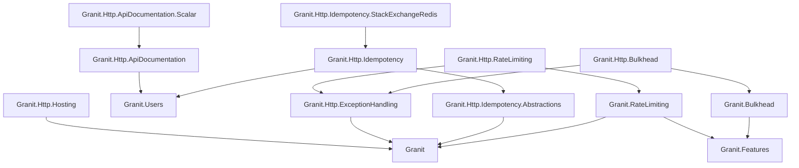

Nine packages that form the HTTP infrastructure layer of a Granit application.

## Choosing the right modules

Start with the problem you need to solve:

| Problem | Module | When to use |
| ------- | ------ | ----------- |
| Clients retry a POST and create duplicates | [Idempotency](/dotnet/api/idempotency/) | Any mutation endpoint called by mobile apps or unreliable networks |
| A single user floods your API | [Rate Limiting](/dotnet/api/rate-limiting/) | Public APIs, multi-tenant APIs, any endpoint exposed to untrusted clients |
| One slow tenant blocks requests for others | [Bulkhead](/dotnet/api/bulkhead/) | Multi-tenant SaaS where tenants share compute resources |
| API responses are large (JSON lists, reports) | [HTTP Hosting](/dotnet/api/http-hosting/) | Any API with responses > 1 KB, especially over mobile networks |
| You need to push events to external systems | [Webhooks](/dotnet/api/webhooks/) | Integration partners expect real-time notifications |
| You are introducing breaking API changes | [API Documentation](/dotnet/api/api-documentation/#api-versioning) | Any API with external consumers that cannot upgrade simultaneously |
| Frontend devs need to explore your API | [API Documentation](/dotnet/api/api-documentation/) | Always — self-service API exploration reduces support requests |
| Your API returns inconsistent error shapes | [Exception Handling](/dotnet/api/exception-handling/) | Always — standardizes all errors to RFC 7807 Problem Details |
| Browser clients call your API cross-origin | [HTTP Hosting](/dotnet/api/http-hosting/) | Any API consumed by SPAs or third-party frontends |

:::tip[Most applications need these three from day one]
**Exception Handling** + **HTTP Hosting** (CORS + compression) + **API Documentation**
(OpenAPI + versioning + Scalar UI) — these are foundational. Add Idempotency, Rate
Limiting, and Bulkhead as your traffic and integration patterns demand.
:::

## All packages

| Package | Purpose |
| ------- | ------- |
| [HTTP Hosting](/dotnet/api/http-hosting/) | Auto-registered CORS with ISO 27001 wildcard rejection, Brotli + gzip compression |
| [API Documentation](/dotnet/api/api-documentation/) | OpenAPI 3.1, URL-segment versioning, RFC 8594 deprecation, Scalar UI (`.Scalar` companion), OAuth2/PKCE |
| [Exception Handling](/dotnet/api/exception-handling/) | RFC 7807 Problem Details, chain of responsibility mapper |
| [Idempotency](/dotnet/api/idempotency/) | Stripe-style middleware, `IIdempotencyStore` contract, Redis provider with AES-256-GCM entries |
| [Rate Limiting](/dotnet/api/rate-limiting/) | SlidingWindow, FixedWindow, TokenBucket, Concurrency algorithms |
| [Webhooks](/dotnet/api/webhooks/) | HMAC-signed outbound webhooks, retry, subscription management |
| [Bulkhead](/dotnet/api/bulkhead/) | Per-tenant concurrency isolation, feature-based quotas, Wolverine middleware |
| [URL Safety](/dotnet/api/url-safety/) | SSRF-safe outbound URL validation |

## Package dependencies

The rate-limiting and bulkhead cores are **framework-pure** — `Granit.Http.RateLimiting`
and `Granit.Http.Bulkhead` are the ASP.NET Core bindings (endpoint filter + RFC 7807
mapping), and `Granit.RateLimiting.Wolverine` / `Granit.Bulkhead.Wolverine` the message
bindings. See [Rate Limiting](/dotnet/api/rate-limiting/), [Bulkhead](/dotnet/api/bulkhead/) and
[ADR-062](/dotnet/architecture/adr/062-framework-pure-core-transport-bindings/).

## See also

- [Architecture: HTTP Conventions](/dotnet/architecture/http-conventions/) -- Status codes, Problem Details, DTO naming
- [Security module](/dotnet/security/authentication/) -- JWT Bearer, authorization
