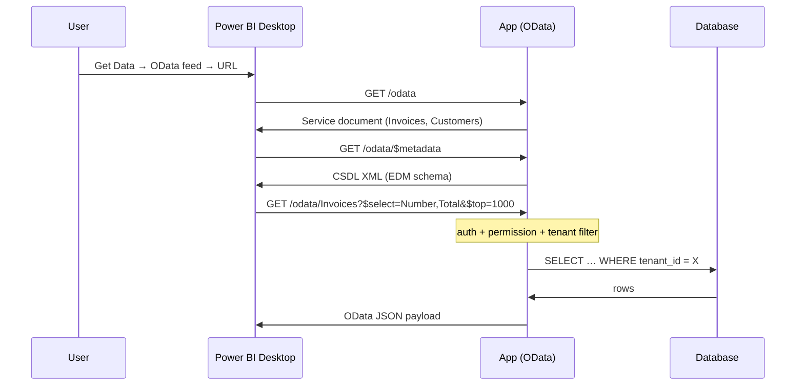

import { FileTree, Tabs, TabItem, Aside } from "@astrojs/starlight/components";

A finance manager asks for "the Invoices table in Power BI". The default move is to
give the BI tool read-only SQL access to a replica. Two weeks later, a custom view
forgets `WHERE tenant_id = …` and one tenant reads another tenant's data. Or someone
gives Tableau direct connection strings and the audit trail goes dark. Or you build a
custom OData controller per module and reinvent paging, filtering, expansion limits,
and rate-limiting from scratch.

**`Granit.Http.ODataExposure`** is the sanctioned bridge: it turns the
`QueryDefinition<TEntity>` you already wrote for the application's grid endpoints into
a full OData v4 `EntitySet`. Power BI Desktop's *Get Data → OData feed* connector
discovers it natively. Every request flows through the same filter pipeline as the
application — tenant filtering, soft delete, per-EntitySet permissions — so a BI tool
can never see rows the user's own UI couldn't see.

| Pain | OData Exposure's answer |
|------|-------------------------|
| BI team wants direct SQL → cross-tenant leaks waiting to happen | Same filter pipeline as the application's grids; OData is the only sanctioned external read |
| Per-module custom OData controllers | One `MapGranitODataEndpoints` call, one `EntitySet<>()` per entity |
| Power BI refresh runs `$top=2_000_000` and locks the DB | `MaxTop` clamp + `OData-MaxTop-Applied` header for observability |
| `$count=true` triggers a full table scan on every refresh | `EnableCount()` is opt-in per EntitySet |
| `$expand=*` exfiltration | Required `ExpandWhitelist(...)` or explicit `DisableExpand()` |
| One tenant saturates the feed | `granit-odata` rate-limit policy partitioned per tenant |
| Cross-tenant analytics for finance ops vs per-tenant feed | Two separate mounts (`MapGranitODataEndpoints` + `MapGranitODataHostEndpoints`), distinct container, distinct quota |

## Package structure

<FileTree>

- Granit.Http.ODataExposure/
  - Extensions/
    - ODataExposureServiceCollectionExtensions.cs `AddGranitODataExposure()`
    - ODataExposureEndpointRouteBuilderExtensions.cs `MapGranitODataEndpoints` / `MapGranitODataHostEndpoints`
  - Internal/
    - ODataEdmModelBuilder.cs EDM whitelist via `EntityDefinition` (ADR-050)
    - ODataEntitySetDescriptor.cs
  - Options/
    - ODataExposureOptions.cs Fluent `EntitySet<TEntity, TQueryDef>(...)` builder
    - ODataHostExposureOptions.cs Cross-tenant host-feed builder
  - Diagnostics/
    - ODataExposureMetrics.cs OTel counters (`granit.odata.*`)

</FileTree>

## Installation

```csharp
// Program.cs — DI
builder.Services
    .AddGranitODataExposure()                                    // OData runtime + ODataQueryOptions<T> binding
    .AddGranitQueryEngine()                              // existing QueryEngine registration
    .AddQueryDefinition<Invoice, InvoiceQueryDefinition>();

// Program.cs — routes (after auth middleware)
app.MapGranitODataEndpoints("/api/{version}/odata", opts =>
{
    opts.RequireMetadataPermission("OData.Invoicing.Metadata.Read"); // or AllowAnonymousMetadata()

    opts.EntitySet<Invoice, InvoiceQueryDefinition>("Invoices")
        .RequirePermission("OData.Invoicing.Invoices.Read")
        .ExpandWhitelist("Customer");

    opts.EntitySet<Customer, CustomerQueryDefinition>("Customers")
        .RequirePermission("OData.Invoicing.Customers.Read")
        .DisableExpand();
});
```

Power BI Desktop → *Get Data* → *OData feed* → `https://your-app/api/v1/odata`. The
service document advertises `Invoices` and `Customers`. The user signs in via OAuth
(the same flow as the web UI). Every row returned passes through tenant filtering,
soft-delete, and the `OData.Invoicing.*.Read` permission gate.

## EntityDefinition is required (ADR-050)

Every EntitySet must target an entity that has a registered
`EntityDefinition<TEntity>` AND an `ExportDefinition<TEntity>` referenced via
`b.Export<TExportDefinition>()`. The startup validator throws otherwise — no silent
fallback.

```csharp
public sealed class InvoiceEntityDefinition : EntityDefinition<Invoice>
{
    public override string Name => "Granit.Invoicing.Invoice";

    protected override void Configure(EntityDefinitionBuilder<Invoice> b)
    {
        b.DisplayKey("Entity:Invoice").PermissionGroup("Invoicing.Invoices");
        b.Query<InvoiceQueryDefinition>();
        b.Export<InvoiceExportDefinition>();   // ← drives the OData EDM whitelist
    }
}
```

The EDM `EntityType` is built by:

1. Resolving the `EntityDefinition` for the target entity.
2. Following `EntityDefinition.Descriptor.ExportDefinitionType` to the matching
   `ExportDefinition`.
3. Whitelisting properties from `ExportDefinition.GetFields()` filtered to
   `IsNavigation == false` and `PropertyPath` containing no `.` (flat scalar fields
   for v1; navigation paths land in a follow-up driven by
   `EntityDefinition.Relations`).
4. Allowing the navigation properties listed in `.ExpandWhitelist(...)` on the
   EntitySet builder — including nested dotted paths (see
   [`$expand` — recursive whitelist](#expand--recursive-whitelist)).

Everything else is removed from the EDM via
`EntityTypeConfiguration.RemoveProperty(...)` **before** convention discovery — notably
`AggregateRoot.DomainEvents` and `AggregateRoot.IntegrationEvents`, which would
otherwise leak into `$metadata` because they're publicly exposed on every aggregate
root to satisfy `IDomainEventSource` / `IIntegrationEventSource`.

<Aside type="note">
Pinning the EDM to `EntityDefinition` instead of `ExportDefinition` directly aligns
the BI surface with the framework's entity-modeling direction
([ADR-050](/dotnet/architecture/adr/050-odata-edm-whitelist-via-entity-definition/)).
As more modules ship `EntityDefinition`s in subsequent phases, their entities become
OData-exposable for free.
</Aside>

## Request flow

```mermaid
flowchart LR
    BI[Power BI / Excel / Tableau] -->|"GET /odata/Invoices?$filter=...&$top=100"| RT[Route]
    RT --> RL[Rate limit<br/>granit-odata]
    RL --> AU[Auth + Permission]
    AU --> QS[IQueryableSource&lt;Invoice&gt;]
    QS -->|"ApplyGranitConventions<br/>(tenant + soft-delete)"| QE[IQueryEngine.BuildFilteredQuery<br/>+ translated $filter predicate]
    QE -->|"QueryDefinition pipeline"| OQ[ODataQueryOptions.ApplyTo]
    OQ -->|"$select / $top / $orderby / $expand"| DB[(Database)]
```



The order is load-bearing: **tenant first, framework filters second, user query
third**. A BI consumer can never widen the result set — only narrow it. `$filter`
is consumed by the QueryEngine step (translated to a `QueryPredicate`) and
excluded from `ApplyTo` — it is never applied twice.

## Strict-config validator

Security-sensitive intents must be declared **explicitly**, or
`MapGranitODataEndpoints` throws at host startup with a list of every misconfigured
set. Per EntitySet:

1. **Permission policy** — `.RequirePermission(...)` (gated) **or** `.AllowAnonymousAccess()`
   (true public reference data, e.g. countries/currencies).
2. **`$expand` policy** — `.ExpandWhitelist(...)` (allow listed navigations) **or**
   `.DisableExpand()` (no expand at all).

And per mount:

<ol start="3">
<li>

**`$metadata` stance** — `opts.RequireMetadataPermission("...")` (gate
`$metadata` + the service document behind a permission) **or**
`opts.AllowAnonymousMetadata()`. The CSDL schema enumerates every exposed
entity and column — reconnaissance gold — so the framework refuses an implicit
stance. The host feed exposes **only** `RequireMetadataPermission(...)`: there
is no anonymous option for cross-tenant metadata.

</li>
</ol>

```csharp
// ❌ Throws at startup — intents missing
app.MapGranitODataEndpoints("/api/{version}/odata", opts =>
{
    opts.EntitySet<Invoice, InvoiceQueryDefinition>("Invoices");
});

// ✅ All intents explicit
app.MapGranitODataEndpoints("/api/{version}/odata", opts =>
{
    opts.RequireMetadataPermission("OData.Invoicing.Metadata.Read");

    opts.EntitySet<Invoice, InvoiceQueryDefinition>("Invoices")
        .RequirePermission("OData.Invoicing.Invoices.Read")
        .ExpandWhitelist("Customer", "Lines");
});
```

Convention drift toward "unprotected by default" is a top cause of data leaks. The
framework refuses to ship a permission-less EntitySet by accident — silent defaults
are the equivalent of an architecture test for a config surface that lives inside a
closure.

## `$filter` — translated to `QueryPredicate`

`$filter` is no longer handed to `ODataQueryOptions.ApplyTo`. The
`ODataFilterTranslator` walks the OData AST and produces a
[`QueryPredicate` tree](/dotnet/building-blocks/query-engine/#structured-predicates--querypredicate)
evaluated by the QueryEngine's strict `BuildFilteredQuery(source, request, predicate)`
overload — **one enforcement point** for column whitelisting, operator/type
validation, and value conversion, shared with the application's own grids.
Anything the translator cannot express as a predicate is rejected with an
explicit `400` — never silently widened or passed through.

**Supported constructs:**

| OData construct | Translated to |
|-----------------|---------------|
| `and` / `or` / `not` | `And` / `Or` / `Not` predicate nodes |
| `eq` / `ne` | `Eq` / `Ne`; a `null` literal becomes `IsNull` / `IsNotNull` |
| `gt` / `ge` / `lt` / `le` | `Gt` / `Gte` / `Lt` / `Lte` (mirrored when the literal is on the left) |
| `contains` / `startswith` / `endswith` | `Contains` / `StartsWith` / `EndsWith` (string columns) |
| `in ( ... )` | `In` with a literal list |

**Rejected with `400 Bad Request`** (metric reason `filter_not_translatable`, each
with a distinct detail message):

| Construct | Example |
|-----------|---------|
| Lambdas | `Lines/any(l: l/Amount gt 100)`, `all(...)` |
| Arithmetic | `Total add 5 gt 100`, `sub`/`mul`/`div`/`mod`, unary minus |
| Navigation property access | `Customer/Name eq 'ACME'` |
| Canonical functions | `tolower(Name) eq 'acme'`, `year(IssuedOn) eq 2026`, everything except contains/startswith/endswith |
| Dynamic (open) properties | any property not in the EDM |
| `has`, collection `$count`, bare boolean property | `Flags has Sales.Color'Red'`, `IsActive` (use `IsActive eq true`) |

NULL semantics are two-valued (`ne` matches NULL rows; use `eq null` /
`ne null` for explicit null checks) — see the
[QueryEngine NULL semantics](/dotnet/building-blocks/query-engine/#null-semantics--two-valued-not-sql-three-valued).

<Aside type="caution" title="Power BI compatibility">
Power BI, Excel, and Tableau generate plain comparison/logic filters for their
query folding — all translated. Two known edges: **case-insensitive text
filters** fold to `tolower(...)`, which is rejected — model text columns with a
consistent case or filter client-side; and **date hierarchy drill-downs** can
fold to `year(...)`/`month(...)` — use explicit date-range filters
(`IssuedOn ge 2026-01-01 and IssuedOn lt 2027-01-01`) instead. A rejected fold
does not fail the report: the BI tool falls back to client-side filtering after
the 400 — at the cost of transferring more rows.
</Aside>

### BREAKING — whitelist gates on `$filter` and `$orderby`

Two behaviors that previously passed through silently now return `400`:

| Request | Before | Now |
|---------|--------|-----|
| `$filter` on a column without `.Filterable()` in the QueryDefinition | Applied silently | `400` listing every offending field (metric `filter_field_rejected`) |
| `$orderby` on a column without `.Sortable()` | Applied silently | `400` (metric `odata_validation_failed`) |

The EDM (`ExportDefinition`) controls which columns are *visible*; the
`QueryDefinition` controls which are *filterable/sortable* — the same
whitelist-first contract the application's grids obey.

**Migration:** audit your BI reports' filters and sorts, then add
`.Filterable()` / `.Sortable()` to the corresponding `QueryDefinition` columns.
A definition with **zero** sortable columns now rejects every `$orderby`.
Watch the `granit.odata.query.rejected` counter (reasons
`filter_field_rejected`, `odata_validation_failed`) after upgrading to catch
reports relying on the old pass-through.

## Hardening per EntitySet

```csharp
opts.EntitySet<Invoice, InvoiceQueryDefinition>("Invoices")
    .RequirePermission("OData.Invoicing.Invoices.Read")  // strict-config: required
    .ExpandWhitelist("Customer")                         // strict-config: required (or DisableExpand())
    .MaxTop(2500)                                        // default 5000 — silently clamps user $top
    .PageSize(500)                                       // default 1000 — used when caller omits $top
    .EnableCount()                                       // default disabled — opt in for cheap-to-count tables
    .MaxExpansionDepth(2);                               // default 1 — flat expand only
```

| Behaviour | Trigger | Response |
|-----------|---------|----------|
| `$top` clamped | Caller sends `$top` above `MaxTop` | Result trimmed + header `OData-MaxTop-Applied: <cap>` |
| `$count` rejected | Caller sends `$count=true` without `.EnableCount()` | `400 Bad Request` (`count_disabled`) |
| `$expand` rejected | Path not in `ExpandWhitelist`, or no whitelist call | `400 Bad Request` (`expand_not_whitelisted`) |
| Depth rejected | `$expand` depth (incl. `$levels`) above `MaxExpansionDepth` | `400 Bad Request` (`expand_depth_exceeded`) |
| `$filter` rejected | Untranslatable construct / non-filterable field | `400 Bad Request` (`filter_not_translatable` / `filter_field_rejected`) |
| `$orderby` rejected | Column not `.Sortable()` in the QueryDefinition | `400 Bad Request` (`odata_validation_failed`) |
| OTel counters | Every event | `granit.odata.query.rejected{entity_set, reason, tenant_id}`, `granit.odata.query.top_clamped` |

## `$expand` — recursive whitelist

`ExpandWhitelist(...)` accepts **dotted paths**, and whitelisting a nested path
implicitly whitelists its prefixes:

```csharp
opts.EntitySet<Invoice, InvoiceQueryDefinition>("Invoices")
    .RequirePermission("OData.Invoicing.Invoices.Read")
    .ExpandWhitelist("Customer", "Lines.Product")  // "Lines" implied by "Lines.Product"
    .MaxExpansionDepth(2);                          // must cover the longest path
```

`$expand=Lines($expand=Product)` now works; `$expand=Customer($expand=Address)`
still returns `400` because `Customer.Address` is not whitelisted. `$levels` is
normalized into repeated segments (`$expand=Manager($levels=2)` ≡
`Manager.Manager` — each level must be whitelisted and within
`MaxExpansionDepth`; `$levels=max` is always rejected as depth-exceeded).

**Startup gates** — `MapGranitODataEndpoints` collects every violation and
throws one `InvalidOperationException` at startup:

1. Every path segment must be a real navigation property on its CLR type.
2. Every type reachable through a whitelisted path must have a registered
   `ExportDefinition` (`IExportDefinitionDescriptor`) — the expanded entity's
   columns are whitelisted through the same EDM mechanism as the root
   (ADR-050). No ExportDefinition, no expansion: register one or remove the
   path.

This closes the classic `$expand` exfiltration hole: a navigation reachable in
the CLR model but never modeled for export cannot be pulled through a BI feed.

## Rate limiting per tenant

Every OData route is gated by the `granit-odata` policy from
[`Granit.RateLimiting`](/dotnet/api/rate-limiting/). Hosts must configure quotas:

```json
{
  "RateLimiting": {
    "Policies": {
      "granit-odata": {
        "Algorithm": "SlidingWindow",
        "PartitionBy": "Tenant",
        "PermitLimit": 60,
        "Window": "00:01:00"
      }
    }
  }
}
```

One bucket per tenant. When empty, the route returns `429 Too Many Requests` with
`Retry-After`. Accepted requests carry `X-RateLimit-Limit` and `X-RateLimit-Remaining`
so BI tools can show the budget left.

**Recommended defaults**: 60 req/min for interactive users, 600 req/min for service
accounts (plumbing via `Granit.Features` plan-based quotas if the host has it wired).
Reduce for huge datasets where each request can trigger a long-running query.

## Host-feed — cross-tenant BI for host operators

The standard `MapGranitODataEndpoints` is per-tenant: an analyst sees only their
tenant's rows. For legitimate cross-tenant analytics — finance ops (MRR/ARR across
all tenants), compliance audit, capacity planning — mount a separate **host-feed**:

```csharp
app.MapGranitODataHostEndpoints("/api/{version}/odata/host", opts =>
{
    opts.RequireMetadataPermission("OData.Host.Platform.Metadata.Read"); // mandatory — no anonymous variant

    opts.EntitySet<Tenant, TenantQueryDefinition>("Tenants")
        .RequirePermission("OData.Host.Platform.Tenants.Read")  // MUST be MultiTenancySides.Host
        .DisableExpand();

    opts.EntitySet<Invoice, InvoiceQueryDefinition>("InvoicesAllTenants")
        .RequirePermission("OData.Host.Invoicing.Invoices.Read")
        .AcknowledgeCrossTenantExposure(q =>
            q.IgnoreQueryFilters([GranitFilterNames.MultiTenant]))    // explicit per-query bypass
        .ExpandWhitelist("Customer");
});
```

Four strict-config gates layered on top of the tenant-feed validator:

1. **Permission must be `MultiTenancySides.Host`.** The validator resolves the
   permission through `IPermissionDefinitionRegistry` at startup and refuses `Tenant`
   or `Both`. A permission without an `IPermissionDefinitionProvider` declaration is
   also refused.
2. **No anonymous access.** The host builder doesn't expose `AllowAnonymousAccess()`
   — every host-feed set is gated.
3. **`AcknowledgeCrossTenantExposure(...)` mandatory for `IMultiTenant` entities.**
   The host writes the per-query bypass lambda at the call site. Without it, the
   framework filter `tenantId == currentTenant.Id` returns no rows for a tenantless
   caller — fail-closed by default.
4. **`RequireMetadataPermission(...)` mandatory.** The host builder has no
   `AllowAnonymousMetadata()` — the cross-tenant CSDL schema and service document
   are always permission-gated (a Host-side permission, same rule as gate 1).

Operational distinctions:

| | Tenant feed | Host feed |
|---|-------------|-----------|
| Mount | `MapGranitODataEndpoints` | `MapGranitODataHostEndpoints` |
| OData container | `Container` | `HostContainer` (schema mismatch surfaces immediately if mixed) |
| Rate-limit policy | `granit-odata` (default `PartitionBy: Tenant`) | `granit-odata-host` (recommended `PartitionBy: User`) |
| Telemetry tag | `feed_kind=tenant` | `feed_kind=host` |
| Audit | Standard | ISO 27001 A.12.4 — every cross-tenant access trackable distinctly |

### Host-feed vs Granit.Analytics

| Need | Use |
|------|-----|
| Cross-tenant aggregate KPI for a host dashboard | `Granit.Analytics` (`MetricDefinition`) |
| Cross-tenant **tabular** data for Power BI / Excel / Tableau | Host feed (this module) |
| Per-tenant **tabular** data for tenant admins | Tenant feed (this module) |
| Per-tenant aggregate KPI inside an admin grid | `Granit.Analytics` |

Rule of thumb: one or a few aggregated numbers per call → Analytics. Full tabular
data + `$filter` / `$select` / `$top` composition → OData.

## BI tool connection



A sample `.pbids` (Power BI connection file) ships with the package — copy it,
substitute the URL, and analysts can connect with one click. The OAuth flow is the
same one the user logs in with on the web UI.

<Aside type="caution">
`Microsoft.AspNetCore.OpenApi` does not produce a complete OData schema
([upstream issue #1381](https://github.com/OData/AspNetCoreOData/issues/1381)). The
OData metadata document at `/{prefix}/$metadata` (CSDL XML) is the authoritative
discovery surface — Power BI / Excel / Tableau consume it natively.
</Aside>

## Limits (v1)

- **Read-only.** No `POST` / `PATCH` / `DELETE` per EntitySet — BI tools should not
  write back.
- **Collection access only.** `GET /Invoices` works; `GET /Invoices(<id>)` (single
  entity by key) is deferred — see
  [OData/AspNetCoreOData#1567](https://github.com/OData/AspNetCoreOData/issues/1567).
- **Flat scalar fields on the root type.** Navigation paths in the root
  `ExportDefinition` (`PropertyPath` containing `.`) are not flattened into the
  root EDM type; related data is reached through the
  [recursive `$expand` whitelist](#expand--recursive-whitelist) instead.

## See also

- [QueryEngine](/dotnet/building-blocks/query-engine/) — the `QueryDefinition<TEntity>` that powers OData feeds
- [Granit.Entities](/dotnet/architecture/adr/050-odata-edm-whitelist-via-entity-definition/) — ADR-050 on EDM whitelist via EntityDefinition
- `Granit.Analytics` — aggregate KPIs (the BI-feed sibling)
- [Rate Limiting](/dotnet/api/rate-limiting/) — the engine behind `granit-odata` and `granit-odata-host`
- [Multi-tenancy](/dotnet/infrastructure/multi-tenancy/) — the tenant filter inherited by every OData query
- [Webhooks](/dotnet/api/webhooks/) — push-style integration when polling isn't enough
