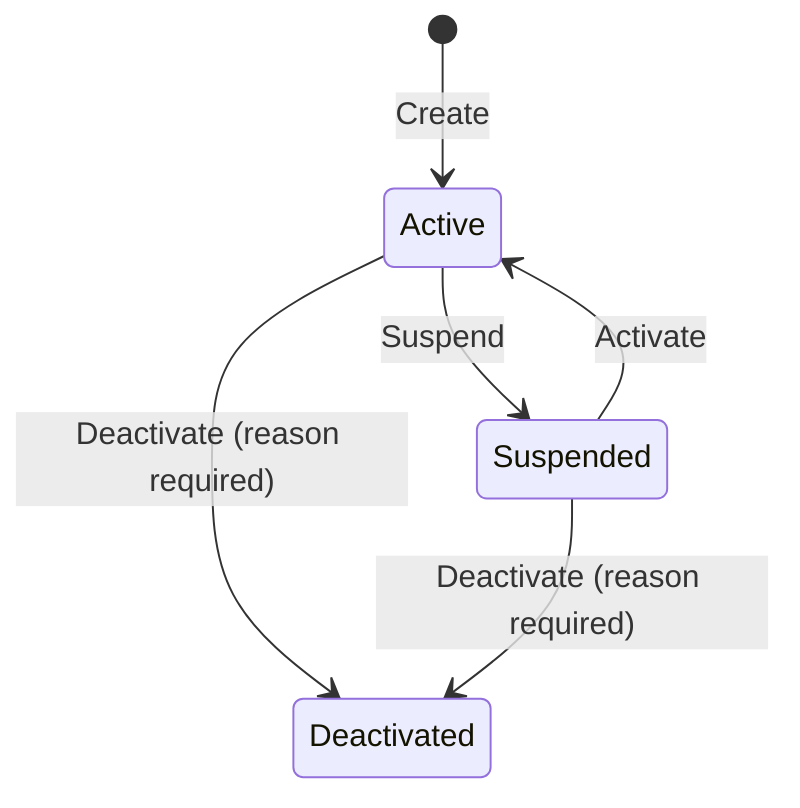
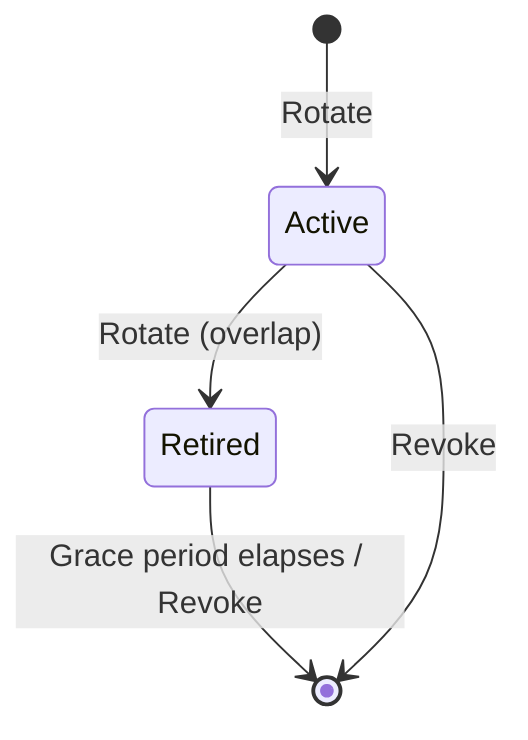

import { FileTree, Tabs, TabItem, Aside } from "@astrojs/starlight/components";

Every SaaS that ships webhooks eventually grows the same admin screen: a list of
subscriptions, a "rotate secret" button that nobody dares click in production, a
suspend/resume toggle that's harder to write than it looks, a delivery log with
filters, and a "send test ping" button that copy-pastes the Stripe UX. That's two to
three sprints of work per project — and most teams cut corners on the secret rotation
flow exactly where security matters most.

**`Granit.Webhooks.Endpoints`** is that admin surface, finished. CRUD, lifecycle
transitions, **dual-key signing rotation with overlap**, test pings, 24-hour
delivery stats, and queryable subscription/delivery lists — all behind a permission
gate, all SSRF-hardened, all OpenAPI-described. Wire one line, ship a UI on top.

| Pain | What this package gives you |
|------|-----------------------------|
| Building a webhook admin UI from scratch | One `MapGranitWebhooks()` call exposes the full CRUD + lifecycle + ops surface |
| "Rotate secret" that breaks every consumer at once | Dual-key rotation with overlap grace period — both signatures accepted during the cutover |
| Lifecycle bugs (suspend ≠ deactivate, can you reactivate a deactivated sub?) | Explicit `Active / Suspended / Deactivated` state machine, enforced server-side |
| SSRF in webhook registration | URL validator + DNS-rebinding-proof `ConnectCallback` at delivery time |
| "Did this delivery actually go through?" — no audit | Queryable `WebhookDeliveryAttempt` log + 24h stats endpoint |
| Stripe-style _test ping_ to debug consumer endpoints | `POST /subscriptions/{id}/test-ping` returns HTTP status + duration |
| Two permissions (Read vs Manage) without splitting endpoint registration | Read at group level, Manage layered via `RequireAuthorization` on mutating sub-groups |

## Package structure

<FileTree>

- Granit.Webhooks.Endpoints/
  - Endpoints/
    - WebhookEventTypeEndpoints.cs `GET /event-types`
    - WebhookSubscriptionReadEndpoints.cs `GET /subscriptions/{id}`
    - WebhookSubscriptionWriteEndpoints.cs Create / Update / Delete
    - WebhookSubscriptionLifecycleEndpoints.cs Activate / Suspend / Deactivate
    - WebhookSubscriptionOperationEndpoints.cs Rotate secret, test ping, 24h stats
    - WebhookSigningKeyEndpoints.cs Dual-key rotation (`/keys` CRUD)
  - Dtos/ Request + response records
  - Validators/ FluentValidation, auto-applied via MapGranitGroup
  - Permissions/ AIPermissions-style constants
  - Options/ WebhooksEndpointsOptions (route prefix, OpenAPI tag)
  - Localization/ 18 cultures
- Granit.Webhooks Core abstractions (subscription readers/writers, signing keys)
- Granit.Webhooks.EntityFrameworkCore Persistence + queryable source

</FileTree>

## Installation

```csharp
// Program.cs
app.MapGranitWebhooks();

// With custom options:
app.MapGranitWebhooks(opts =>
{
    opts.RoutePrefix = "admin/webhooks";
    opts.TagName = "Webhook Administration";
});

// Redelivery surface (mapped separately so hosts can scope its auth differently):
app.MapGranitWebhooksRedelivery();
```

`MapGranitWebhooks()` returns the parent `RouteGroupBuilder` so you can chain
framework filters (CORS, rate limit policy, additional metadata) on the whole admin
surface.

## Configuration

| Option | Default | Description |
|--------|---------|-------------|
| `RoutePrefix` | `"webhooks"` | Route prefix for every admin endpoint |
| `TagName` | `"Webhooks"` | OpenAPI tag for endpoint grouping |

## Authorization

Two permissions, declared by `WebhooksPermissionDefinitionProvider` and
auto-discovered by [`Granit.Authorization`](/dotnet/security/authorization/):

| Permission | Endpoints |
|------------|-----------|
| `Webhooks.Subscriptions.Read` | Discovery, Read, Query, Stats, **list signing keys** |
| `Webhooks.Subscriptions.Manage` | Create / Update / Delete, Lifecycle, Rotate secret, Test ping, **rotate / revoke signing keys** |

The route group applies `Read` at the top level; mutating sub-groups layer `Manage`
via `RequireAuthorization` (ISO 27001 A.5.15 — least privilege).

:::tip[Grant model]
Grant `Read` to monitoring dashboards and support roles. Reserve `Manage` for
platform administrators who can create subscriptions or rotate keys.
:::

## Endpoint catalogue

### Discovery

| Method | Route | Description |
|--------|-------|-------------|
| `GET` | `/event-types` | List every event type registered via `IWebhookEventTypeDefinitionProvider`, with localized display name + description + category |

The frontend hits this once to populate the "Event type" dropdown when creating a
subscription. Labels respect the `Accept-Language` header. Unknown event types are
rejected on `POST /subscriptions` — call this first.

### Subscriptions — read

| Method | Route | Description |
|--------|-------|-------------|
| `GET` | `/subscriptions/{id:guid}` | Get a subscription by ID |
| `POST` | `/subscriptions/query` | `MapGranitQuery<WebhookSubscription>` — filter, sort, page, groupBy |

The query endpoint inherits all [QueryEngine](/dotnet/building-blocks/query-engine/)
features (saved views, presets, metadata endpoint).

### Subscriptions — write

| Method | Route | Description | HTTP |
|--------|-------|-------------|------|
| `POST` | `/subscriptions` | Create — returns the signing secret **once** | `201` |
| `PUT` | `/subscriptions/{id:guid}` | Update target URL | `200` |
| `DELETE` | `/subscriptions/{id:guid}` | Hard-delete a subscription | `204` |

```json
// POST /webhooks/subscriptions
{
  "targetUrl": "https://customer-app.example.com/hooks/granit",
  "eventType": "Invoicing.InvoicePaid"
}

// 201 Created
{
  "id": "5b1d8e26-…",
  "targetUrl": "https://customer-app.example.com/hooks/granit",
  "eventType": "Invoicing.InvoicePaid",
  "status": "Active",
  "signingSecret": "wh_sec_HxF6KqRz…"
}
```

<Aside type="caution">
The `signingSecret` is returned **exactly once** at creation. The framework stores
only the HMAC-protected value. If the consumer loses it, rotate — there's no
retrieve endpoint.
</Aside>

### Lifecycle



| Method | Route | Use when |
|--------|-------|----------|
| `POST` | `/subscriptions/{id:guid}/suspend` | Consumer is down or you want to pause without losing config |
| `POST` | `/subscriptions/{id:guid}/activate` | Resume a `Suspended` subscription |
| `POST` | `/subscriptions/{id:guid}/deactivate` | Permanent end-of-life (reason required, audited) — no return to `Active` |

`Deactivate` requires a reason in the body (`WebhookSubscriptionDeactivateRequest`,
max 1000 chars). The reason is persisted on the audit trail — useful when a customer
later asks "why did our webhook stop firing six months ago?".

### Operations

| Method | Route | Description |
|--------|-------|-------------|
| `POST` | `/subscriptions/{id:guid}/rotate-secret` | Rotate the **legacy single-secret** HMAC (returns new secret once) |
| `POST` | `/subscriptions/{id:guid}/test-ping` | Stripe-style test ping → returns `{ success, httpStatusCode, durationMs }` |
| `GET` | `/stats` | Aggregate stats: total subscriptions, active/suspended/deactivated counts, last-24h deliveries, success rate, avg response time |

`test-ping` is the single feature operators ask for most. It posts a synthetic event
to the target URL and reports the consumer's actual HTTP response — invaluable for
"is your endpoint up?" support conversations.

```json
// POST /webhooks/subscriptions/{id}/test-ping
// 200 OK
{ "success": true, "httpStatusCode": 200, "durationMs": 187 }
```

### Signing keys — dual-key rotation

The single-secret model breaks every consumer when you rotate. The dual-key model
ships keys with an **overlap grace period**: when you rotate, both the old and the new
key are accepted for `WebhooksOptions.RetiredKeyGracePeriod` (default 24 hours), so
consumers can update their verification code without downtime.

| Method | Route | Permission | Description |
|--------|-------|------------|-------------|
| `GET` | `/subscriptions/{id:guid}/keys` | `Read` | List keys (`Active`, `Retired`, `Revoked`). The secret is never returned. |
| `POST` | `/subscriptions/{id:guid}/keys` | `Manage` | Rotate: mint a new `Active`, move the previous `Active` to `Retired` for the grace period. Returns the plain secret **once** (`201`). |
| `DELETE` | `/subscriptions/{id:guid}/keys/{keyId:guid}` | `Manage` | Revoke a key. The last `Active` key cannot be revoked — rotate first. |



Verification accepts signatures from both `Active` and `Retired` keys until the
`Retired` window closes. See
[Signing keys](/dotnet/api/webhooks/signing-keys/) for the full algorithm,
verification fallback, and consumer migration guide.

### Redelivery

Mapped separately via `MapGranitWebhooksRedelivery()` (own route scope so hosts can
apply stricter auth — e.g. step-up MFA):

| Method | Route | Description |
|--------|-------|-------------|
| `POST` | `/deliveries/{deliveryId:guid}/retry` | Retry a previously failed delivery attempt |

Responses: `202 Accepted`, `404` not found, `409` if not retryable (already
succeeded or terminal failure).

### Delivery query

When `Granit.Webhooks.EntityFrameworkCore` is registered, both subscriptions and
delivery attempts are exposed through `MapGranitQuery<T>`:

| Route | Backed by |
|-------|-----------|
| `POST /subscriptions/query` | `WebhookSubscription` |
| `POST /deliveries/query` | `WebhookDeliveryAttempt` |

Filter, sort, paginate, groupBy — the same surface admins use everywhere else in
Granit. Saved views work out of the box.

## DTOs

| DTO | Direction | Used by |
|-----|-----------|---------|
| `WebhookEventTypeResponse` | Output | `GET /event-types` |
| `WebhookSubscriptionCreateRequest` | Input | `POST /subscriptions` |
| `WebhookSubscriptionCreatedResponse` | Output | `POST /subscriptions` — includes `SigningSecret` |
| `WebhookSubscriptionUpdateRequest` | Input | `PUT /subscriptions/{id}` |
| `WebhookSubscriptionResponse` | Output | `GET /subscriptions/{id}`, lifecycle endpoints |
| `WebhookSubscriptionDeactivateRequest` | Input | `POST /deactivate` (mandatory `Reason`) |
| `WebhookSubscriptionRotateSecretResponse` | Output | `POST /rotate-secret` |
| `WebhookSubscriptionTestPingResponse` | Output | `POST /test-ping` |
| `WebhookSubscriptionStatsResponse` | Output | `GET /stats` |
| `WebhookSigningKeyResponse` | Output | `GET /subscriptions/{id}/keys` |
| `WebhookSigningKeyCreatedResponse` | Output | `POST /subscriptions/{id}/keys` — includes `PlainSecret` |

## Validation

Every request DTO is auto-validated via `FluentValidation` through `MapGranitGroup()`:

- **Target URL** — HTTPS only, absolute URI, max 2048 chars.
- **SSRF protection (registration)** — blocks private IP ranges (`10.0.0.0/8`,
  `172.16.0.0/12`, `192.168.0.0/16`, `169.254.0.0/16`, `100.64.0.0/10`), localhost,
  link-local IPv6, and reserved TLDs (`.local`, `.internal`, `.onion`). Powered by
  [`Granit.Http.UrlSafety`](/dotnet/api/url-safety/).
- **SSRF protection (delivery)** — `SocketsHttpHandler.ConnectCallback` validates the
  **resolved IP** at connection time, defeating DNS rebinding.
- **Event type** — non-empty, max 200 chars, **must exist in the event-type registry**.
  Unknown types are rejected with `Granit:Validation:UnknownWebhookEventType` —
  always call `GET /event-types` before submitting a create form.
- **Deactivation reason** — non-empty, max 1000 chars.

## Idempotency

The signing key rotation endpoints (`POST /keys`, `DELETE /keys/{keyId}`) carry
`[Idempotent(Required = false)]` — clients may send `Idempotency-Key` to deduplicate
retries. See [Idempotency](/dotnet/api/idempotency/) for the framework's replay
protection.

## See also

- [Webhooks (core)](/dotnet/api/webhooks/) — publisher, delivery engine, retry policy, exponential backoff
- [Signing keys (dual-key rotation)](/dotnet/api/webhooks/signing-keys/) — full state flow, verification fallback, consumer migration
- [Granit.Http.UrlSafety](/dotnet/api/url-safety/) — the SSRF validator behind URL checks
- [QueryEngine](/dotnet/building-blocks/query-engine/) — engine powering `/subscriptions/query` and `/deliveries/query`
- [Authorization](/dotnet/security/authorization/) — permission grant administration
- [Idempotency](/dotnet/api/idempotency/) — replay-safe key rotation
