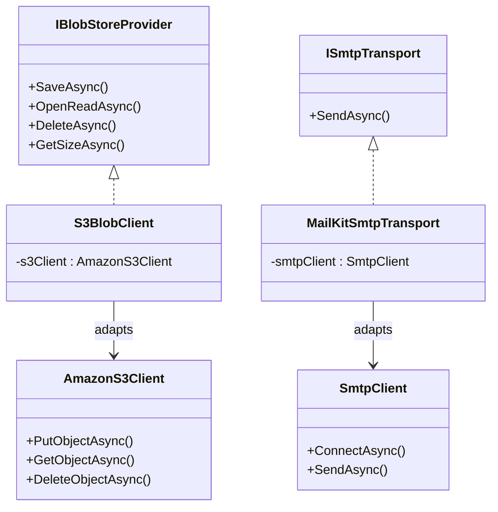

## Definition

The Adapter pattern converts the interface of an existing class into the
interface expected by the client, allowing incompatible components to
collaborate. The adapter wraps the existing class and translates calls.

## Diagram



## Implementation in Granit

| Adapter | File | Target interface | Adapted class |
|---------|------|------------------|---------------|
| `S3BlobClient` | `src/Granit.BlobStorage.S3/Internal/S3BlobClient.cs` | `IBlobStoreProvider` + `IPresignedUrlProvider` | `AmazonS3Client` (AWS SDK) |
| `MailKitSmtpTransport` | `src/Granit.Notifications.Smtp/Internal/MailKitSmtpTransport.cs` | `ISmtpTransport` | `SmtpClient` (MailKit, sealed) |

## Rationale

`S3BlobClient` isolates the framework from the AWS SDK, allowing provider
changes (European hosting, MinIO) without touching the core.
`MailKitSmtpTransport` wraps the sealed MailKit `SmtpClient` behind a
testable `ISmtpTransport` interface.

Both ports are `internal` to their owning package: adapters are a framework
extension point, not a host extension point. Hosts select a provider through
its registration extension rather than by implementing the port.

## Usage example

Swapping AWS S3 for MinIO is the same adapter pointed at a different endpoint
— `AddGranitBlobStorageS3()` binds `S3BlobOptions` from the `BlobStorage`
configuration section:

```jsonc
// appsettings.Development.json — credentials come from Granit.Vault in production.
{
  "BlobStorage": {
    "ServiceUrl": "http://localhost:9000",
    "ForcePathStyle": true
  }
}
```

```csharp
builder.AddGranitBlobStorageS3();

// The rest of the application code remains unchanged
IBlobStorage blobStorage = serviceProvider.GetRequiredService<IBlobStorage>();
PresignedUploadTicket ticket = await blobStorage.InitiateUploadAsync(
    "medical-documents",
    new BlobUploadRequest("mri-report.pdf", "application/pdf", MaxAllowedBytes: 50_000_000),
    cancellationToken);
```

## Further reading

- [Adapter -- refactoring.guru](https://refactoring.guru/design-patterns/adapter)
