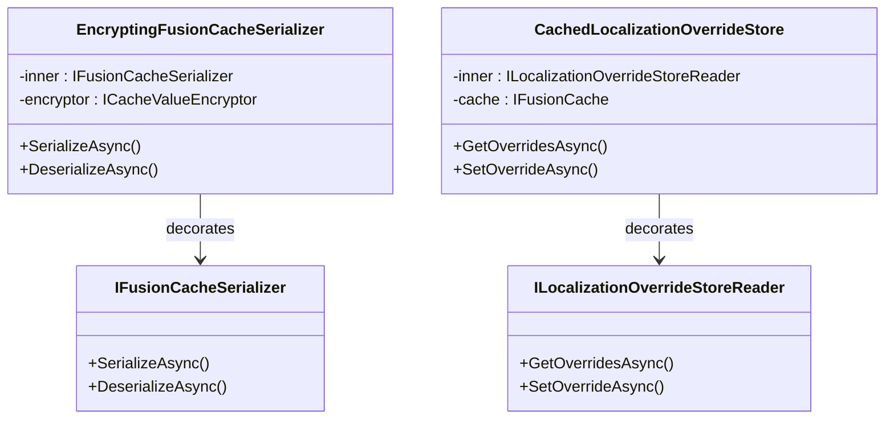

## Definition

The Decorator pattern dynamically adds responsibilities to an object without
modifying its class. Each decorator wraps the original object and enriches
its behavior (serialization, encryption, caching, anti-stampede protection).

## Diagram



## Implementation in Granit

| Decorator | File | Target | Added responsibilities |
|-----------|------|--------|-----------------------|
| `EncryptingFusionCacheSerializer` | `src/Granit.Caching/Internal/EncryptingFusionCacheSerializer.cs` | `IFusionCacheSerializer` | AES-256-GCM authenticated encryption of L2 (Redis) cache values |
| `CachedLocalizationOverrideStore` | `src/Granit.Localization/Internal/CachedLocalizationOverrideStore.cs` | `ILocalizationOverrideStoreReader` | FusionCache with per-tenant invalidation |

**Custom variant -- Conditional encryption**: `EncryptingFusionCacheSerializer`
wraps the inner serializer and applies AES-256-GCM authenticated encryption to all
values written to L2 (Redis). L1 (in-process) stores unencrypted objects. Per-type
encryption is resolved via `CacheEncryptionResolver` using the `[CacheEncrypted]` attribute.

## Rationale

Separating concerns (encryption, caching) from business logic allows testing
and configuring them independently. The localization decorator avoids hitting
the database on every translation resolution.

## Usage example

```csharp
// The consumer uses IFusionCache -- the decorator is transparent
IFusionCache cache = serviceProvider
    .GetRequiredService<IFusionCache>();

PatientDto patient = await cache.GetOrSetAsync(
    $"patient:{patientId}",
    async (ctx, ct) => await db.Patients.FindAsync([patientId], ct),
    cancellationToken: cancellationToken);

// Behind the scenes:
// 1. Check L1 (in-process memory)
// 2. If miss -> check L2 (Redis, decrypted via EncryptingFusionCacheSerializer)
// 3. If miss -> native stampede protection (only one factory call)
// 4. Execute the factory
// 5. Store in L1 + serialize -> encrypt -> store in L2 (Redis)
```

## Further reading

- [Decorator -- refactoring.guru](https://refactoring.guru/design-patterns/decorator)
