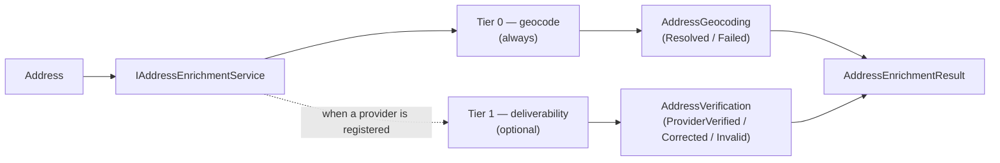

import { Aside } from "@astrojs/starlight/components";

An entity that holds an `Address` almost always wants the two **derived** axes
beside it — where the address geocodes, and whether it's deliverable. Wiring each
consumer to call the geocoder, then maybe a verification provider, then map both
onto the value objects, is the kind of boilerplate that drifts between modules.
`Granit.AddressEnrichment` is the one orchestrator that does it.

```csharp
public interface IAddressEnrichmentService
{
    Task<AddressEnrichmentResult> EnrichAsync(Address address, CancellationToken ct = default);
}

public sealed record AddressEnrichmentResult(
    AddressGeocoding Geocoding,
    AddressVerification Verification);
```

One `Address` in; the two value objects an address-holding entity persists
alongside the postal text out — ready to hand to
[`MapAddressGeocoding` / `MapAddressVerification`](/dotnet/building-blocks/address-value-objects/#persistence--flat-queryable-columns).

## Two tiers, one of them optional

`EnrichAsync` runs the [evidence tiers](/dotnet/building-blocks/address-platform/#three-evidence-tiers)
the platform defines — the two that a *machine* can run unattended:



**Tier 0 — geocoding (always).** The service geocodes
`address.ToPostalAddress()` through [`IGeocodingService`](/dotnet/building-blocks/geocoding/).
A hit becomes `AddressGeocoding.Resolved(coordinate, precision, …)` (carrying the
parsed house number); a miss becomes `AddressGeocoding.Failed(now)`. Because the
geocoding service is itself a [no-op when no provider is registered](/dotnet/building-blocks/geocoding/#three-contracts-one-privacy-guarantee),
tier 0 degrades gracefully to `Failed` rather than throwing.

**Tier 1 — deliverability (optional).** If — and only if — an
[`IAddressDeliverabilityService`](/dotnet/building-blocks/address-deliverability/)
is registered, the service checks the address against it and maps the provider's
outcome onto the verification verdict. With no provider, `Verification` stays
`AddressVerification.Unverified` and tier 1 is silently skipped.

| Provider outcome | Recorded verdict | Source |
|------------------|------------------|--------|
| `Verified` | `ProviderVerified` | `VerificationProvider` |
| `Corrected` | `Corrected` | `VerificationProvider` |
| `Invalid` | `Invalid` | `VerificationProvider` |
| `Unverifiable` | `Unverified` | — |

The provider's raw match code is carried into the verdict's `Evidence` field for
provenance.

<Aside type="note" title="Tier 2 is not here — by design">
`EnrichAsync` produces only the two *automatable* tiers. The strongest evidence —
`ManuallyConfirmed`, `DeliveryConfirmed` — comes from real-world outcomes a
consuming module records (an operator confirming, a courier delivering). See how
the [Parties module](/dotnet/business/parties/) layers tier-2 confirmation on top
of enrichment in the [platform overview](/dotnet/building-blocks/address-platform/#how-the-parties-module-consumes-it).
</Aside>

## Setup

```csharp
[DependsOn(typeof(GranitAddressEnrichmentModule))]
public sealed class CrmModule : GranitModule { }
```

`GranitAddressEnrichmentModule` depends on `GranitGeocodingModule`, so a geocoding
service is always present (the no-op default when no provider is installed).
`IAddressEnrichmentService` is registered **scoped**. Deliverability is wired as a
soft dependency — register a provider to light up tier 1, leave it out to stay at
geocoding plausibility:

```csharp
public sealed class CustomerWriter(IAddressEnrichmentService enrichment)
{
    public async Task SetAddressAsync(Customer customer, Address address, CancellationToken ct)
    {
        AddressEnrichmentResult e = await enrichment.EnrichAsync(address, ct);
        customer.SetAddress(address, e.Geocoding, e.Verification);
    }
}
```

<Aside type="tip" title="Run it off the request path">
Geocoding and deliverability are network calls to rate-limited providers — don't
block an HTTP write on them. The established pattern is to persist the address
with `AddressGeocoding.Pending`, raise a domain event, and enrich in a background
job (on-demand plus a periodic sweep for `Pending` / `Stale` / `Failed` rows).
The [Parties module](/dotnet/business/parties/) does exactly this.
</Aside>

## See also

- [Address value objects](/dotnet/building-blocks/address-value-objects/) — the
  `AddressGeocoding` and `AddressVerification` shapes `EnrichAsync` returns.
- [Geocoding](/dotnet/building-blocks/geocoding/) — tier 0.
- [Address deliverability](/dotnet/building-blocks/address-deliverability/) — the
  tier-1 contract.
- [Address platform overview](/dotnet/building-blocks/address-platform/) — the
  three axes and three evidence tiers.
