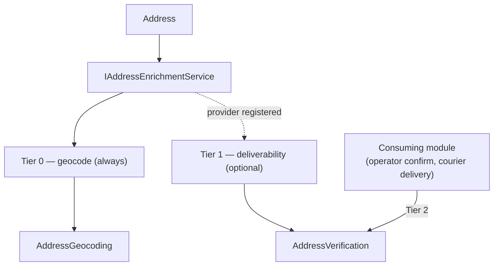

import { Aside, CardGrid, LinkCard } from "@astrojs/starlight/components";

Addresses look simple and behave like anything but. A system that *acts* on them
— ships parcels, plots customers on a map, lets users pick one as they type —
keeps tripping over the same conflations: treating "we found a coordinate" as "the
address is real", re-geocoding the same row on every render, or shipping a
personal address to a third-party API that logs it. The **address platform** is
the set of Granit packages that settle these questions once, so every module
handles addresses the same way.

It rests on three ideas: an address has **three independent axes**, its
deliverability is established through **three evidence tiers**, and providers
expose their abilities through a **capability model**.

## Three orthogonal axes

An address carries three separate facts, and they **do not move together**:

| Axis | Value object | Answers |
|------|--------------|---------|
| **Postal** | [`Address`](/dotnet/building-blocks/address-value-objects/#address--the-postal-fact) | What did the user type? |
| **Geocoding** | [`AddressGeocoding`](/dotnet/building-blocks/address-value-objects/#addressgeocoding--the-spatial-outcome) | Where is it on a map? |
| **Verification** | [`AddressVerification`](/dotnet/building-blocks/address-value-objects/#addressverification--the-deliverability-verdict) | Is it real and deliverable? |

The independence is the whole point. A brand-new **rural** address can be
geocoding-`Failed` (no OpenStreetMap node for the lane) yet `DeliveryConfirmed`
because a courier physically dropped a parcel there last week. A typo-perfect
**city-centre** address geocodes to a crisp `Rooftop` coordinate yet stays
`Unverified` because nothing has ever confirmed a person receives mail there — or
even verifies `Invalid`, because the building was demolished. Collapse the three
into one "is the address good?" boolean and you throw away exactly the
distinctions that drive the next decision: plot the marker, ship the parcel, or
ask the user to re-check.

These are mutualized value objects in the base `Granit` package, persisted as
**flat, queryable columns** — so "show every customer whose address is `Failed`"
or "count parties `DeliveryConfirmed` this quarter" is a plain SQL filter. See
[Address value objects](/dotnet/building-blocks/address-value-objects/) for the
full API and persistence model.

## Three evidence tiers

The verification axis isn't a single yes/no — it's a verdict backed by evidence
of **escalating strength**. The platform defines three tiers, and records *which*
one produced the verdict so a weak guess is never mistaken for a hard fact:

| Tier | Evidence | Strength | Where it runs |
|------|----------|----------|---------------|
| **0** | **Geocoding plausibility** — the address exists on OSM at some precision | Weak (existence, not deliverability) | [`Granit.Geocoding`](/dotnet/building-blocks/geocoding/) — free, self-hostable |
| **1** | **Authoritative provider** — DPV / RDI via Smarty, Loqate, Google Address Validation | Strong | [`Granit.AddressDeliverability.Abstractions`](/dotnet/building-blocks/address-deliverability/) — contract only, no provider in the baseline |
| **2** | **Real-world evidence** — an operator confirmed, or a delivery / mailing succeeded | Strongest | the consuming module (e.g. [Parties](/dotnet/business/parties/)) |

Tiers 0 and 1 are *automatable* — a machine runs them unattended, which is
exactly what the [enrichment orchestrator](/dotnet/building-blocks/address-enrichment/)
does: tier 0 always, tier 1 when an authoritative provider is registered. Tier 2
can only come from the real world, so the consuming module records it — and,
crucially, a tier-2 verdict is **never downgraded** by a later tier-0/1 pass.

## The capability model

Geocoding providers differ in what they can do — Nominatim does precise forward
and reverse lookups; Photon adds typo-tolerant autocomplete. Rather than a
lowest-common-denominator interface, providers implement **segmented capability
interfaces**, and the engine aggregates them into a `GeocodingCapabilities`
record:

| Capability | Nominatim | Photon |
|------------|:---------:|:------:|
| Forward (address → coordinate) | ✓ | ✓ |
| Reverse (coordinate → address) | ✓ | ✓ |
| Autocomplete (typeahead) | ✗ | ✓ |

The payoff is honest surfaces: the [HTTP endpoints](/dotnet/building-blocks/geocoding-endpoints/)
map `/autocomplete` **only** when an autocomplete-capable provider is installed,
so a deployment's OpenAPI document reflects exactly what it can actually do — no
runtime "not supported" errors. See
[Geocoding — the capability matrix](/dotnet/building-blocks/geocoding/#providers-and-the-capability-matrix).

## The packages

<CardGrid>
  <LinkCard title="Address value objects" href="/dotnet/building-blocks/address-value-objects/" description="Address, AddressGeocoding, AddressVerification + the flat-column EF helpers — the shared vocabulary." />
  <LinkCard title="Geocoding" href="/dotnet/building-blocks/geocoding/" description="Forward / reverse / autocomplete behind one privacy-first contract. Nominatim + Photon, self-hostable, hashed-key cache." />
  <LinkCard title="Geocoding endpoints" href="/dotnet/building-blocks/geocoding-endpoints/" description="Capability-gated GET /geocoding/autocomplete and /reverse. Authenticated; host applies a per-principal rate limit." />
  <LinkCard title="Address enrichment" href="/dotnet/building-blocks/address-enrichment/" description="One Address in, both derived value objects out. Tier 0 always; tier 1 optional." />
  <LinkCard title="Address deliverability" href="/dotnet/building-blocks/address-deliverability/" description="The tier-1 verification contract. Abstractions only — a host registers a provider." />
</CardGrid>

## How the Parties module consumes it

[`granit-business`](/dotnet/business/parties/) is the reference consumer. Its
`PartyAddress` entity owns all three axes — the postal `Address`, plus
`AddressGeocoding` (default `Pending`) and `AddressVerification` (default
`Unverified`) — mapped to flat columns with the framework's
`MapAddressGeocoding` / `MapAddressVerification` helpers. From there:

- **Enrichment runs off the request path.** Adding, updating, or removing an
  address raises a domain event that dispatches an **on-demand** geocode job; a
  **recurring sweep** (every five minutes) catches `Pending` / `Stale` / `Failed`
  rows that a missed dispatch or a provider outage left behind. Both call
  `IAddressEnrichmentService`, and verification is **promote-only** — a provider
  pass never overwrites a tier-2 `ManuallyConfirmed` / `DeliveryConfirmed` verdict.
- **Tier-2 evidence has an endpoint.** `POST /parties/{id}/addresses/{addressId}/confirm`
  records a `ManuallyConfirmed` (operator) or `DeliveryConfirmed` (courier /
  postal) verdict; the inverse records `Invalid` when a delivery comes back.
- **Analytics reads the flat columns.** The dashboard
  [Map widget](/dotnet/business/dashboards/endpoints/#map--geocoded-markers)'s
  `LatLng` point source reads the materialized `Latitude` / `Longitude` straight
  off the geocoding columns — no per-render geocoding.

<Aside type="note" title="Spatial PostGIS is a planned opt-in">
The persisted scalars (`Latitude` / `Longitude`) are the source of truth and the
portable default. A PostGIS `geography(Point)` column — a derived spatial index
unlocking server-side `ST_DWithin` / `ST_Within` filters — is designed into the
Map widget's `Geography` point source but **not yet shipped**; it will arrive as
an opt-in `Granit.Analytics.PostGIS` projector, never as the source of truth.
</Aside>

## Privacy posture

A coordinate that pins where a named person lives is **personal data**, and the
platform treats it that way end to end: address and coordinate fields carry
`[SensitiveData(Confidential)]`, geocoding **never logs** an address or coordinate
and **never** puts either in a cache key (keys are hashed), third-party geocoding
and deliverability are deliberate opt-ins (the default geocoding service is a
no-op), and on a subject-erasure request the consuming module erases the stored
address through its [`IPrivacyDataProvider`](/dotnet/compliance/privacy/).

<Aside type="caution" title="Two geo-data regimes, deliberately different">
The address-coordinate persisted on a business entity is **referential PII** — it
is stored on purpose and erased on a subject request. The **IP-derived**
geolocation of a session is a *different* regime: it is deliberately **not**
persisted. They answer different questions and live under different retention
rules — don't reach for one to populate the other.
</Aside>

## See also

- [Address value objects](/dotnet/building-blocks/address-value-objects/)
- [Geocoding](/dotnet/building-blocks/geocoding/) ·
  [Geocoding endpoints](/dotnet/building-blocks/geocoding-endpoints/)
- [Address enrichment](/dotnet/building-blocks/address-enrichment/) ·
  [Address deliverability](/dotnet/building-blocks/address-deliverability/)
- [ADR-072 — Address platform](/dotnet/architecture/adr/072-address-platform-geocoding-and-verification/)
  — the design decisions behind the three axes and flat-column persistence.
- [Parties](/dotnet/business/parties/) — the reference consumer.
