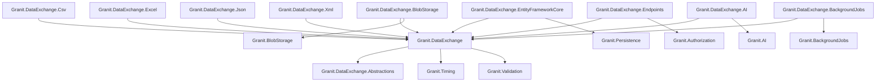
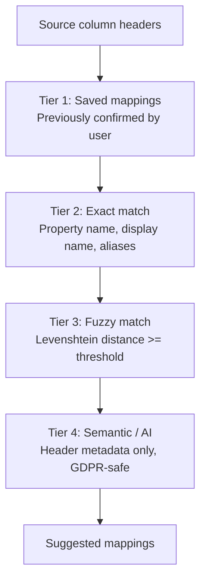
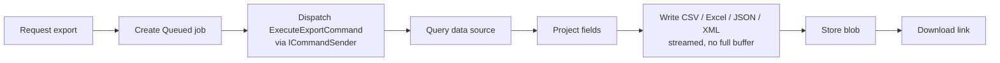

import { Tabs, TabItem, FileTree, Badge } from "@astrojs/starlight/components";

Granit.DataExchange provides a complete import/export pipeline for tabular data.
Imports follow a guided flow: upload a file, preview headers, receive intelligent
column mapping suggestions, confirm, then execute a typed pipeline with batched
persistence and detailed, errors-as-data reporting. Exports use a whitelist-based
field definition, optional presets, and always dispatch asynchronously. Both
pipelines require a registered `ICommandSender` — `Granit.Wolverine` is the
reference provider, giving durable outbox-backed execution.

## Package structure

<FileTree>
- Granit.DataExchange.Abstractions/ Pure contracts: `ImportDefinition<T>`, `ExportDefinition<T>`, mapping descriptors, DTOs
  - Granit.DataExchange/ Core: typed import/export pipelines, fluent definitions, mapping suggestion engine, registration-based export fallback
    - Granit.DataExchange.BlobStorage Bridges `IDataExchangeFileProvider` to `IBlobStoreProvider` (S3, Azure, FileSystem)
    - Granit.DataExchange.Csv CSV parser (Sep SIMD), writer (semicolon separator), correction-file generator
    - Granit.DataExchange.Excel Excel parser (Sylvan.Data.Excel) and writer (ClosedXML)
    - Granit.DataExchange.Json Export-only writer (System.Text.Json), hierarchical fields
    - Granit.DataExchange.Xml Export-only writer (System.Xml), `<Export>` root element
    - Granit.DataExchange.EntityFrameworkCore `DataExchangeDbContext`, EF executor, batch identity resolvers, stores
    - Granit.DataExchange.Endpoints REST endpoints for import/export operations
    - Granit.DataExchange.AI AI-powered mapping suggestions for cryptic CSV/Excel column names
    - Granit.DataExchange.BackgroundJobs GDPR retention sweep for import/export files and job records

</FileTree>

| Package | Role | Depends on |
|---------|------|------------|
| `Granit.DataExchange.Abstractions` | Pure contracts — `ImportDefinition<T>`, `ExportDefinition<T>`, mapping descriptors. Per [ADR-020](/dotnet/architecture/adr/020-declarative-definitions-placement/), each module ships its own `ExportDefinition<T>` referencing only this package — no upstream dependency on the import/export runtime | `Granit` |
| `Granit.DataExchange` | Typed import/export pipelines, mapping suggestion engine, registration-based fallback `ExportDefinition` when none is declared | `Granit.DataExchange.Abstractions`, `Granit.Timing`, `Granit.Validation` |
| `Granit.DataExchange.BlobStorage` | Bridges file operations to blob storage providers | `Granit.DataExchange`, `Granit.BlobStorage` |
| `Granit.DataExchange.Csv` | Sep-based CSV parser, semicolon CSV writer, `ICorrectionFileGenerator` | `Granit.DataExchange` |
| `Granit.DataExchange.Excel` | Sylvan streaming Excel reader, ClosedXML writer | `Granit.DataExchange` |
| `Granit.DataExchange.Json` | Export-only writer over `System.Text.Json` — hierarchical/complex fields, enum-as-string, per-row streaming. Format key `json` (`application/json`) | `Granit.DataExchange` |
| `Granit.DataExchange.Xml` | Export-only writer over `System.Xml` — `<Export>` root, `XmlSerializer` caching. Format key `xml` (`application/xml`) | `Granit.DataExchange` |
| `Granit.DataExchange.EntityFrameworkCore` | `DataExchangeDbContext`, EF executor, batch identity resolvers | `Granit.DataExchange`, `Granit.Persistence` |
| `Granit.DataExchange.Endpoints` | 19 REST endpoints (import + export + metadata) | `Granit.DataExchange`, `Granit.Authorization` |
| `Granit.DataExchange.AI` | `ISemanticMappingService` — LLM-powered "Nom_Clt_V2_Final → CustomerName" mapping inside the import wizard | `Granit.DataExchange`, `Granit.AI` |
| `Granit.DataExchange.BackgroundJobs` | `DataExchangeRetentionSweepJob` — GDPR retention sweep for import/export files and job records (Art. 5(1)(e)) | `Granit.DataExchange`, `Granit.BackgroundJobs` |

## Dependency graph



## Setup

<Tabs>
<TabItem label="Full stack (production)">

```csharp
[DependsOn(
    typeof(GranitDataExchangeEntityFrameworkCoreModule),
    typeof(GranitDataExchangeBlobStorageModule),
    typeof(GranitDataExchangeEndpointsModule),
    typeof(GranitDataExchangeCsvModule),
    typeof(GranitDataExchangeExcelModule),
    typeof(GranitWolverineModule),
    typeof(GranitWolverinePostgresqlModule))]
public class AppModule : GranitModule
{
    public override void ConfigureServices(ServiceConfigurationContext context)
    {
        // Register import definitions
        context.Services.AddImportDefinition<Patient, PatientImportDefinition>();

        // Register export definitions
        context.Services.AddExportDefinition<Patient, PatientExportDefinition>();
    }
}
```

```csharp
// Map endpoints in Program.cs
app.MapGranitDataExchange();

// Or with a custom route prefix
app.MapGranitDataExchange(opts =>
{
    opts.RoutePrefix = "admin/data-exchange";
});
```

:::caution[ICommandSender is required]
Both orchestrators take a hard constructor dependency on `Granit.Commands.ICommandSender` to
dispatch `ExecuteImportCommand` / `ExecuteExportCommand` for asynchronous execution — there is
no in-process fallback. Register a messaging provider (`Granit.Wolverine` +
`Granit.Wolverine.Postgresql`, or another `ICommandSender` implementation) or DI resolution
fails at startup. See [Wolverine integration](#wolverine-integration) below.
:::

</TabItem>
<TabItem label="Minimal (import only, no persistence)">

```csharp
[DependsOn(
    typeof(GranitDataExchangeCsvModule),
    typeof(GranitDataExchangeExcelModule))]
public class AppModule : GranitModule
{
    public override void ConfigureServices(ServiceConfigurationContext context)
    {
        context.Services.AddImportDefinition<Patient, PatientImportDefinition>();
    }
}
```

No EF Core, no endpoints. Useful for CLI tools or custom orchestration.

</TabItem>
</Tabs>

## Configuration

<Tabs>
<TabItem label="Import options">

```json
{
  "DataExchange:Import": {
    "DefaultMaxFileSizeMb": 50,
    "DefaultBatchSize": 500,
    "FuzzyMatchThreshold": 0.8,
    "DeleteUploadedFileOnSuccess": false
  }
}
```

| Property | Default | Description |
|----------|---------|-------------|
| `DefaultMaxFileSizeMb` | `50` | Max upload size (overridable per definition) |
| `DefaultBatchSize` | `500` | Rows per `SaveChanges` batch |
| `FuzzyMatchThreshold` | `0.8` | Minimum Levenshtein similarity for fuzzy tier (0.0 - 1.0) |
| `DeleteUploadedFileOnSuccess` | `false` | GDPR opt-in (Art. 5(1)(e)): delete the uploaded source file as soon as the import completes with **zero** failed rows — nothing is left to correct. Imports with at least one failed row always keep the file so `GET /{jobId}/correction-file` can still regenerate it. |

</TabItem>
<TabItem label="Export options">

Bound from `DataExchange:Export` — the section currently has no settings of its own; export
sizing/dispatch is controlled entirely by the caller's request and the writer's own limits (e.g.
the Excel row cap, see [Export pipeline](#export-pipeline)).

</TabItem>
</Tabs>

## File storage

Both import and export pipelines need to store files (uploaded CSV/Excel for import,
generated output for export). The `IDataExchangeFileProvider` interface abstracts
this concern with four operations: `OpenAsync`, two `SaveAsync` overloads, and `DeleteAsync`.

By default, `Granit.DataExchange` registers a **fail-fast** `NullDataExchangeFileProvider` —
every call throws `NotImplementedException` with an actionable message. This is intentional:
a host that forgets to wire a concrete provider should fail loudly at first use, not silently
lose uploaded files. Register a concrete implementation explicitly:

- **Production** — add `Granit.DataExchange.BlobStorage` (below).
- **Tests / single-process CLI tools** — call `services.AddInMemoryDataExchangeFileProvider()`.
  Registered as a **singleton** (files live in a `ConcurrentDictionary`) so uploaded files
  survive across DI scopes — upload, preview, and background execution each run in their own
  scope, and a scoped in-memory store would lose every file at scope end.

```csharp
// Streaming save — used by the export pipeline to avoid a full in-memory buffer of the
// generated file. writeAsync receives the destination stream directly.
Task<BlobReference> SaveAsync(
    string fileName,
    string contentType,
    Func<Stream, CancellationToken, Task> writeAsync,
    CancellationToken cancellationToken = default);
```

### Using the BlobStorage adapter

The simplest approach is to add `Granit.DataExchange.BlobStorage`, which bridges
`IDataExchangeFileProvider` to the registered blob storage provider (S3, Azure Blob,
FileSystem, etc.):

```csharp
[DependsOn(typeof(GranitDataExchangeBlobStorageModule))]
public class AppModule : GranitModule { }
```

```json
{
  "DataExchange:BlobStorage": {
    "ContainerName": "data-exchange"
  }
}
```

| Property | Default | Description |
|----------|---------|-------------|
| `ContainerName` | `data-exchange` | Key-prefix segment in the object path (not a physical bucket) |
| `DefaultContentType` | `application/octet-stream` | MIME type for stored export files |

### Custom implementation

For scenarios where blob storage is not available (CLI tools, local file system,
custom testing), implement `IDataExchangeFileProvider` directly and register it —
as a **singleton** if it holds in-process state (like the in-memory default), scoped
otherwise:

```csharp
services.Replace(ServiceDescriptor.Singleton<IDataExchangeFileProvider, MyFileProvider>());
```

## Import pipeline

Definitions build a **typed pipeline at registration time** — there is no runtime reflection
in the hot path. Each `ImportDefinition<T>` is compiled once into an `IImportPipelineDescriptor`
(entity type known statically) that the orchestrator looks up by definition name via
`IImportPipelineRegistry`. Row-by-row work flows as **errors-as-data**: mapping, validation, and
identity resolution never throw for a bad row — each source row yields a `RowOutcome<TEntity>`
(`Ok`, `Failed`, or `Skipped`), and every failure surfaces as an `ImportRowError` in the final
`ImportReport` instead of silently disappearing.

### Pipeline overview



```mermaid
flowchart LR
    A[Upload file] --> B[Extract headers]
    B --> C[Preview rows]
    C --> D["Suggest mappings<br/>4-tier"]
    D --> E["User confirms<br/>mappings"]
    E --> F[Parse rows]
    F --> G["Map to entities<br/>RowOutcome stream"]
    G --> H[Validate rows]
    H --> I["Resolve identity<br/>batched, key-based"]
    I --> J["Execute batch<br/>INSERT / UPDATE"]
    J --> K[Report + correction file]
```

### Default mapping and overriding it

By default, every `ImportDefinition<T>` is mapped by a `CompiledDataMapper<TEntity>` — an
internal `IDataMapper<TEntity>` implementation built once from the definition using
expression-tree setters and TryParse-first converters (`bool`, numeric types, `Guid`, enums,
`DateTime`/`DateTimeOffset`/`DateOnly`/`TimeOnly`, with optional `.Format(...)`). Bad cell
values never throw — they come back as `CellConversionError` entries that flow into
`ImportRowError` with `ImportRowErrorKind.Conversion`. Structural problems (a declared property
that doesn't exist, has no public setter, or is an unsupported type; an entity with no public
parameterless constructor) fail fast at pipeline construction with an actionable message —
these are definition bugs, not row data.

To customize mapping beyond what the compiled mapper supports, register a custom
`IDataMapper<TEntity>` for that entity — the pipeline resolves it from DI first and only
falls back to the compiled default when nothing is registered:

```csharp
services.AddScoped<IDataMapper<Patient>, CustomPatientMapper>();
```

### Import definition

Each entity requires an `ImportDefinition<T>` that declares importable properties
using a fluent API. Only explicitly declared properties are available for column
mapping (whitelist pattern).

```csharp
public sealed class PatientImportDefinition : ImportDefinition<Patient>
{
    public override string Name => "Acme.PatientImport";

    protected override void Configure(ImportDefinitionBuilder<Patient> builder)
    {
        builder
            .HasBusinessKey(p => p.Niss)
            .Property(p => p.Niss, p => p.DisplayName("NISS").Required())
            .Property(p => p.LastName, p => p.DisplayName("Last name").Required())
            .Property(p => p.FirstName, p => p.DisplayName("First name").Required())
            .Property(p => p.Email, p => p
                .DisplayName("Email")
                .Aliases("Courriel", "E-mail", "Mail"))
            .Property(p => p.BirthDate, p => p
                .DisplayName("Date of birth")
                .Format("dd/MM/yyyy"))
            .ExcludeOnUpdate(p => p.Niss);
    }
}
```

**Property configuration options:**

| Method | Description |
|--------|-------------|
| `.DisplayName(string)` | User-facing label (used in preview UI and mapping suggestions) |
| `.Description(string)` | Sent to the AI mapping service as field metadata |
| `.Aliases(params string[])` | Alternative names for exact and fuzzy matching |
| `.Required(bool)` | Import-level required validation (independent of entity `[Required]`) |
| `.Format(string)` | Expected format for type conversion (e.g. `"dd/MM/yyyy"`) |

**Identity resolution:**

| Method | Description |
|--------|-------------|
| `.HasBusinessKey(p => p.Niss)` | Single natural key for INSERT vs UPDATE resolution |
| `.HasCompositeKey(p => p.Code, p => p.Year)` | Multi-column business key |
| `.HasExternalId()` | External ID column for cross-system identity mapping (via a dedicated mapping table) |

:::note[Parent/child grouping — not yet available]
An earlier design explored a `.GroupBy(...)` + `.HasMany(...)` surface for parent/child rows
(e.g. an invoice header with line items on the same sheet). It was removed before release —
each `ImportDefinition<T>` targets a single flat entity type. Grouped/hierarchical import is
deferred to a future version.
:::

### Batch identity resolution

Identity is resolved **per batch, not per row**: `IRecordIdentityResolver<TEntity>.ResolveBatchAsync`
takes the whole chunk of mapped entities and returns one `RecordIdentity` per input (same order),
so an implementation can issue a single `WHERE key IN (...)` query per batch instead of one
round-trip per row. `RecordIdentity` carries a non-generic `EntityKey` (structural, value-based
equality — no live entity reference, since resolvers run against their own short-lived context)
and a `RecordOperation`: `Insert`, `Update`, `Upsert`, `Skip`, or `Ambiguous`. `Granit.DataExchange.EntityFrameworkCore`
ships three registration helpers, matching the builder methods above:

```csharp
services.AddBusinessKeyResolver<Patient, ClinicDbContext>();   // .HasBusinessKey(...)
services.AddCompositeKeyResolver<Invoice, ClinicDbContext>();  // .HasCompositeKey(...)
services.AddExternalIdResolver<Patient, ClinicDbContext>();    // .HasExternalId()
```

Each resolver prefetches existing rows by key (tracked by the executor's context), so the
executor can apply updates in place and persist external-ID mappings once new rows are inserted.
A row that fails identity resolution (e.g. `Ambiguous`) surfaces as an `ImportRowError` with
`ImportRowErrorKind.Identity` rather than aborting the batch.

### 4-tier mapping suggestions

When headers are extracted from the uploaded file, the mapping suggestion service
runs four tiers in order. Columns matched by a higher-confidence tier are excluded
from lower tiers:



| Tier | Confidence | Source |
|------|------------|--------|
| Saved | `MappingConfidence.Saved` | Previously confirmed mappings stored in database |
| Exact | `MappingConfidence.Exact` | Case-insensitive match on property name, display name, or aliases |
| Fuzzy | `MappingConfidence.Fuzzy` | Levenshtein similarity above `FuzzyMatchThreshold` |
| Semantic | `MappingConfidence.Semantic` | AI-backed service (opt-in, only header metadata sent) |

:::tip
The semantic tier uses `ISemanticMappingService`, which defaults to a no-op. To enable AI
mapping, register your implementation:

```csharp
services.AddSemanticMappingService<OpenAiMappingService>();
```

Only column header names and field metadata are sent to the AI provider — never row data (GDPR-safe).
:::

### Import job lifecycle

| Status | Description |
|--------|-------------|
| `Created` | File uploaded, job created |
| `Previewed` | Headers extracted, preview and mapping suggestions generated |
| `Mapped` | Column mappings confirmed by the user |
| `Executing` | Import running (background handler) |
| `Completed` | All rows imported successfully |
| `PartiallyCompleted` | Some rows failed, others succeeded |
| `Failed` | Import failed entirely |
| `Cancelled` | Cancelled by the user (only from Created, Previewed, or Mapped) |

State transitions are **guarded** — calling a transition from an invalid state throws
`InvalidOperationException`. The valid transition graph is:

```text
Created → Previewed → Mapped → Executing → Completed / PartiallyCompleted / Failed
                                    ↑
Created / Previewed / Mapped → Cancelled
```

### Execution options

```csharp
new ImportExecutionOptions
{
    BatchSize = 500,       // Rows per SaveChanges batch
    DryRun = true,         // Full pipeline with transaction rollback
    ErrorBehavior = ImportErrorBehavior.SkipErrors,
}
```

| Error behavior | Description |
|----------------|-------------|
| `FailFast` | Stop immediately on the first error |
| `SkipErrors` | Skip errored rows, continue processing (default) |
| `CollectAll` | Process all rows, collect all errors without stopping |

An `IImportExecutor<TEntity>` must be registered per entity to persist rows — the EF Core
implementation is added via `services.AddImportExecutor<Patient, ClinicDbContext>()`
(`Granit.DataExchange.EntityFrameworkCore`). Without one, the pipeline throws at execution
time with a message naming the missing registration.

### Correction file

After an import that leaves at least one row in `ImportReport.RowErrors` (i.e. `SkipErrors` or
`CollectAll` with failures), `GET /{jobId}/correction-file` streams a real CSV built by
`ICorrectionFileGenerator` — registered as `CsvCorrectionFileGenerator` by
`AddGranitDataExchangeCsv()`. It re-reads the original upload with the same parser
configuration and re-emits only the failed rows, faithfully round-tripping the original
columns plus an appended `_ImportError` column (grouped so a row with multiple errors is
emitted once). Users fix the flagged rows and re-upload. The endpoint returns `204 No Content`
when there are no failed rows, or when no `ICorrectionFileGenerator` is registered.

## Export pipeline

Every export request is dispatched **asynchronously** — there is no row-count threshold or
synchronous path. `IExportOrchestrator.ExportAsync` validates the definition and format, creates
an `ExportJob` in `Queued` status, and sends `ExecuteExportCommand` via `ICommandSender`; the
actual write happens later when `ExecuteExportCommandHandler` calls `ExecuteAsync` on the same
orchestrator.

### Pipeline overview



### Export definition

Each entity requires an `ExportDefinition<T>` with a field whitelist. Only declared
fields can appear in the output:

```csharp
public sealed class PatientExportDefinition : ExportDefinition<Patient>
{
    public override string Name => "Acme.PatientExport";
    public override string? QueryDefinitionName => "Acme.Patients";

    protected override void Configure(ExportDefinitionBuilder<Patient> builder)
    {
        builder
            .IncludeBusinessKey()
            .Field(p => p.LastName, f => f.Header("Last name"))
            .Field(p => p.FirstName, f => f.Header("First name"))
            .Field(p => p.Email)
            .Field(p => p.BirthDate, f => f
                .Header("Date of birth")
                .Format("dd/MM/yyyy"))
            .Field(p => p.Company, c => c.Name, f => f.Header("Company"));
    }
}
```

**Field configuration options:**

| Method | Description |
|--------|-------------|
| `.Header(string)` | Column header name in the exported file |
| `.Format(string)` | Display format (e.g. `"dd/MM/yyyy"`, `"#,##0.00"`) |
| `.Order(int)` | Column order (lower values first) |

**Definition-level options:**

| Method | Description |
|--------|-------------|
| `.IncludeId()` | Include entity `Id` column for roundtrip import compatibility |
| `.IncludeBusinessKey()` | Include business key columns from the matching import definition |
| `.IncludeMetadata()` | Append mapped extra properties (from `MapProperty<T>()`) as additional export fields at runtime |

**Navigation fields** use a two-argument `Field()` overload for dot-notation traversal.
The developer must ensure the corresponding `Include()` is present in the
`IExportDataSource<T>` implementation.

### Export writers

`IExportWriter.WriteAsync` streams rows into the output — each row is an `object?[]` aligned by
index to the `IReadOnlyList<ExportFieldDescriptor>` field list (`rows[i][j]` belongs to
`fields[j]`), and the method returns the number of data rows written:

```csharp
Task<long> WriteAsync(
    Stream output,
    IReadOnlyList<ExportFieldDescriptor> fields,
    IAsyncEnumerable<object?[]> rows,
    CancellationToken cancellationToken = default);
```

Writers declare `ExportFormatCapabilities` (`TabularOnly` by default; JSON/XML override to
`Structured` to accept `ComplexField`/hierarchical values) via an optional interface member.
The Excel writer additionally enforces the `.xlsx` worksheet cap — see [File format
support](#file-format-support) below.

### Automatic fallback (registration-based)

When no explicit `ExportDefinition<T>` is registered for an entity, the system can
auto-generate one by introspecting the entity's public properties — but only for `DbContext`
types the host has explicitly opted in:

```csharp
// Granit.DataExchange.EntityFrameworkCore — opts a DbContext into auto-export discovery
// and the fallback IExportDataSource<T>. Idempotent; call once per DbContext.
services.AddDataExchangeDbContext<ClinicDbContext>();
```

Discovery is **strictly registration-based** — there is no assembly scanning. Entities in a
`DbContext` that was never passed to `AddDataExchangeDbContext<TContext>()` are invisible to
both auto-export and the fallback data source, even if an explicit `ExportDefinition<T>` exists
for a *different* entity in the same context. This is a migration point: hosts relying on the
generic EF fallback for entities without an explicit `ExportDefinition<T>` must add this call
for every `DbContext` those entities live in; entities with an explicit `IExportDataSource<T>`
don't need it.

Auto-generated definitions use the naming convention `Auto.{EntityTypeName}`
(e.g. `Auto.Tenant`, `Auto.BlobDescriptor`) and are discoverable via
`GET /metadata/definitions` alongside explicit definitions.

:::tip[Convention over configuration]
Explicit definitions **always take precedence**. When a module registers an
`ExportDefinition<T>`, the auto-generated fallback for that entity is automatically
replaced. This enables progressive adoption: start with the fallback, then add
explicit definitions for entities that need custom headers, formats, or navigation fields.
:::

**Property filtering rules** — the fallback reuses existing security attributes
(no dedicated `[ExportIgnore]` attribute):

| Condition | Action | Rationale |
|-----------|--------|-----------|
| `[SensitiveData]` (any level, any mode) | Excluded | GDPR Art. 25 — all PII excluded by default |
| `[AuditIgnore]` on property | Excluded | If not audited, not exported |
| `[Encrypted(KeyIsolation = true)]` | Excluded | Crypto-shredded data |
| Collection properties (`IEnumerable<T>`) | Excluded | Navigation collections |
| `byte[]`, `JsonDocument`, `JsonElement` | Excluded | Binary/JSON blobs |
| `ConcurrencyStamp`, `SecurityStamp` | Excluded | Infrastructure properties |

The API response includes an `IsAutoGenerated` boolean so the admin UI can
display a visual indicator (e.g. "default export — customize via ExportDefinition").

```json title="GET /metadata/definitions — response excerpt"
[
  {
    "name": "Acme.PatientExport",
    "entityType": "Patient",
    "supportedFormats": ["xlsx", "csv"],
    "isAutoGenerated": false
  },
  {
    "name": "Auto.Tenant",
    "entityType": "Tenant",
    "supportedFormats": ["xlsx", "csv"],
    "isAutoGenerated": true
  }
]
```

**Data source fallback** — once its `DbContext` is registered via
`AddDataExchangeDbContext<TContext>()`, `DbContextExportDataSource<T>` resolves the context
for a given entity type via `DbContextResolver` (enumerates registered
`DataExchangeDbContextRegistration` entries — no scanning). The queryable uses
`AsNoTracking()` for performance, except when the entity has mapped extra properties
(`IHasMetadata` with `MapProperty<T>()`) — in that case tracking is enabled so shadow property
values can be read, with periodic `ChangeTracker.Clear()` to prevent memory bloat during bulk
exports. Navigation properties are NOT auto-included — for navigation fields, use an explicit
`ExportDefinition<T>` with a matching `IExportDataSource<T>`.

### Pre-built definitions — none, by design

There is **no** central `Granit.DataExchange.Definitions` aggregation package. Per
[ADR-020](/dotnet/architecture/adr/020-declarative-definitions-placement/), every framework
module owns its own `ExportDefinition<T>` (and matching `QueryDefinition<T>`) in its own
`Exports/` / `Queries/` folder, referencing only `Granit.DataExchange.Abstractions` — never a
shared, central package. `Granit.DataExchange` itself follows this convention for its own job
entities:

```csharp
// Granit.DataExchange/Exports/ImportJobExportDefinition.cs (abridged)
public sealed class ImportJobExportDefinition : ExportDefinition<ImportJob>
{
    public override string Name => "Granit.DataExchange.ImportJobExport";

    protected override void Configure(ExportDefinitionBuilder<ImportJob> builder)
    {
        builder
            .IncludeId()
            .Field(e => e.DefinitionName)
            .Field(e => e.EntityTypeName)
            .Field(e => e.OriginalFileName)
            .Field(e => e.MimeType)
            .Field(e => e.FileSizeBytes)
            .Field(e => e.BlobReference)
            .Field(e => e.Status)
            .Field(e => e.CompletedAt, f => f.Format("O"))
            .Field(e => e.TenantId)
            .IncludeAuditFields();
    }
}
```

Registration is per-module (`context.Services.AddExportDefinition<ImportJob, ImportJobExportDefinition>()`
inside `AddGranitDataImport()`) — there is no umbrella module to depend on. Applications add
export coverage for their own entities the same way: write an `ExportDefinition<T>` next to the
entity's module and register it, or rely on the [automatic fallback](#automatic-fallback-registration-based)
above for entities that don't need custom headers, formats, or navigation fields.

### Export presets

Presets are named field selections that users can save and reuse. They are stored
in the database via `IExportPresetReader` / `IExportPresetWriter`. The REST API
exposes CRUD operations under `/metadata/presets/`.

### Export job lifecycle

| Status | Description |
|--------|-------------|
| `Queued` | Job created and queued for background execution |
| `Exporting` | Export currently being generated |
| `Completed` | File available for download |
| `Failed` | Export failed |

State transitions are **guarded**: `Queued → Exporting → Completed / Failed`.

### Query integration

When `QueryDefinitionName` is set on an export definition, the export pipeline
delegates filtering and sorting to `IQueryEngine<T>` from `Granit.QueryEngine`.
This reuses the same whitelist-based filtering pipeline as the grid view —
the user's active filters are applied to the export.

## File format support

| Format | Parser (import) | Writer (export) | Package |
|--------|-----------------|-----------------|---------|
| CSV | [Sep](https://github.com/nietras/Sep) (SIMD-accelerated) | Semicolon separator (EU locale) | `Granit.DataExchange.Csv` |
| Excel (.xlsx, .xls) | [Sylvan.Data.Excel](https://github.com/MarkPflug/Sylvan.Data.Excel) (streaming) | [ClosedXML](https://github.com/ClosedXML/ClosedXML) | `Granit.DataExchange.Excel` |
| JSON (.json) | — | `System.Text.Json` (hierarchical fields, enum-as-string) | `Granit.DataExchange.Json` |
| XML (.xml) | — | `System.Xml` (`<Export>` root, `XmlSerializer`) | `Granit.DataExchange.Xml` |

:::note[JSON and XML are export-only]
Both ship a writer but no parser — they serialize query results out, they do not
import. CSV and Excel remain the round-trip (import **and** export) formats.
:::

:::note[Macro-enabled Excel files not supported]
`.xlsb` (macro-enabled binary workbooks) are rejected at upload. This prevents
macro execution when exported files are re-served to users.
:::

:::caution[xlsx row cap]
The Excel writer caps a worksheet at 1,048,576 rows (the Office Open XML hard limit) — 1
header row plus at most 1,048,575 data rows. It checks the cap per row and fails fast with an
actionable error instead of buffering gigabytes before ClosedXML rejects the workbook. For
datasets that exceed the cap, export to CSV or JSON instead.
:::

:::caution
At least one parser package must be registered. The core module provides **no** file
parser by default. If neither CSV nor Excel is installed, upload will fail at runtime.
:::

## REST endpoints

All endpoints require authorization under a **flat permission model** — `Execute` does **not**
imply `Read`. Grant both to a role that needs full access; grant only `Read` for view-only
access to job history, reports, and definitions. Read-only GET endpoints (job listing, status,
report, correction file, export definitions/fields, preset listing, download) require
`DataExchange.Imports.Read` / `DataExchange.Exports.Read`; mutating endpoints (upload, mapping
confirmation, execution, dry-run, cancellation, export job creation, preset save/delete)
require `DataExchange.Imports.Execute` / `DataExchange.Exports.Execute`.

### Import endpoints

| Method | Path | Permission | Description |
|--------|------|------------|-------------|
| `GET` | `/jobs` | `Imports.Read` | List import jobs |
| `POST` | `/jobs` | `Imports.Execute` | Upload file (creates import job) |
| `POST` | `/{jobId}/preview` | `Imports.Execute` | Extract headers and generate mapping suggestions |
| `PUT` | `/{jobId}/mappings` | `Imports.Execute` | Confirm column mappings |
| `POST` | `/{jobId}/execute` | `Imports.Execute` | Execute the import |
| `POST` | `/{jobId}/dry-run` | `Imports.Execute` | Full pipeline with transaction rollback |
| `GET` | `/{jobId}` | `Imports.Read` | Get import job status |
| `DELETE` | `/{jobId}` | `Imports.Execute` | Cancel import job |
| `GET` | `/{jobId}/report` | `Imports.Read` | Get import report (success/error counts, row details) |
| `GET` | `/{jobId}/correction-file` | `Imports.Read` | Download CSV with failed rows and error messages |

### Export endpoints

| Method | Path | Permission | Description |
|--------|------|------------|-------------|
| `GET` | `/export/jobs` | `Exports.Read` | List export jobs |
| `POST` | `/export/jobs` | `Exports.Execute` | Create and execute export |
| `GET` | `/export/jobs/{id}` | `Exports.Read` | Get export job status |
| `GET` | `/export/jobs/{id}/download` | `Exports.Read` | Download exported file |

### Metadata endpoints

| Method | Path | Permission | Description |
|--------|------|------------|-------------|
| `GET` | `/metadata/definitions` | `Exports.Read` | List registered export definitions |
| `GET` | `/metadata/definitions/{name}/fields` | `Exports.Read` | List available fields for a definition |
| `GET` | `/metadata/presets/{definitionName}` | `Exports.Read` | List saved presets for a definition |
| `POST` | `/metadata/presets` | `Exports.Execute` | Save a field selection preset |
| `DELETE` | `/metadata/presets/{definitionName}/{presetName}` | `Exports.Execute` | Delete a preset |

## EF Core persistence

`Granit.DataExchange.EntityFrameworkCore` provides:

- **`DataExchangeDbContext`** with entities for import jobs, export jobs, saved mappings,
  external ID mappings, and export presets. All entities implement `IMultiTenant` for
  automatic tenant query filtering via `ApplyGranitConventions`.
- **`EfImportExecutor<TEntity, TContext>`** — batched INSERT/UPDATE executor with `SaveChanges`
  per batch; consumes the `RowOutcome<TEntity>` stream and folds every outcome into the final
  `ImportReport`.
- **Identity resolvers**: `BusinessKeyResolver`, `CompositeKeyResolver`, `ExternalIdResolver` —
  batch-resolve `IRecordIdentityResolver<TEntity>` by prefetching existing rows by key.

| Entity | Purpose |
|--------|---------|
| `ImportJob` | Aggregate root tracking import job lifecycle, mappings, and report |
| `ExportJob` | Aggregate root tracking export job lifecycle and file location |
| `SavedMappingEntity` | Persists confirmed column mappings for reuse (Tier 1) |
| `ExternalIdMappingEntity` | Maps external identifiers to internal entity IDs |
| `ExportPresetEntity` | Named field selection presets |

## Wolverine integration

There is no `Granit.DataExchange.Wolverine` package and no in-memory fallback dispatcher.
Both orchestrators take a hard constructor dependency on `Granit.Commands.ICommandSender` to
dispatch `ExecuteImportCommand` / `ExecuteExportCommand` for asynchronous execution — DI
resolution fails at startup if nothing implements it. `Granit.Wolverine` (+
`Granit.Wolverine.Postgresql` for the durable outbox) is the reference provider: it registers
`WolverineCommandSender` bridging onto Wolverine's `IMessageBus`. A custom `ICommandSender`
implementation is equally valid for a non-Wolverine messaging stack.

Terminal integration events (`ImportJobCompletedEto`, `ExportJobCompletedEto`) are **not**
published through a separate event-publisher service — they are buffered on the aggregate via
`AddDistributedEvent()` inside `ImportJob`/`ExportJob` behavior methods (`Complete()`, `Fail()`,
etc.) and flushed through the transactional outbox pre-commit, alongside the same `SaveChanges`
call that persists the job's terminal status. There is no dedicated `ExportJobFailedEto` — a
failed export raises the same `ExportJobCompletedEto` with `Status = ExportJobStatus.Failed`,
so consumers switch on `Status` rather than subscribing to a separate failure event.

## Public API summary

| Category | Key types | Package |
|----------|-----------|---------|
| Module | `GranitDataExchangeModule`, `GranitDataExchangeBlobStorageModule`, `GranitDataExchangeCsvModule`, `GranitDataExchangeExcelModule`, `GranitDataExchangeEntityFrameworkCoreModule`, `GranitDataExchangeEndpointsModule`, `GranitDataExchangeBackgroundJobsModule` | --- |
| Import pipeline | `IImportOrchestrator`, `IImportPipeline`, `IImportPipelineRegistry`, `IMappingSuggestionService`, `IFileParser`, `IDataMapper<T>`, `IRowValidator<T>`, `IImportExecutor<T>` | `Granit.DataExchange` |
| Import definition | `ImportDefinition<T>`, `ImportDefinitionBuilder<T>`, `PropertyMappingBuilder` | `Granit.DataExchange.Abstractions` |
| Import identity | `IRecordIdentityResolver<T>`, `RecordIdentity`, `RecordOperation`, `EntityKey` | `Granit.DataExchange` |
| Import reporting | `ImportReport`, `ImportRowError`, `ImportRowErrorKind`, `RowOutcome<T>`, `ImportProgress`, `ICorrectionFileGenerator` | `Granit.DataExchange` |
| Export pipeline | `IExportOrchestrator`, `IExportWriter`, `IExportDataSource<T>` | `Granit.DataExchange` |
| Export definition | `ExportDefinition<T>`, `ExportDefinitionBuilder<T>`, `ExportFieldBuilder`, `ExportFieldDescriptor` | `Granit.DataExchange.Abstractions` |
| Export fallback | `IExportDefinitionProvider`, `IAutoExportDefinitionSource`, `ExportPropertyFilter`, `AddDataExchangeDbContext<T>()` | `Granit.DataExchange`, `Granit.DataExchange.EntityFrameworkCore` |
| Export extra props | `IExtraExportFieldProvider`, `IExportExtraValueResolver` | `Granit.DataExchange` |
| Export presets | `IExportPresetReader`, `IExportPresetWriter` | `Granit.DataExchange` |
| GDPR retention | `GranitDataExchangeBackgroundJobsModule`, `DataExchangeRetentionSweepJob`, `DataExchangeRetentionOptions` | `Granit.DataExchange.BackgroundJobs` |
| Mapping | `MappingConfidence`, `ImportColumnMapping`, `ISemanticMappingService` | `Granit.DataExchange` |
| File storage | `IDataExchangeFileProvider`, `DataExchangeBlobStorageOptions` | `Granit.DataExchange`, `Granit.DataExchange.BlobStorage` |
| Options | `ImportOptions`, `ExportOptions`, `ImportExecutionOptions` | `Granit.DataExchange` |
| Permissions | `DataExchangePermissions.Imports.{Read,Execute}`, `DataExchangePermissions.Exports.{Read,Execute}` | `Granit.DataExchange.Endpoints` |
| Extensions | `AddImportDefinition<T, TDef>()`, `AddExportDefinition<T, TDef>()`, `AddSemanticMappingService<T>()`, `AddImportExecutor<T, TContext>()`, `AddBusinessKeyResolver<T, TContext>()`, `AddCompositeKeyResolver<T, TContext>()`, `AddExternalIdResolver<T, TContext>()`, `MapGranitDataExchange()` | --- |

## GDPR retention

`Granit.DataExchange.BackgroundJobs` adds a recurring sweep that enforces storage limitation
(GDPR Art. 5(1)(e)) on uploaded and generated files, and bounds how long import/export job
history stays queryable. It is opt-in — the base `Granit.DataExchange` module does not schedule
it — so add the module explicitly:

```csharp
[DependsOn(typeof(GranitDataExchangeBackgroundJobsModule))]
public class AppModule : GranitModule { }
```

This registers `DataExchangeRetentionSweepJob`, declared
`[RecurringJob("0 3 * * *", "data-exchange-retention-sweep")]` — daily at 3:00 AM, via
`Granit.BackgroundJobs`. The handler delegates to `RetentionSweepService`, which:

- **Purges expired files** — marks `FileDeletedAt` and deletes the blob for import/export jobs
  whose file has outlived its retention window.
- **Hard-deletes terminal job records** past `JobRecordRetention` — the metadata row itself
  (file names, error messages, request filters can carry personal data too).
- **Recovers stranded jobs** — a job stuck in `Executing`/`Exporting` longer than
  `StuckJobTimeout` (crashed worker, lost message) is force-failed so its file becomes eligible
  for the purge above; `Executing`/`Exporting` is never itself a terminal state.

It runs as a **system job across all tenant partitions** — it is not scoped to the tenant that
created a given job.

```json
{
  "DataExchange:Retention": {
    "ImportFileRetention": "30.00:00:00",
    "ExportFileRetention": "7.00:00:00",
    "JobRecordRetention": "365.00:00:00",
    "StuckJobTimeout": "06:00:00",
    "SweepBatchSize": 500
  }
}
```

| Property | Default | Description |
|----------|---------|-------------|
| `ImportFileRetention` | 30 days | How long an uploaded import file is kept after the job reaches a terminal state before the sweep purges it from blob storage — uploaded files often carry personal data (raw source rows). |
| `ExportFileRetention` | 7 days | How long a generated export file is kept before purge. Shorter than import retention by default: an export is a derived, re-downloadable artifact, so a long window only prolongs exposure. |
| `JobRecordRetention` | 365 days | How long a terminal job's database row (not the file) is kept before hard-delete. |
| `StuckJobTimeout` | 6 hours | How long a job may sit in a non-terminal executing state before the sweep treats it as stranded and force-fails it. |
| `SweepBatchSize` | 500 | Max jobs processed per category, per run — bounds a single run's duration; the next scheduled run picks up any remainder. |

Options are validated at startup by `DataExchangeRetentionOptionsValidator` (`TimeSpan` values
can't be expressed with `[Range]`).

## Security

The DataExchange module includes several hardening measures:

- **Multi-tenancy isolation** — all entities (`ImportJob`, `ExportJob`, `SavedMappingEntity`,
  `ExternalIdMappingEntity`, `ExportPresetEntity`) implement `IMultiTenant`, activating
  automatic tenant query filters via `ApplyGranitConventions`.
- **Formula injection protection** — CSV and Excel writers neutralize cell values starting
  with `=`, `+`, `-`, `@`, `\t`, or `\r` to prevent spreadsheet formula injection (CWE-1236).
- **Upload validation** — filenames are sanitized via `Path.GetFileName()` to prevent path
  traversal. File extensions are cross-validated against allowed MIME types.
- **State machine guards** — `ImportJob` and `ExportJob` enforce valid state transitions.
  Calling a transition from an invalid state throws `InvalidOperationException`.
- **Error message sanitization** — exception messages stored in the database and published
  via integration events are truncated to 500 characters to prevent information disclosure.
- **Fail-fast file storage default** — the default `IDataExchangeFileProvider` throws rather
  than silently persisting to an unintended location; a host must explicitly choose blob
  storage or the in-memory provider.
- **GDPR retention sweep** — `Granit.DataExchange.BackgroundJobs` purges expired uploaded and
  generated files and hard-deletes terminal job records past retention (Art. 5(1)(e) storage
  limitation); see [GDPR retention](#gdpr-retention) above.
- **AI output validation** — LLM mapping suggestions are validated against the known property
  whitelist and source headers. Confidence scores are clamped to `[0.0, 1.0]`. Preview row
  cell values and target field metadata are sanitized before prompt injection.
- **AI options validation** — `DataExchangeAIOptions` are validated at startup
  (`ValidateOnStart`) to catch misconfigurations (invalid score ranges, zero timeouts).

## See also

- [React companion: Data Exchange](/frontend/business/data-exchange/) — the `@granit` packages that consume this module from React
- [ADR-015: Sep](/dotnet/architecture/adr/015-sep-csv-parsing/) -- Why Sep was chosen for CSV parsing
- [ADR-016: Sylvan.Data.Excel](/dotnet/architecture/adr/016-sylvan-data-excel-parsing/) -- Why Sylvan was chosen for Excel reading
- [Core module](/dotnet/core/module-system/) — Module system, domain types
- [Persistence module](/dotnet/data/persistence/) — EF Core interceptors, `ApplyGranitConventions`
- [Wolverine module](/dotnet/infrastructure/wolverine-messaging/) — Transactional outbox, context propagation
- [Background jobs module](/dotnet/infrastructure/background-jobs/) — Scheduling integration
- [Query Engine](/dotnet/building-blocks/query-engine/) — peer building block: declarative filters / sort / paging
- [TextExtraction](/dotnet/building-blocks/text-extraction/) — peer building block: bytes → plain text for unstructured documents
- [Indexing](/dotnet/building-blocks/indexing/) — peer building block: full-text + hybrid semantic search. Imported rows are commonly indexed in the same Wolverine workflow.
- [API Reference](/api/Granit.DataExchange.html) (auto-generated from XML docs)
