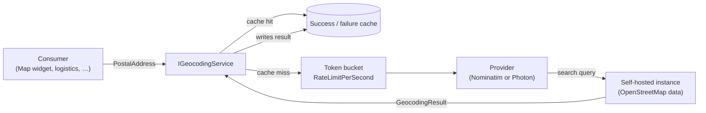

import { FileTree, Aside } from "@astrojs/starlight/components";

Plenty of features end up needing the same answer: *where is this address on a
map?* A dashboard Map widget plots customers. A logistics module clusters
delivery stops. A field-service planner sorts work orders by distance. Each one
reaches for an address-to-coordinate lookup, and the naive shape is one HTTP
call to a hosted geocoder per consumer — each with its own API key, its own rate
limit, and its own habit of logging the full address it just sent over the wire.

That last part matters more than it looks. **A postal address is personal data.**
Shipping one to a third-party geocoder is a cross-border transfer of PII, and
echoing it into structured logs is a second disclosure most teams never notice.

**`Granit.Geocoding`** is the single contract — `IGeocodingService` turning a
`PostalAddress` into a `GeoPoint` — resolved by the DI container so every
consumer geocodes the same way. Two provider packages implement it, both **built
to run self-hosted** so addresses never leave your boundary:
**`Granit.Geocoding.Nominatim`** against [Nominatim](https://nominatim.org/) for
precise structured lookups, and **`Granit.Geocoding.Photon`** against
[Photon](https://photon.komoot.io/) for typo-tolerant, type-as-you-go search —
both built on OpenStreetMap data. Register the one that fits your query style.

| Pain | This module's answer |
|------|----------------------|
| Each consumer wires its own hosted-geocoder client with a different key, retry, and rate limit | One `IGeocodingService` resolved by DI — every consumer geocodes identically |
| Geocoding a personal address ships PII to a third country with no DPA on file | Both providers target a **self-hosted** instance — no PII egress, no sub-processor |
| The geocoder client logs the full address it just resolved | The contract never logs address fields; provider exceptions are logged by type only |
| Hammering the public Nominatim endpoint trips its 1 req/s usage policy and gets you blocked | Built-in token-bucket `RateLimitPerSecond`, defaulting to the public-instance limit |
| Re-geocoding the same address on every dashboard render | Success **and** failure cache with independent TTLs — a bad address isn't re-queried every paint |

## Package structure

<FileTree>

- Granit.Geocoding/ Contract: `IGeocodingService`, `PostalAddress`, `GeoPoint`, `GeocodingResult`, caching decorator
  - Granit.Geocoding.Nominatim/ Provider — Nominatim / OpenStreetMap, structured search + reverse
  - Granit.Geocoding.Photon/ Provider — Photon (Komoot), typo-tolerant autocomplete search

</FileTree>

| Package | Role | Depends on |
|---------|------|------------|
| `Granit.Geocoding` | `IGeocodingService`, `PostalAddress`, `GeoPoint`, `GeocodingResult`, the caching decorator, `AddGranitGeocoding()`. No `[DependsOn]` — the contract root every provider attaches to. | `Granit` |
| `Granit.Geocoding.Nominatim` | `NominatimGeocodingProvider`, `NominatimOptions` (`BaseAddress`, `UserAgent`, `RateLimitPerSecond`). Typed `HttpClient` + token-bucket limiter. Structured field search; precise. | `Granit.Geocoding` |
| `Granit.Geocoding.Photon` | `PhotonGeocodingProvider`, `PhotonOptions` (`BaseAddress`, `Language`, `Limit`, `RateLimitPerSecond`). Typed `HttpClient`; typo-tolerant free-text search tuned for type-as-you-go input. | `Granit.Geocoding` |

<Aside type="note" title="Pure contract, no host plumbing">
`Granit.Geocoding` ships with **zero** ASP.NET Core or EF Core references. CLI
tools, background workers, and import pipelines pull in geocoding without
dragging in the web stack. Only the provider packages add a typed `HttpClient`.
</Aside>

## Contract

```csharp
public interface IGeocodingService
{
    Task<GeocodingResult> GeocodeAsync(
        PostalAddress address,
        CancellationToken cancellationToken = default);
}

public sealed record PostalAddress(
    string? Line1,
    string? Line2,
    string? PostalCode,
    string? City,
    string? Region,
    string? CountryCode);   // ISO 3166-1 alpha-2, e.g. "BE"

public readonly record struct GeoPoint(double Latitude, double Longitude);

public sealed record GeocodingResult(
    GeoPoint? Point,
    GeocodingConfidence Confidence)   // None, Low, Medium, High
{
    public bool Found => Point is not null;
}
```

One method, one input, one output. `GeocodeAsync` returns:

| Result | Meaning | Caller action |
|--------|---------|---------------|
| `Found == true`, `Confidence` ≥ `Medium` | The provider matched the address to a coordinate | Use `Point` |
| `Found == true`, `Confidence == Low` | A coarse match (postcode centroid, city fallback) | Use with a caveat, or treat as unresolved per your tolerance |
| `Found == false` (`Point is null`, `Confidence == None`) | No usable match | Fall back — skip the marker, queue for manual review, don't throw |

Implementations are safe to call concurrently. A failed lookup is a `None`
result, **not** an exception — an unresolvable address is a normal outcome, not
an error, so a Map widget over 10 000 rows never aborts on one bad street name.

## Providers

Both providers implement `IGeocodingService`, sit behind the same cache and
rate-limiter seam, and are **self-hostable** — either one keeps PII in your
boundary. Register exactly one provider module per host; they differ in query
style, not in contract.



| | `Granit.Geocoding.Nominatim` | `Granit.Geocoding.Photon` |
|--|------------------------------|---------------------------|
| Engine | Nominatim (OSM) | Photon / Elasticsearch (Komoot, OSM data) |
| Best at | Precise lookups on clean, stored addresses; reverse geocoding | Typo-tolerant, partial, user-typed input (autocomplete) |
| Query shape | Structured fields (street / city / postalcode / country) | Free-text, optional lat/lon bias |
| Public-instance policy | 1 req/s, mandatory `User-Agent` | Demo instance discourages bulk; no hard rate cap |
| Self-host | Geofabrik extract + `mediagis/nominatim` image | Prebuilt index download + Java service — no import step |

Use **Nominatim** for the stored `PostalAddress` of import pipelines and dashboard
Map widgets, where the data is already validated and precision matters. Use
**Photon** when the address is being typed by a user and you want forgiving,
type-as-you-go matching.

### Nominatim — `Geocoding:Nominatim`

`Granit.Geocoding.Nominatim` wraps the OpenStreetMap
[Nominatim](https://nominatim.org/) search API behind a typed `HttpClient` and a
token-bucket rate limiter, using the structured-search query shape (street /
city / postalcode / country fields, not a free-text blob).

| Option | Default | Role |
|--------|---------|------|
| `BaseAddress` | *(none — required)* | Root URL of the Nominatim instance. Point it at **your** instance; the public `nominatim.openstreetmap.org` is rate-capped and prohibits heavy or commercial use. |
| `UserAgent` | *(none — required)* | Sent on every request. Nominatim's usage policy **mandates** a real identifying `User-Agent` (app name + contact); requests without one are rejected. |
| `RateLimitPerSecond` | `1` | Token-bucket ceiling. `1` matches the public instance's absolute limit; raise it only against an instance you control. |
| `TimeoutSeconds` | `10` | Per-request timeout; on expiry the lookup returns a `None` result. |
| `Language` | `null` | Optional `Accept-Language` for localised place names; `null` uses the instance default. |

`BaseAddress` and `UserAgent` have no safe default, so omitting either fails fast
at startup (`ValidateDataAnnotations().ValidateOnStart()`) rather than silently
degrading every lookup to `None`.

<Aside type="tip" title="Self-host Nominatim">
A full planet import is heavy, but a single-country extract from
[Geofabrik](https://download.geofabrik.de/) imports in minutes and runs in a
container. The official
[`mediagis/nominatim`](https://github.com/mediagis/nominatim-docker) image takes
a `PBF_URL` and serves the same search API. Self-hosting is the difference
between *processing* personal data in-house and *transferring* it to a third
party — see [Privacy and GDPR](#privacy-and-gdpr).
</Aside>

### Photon — `Geocoding:Photon`

`Granit.Geocoding.Photon` wraps [Photon](https://photon.komoot.io/) — Komoot's
OSM-backed geocoder built for search-as-you-type. It sends free-text queries and
tolerates typos and partial input, the better fit when the address comes from a
user typing rather than a validated column.

| Option | Default | Role |
|--------|---------|------|
| `BaseAddress` | *(none — required)* | Root URL of your Photon instance. The demo `photon.komoot.io` is fine for trials but discourages bulk and production use. |
| `Language` | `null` | `lang` parameter (`en`, `de`, `fr`, …) for localised place names; `null` uses the instance default. |
| `Limit` | `1` | Candidates fetched per query; the provider keeps the top match and maps Photon's result rank to `GeocodingConfidence`. |
| `RateLimitPerSecond` | `null` | Optional token-bucket courtesy throttle; `null` runs unthrottled against an instance you control. |
| `UserAgent` | `null` | Optional identifying header — recommended even self-hosted so requests are attributable in your own access logs. |
| `TimeoutSeconds` | `10` | Per-request timeout; on expiry the lookup returns a `None` result. |

Unlike Nominatim, Photon imposes no mandatory `User-Agent` and no fixed rate
policy on your own instance, so `RateLimitPerSecond` defaults to unset. Only
`BaseAddress` is required and has no safe default, so omitting it fails fast at
startup.

<Aside type="tip" title="Self-host Photon">
Photon ships a **prebuilt search index** — download it from
[the Photon project](https://github.com/komoot/photon#installation) and run the
Java service in a container; there is no separate OSM import step like Nominatim's.
A country-scoped index keeps the footprint small. As with Nominatim, self-hosting
is what keeps personal data in-house — see [Privacy and GDPR](#privacy-and-gdpr).
</Aside>

## Caching

Geocoding the same address twice is wasted work and wasted rate-limit budget, so
`Granit.Geocoding` wraps every provider in a caching decorator keyed on the
normalised address. **Successes and failures cache independently**, because they
expire on different clocks:

| Outcome | Option | Default | Rationale |
|---------|--------|---------|-----------|
| Found | `SuccessTtl` | `30d` | Coordinates for a real address are stable for weeks; a long TTL slashes provider traffic. |
| Not found | `FailureTtl` | `1h` | A `None` is often transient (instance cold, address mid-correction). A short TTL stops one bad lookup pinning a marker as missing for a month, without re-querying on every render. |

Caching the failure is the point that's easy to miss: without it, every
unresolvable address re-hits the rate-limited provider on **every** dashboard
paint, and a handful of bad rows can starve the token bucket for the good ones.

```csharp
// appsettings.json
{
  "Geocoding": {
    "Cache": { "SuccessTtl": "30.00:00:00", "FailureTtl": "01:00:00" },
    "Nominatim": {
      "BaseAddress": "https://nominatim.internal.example.com/",
      "UserAgent": "AcmeLogistics/1.4 (ops@acme.example)",
      "RateLimitPerSecond": 1
    }
  }
}
```

The decorator uses the same `FusionCache` instance as the rest of the framework,
so the cache key namespace is tenant-scoped automatically — one tenant's
geocodes never serve another's.

## Setup

```csharp
[DependsOn(typeof(GranitGeocodingNominatimModule))]
public sealed class LogisticsModule : GranitModule { }
```

`GranitGeocodingNominatimModule` depends on `GranitGeocodingModule`, so the
caching decorator and `IGeocodingService` are registered transitively. Swap it
for `GranitGeocodingPhotonModule` to run on Photon — the consumer code below is
identical, only the configuration section changes. After startup:

```csharp
public sealed class DeliveryPlanner(IGeocodingService geocoding)
{
    public async Task<GeoPoint?> LocateAsync(Order order, CancellationToken ct)
    {
        var address = new PostalAddress(
            Line1: order.Street, Line2: null,
            PostalCode: order.PostalCode, City: order.City,
            Region: null, CountryCode: order.CountryCode);

        GeocodingResult result = await geocoding.GeocodeAsync(address, ct);
        return result.Confidence >= GeocodingConfidence.Medium ? result.Point : null;
    }
}
```

`IGeocodingService` is a singleton; safe to inject anywhere.

## Map widget — the `address` point source

The analytics [Map widget](/dotnet/business/dashboards/endpoints/#map--geocoded-markers)
plots `points` with explicit `latitude` / `longitude`. When a dataset stores a
**postal address** rather than coordinates, the widget's `address` source resolves
each row through the registered `IGeocodingService` (cache included) and emits the
same `points` shape — so adding `Granit.Geocoding` plus either provider is all the
Map renderer needs; no analytics-side package. Rows that don't resolve are dropped
from the marker set, not failed, and without a registered `IGeocodingService` the
widget surfaces `Widget:Unavailable.GeocodingNotConfigured`. See
[Dashboards endpoints — Map](/dotnet/business/dashboards/endpoints/#map--geocoded-markers)
for the wire contract and the `address` source declaration.

## Privacy and GDPR

A postal address that identifies a person is **personal data** under GDPR. The
module's defaults are chosen so the safe path is the default path, but the
host owns the legal posture.

<Aside type="caution" title="A self-hosted instance keeps PII in-house">
Running Nominatim or Photon on infrastructure you control means geocoding
**processes** personal data internally — no transfer, no sub-processor, no DPA
required for the geocoding step. This is the recommended deployment for both
providers, and why neither has a default `BaseAddress`: pointing at a geocoder
must be a deliberate choice, not an accidental call to a public third party.
</Aside>

If you point `BaseAddress` at a **third-party** geocoder (the public Nominatim or
Photon demo instance, Google, Mapbox, …), you are transferring personal data to a
processor, and the host must put the full chain in place:

- **Lawful basis** — identify and record the Article 6 basis for the transfer
  (legitimate interest, contract performance, …) before the first call.
- **Data Processing Agreement** — execute an Article 28 DPA with the geocoding
  provider; for non-EU providers, confirm a valid transfer mechanism (adequacy
  decision or SCCs).
- **Minimisation** — send only the fields the lookup needs. Don't pass a name,
  order ID, or customer reference through `PostalAddress`; the contract carries
  address fields only, by design.
- **Records of processing** — list the geocoder as a recipient on your Article 30
  register of processing activities.

<Aside type="caution" title="Never log addresses">
The contract and the Nominatim provider **never** write address fields to logs;
provider exceptions are logged by type only, because some HTTP clients echo the
request URL — which contains the address query string — into 4xx/5xx error
messages. If you add a custom provider or a logging wrapper, hold this line:
log the `Confidence`, the cache key hash, or a row id — never the address.
</Aside>

## See also

- [Dashboards endpoints — Map widget](/dotnet/business/dashboards/endpoints/#map--geocoded-markers)
  — the `points` wire contract and the `address` point source backed by this module.
- [Analytics conventions](/dotnet/business/analytics/conventions/) — where the
  Map widget sits in the BI stack and the address-sourcing convention.
- [Multi-tenancy](/dotnet/infrastructure/multi-tenancy/) — the tenant scoping the
  geocode cache inherits from `FusionCache`.
- [Application settings](/dotnet/infrastructure/application-settings/) — how the
  `Geocoding:Nominatim` options bind and validate on start.
