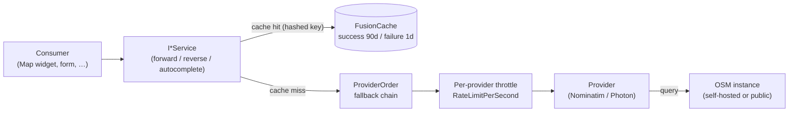

import { FileTree, Aside } from "@astrojs/starlight/components";

Plenty of features end up needing the same handful of answers about an address:
*where is it on a map?* (a dashboard Map widget plotting customers), *what
address is at this pin?* (a field worker dropping a marker), *what is the user
half-way through typing?* (an address autocomplete on a form). The naive shape is
one HTTP call to a hosted geocoder per consumer — each with its own key, its own
rate limit, and its own habit of logging the full address it just sent over the
wire.

That last part matters more than it looks. **A postal address is personal data.**
Shipping one to a third-party geocoder is a cross-border transfer of PII, and
echoing it into structured logs is a second disclosure most teams never notice.

**`Granit.Geocoding`** is the single seam — three small capability contracts,
resolved by DI, so every consumer geocodes the same way and the privacy posture
is set once. Two provider packages implement it against OpenStreetMap data, both
**built to run self-hosted**:
**`Granit.Geocoding.Nominatim`** ([Nominatim](https://nominatim.org/)) for precise
structured lookups, and **`Granit.Geocoding.Photon`** ([Photon](https://photon.komoot.io/))
for typo-tolerant, type-as-you-go search and reverse lookups. Register whichever
fits, in whatever order.

| Pain | This module's answer |
|------|----------------------|
| Each consumer wires its own geocoder client with a different key, retry, and rate limit | Three DI-resolved contracts — `IGeocodingService`, `IReverseGeocodingService`, `IAddressAutocompleteService` — every consumer uses the same seam |
| Geocoding a personal address ships PII to a third country with no DPA on file | Both providers can target a **self-hosted** instance; the default contract is a **no-op** that resolves to `null` until you deliberately register a provider |
| The geocoder client logs the full address it just resolved | The contract never logs address or coordinate fields; the HTTP loggers are stripped and a redaction handler scrubs the request URI from trace spans |
| Hammering the public Nominatim endpoint trips its 1 req/s policy and gets you blocked | A per-provider token-bucket throttle, shared across forward / reverse / autocomplete, defaulting to 1 req/s |
| Re-geocoding the same address on every dashboard render | A FusionCache layer keyed on a **hashed** address — successes and failures cached on separate clocks, raw address never in the key |

## Package structure

<FileTree>

- Granit.Geocoding.Abstractions/ Contracts: the three `I*Service` seams, the three `I*Provider` capability interfaces, `PostalAddress`, `GeocodingResult`, `GeocodingCapabilities`
  - Granit.Geocoding/ Engine: no-op default services, the hashed-key FusionCache layer, `ProviderOrder` fallback, capability aggregation
    - Granit.Geocoding.Nominatim/ Provider — Nominatim / OSM: forward + reverse
    - Granit.Geocoding.Photon/ Provider — Photon (Komoot): forward + reverse + autocomplete
  - Granit.Geocoding.Endpoints/ Capability-gated HTTP endpoints (`/geocoding/autocomplete`, `/geocoding/reverse`)

</FileTree>

<Aside type="note" title="Pure contract, no host plumbing">
`Granit.Geocoding.Abstractions` and `Granit.Geocoding` ship with **zero** ASP.NET
Core references. CLI tools, background workers, and import pipelines geocode
without dragging in the web stack. Only the provider packages add a typed
`HttpClient`, and only [`Granit.Geocoding.Endpoints`](/dotnet/building-blocks/geocoding-endpoints/)
adds the HTTP surface.
</Aside>

## Three contracts, one privacy guarantee

The engine is split into three capabilities so a consumer depends only on what it
uses, and so a host maps only the endpoints its provider can actually serve.

```csharp
// Forward — address → coordinate
Task<GeocodingResult?> GeocodeAsync(PostalAddress address, CancellationToken ct = default);

// Reverse — coordinate → address
Task<ReverseGeocodingResult?> ReverseAsync(GeoCoordinate coordinate, CancellationToken ct = default);

// Autocomplete — partial text → suggestions
Task<IReadOnlyList<AddressSuggestion>> SuggestAsync(string query, int limit = 5, CancellationToken ct = default);
```

Every one is **null-safe and exception-free**. A forward or reverse lookup that
finds nothing returns `null`; autocomplete returns an empty list. An
unresolvable address is a normal outcome, not an error — a Map widget over 10 000
rows never aborts on one bad street name. And with **no provider registered**, all
three are no-ops (`null` / empty), so a host that hasn't opted into geocoding
never accidentally calls out to a third party.

### The wire types

```csharp
public sealed record PostalAddress(
    string? Street,        // number + name, or null
    string? PostalCode,    // or null
    string  Locality,      // city / town — required
    string  Country);      // name or ISO 3166-1 alpha-2 — required

public sealed record GeocodingResult(
    GeoCoordinate Coordinate,
    GeocodeMatchPrecision Precision,   // Rooftop | Street | Locality
    string? HouseNumber = null,
    string? PostalCode = null,
    string? CountryCode = null);

public sealed record ReverseGeocodingResult(PostalAddress Address, GeocodeMatchPrecision Precision);

public sealed record AddressSuggestion(
    string Label, PostalAddress Address, GeoCoordinate? Coordinate, GeocodeMatchPrecision? Precision);
```

<Aside type="note" title="PostalAddress is not the domain Address">
`PostalAddress` is deliberately **looser** than the domain
[`Address`](/dotnet/building-blocks/address-value-objects/#address--the-postal-fact)
value object. A geocoder can resolve from just a locality and country with no
street, so only `Locality` and `Country` are required here — whereas the domain
`Address` enforces mailing-address invariants. Convert with `address.ToPostalAddress()`.
The returned `Coordinate` is a [`GeoCoordinate`](/dotnet/building-blocks/address-value-objects/#geocoordinate--a-validated-wgs-84-point),
a WGS 84 point that cannot hold an out-of-range value.
</Aside>

The parsed `HouseNumber` / `PostalCode` / `CountryCode` on a forward result are
best-effort enrichment: a host stores `HouseNumber` on the geocoding value object,
and cross-checks the returned `PostalCode` / `CountryCode` against the submitted
address to flag a likely typo. A provider that returns only a coordinate leaves
them `null`.

## Providers and the capability matrix

Providers don't implement the consumer services directly. Each implements one or
more **capability interfaces**, and the engine aggregates them. A provider that
can reverse-geocode also implements `IReverseGeocodingProvider`; one built for
typeahead also implements `IAddressAutocompleteProvider`.

| Capability interface | Nominatim | Photon |
|----------------------|:---------:|:------:|
| `IGeocodingProvider` (forward) | ✓ | ✓ |
| `IReverseGeocodingProvider` (reverse) | ✓ | ✓ |
| `IAddressAutocompleteProvider` (autocomplete) | ✗ | ✓ |

Nominatim's usage policy discourages per-keystroke queries, so it deliberately
omits autocomplete; Photon is built for search-as-you-type and offers all three.
Register one provider, or both — when both are registered, `ProviderOrder` sets
the fallback chain. A single provider instance serves every capability it
implements, so forward, reverse, and autocomplete calls all pace through the
**same** rate-limit throttle.



The engine exposes a `GeocodingCapabilities(bool Forward, bool Autocomplete, bool
Reverse)` record, computed once from the registered provider set. The
[HTTP endpoints](/dotnet/building-blocks/geocoding-endpoints/) read it to map
`/autocomplete` and `/reverse` **only** when a capable provider is installed.

## Configuration

Geocoding binds three option sections under `Geocoding`.

### `Geocoding` — the engine

| Option | Default | Role |
|--------|---------|------|
| `ProviderOrder` | `[]` | Ordered list of `ProviderName`s — the fallback chain, tried in turn until one matches. **Empty** = all registered providers in registration order. **Non-empty** = an allow-list; a registered provider absent from it is excluded. |
| `SuccessCacheDuration` | `90d` | TTL for a cached **successful** geocode. Coordinates for a real address are stable, so this is long to slash provider traffic. |
| `FailureCacheDuration` | `1d` | TTL for a cached **miss**. Short, so a transient failure (provider cold, address mid-correction) retries soon without pinning a marker as missing for months. |

### `Geocoding:Nominatim`

| Option | Default | Role |
|--------|---------|------|
| `BaseAddress` | `https://nominatim.openstreetmap.org` | Root URL. **Point it at your own instance** for any non-trivial volume — the public one is rate-capped and prohibits heavy/commercial use. |
| `UserAgent` | *(empty — required)* | Sent on every request. Nominatim's policy **mandates** a real identifying agent; startup validation fails until it is set. |
| `RateLimitPerSecond` | `1` | Token-bucket ceiling. `1` matches the public instance's hard limit; raise it only against an instance you control. |
| `Timeout` | `5s` | Per-request timeout; on expiry the lookup returns `null`. |
| `MaxResponseSizeBytes` | `262144` | Upper bound on the buffered response body — hardening against oversized OSM fields. |
| `ProviderName` | `Nominatim` | Identifier used in `ProviderOrder`. |

### `Geocoding:Photon`

| Option | Default | Role |
|--------|---------|------|
| `BaseAddress` | `https://photon.komoot.io` | Root URL of your Photon instance. The demo is fine for trials but discourages bulk and production use. |
| `Language` | `null` | Optional `lang` parameter (`en`, `de`, `fr`, …) for localised place names; affects text only, never the coordinate. |
| `UserAgent` | `null` | Optional identifying header — Photon doesn't mandate one, but it makes your own access logs attributable. |
| `RateLimitPerSecond` | `1` | Token-bucket ceiling; the public komoot endpoint is free but fair-use. |
| `Timeout` | `5s` | Per-request timeout; on expiry the lookup returns `null`. |
| `MaxResponseSizeBytes` | `262144` | Upper bound on the buffered response body. |
| `ProviderName` | `Photon` | Identifier used in `ProviderOrder`. |

<Aside type="caution" title="The default BaseAddress is the public instance">
Both providers default `BaseAddress` to the **public** OSM endpoint, so the
deliberate act is *registering the provider at all* — see [Setup](#setup). For
any real workload, and to keep PII in-house, set `BaseAddress` to a self-hosted
instance. A single-country [Geofabrik](https://download.geofabrik.de/) extract
imports in minutes into the official
[`mediagis/nominatim`](https://github.com/mediagis/nominatim-docker) image;
Photon ships a [prebuilt index](https://github.com/komoot/photon#installation)
with no import step.
</Aside>

## Caching

Geocoding the same address twice is wasted work and wasted rate-limit budget, so
the engine wraps every provider in a FusionCache layer. **Successes and failures
cache on independent clocks** (90 days / 1 day by default), and the cache uses
stampede protection — concurrent lookups of the same uncached address coalesce
onto a single provider call.

The cache key is a **SHA-256 hash** of the normalised address (or, for reverse,
the coordinate rounded to ~1 m); the raw address or coordinate **never** lands in
the key:

```text
granit:geocoding:<sha256(street|postalcode|locality|country)>
granit:geocoding:reverse:<sha256(lat,lon rounded to 5 dp)>
```

Autocomplete is **not** cached — typeahead has a low cache-hit rate and is
expected to be debounced by the caller — so a partial query (itself fragmentary
personal data) is never persisted to a distributed cache.

<Aside type="caution" title="Why hash the key">
A distributed cache is shared infrastructure that often has its own logging,
eviction tooling, and operators. A plaintext address as a cache key would leak
PII into all of it. Hashing keeps the cache fully functional — same address,
same key, same hit — while the key itself reveals nothing.
</Aside>

## Setup

Register a provider on the host builder. The `AddGranitGeocoding*` extension
wires a typed `HttpClient`, binds and validates the options on start, **removes
the default HTTP-client loggers** (their request-URI logging would leak the
address), adds a telemetry redaction handler, and disables auto-redirects (an
SSRF hardening). It is the single, deliberate opt-in to an outbound data flow.

```csharp
builder.AddGranitGeocodingNominatim();   // forward + reverse
builder.AddGranitGeocodingPhoton();      // + autocomplete
```

```jsonc
// appsettings.json
{
  "Geocoding": {
    "ProviderOrder": ["Nominatim", "Photon"],
    "SuccessCacheDuration": "90.00:00:00",
    "FailureCacheDuration": "1.00:00:00",
    "Nominatim": {
      "BaseAddress": "https://nominatim.internal.example.com/",
      "UserAgent": "AcmeLogistics/1.4 (ops@acme.example)"
    },
    "Photon": { "BaseAddress": "https://photon.internal.example.com/" }
  }
}
```

Then inject whichever contract you need — all three are singletons, safe anywhere:

```csharp
public sealed class DeliveryPlanner(IGeocodingService geocoding)
{
    public async Task<GeoCoordinate?> LocateAsync(Address address, CancellationToken ct)
    {
        GeocodingResult? result = await geocoding.GeocodeAsync(address.ToPostalAddress(), ct);
        return result?.Coordinate;   // null when unresolved — a normal outcome
    }
}
```

<Aside type="tip" title="One step up: enrich both axes at once">
Most consumers don't want a bare coordinate — they want the
[`AddressGeocoding`](/dotnet/building-blocks/address-value-objects/#addressgeocoding--the-spatial-outcome)
and [`AddressVerification`](/dotnet/building-blocks/address-value-objects/#addressverification--the-deliverability-verdict)
value objects to persist on an entity. [`Granit.AddressEnrichment`](/dotnet/building-blocks/address-enrichment/)
orchestrates exactly that from one `Address`. Reach for `IGeocodingService`
directly only when you need just the coordinate.
</Aside>

## Map widget — the `address` point source

The analytics [Map widget](/dotnet/business/dashboards/endpoints/#map--geocoded-markers)
plots `points` with explicit `latitude` / `longitude`. When a dataset stores a
**postal address** rather than coordinates, the widget's `address` source resolves
each row through the registered `IGeocodingService` (cache included) and emits the
same `points` shape — so adding `Granit.Geocoding` plus a provider is all the Map
renderer needs. Rows that don't resolve are dropped from the marker set, not
failed, and without a registered provider the widget surfaces
`Widget:Unavailable.GeocodingNotConfigured`.

## Privacy and GDPR

A postal address that identifies a person is **personal data** under GDPR. The
module's defaults make the safe path the default path, but the host owns the
legal posture.

<Aside type="caution" title="A self-hosted instance keeps PII in-house">
Running Nominatim or Photon on infrastructure you control means geocoding
**processes** personal data internally — no transfer, no sub-processor, no DPA
for the geocoding step. This is the recommended deployment, and why the no-op
default geocodes nothing: reaching out to a geocoder must be a deliberate call to
`AddGranitGeocoding*`, never an accident.
</Aside>

If you point `BaseAddress` at a **third-party** geocoder (the public Nominatim or
Photon demo, Google, Mapbox, …), you are transferring personal data to a
processor, and the host must put the full chain in place:

- **Lawful basis** — record the Article 6 basis for the transfer before the first call.
- **Data Processing Agreement** — an Article 28 DPA with the provider; for non-EU
  providers, a valid transfer mechanism (adequacy decision or SCCs).
- **Minimisation** — `PostalAddress` carries address fields only, by design. Never
  pass a name, order id, or customer reference through it.
- **Records of processing** — list the geocoder as a recipient on your Article 30 register.

<Aside type="caution" title="Never log addresses or coordinates">
The contracts, the providers, and the cache **never** write address or coordinate
fields anywhere a human reads them. The default HTTP-client loggers are removed
(some echo the request URI — which contains the address query — into 4xx/5xx
messages), a redaction handler scrubs the address from outbound trace spans, the
no-op service logs the *reason* a lookup was skipped and never the address, and
cache keys are hashed. If you add a custom provider or a logging wrapper, hold
this line: log the precision, a cache-key hash, or a row id — never the address.
</Aside>

## See also

- [Address platform overview](/dotnet/building-blocks/address-platform/) — the
  three axes and three evidence tiers geocoding sits inside.
- [Address value objects](/dotnet/building-blocks/address-value-objects/) — where
  a geocoding result is persisted (`AddressGeocoding`).
- [Address enrichment](/dotnet/building-blocks/address-enrichment/) — the
  orchestrator that turns one `Address` into both derived value objects.
- [Geocoding endpoints](/dotnet/building-blocks/geocoding-endpoints/) — the
  capability-gated `/geocoding/autocomplete` and `/geocoding/reverse` HTTP surface.
- [Dashboards endpoints — Map widget](/dotnet/business/dashboards/endpoints/#map--geocoded-markers)
  — the `points` contract and the `address` point source backed by this module.
- [Application settings](/dotnet/infrastructure/application-settings/) — how the
  `Geocoding` options bind and validate on start.
