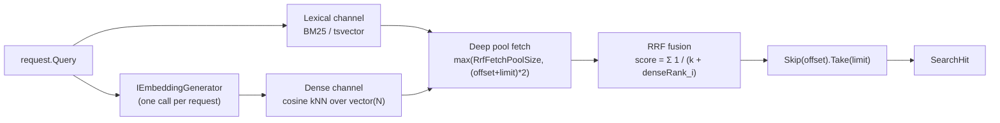

import { Aside } from "@astrojs/starlight/components";

`Granit.Indexing.Embeddings` is the opt-in semantic + hybrid retrieval add-on
for [Granit.Indexing](/dotnet/building-blocks/indexing/). It decorates the
host's existing indexer with an embedding generator and decorates the lexical
search backend with a hybrid retriever that fuses BM25 / `tsvector` results
with cosine kNN via **Reciprocal Rank Fusion** (Cormack et al. 2009).

The default `Granit.Indexing` pipeline is purely lexical — `tsvector` on
Postgres, BM25 on Elasticsearch. Lexical retrieval misses synonym matches: a
query *"comment résilier mon abonnement"* against a doc worded *"procédure de
désinscription"* returns nothing.

| Reach for this package when | Skip it when |
|-----------------------------|--------------|
| The corpus mixes languages or registers (formal / colloquial) and lexical recall alone leaves obvious matches on the table | The corpus is mono-lingual, technical, and lexical recall already meets UX targets |
| You already pay for an embedding model (OpenAI `text-embedding-3-small`, `bge-large`, Ollama-hosted `nomic-embed`, …) | You do not have an `IEmbeddingGenerator` registered and adding LLM cost per indexed entry + per query is not justified |
| The marginal cost of one embedding call per indexed entry and per search query is acceptable | The corpus is high-churn and re-embedding on every write is prohibitive |

## Registration

The four-step composition order is **load-bearing** — the writer and hybrid
retriever MUST be the last decorators applied to their target services so the
embedding write reaches the storage backend. Both fast-fail at composition time
when their dependencies are missing — there is no silent degraded mode.

```csharp
// 1. Host registers an IEmbeddingGenerator from any AI SDK (M.E.AI.Abstractions).
builder.Services.AddSingleton<IEmbeddingGenerator<string, Embedding<float>>>(...);

// 2. Storage backend's regular Add… extension (EF or ES).
builder.Services.AddGranitIndexing();
builder.Services.AddGranitIndexingEntityFrameworkCore(opts => opts.UseNpgsql(cs), typeof(Guid));

// 3. Storage backend's vector extension (pgvector / dense_vector).
builder.Services.AddGranitIndexingEmbeddingsBackend<Guid, MyResult>(
    row => new MyResult(row.Key, row.Content));

// 4. This package — decorates indexer + search backend.
builder.Services.AddGranitIndexingEmbeddings();
builder.Services.AddGranitIndexingEmbeddingsWriter<Guid>();
builder.Services.AddGranitIndexingHybridSearch<Guid, MyResult>();
```

```json
{
  "Indexing": {
    "Embeddings": {
      "Dimensions": 1536,
      "EmbeddingModelId": "text-embedding-3-small",
      "RrfK": 60,
      "RrfFetchPoolSize": 200,
      "RecommendHnswReindexCadenceDays": 7
    }
  }
}
```

`Dimensions` must match **both** the model used by your `IEmbeddingGenerator`
**and** the column type in your storage backend (`vector(N)` on pgvector,
`dims: N` on Elasticsearch). A mismatch fails at the first index attempt.

## Hybrid retrieval — how it works

Each `SearchAsync` call:

1. **Embeds `request.Query` once** via `IEmbeddingGenerator`.
2. **Fetches a deep pool from both channels in parallel**
   (`poolSize = max(RrfFetchPoolSize, (offset + limit) * 2)`).
3. **Fuses via Reciprocal Rank Fusion**:

   `score(d) = Σ 1 / (k + denseRank_i(d))` (default `k = 60`)

   *Dense ranking* means tied raw scores share a rank — the second equal-score
   doc is not unfairly penalised over the first.

4. **Slices `Skip(offset).Take(limit)` after the fusion.** Backend-level
   pagination kills RRF math, so the fuser MUST see the deep union before the
   page boundary.



When the embedding call fails at search time (transport, timeout), the backend
degrades gracefully to lexical-only with the original `(offset, limit)` — the
user still gets results, just without the semantic channel.

## GDPR Art. 17 — same-row storage

The CJEU ruled in 2024 that embeddings are personal data. The framework
persists the embedding on the **same row** as `Content` in every storage
backend (`vector(N)` column on pgvector, `dense_vector` field on Elasticsearch).
When the existing `IIndexedDataEraser` cascade fires, both atoms vanish
atomically in a single `DELETE` / `delete_by_query`. No sidecar table, no
orphan vectors.

The invariant is pinned by the
`Embeddings_must_live_on_the_same_row_as_Content_no_sidecar_entity_types`
architecture test — any sidecar entity type bound to vector storage fails CI.

See the
[GDPR Art. 17 cascade](/dotnet/building-blocks/indexing/#gdpr-art-17--atomic-erasure-path)
section on the parent page for the end-to-end fan-out.

## HNSW ghost vectors

<Aside type="caution" title="Operations concern — framework does not schedule REINDEX">
On Postgres + pgvector, an HNSW index keeps a pointer to deleted vectors in
its graph until a `REINDEX INDEX CONCURRENTLY` runs. Elasticsearch retains
deleted vectors until `forcemerge`. The framework cannot schedule this — it's
an ops concern. `RecommendHnswReindexCadenceDays = 7` is informational only;
wire a cron job:

```sql
-- Postgres example (pg_cron weekly)
SELECT cron.schedule('hnsw-purge', '0 3 * * 0',
    $$REINDEX INDEX CONCURRENTLY ix_indexed_entry_embedding$$);
```

Without periodic reindex, deleted personal-data vectors stay reachable in the
HNSW graph traversal — Article 17 erasure is logically complete (the source
row is gone, search queries cannot return it) but the bit-level vector
remains until the next merge / reindex. Hosts processing personal data
should commit to a documented cadence and surface it on the Article 30
register.

</Aside>

## Cost ceiling — deferred

This package does NOT yet rate-limit outbound `IEmbeddingGenerator` calls.
The `IAICallRateLimiter` factored during I-F3.2 will be wired in here as a
follow-up once the cost-accounting contract is fleshed out. Hosts that need a
hard cap today can register a wrapper around their `IEmbeddingGenerator`.

## See also

- [Indexing](/dotnet/building-blocks/indexing/) — parent page: contracts, authorization boundary, backends, GDPR cascade, configuration.
- [Indexing — Background reindex](/dotnet/building-blocks/indexing-background-jobs/) — re-embedding the corpus after a model change is the canonical use case for `RebuildIndexJob<TKey>`.
- [AI — Semantic Search & RAG](/dotnet/ai/semantic-search/) — overview of the hybrid-retrieval story across the AI feature family.
