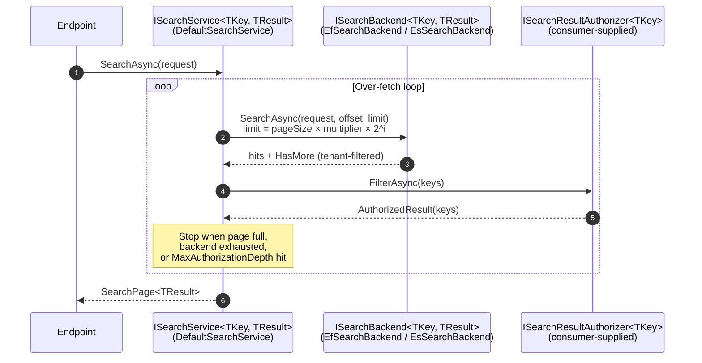
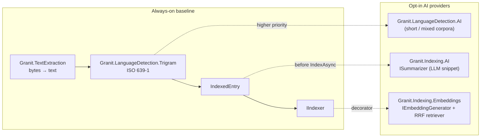
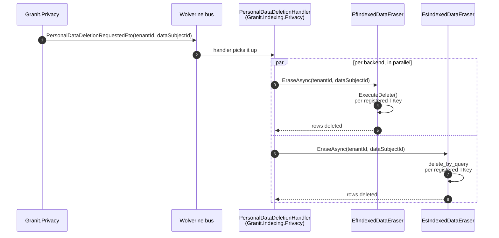

import { FileTree, Aside, Tabs, TabItem } from "@astrojs/starlight/components";

Every product team builds the same search feature twice. First a quick `LIKE
'%term%'` on a single table. Then — when the corpus grows — a hasty rewrite onto
`tsvector` or Elasticsearch, with a re-indexing batch glued together over a long
weekend. Both attempts share the same blind spots: no per-resource ACL filter
past tenant scope, no language-aware analysis, no GDPR-grade erasure when a data
subject revokes consent, no graceful path from lexical-only to hybrid semantic
retrieval, and every endpoint silently re-implements query parsing — usually
forwarding raw operator syntax straight into `to_tsquery`.

**`Granit.Indexing`** is the horizontal full-text + semantic search framework.
One write port (`IIndexer<TKey>`), one read port
(`ISearchService<TKey, TResult>`), pluggable backends behind both. The default
backend is **Postgres `tsvector`** (`Granit.Indexing.EntityFrameworkCore`) — zero
new infrastructure for a Granit host. **Elasticsearch 8.x** is opt-in
(`Granit.Indexing.Elasticsearch`) for low-millions-of-rows corpora or per-language
analyzer needs. Embeddings + hybrid Reciprocal Rank Fusion ship as a separate
opt-in (`Granit.Indexing.Embeddings`), as do AI summaries
(`Granit.Indexing.AI`), background reindex with checkpoint resume
(`Granit.Indexing.BackgroundJobs`), and the GDPR Art. 17 bridge
(`Granit.Indexing.Privacy`).

| Pain | This package's answer |
|------|----------------------|
| Hand-rolled `LIKE '%…%'` per endpoint with no ACL filter past tenant scope | One `ISearchService<TKey, TResult>` with consumer-supplied `ISearchResultAuthorizer<TKey>` on every hit |
| tsquery / Lucene injection from anonymous traffic | `plainto_tsquery` / `simple_query_string` (restricted flags) on the default path; advanced syntax gated on a `Search.Advanced.Execute` permission |
| Existence-oracle probing via empty-result pings | Per-principal sliding window — `MaxEmptyResultQueriesPerPrincipalPerMinute = 10` by default; 11th hits `429` |
| Long-tail "no results" page reveals row counts to restricted principals | Exponential over-fetch loop with a `MaxAuthorizationDepth = 5 000` ceiling; aggregated `HitAuthorizationLimit` hint, not a per-query oracle |
| Index outlives the source row after a GDPR Art. 17 request | `IIndexedDataEraser` + `Granit.Indexing.Privacy` bridge: one bulk statement per backend, atomic with the source delete |
| Embedding sidecar table de-syncs from `Content` on erasure | Embeddings live on the **same row** as `Content` — pinned by an architecture test (`Embeddings_must_live_on_the_same_row_as_Content_no_sidecar_entity_types`) |
| Reindex after a tokenizer change requires a custom batch | `RebuildIndexJob<TKey>` + checkpoint store; survives worker restarts |
| Switching from Postgres to ES means rewriting consumers | Same `IIndexer<TKey>` / `ISearchService<TKey, TResult>` contracts — backend swap is a DI line |

## Package structure

<FileTree>

- Granit.Indexing/ Contracts: `IIndexer<TKey>`, `ISearchService<TKey, TResult>`, `ISearchBackend<TKey, TResult>`, `ISearchResultAuthorizer<TKey>`, `IIndexedEntrySource<TKey>`, `IIndexedDataEraser`, `IndexedEntry<TKey>`, `SearchPage<TResult>`
  - Granit.Indexing.EntityFrameworkCore/ **Default backend** — Postgres `tsvector` (`GENERATED ALWAYS … STORED`) + GIN index, `PersonalDataDeletionHandler`
  - Granit.Indexing.Elasticsearch/ ES 8.x backend, `Shared` / `PerTenant` strategies, restricted `simple_query_string`
  - Granit.Indexing.AI/ `ISummarizer` — one-shot LLM call, JSON-schema-pinned, AIQuota-rate-limited
  - Granit.Indexing.Embeddings/ Decorator: `IEmbeddingGenerator` write + RRF hybrid retriever (k=60 default, dense ranking)
  - Granit.Indexing.BackgroundJobs/ `RebuildIndexJob<TKey>` + checkpoint store (in-memory or EF)
  - Granit.Indexing.Privacy/ Wolverine handler bridging `PersonalDataDeletionRequestedEto` → every `IIndexedDataEraser`

</FileTree>

| Package | Role | Depends on |
|---------|------|------------|
| `Granit.Indexing` | Contract root — `IIndexer<TKey>`, `ISearchService<TKey, TResult>`, `ISearchBackend<TKey, TResult>`, `ISearchResultAuthorizer<TKey>`, `IIndexedEntrySource<TKey>`, `IIndexedDataEraser`, `IndexedEntry<TKey>`, `SearchPage<TResult>`, `DefaultSearchService`, empty-result rate limiter | `Granit`, `Granit.LanguageDetection` |
| `Granit.Indexing.EntityFrameworkCore` | Default Postgres `tsvector` backend — `IndexingDbContext`, `IndexedEntryRow<TKey>`, `HasGeneratedTsVectorColumn`, `EfIndexer<TKey>`, `EfSearchBackend<TKey, TResult>`, `EfIndexedDataEraser` | `Granit.Indexing`, `Granit.Persistence.EntityFrameworkCore` |
| `Granit.Indexing.Elasticsearch` | ES 8.x backend — BM25 multi-field per-language analyzers, `Shared` / `PerTenant` strategy, `delete_by_query` eraser | `Granit.Indexing`, `Elastic.Clients.Elasticsearch` |
| `Granit.Indexing.AI` | `ISummarizer` LLM provider — JSON-schema response, AIQuota counter, prompt-injection isolation | `Granit.Indexing`, `Granit.AI` |
| `Granit.Indexing.Embeddings` | Decorator pair: `IIndexer<TKey>` writer (embeds Content) + `ISearchBackend<TKey, TResult>` hybrid retriever (BM25 ∪ kNN → RRF) | `Granit.Indexing`, `Microsoft.Extensions.AI.Abstractions` |
| `Granit.Indexing.BackgroundJobs` | `RebuildIndexJob<TKey>` (on-demand, host-dispatched), `InMemoryRebuildCheckpointStore<TKey>` default, EF persistent checkpoint opt-in | `Granit.Indexing`, `Granit.BackgroundJobs` |
| `Granit.Indexing.Privacy` | `PersonalDataDeletionHandler` Wolverine handler — fans `PersonalDataDeletionRequestedEto` to every registered `IIndexedDataEraser` | `Granit.Indexing`, `Granit.Privacy` |

<Aside type="note" title="Backend swap is a DI line, not a rewrite">
Consumer code resolves `IIndexer<TKey>` and `ISearchService<TKey, TResult>` —
both are backend-agnostic. Switching from Postgres `tsvector` to Elasticsearch
means swapping `AddGranitIndexingEntityFrameworkCore(...)` for
`AddGranitIndexingElasticsearch(...)` and re-running a `RebuildIndexJob<TKey>`;
the consumer's `IIndexedEntrySource<TKey>` and `ISearchResultAuthorizer<TKey>`
do not change.
</Aside>

## Contracts

### Write port — `IIndexer<TKey>`

```csharp
public interface IIndexer<TKey>
{
    Task IndexAsync(IndexedEntry<TKey> entry, CancellationToken cancellationToken = default);
    Task RemoveAsync(TKey key, Guid? tenantId, CancellationToken cancellationToken = default);
}

public sealed record IndexedEntry<TKey>
{
    public required TKey Key { get; init; }
    public required Guid? TenantId { get; init; }
    public required string Content { get; init; }
    public string? Language { get; init; }          // ISO 639-1 — from ILanguageDetector
    public string? Summary { get; init; }           // optional — ISummarizer
    public IReadOnlyList<string>? Tags { get; init; }
    public ReadOnlyMemory<float>? Embedding { get; init; }
    public IReadOnlyDictionary<string, string>? Facets { get; init; }
    public bool IsTruncated { get; init; }          // from TextExtractionResult
    public int CharCount { get; init; }
    public Guid? DataSubjectId { get; init; }       // drives GDPR Art. 17 erasure
}
```

`IndexAsync` is idempotent: re-indexing `(TenantId, Key)` overwrites the existing
row in place. `RemoveAsync` takes `tenantId` explicitly because background
workers — which may not have `ICurrentTenant` in scope — must still be able to
remove rows from any tenant without leaking through ambient state.

<Aside type="caution" title="No ACL fields on IndexedEntry">
`IndexedEntry<TKey>` carries no permission, role, or workspace-ACL field — by
design. Tenant isolation is the only access-control signal honoured at write
time; everything else is enforced at read time via
`ISearchResultAuthorizer<TKey>`. Storing per-resource ACLs in the index would
couple cache invalidation to every permission change and create an
out-of-band oracle.
</Aside>

### Read port — `ISearchService<TKey, TResult>`

```csharp
public interface ISearchService<TKey, TResult>
{
    Task<SearchPage<TResult>> SearchAsync(SearchRequest request, CancellationToken ct = default);
}

public sealed record SearchRequest(
    string Query,
    int Page = 1,
    int PageSize = 20,
    string? Language = null,
    string? PrincipalIdentifier = null,
    bool UseAdvancedSyntax = false);
```

`SearchRequest.Query` is treated as a phrase by default. `UseAdvancedSyntax`
opts the backend into operator-aware parsing (`to_tsquery` on Postgres,
Lucene `query_string` on ES) — endpoints MUST gate this on a dedicated
`Search.Advanced.Execute` permission before forwarding the flag.
`PrincipalIdentifier` (typically `User.GetSubjectId()`) is hashed before any
log emission and used as the bucket key for the empty-result rate limiter.

## Authorization boundary

The single most important contract in `Granit.Indexing`:

> **The framework enforces tenant isolation only.** Per-resource ACL is the
> consumer module's responsibility and is enforced at read time via
> `ISearchResultAuthorizer<TKey>` — never serialised into the index.



| Layer | Concern | Default |
|-------|---------|---------|
| `ISearchBackend<TKey, TResult>` | Tenant isolation — every query scoped to `ICurrentTenant`, applied by the backend (never by the orchestrator) | EF: `GranitDbContext` parameterised tenant filter rewritten into every SQL statement. ES: mandatory `term tenant_id` on every read/write |
| `ISearchResultAuthorizer<TKey>` | Per-resource ACL — workspace, role-based row-level, public-link grants | `NullSearchResultAuthorizer<TKey>` (authorises every hit) — appropriate only when tenant isolation is the complete authorization story |
| `DefaultSearchService<TKey, TResult>` | Exponential over-fetch loop fills the requested page with authorised hits without leaking row counts | Iteration 1: `pageSize × RecommendedInitialMultiplier`. Doubles per iteration. Stops at `MaxAuthorizationDepth = 5 000` |

The over-fetch loop avoids a class of leaks:

- **No per-page existence oracle.** A restricted principal who never sees more
  than `n` rows cannot bisect-search a private term — the response always carries
  the same authorised-page shape; the only signal is the aggregated
  `HitAuthorizationLimit` flag, which endpoints **MUST throttle to at most one
  display per principal per 60 s** (the framework cannot enforce this — it has
  no UI state).
- **No empty-result probing.** A principal that exceeds
  `MaxEmptyResultQueriesPerPrincipalPerMinute` (default 10) inside a 60 s window
  gets `EmptyResultRateLimitedException`, which the endpoint adapter converts to
  `Problem(429)`.
- **No backend hit count leak.** `SearchPage<TResult>.BackendHitCount` is marked
  `[JsonIgnore]` + `[EditorBrowsable(Never)]` so it never round-trips through
  HTTP; an architecture test
  (`BackendHitCount_must_not_be_referenced_from_any_Endpoints_package`) forbids
  cross-package access from `.Endpoints` projects.

### Writing an authorizer

```csharp
public sealed class WorkspaceAclAuthorizer(IWorkspaceAccess access)
    : ISearchResultAuthorizer<Guid>
{
    // Restricted principal sees ~10 % of hits — over-fetch 10× on iteration 1.
    public int RecommendedInitialMultiplier => 10;

    public async Task<AuthorizedResult<Guid>> FilterAsync(
        IReadOnlyList<Guid> candidates, CancellationToken ct)
    {
        IReadOnlyList<Guid> allowed = await access
            .FilterReadableAsync(candidates, ct).ConfigureAwait(false);
        return new AuthorizedResult<Guid>(allowed);
    }
}

// Composition root
services.AddGranitIndexing();
services.AddSingleton<ISearchResultAuthorizer<Guid>, WorkspaceAclAuthorizer>();
```

Use the rule of thumb `ceil(1 / expected_authorized_ratio)` for the multiplier.
Too low costs an extra round-trip on the common path; too high wastes backend
rows on the rare path. Unknown principals default to `3` — covers admin and
restricted alike within two iterations.

## Backends

### Postgres `tsvector` (default)

`Granit.Indexing.EntityFrameworkCore` is the default backend — zero new
infrastructure for any Granit host that already runs Postgres.

| Aspect | Behaviour |
|--------|-----------|
| Storage | `IndexedEntryRow<TKey>` with `Content`, `SearchVector tsvector` (`GENERATED ALWAYS … STORED`), `Language`, `Summary`, `Tags string[]`, `IsTruncated`, `CharCount`, `DataSubjectId`. One physical table per registered `TKey`. |
| Query syntax | `plainto_tsquery` by default; `websearch_to_tsquery` via `IndexingEntityFrameworkCoreOptions.UseWebSearchSyntax`. `to_tsquery` is **not reachable** from the default path — operator characters (`&`, `\|`, `!`, parentheses) are treated as literals. |
| Index | GIN over `SearchVector`, emitted by the `HasGeneratedTsVectorColumn(...)` `ModelBuilder` extension. |
| Tenant isolation | Inherited from `GranitDbContext` — parameterised tenant filter rewritten into every SQL statement at execution time (no closure-leak risk). |
| GDPR Art. 17 | `EfIndexedDataEraser` fans out a single `ExecuteDelete()` per registered `TKey` filtered by `(TenantId, DataSubjectId)`. |
| Architecture pins | `Granit.Indexing.EntityFrameworkCore` is the only package allowed to reference EF Core NuGets (`EntityFrameworkCore_NuGets_only_in_the_EntityFrameworkCore_backend`). `IgnoreQueryFilters` usage is on an audit allowlist. |

```csharp
builder.Services.AddGranitIndexing();
builder.Services.AddGranitIndexingEntityFrameworkCore(
    opts => opts.UseNpgsql(connectionString),
    typeof(Guid));

builder.Services.AddGranitIndexingBackend<Guid, MyHitResponse>(
    row => new MyHitResponse(row.Key, row.Summary ?? string.Empty, row.Tags));
```

The package ships **no EF migrations** — the consumer host owns them:

```bash
dotnet ef migrations add InitIndexing \
    --context IndexingDbContext \
    --project YourHost/YourHost.csproj
```

### Elasticsearch 8.x (opt-in)

`Granit.Indexing.Elasticsearch` swaps the backend wholesale: registering it
strips any previously-registered `IIndexer<TKey>` and `IIndexedDataEraser` to
guarantee the host runs a single backend.

Reach for it when:

- The corpus exceeds what a single Postgres `tsvector` index can comfortably
  serve (low-millions of rows or multi-GB content).
- Per-language analyzers, synonym maps, or phrase scoring are core to UX.
- An Elasticsearch cluster is already operated and consolidating full-text
  workloads makes sense.

```csharp
builder.Services.AddGranitIndexing();
builder.Services.AddGranitIndexingElasticsearch(
    configureClient: null,
    typeof(Guid));
builder.Services.AddGranitIndexingElasticsearchBackend<Guid, MyResponse>(
    keyProjection: doc => Guid.Parse(doc.Key),
    resultProjection: doc => new MyResponse(doc.Key, doc.Summary, doc.Tags));
```

```json
{
  "Indexing": {
    "Elasticsearch": {
      "Uri": "https://es.internal:9200",
      "ApiKey": "your-api-key",
      "Strategy": "Shared",
      "IndexPrefix": "granit-indexing",
      "BulkBatchSize": 500,
      "StoreFullContentInIndex": true,
      "UseSimpleQueryString": true,
      "DefaultAnalyzer": "standard"
    }
  }
}
```

| Setting | Choice |
|---------|--------|
| `Strategy: Shared` (default) | One index per `TKey`; tenants isolated by mandatory `term tenant_id` filter on every read / write. |
| `Strategy: PerTenant` | One index per `(TKey, tenant)` pair. Stricter physical isolation, one extra index per tenant. The framework still applies the `tenant_id` filter as defence-in-depth for misrouted bulk imports. |
| `UseSimpleQueryString: true` (default) | `simple_query_string` with the restricted flag set `AND \| OR \| PHRASE \| PREFIX`. Lucene's full `query_string` (regex, fuzzy, field-targeted operators) is reachable only when the request carries `UseAdvancedSyntax = true` and the endpoint has gated on `Search.Advanced.Execute`. |
| `StoreFullContentInIndex` | Trade-off — see below. |

<Aside type="caution" title="StoreFullContentInIndex — arbitrate against your access-log policy">
With `StoreFullContentInIndex = true`, document bodies leave Postgres and live
on the ES cluster — convenient for highlighting and snippet generation, but
every cluster operator with read access to the index now sees full document
bodies. Pair it with cluster-level access logs and a documented review
cadence, or set it to `false` and have the consumer fetch the body from the
source store on hit.
</Aside>

`Granit.Indexing.Elasticsearch` ships an `IIndexedDataEraser` that fans out a
single `delete_by_query` across every registered `TKey`. `delete_by_query` is a
logical delete; physical disposal happens at the next segment merge or via an
explicit `forcemerge` schedule — Article 17 is satisfied because the data is no
longer addressable, but bit-level disposal depends on the host's storage policy.

### Backend comparison

| Concern | Postgres `tsvector` | Elasticsearch 8.x |
|---------|---------------------|--------------------|
| Infrastructure cost | None beyond Postgres | Dedicated cluster |
| Default query parser | `plainto_tsquery` (operator characters → literals) | `simple_query_string` with restricted flags |
| Advanced syntax | `to_tsquery` — gated on `Search.Advanced.Execute` | Full Lucene `query_string` — gated on `Search.Advanced.Execute` |
| Tenant isolation | `GranitDbContext` parameterised filter | Mandatory `term tenant_id` filter, plus optional `PerTenant` physical isolation |
| Per-language analyzers | One `tsvector` config per row (chosen from `Language`) | One sub-field per analyzer; synonym maps and phrase scoring built-in |
| GDPR Art. 17 | `ExecuteDelete()` per `TKey` (synchronous, atomic) | `delete_by_query` (logical delete; physical disposal on next merge / `forcemerge`) |
| Embeddings | `vector(N)` pgvector column on the **same row** as `Content` | `dense_vector(dims: N)` field on the **same document** as `Content` |

## Language-aware analysis

`IndexedEntry.Language` is consumed by every backend at index time to pick the
right analyser (Postgres `tsvector` configuration, ES `<lang>_<analyzer>`). The
value comes from
[Granit.LanguageDetection](/dotnet/building-blocks/language-detection/) — a
cross-cutting `ILanguageDetector` with a deterministic trigram default and
optional priority-chain overrides:

```csharp
public sealed class MyDocumentSource(
    IDocumentRepository repo,
    ITextExtractionPipeline extraction,
    ILanguageDetector languageDetector) : IIndexedEntrySource<Guid>
{
    public string Name => "document";

    public async IAsyncEnumerable<Guid> EnumerateKeysAsync(
        Guid? tenantId, Guid? resumeAfter, [EnumeratorCancellation] CancellationToken ct)
    {
        await foreach (Guid id in repo.EnumerateIdsAsync(tenantId, resumeAfter, ct))
            yield return id;
    }

    public async Task<IndexedEntry<Guid>?> BuildEntryAsync(Guid key, CancellationToken ct)
    {
        Document? doc = await repo.GetAsync(key, ct).ConfigureAwait(false);
        if (doc is null) return null;

        TextExtractionResult body = await extraction.ExtractAsync(
            doc.OpenRead(), doc.ContentType, ct).ConfigureAwait(false);

        string? language = body.DetectedLanguage
            ?? await languageDetector.DetectAsync(body.Content, ct).ConfigureAwait(false);

        return new IndexedEntry<Guid>
        {
            Key = key,
            TenantId = doc.TenantId,
            Content = body.Content,
            Language = language,
            IsTruncated = body.IsTruncated,
            CharCount = body.CharCount,
            DataSubjectId = doc.OwnerPartyId,    // GDPR Art. 17 hook
        };
    }

    public Task<Guid?> GetDataSubjectIdAsync(Guid key, CancellationToken ct)
        => repo.GetOwnerPartyIdAsync(key, ct);
}
```

## AI providers (opt-in)

Every AI add-on is opt-in. The base `Granit.Indexing` pipeline runs fully
lexical with the deterministic trigram detector — no network calls, no embedded
LLM. Bring in AI providers package by package when the cost/quality trade-off
makes sense.



| Package | Adds | Cost ceiling |
|---------|------|--------------|
| `Granit.LanguageDetection.AI` | LLM-backed `ILanguageDetectorProvider` at priority 200 — disambiguates short or mixed-language inputs the trigram detector cannot reliably classify | Inherits `Granit.AI` `AIQuotaOptions.MaxRequestsPerTenantPerHour` |
| `Granit.Indexing.AI` | `ISummarizer` — one-shot LLM call producing a SERP-style snippet for `IndexedEntry.Summary`. JSON-schema-pinned, content wrapped in `<untrusted_document>...</untrusted_document>` (OWASP LLM01) | `MaxAICallsPerHourPerTenant` (default 1 000); on cap, returns `null` — the entry persists without a summary |
| `Granit.Indexing.Embeddings` | Decorator pair — embeds `Content` via `IEmbeddingGenerator` at write time, fuses BM25/tsvector + cosine kNN with Reciprocal Rank Fusion at read time | Wraps the host's `IEmbeddingGenerator`; native cost ceiling tracked under follow-up (the cost-accounting contract is fleshed out in I-F3.2) |

### Hybrid retrieval — Reciprocal Rank Fusion

`Granit.Indexing.Embeddings` decorates both ports — write-time embedding of
`Content` on the **same row** as the body (atomic GDPR erasure), read-time
fusion of the lexical and dense channels via Reciprocal Rank Fusion
(Cormack et al. 2009, `k = 60`, dense ranking on score ties). The full
registration order, `RrfFetchPoolSize` / pagination-after-fusion contract,
graceful lexical-only degradation, and the HNSW ghost-vector operations
concern live on the dedicated page:

→ **[Indexing — Embeddings (RRF)](/dotnet/building-blocks/indexing-embeddings/)**

## GDPR Art. 17 — atomic erasure path

Indexed copies must not outlive the source row. Three pieces co-operate:



| Layer | Role |
|-------|------|
| Producer — `IIndexedEntrySource<TKey>.GetDataSubjectIdAsync` | Returns the natural-person id the indexed body refers to; `null` for non-personal data (system documents, public reference data). Populated into `IndexedEntry.DataSubjectId` at build time. |
| Backend — `IIndexedDataEraser` | One implementation per backend (`EfIndexedDataEraser`, `EsIndexedDataEraser`). Bulk-deletes rows filtered by `(TenantId, DataSubjectId)` in a single statement. Idempotent — Wolverine retries and manual replays converge safely. |
| Bridge — `Granit.Indexing.Privacy` | `PersonalDataDeletionHandler` subscribed to `PersonalDataDeletionRequestedEto`. Resolves every `IIndexedDataEraser` from DI and fans out the request. Skip the package on hosts that do not need the cascade. |

Why a separate hook instead of `IIndexer<TKey>.RemoveAsync`?
`IIndexer<TKey>.RemoveAsync` removes a single known `(TenantId, Key)` tuple. The
GDPR cascade does not know the keys — only the `DataSubjectId` the entries
reference. Backends store that value at index time and expose `EraseAsync` to
erase by subject in one bulk statement; calling `RemoveAsync` in a loop would
require enumerating every key first — slower and racier.

When `Granit.Indexing.Embeddings` is wired, embeddings are persisted on the
**same row** as `Content` in every storage backend — pinned by
`Embeddings_must_live_on_the_same_row_as_Content_no_sidecar_entity_types`. When
the eraser fires, both atoms vanish atomically in a single `DELETE` / `delete_by_query`.
No sidecar table, no orphan vectors.

## Background reindex with checkpoint resume

`Granit.Indexing.BackgroundJobs` ships `RebuildIndexJob<TKey>` — an on-demand
job that iterates every key emitted by `IIndexedEntrySource<TKey>` and calls
`IIndexer<TKey>.IndexAsync` per entry. Use it after a tokenizer / analyzer
change, after a new tenant backfill, after wiring a new embedding model, or
after a data-quality incident.

The job is on-demand only — the framework ships no `[RecurringJob]`. The
permission check MUST live at the dispatch site (the Wolverine handler has no
HTTP context), and a `MaxEntriesPerRun` / `MaxRunDuration` budget should be
set in production to bound the blast radius of a runaway or hostile dispatch.
Resource budget, lifecycle events, checkpoint store options, and the full
dispatch-controller example live on the dedicated page:

→ **[Indexing — Background reindex](/dotnet/building-blocks/indexing-background-jobs/)**

## Configuration cookbook

<Tabs>
<TabItem label="Postgres default + workspace ACL">

```csharp
[DependsOn(
    typeof(GranitIndexingEntityFrameworkCoreModule),
    typeof(GranitLanguageDetectionTrigramModule))]
public sealed class SearchModule : GranitModule
{
    public override void ConfigureServices(ServiceConfigurationContext context)
    {
        context.Services.AddGranitIndexing();
        context.Services.AddGranitIndexingEntityFrameworkCore(
            opts => opts.UseNpgsql(context.Configuration.GetConnectionString("Indexing")!),
            typeof(Guid));

        context.Services.AddGranitIndexingBackend<Guid, MyHitResponse>(
            row => new MyHitResponse(row.Key, row.Summary ?? string.Empty, row.Tags));

        context.Services.AddSingleton<ISearchResultAuthorizer<Guid>, WorkspaceAclAuthorizer>();
        context.Services.AddScoped<IIndexedEntrySource<Guid>, MyDocumentSource>();
    }
}
```

```json
{
  "Indexing": {
    "DefaultPageSize": 20,
    "MaxPageSize": 100,
    "MaxAuthorizationDepth": 5000,
    "MaxEmptyResultQueriesPerPrincipalPerMinute": 10,
    "AuthorizationOverfetchMultiplier": 3
  }
}
```

</TabItem>
<TabItem label="Switch to Elasticsearch">

```csharp
[DependsOn(typeof(GranitIndexingElasticsearchModule))]
public sealed class SearchModule : GranitModule
{
    public override void ConfigureServices(ServiceConfigurationContext context)
    {
        context.Services.AddGranitIndexing();
        context.Services.AddGranitIndexingElasticsearch(
            configureClient: null,
            typeof(Guid));

        context.Services.AddGranitIndexingElasticsearchBackend<Guid, MyHitResponse>(
            keyProjection: doc => Guid.Parse(doc.Key),
            resultProjection: doc => new MyHitResponse(doc.Key, doc.Summary, doc.Tags));
    }
}
```

```json
{
  "Indexing": {
    "Elasticsearch": {
      "Uri": "https://es.internal:9200",
      "ApiKey": "your-api-key",
      "Strategy": "Shared",
      "IndexPrefix": "granit-indexing",
      "StoreFullContentInIndex": false,
      "UseSimpleQueryString": true
    }
  }
}
```

</TabItem>
<TabItem label="Add AI summaries + GDPR cascade">

```csharp
[DependsOn(
    typeof(GranitIndexingAIModule),
    typeof(GranitIndexingPrivacyModule))]
public sealed class SearchAIModule : GranitModule
{
    public override void ConfigureServices(ServiceConfigurationContext context)
    {
        context.Services.AddGranitIndexingAISummarizer();
    }
}
```

```json
{
  "Indexing": {
    "AI": {
      "WorkspaceName": "default",
      "MaxAICallsPerHourPerTenant": 1000,
      "RedactPIIBeforeLLMCall": true,
      "MaxContentLength": 8192,
      "MaxSummaryLength": 500,
      "TimeoutSeconds": 20
    }
  }
}
```

Consumers retrieve `ISummarizer` from DI and call `SummarizeAsync(content)`
**before** building the `IndexedEntry`, then assign the result to
`entry.Summary`. The framework does NOT auto-wire a decorator on `IIndexer<TKey>` —
the call cost lives where the consumer can control it.

</TabItem>
</Tabs>

## Architecture invariants

The following invariants are pinned by tests in
[`IndexingArchitectureTests`](https://github.com/granit-fx/granit-dotnet/blob/develop/tests/Granit.ArchitectureTests/IndexingArchitectureTests.cs)
and run on every CI build:

| Invariant | Rationale |
|-----------|-----------|
| `BackendHitCount_must_not_be_referenced_from_any_Endpoints_package` | The raw backend hit count is a tenant-wide row-count oracle. Endpoint adapters must read only `SearchPage.Items` + `HitAuthorizationLimit`. |
| `Embeddings_must_live_on_the_same_row_as_Content_no_sidecar_entity_types` | Atomic GDPR Art. 17 erasure — embeddings and content vanish in the same `DELETE`. |
| `IgnoreQueryFilters_calls_in_Granit_Indexing_EntityFrameworkCore_stay_within_the_audit_allowlist` | Bypassing tenant filters is allowed only at named, reviewed call sites. |
| `Granit_Indexing_packages_must_not_reference_Microsoft_AspNetCore` | Indexing is a horizontal framework — CLI tools and background workers consume it without dragging in the web stack. |
| `EntityFrameworkCore_NuGets_only_in_the_EntityFrameworkCore_backend` | EF Core stays confined to the EF backend; the base contract and other backends remain provider-pure. |
| `IIndexer_implementations_must_not_call_Console_or_Trace` | All telemetry flows through `IndexingMetrics` + `IndexingActivitySource` — never stdout. |

## See also

### Sub-pages

- [Indexing — Embeddings (RRF)](/dotnet/building-blocks/indexing-embeddings/) — opt-in hybrid retrieval: `IEmbeddingGenerator` writer + RRF fusion of BM25 / `tsvector` with cosine kNN; HNSW reindex cadence.
- [Indexing — Background reindex](/dotnet/building-blocks/indexing-background-jobs/) — `RebuildIndexJob<TKey>` with checkpoint resume, dispatch-site permission, resource budgets, lifecycle events.

### Related

- [TextExtraction](/dotnet/building-blocks/text-extraction/) — upstream producer of `IndexedEntry.Content` (and `DetectedLanguage`) for unstructured uploads.
- [LanguageDetection](/dotnet/building-blocks/language-detection/) — `ILanguageDetector` populates `IndexedEntry.Language`; backends pick the analyser from it.
- [Query Engine](/dotnet/building-blocks/query-engine/) — peer building block for structured filter / sort / paging over EF Core. Indexing handles full-text + semantic; QueryEngine handles structured admin grids.
- [Data Exchange](/dotnet/building-blocks/data-exchange/) — peer building block for CSV / Excel import / export. Often paired: imported rows are indexed at the same time.
- [Documents](/dotnet/business/documents/) — downstream consumer that uploads bytes, runs them through TextExtraction, then indexes the result.
- [AI — Semantic Search & RAG](/dotnet/ai/semantic-search/) — overview of the hybrid-retrieval story across the AI feature family.
- [Compliance — Privacy](/dotnet/compliance/privacy/) — `Granit.Privacy` publishes `PersonalDataDeletionRequestedEto`; `Granit.Indexing.Privacy` is its indexing bridge.
