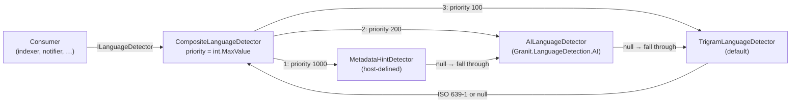
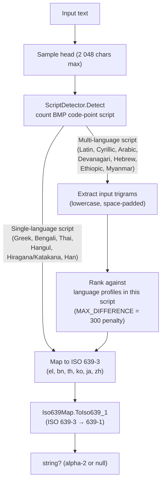

import { FileTree, Aside, Tabs, TabItem } from "@astrojs/starlight/components";

Every text-handling feature ends up needing the same answer: *what language is
this?* Search indexers pick a `tsvector` configuration from it. Notification
routers pick a template locale. AI prompt builders pick a system prompt. Privacy
classifiers flag corpora that need region-specific handling.

The naive shape is one detector per consumer, each pulling in its own native
library (CLD3, fastText, libpostal) and each tuned slightly differently. Six
months in, two modules disagree on whether `"Hello world"` is `en` or `de` and
the indexing batch starts dropping documents.

**`Granit.LanguageDetection`** is the single contract — `ILanguageDetector`
returning an ISO 639-1 alpha-2 code, resolved by a priority-chain composite
that consumers register providers into. **`Granit.LanguageDetection.Trigram`**
ships the default provider: a pure-managed character-trigram detector with
Unicode-script pre-filtering, an embedded dataset, and no native dependency.

| Pain | This module's answer |
|------|----------------------|
| Each consumer module ships its own detector with a different verdict on edge cases | One `ILanguageDetector` resolved by the DI container — every consumer reads the same answer |
| Adding a metadata-hint override means rewriting the indexer | Register a higher-priority `ILanguageDetectorProvider`; the composite chain picks it up first |
| Native libraries (CLD3, fastText) drag glibc-specific binaries into AOT-published containers | Pure-managed trigram default — no native dependency, no `runtimes/` payload |
| Detection results drift across CI runs (LLM-backed, fastText probabilistic) | Deterministic: same input always yields the same answer — suitable for CI fixtures |
| Mixing alpha-2 (`en`) and alpha-3 (`eng`) codes downstream | Detector always returns ISO 639-1 alpha-2; alpha-3-only languages return `null` so the chain falls through |

## Package structure

<FileTree>

- Granit.LanguageDetection/ Contracts: `ILanguageDetector`, `ILanguageDetectorProvider`, `CompositeLanguageDetector`
  - Granit.LanguageDetection.Trigram/ Default provider — character-trigram detector + embedded Franc dataset
  - Granit.LanguageDetection.AI/ LLM-backed provider for ambiguous or short-text corpora — opt-in, GDPR-gated

</FileTree>

| Package | Role | Depends on |
|---------|------|------------|
| `Granit.LanguageDetection` | `ILanguageDetector`, `ILanguageDetectorProvider`, `CompositeLanguageDetector`, `AddGranitLanguageDetection()`. No `[DependsOn]` — the contract root every provider attaches to. | `Granit` |
| `Granit.LanguageDetection.Trigram` | `TrigramLanguageDetector` at priority `100`. Embedded Franc dataset, Unicode-script pre-filter, pure-managed scoring. | `Granit.LanguageDetection` |
| `Granit.LanguageDetection.AI` | `AILanguageDetector` at priority `200`. One-shot LLM call with PII redaction, per-tenant rate limit, and structured-output + ISO 639-1 prompt-injection defence. Falls through to `null` on any failure. | `Granit.LanguageDetection`, `Granit.AI.Extraction` |

<Aside type="note" title="Pure utility, no host plumbing">
The base package and the trigram provider ship with **zero** ASP.NET Core or
EF Core references. CLI tools, background workers, indexing pipelines, and
notification routers pull in detection without dragging in the web stack.
</Aside>

## Contract

```csharp
public interface ILanguageDetector
{
    int Priority { get; }
    Task<string?> DetectAsync(string content, CancellationToken cancellationToken = default);
}

public interface ILanguageDetectorProvider : ILanguageDetector
{
}
```

Two interfaces, one method. The split is deliberate — see [Why two
interfaces](#why-two-interfaces).

`DetectAsync` returns:

| Result | Meaning | Caller action |
|--------|---------|---------------|
| Non-null ISO 639-1 code (`"fr"`, `"zh"`, `"ja"`, …) | A registered provider claimed the input | Use the code |
| `null` | Every provider in the chain returned `null` (input too short, script unrecognised, alpha-3-only language) | Fall back to a host default (tenant locale, `Accept-Language`, indexer's default `tsvector`) |

Implementations are required to be safe to call concurrently. Large inputs may
be sampled from the head — the trigram provider caps at 2 048 characters.

## Composite chain

`CompositeLanguageDetector` is the sole `ILanguageDetector` exposed by the DI
container. It delegates to each registered `ILanguageDetectorProvider` in
descending `Priority` order, stopping at the first non-null result.



| Provider | Default priority | Origin |
|----------|------------------|--------|
| Metadata hints (host-defined: `Accept-Language`, `X-Content-Language`, tenant locale) | `1000` (recommended) | Host code |
| AI-backed detector (LLM disambiguation for short or mixed corpora) | `200` | `Granit.LanguageDetection.AI` |
| Trigram default | `100` | `Granit.LanguageDetection.Trigram` |

Ties on identical priority resolve by DI registration order. Providers may
return `null` to declare "I don't know" — the composite tries the next one
rather than committing to an uncertain answer.

## Default provider — `TrigramLanguageDetector`

Pure-managed clean-room port of [Franc](https://github.com/wooorm/franc)
(Wormer 2014, MIT), itself building on Cavnar–Trenkle (1994). Two-stage
detection inside `DetectAsync`:



| Property | Value |
|----------|-------|
| Algorithm | Character trigram ranking with Unicode-script pre-filter |
| Coverage | 7 multi-language scripts (Latin, Cyrillic, Arabic, Devanagari, Myanmar, Ethiopic, Hebrew) + 6 single-language scripts (Greek, Bengali, Thai, Hangul, Japanese kana, Han) |
| Dataset | Embedded `Resources/profiles.json` (Franc trigram tables, MIT, trained on UDHR + Wikipedia) |
| Sample size | First 2 048 characters of input (`MaxSampleChars`) |
| Minimum input length | 10 characters — shorter inputs return `null` |
| Output | ISO 639-1 alpha-2 (`"fr"`, `"zh"`, `"ja"`, …) or `null` for alpha-3-only languages |
| Priority | `100` (overridable by any provider registered at a higher priority) |
| Determinism | Same input always yields the same answer — fixture-safe |
| Latency | Sub-millisecond on samples ≤ 2 048 characters; no allocations after warm-up beyond the rank dictionary |

<Aside type="note" title="Why alpha-2 and not alpha-3">
Downstream consumers — Postgres `tsvector` configs, .NET `CultureInfo`, browser
`Accept-Language` headers — all key off ISO 639-1 (alpha-2). The detector returns
the alpha-2 form so callers don't need a mapping table. Languages the Franc
dataset covers but ISO 639 doesn't assign an alpha-2 to (e.g. `cmn`, `sco`) return
`null`; the composite chain falls through to the next provider.
</Aside>

<Aside type="caution" title="Tibetan and Canadian Aboriginal Syllabics">
The Franc dataset bundles trigram profiles for Tibetan and Canadian_Aboriginal
multi-language scripts, but `ScriptDetector.ClassifyChar` does not yet recognise
those Unicode blocks. Inputs in those scripts fall through to `null`. Extend
`ClassifyChar` to enable.
</Aside>

## Setup

The minimal working setup — facade + default trigram provider:

```csharp
[DependsOn(typeof(GranitLanguageDetectionTrigramModule))]
public sealed class IndexingModule : GranitModule { }
```

`GranitLanguageDetectionTrigramModule` depends on `GranitLanguageDetectionModule`,
so the composite is registered transitively. After startup:

```csharp
public sealed class DocumentIndexer(ILanguageDetector detector)
{
    public async Task IndexAsync(Document doc, CancellationToken ct)
    {
        string? language = await detector.DetectAsync(doc.PlainText, ct).ConfigureAwait(false);
        string tsvectorConfig = language switch
        {
            "fr" => "french",
            "de" => "german",
            "nl" => "dutch",
            _    => "simple",
        };
        // … persist with the chosen tsvector configuration
    }
}
```

`ILanguageDetector` is a singleton; safe to inject anywhere. The trigram dataset
loads once at first resolution and stays in memory (~1 MB).

## Adding a higher-priority provider

The contract calls `Priority` a stack: higher number wins. Three common
patterns, all registered against `ILanguageDetectorProvider` via
`TryAddEnumerable`.

<Tabs>
<TabItem label="Metadata hint (HTTP header)">

When the incoming request carries a trusted hint (a tenant-configured
`X-Content-Language` header, the user profile locale, or a workspace default),
short-circuit detection at priority `1000`:

```csharp
public sealed class MetadataHintDetector(IHttpContextAccessor http) : ILanguageDetectorProvider
{
    public int Priority => 1000;

    public Task<string?> DetectAsync(string content, CancellationToken cancellationToken)
    {
        string? hint = http.HttpContext?.Request.Headers["X-Content-Language"].FirstOrDefault();
        return Task.FromResult(string.IsNullOrWhiteSpace(hint) ? null : hint);
    }
}

// Composition root
services.AddGranitLanguageDetection();
services.AddGranitLanguageDetectionTrigram();
services.TryAddEnumerable(
    ServiceDescriptor.Singleton<ILanguageDetectorProvider, MetadataHintDetector>());
```

The hint wins when present; absent or empty hints return `null` and the chain
falls through to the trigram default.

</TabItem>
<TabItem label="Tenant locale fallback">

When the tenant has a declared default locale stored alongside the workspace,
plug that in at a priority below explicit hints but above the trigram default:

```csharp
public sealed class TenantLocaleDetector(ITenantContext tenant) : ILanguageDetectorProvider
{
    public int Priority => 50;

    public Task<string?> DetectAsync(string content, CancellationToken cancellationToken)
        => Task.FromResult(tenant.Current?.DefaultLanguage);
}

services.TryAddEnumerable(
    ServiceDescriptor.Singleton<ILanguageDetectorProvider, TenantLocaleDetector>());
```

Priority `50` runs *after* the trigram default, so trigram detection wins
whenever it can — tenant locale only kicks in for inputs too short for the
trigram detector to commit (10 characters minimum).

</TabItem>
<TabItem label="AI disambiguation (package)">

For corpora the trigram detector cannot reliably classify — very short text
(SMS, tweet-length notifications), code-mixed input, or rare languages — don't
hand-roll an LLM provider: add `Granit.LanguageDetection.AI`. It registers
`AILanguageDetector` at priority `200` (above the trigram default), wraps the
call in PII redaction, a per-tenant rate limit, and prompt-injection defence,
and falls through to `null` on any failure.

```csharp
[DependsOn(
    typeof(GranitLanguageDetectionTrigramModule),
    typeof(GranitLanguageDetectionAIModule))]
public sealed class IndexingModule : GranitModule { }
```

The host also wires an AI provider package (`Granit.AI.OpenAI`,
`Granit.AI.Anthropic`, …) so `IAIChatClientFactory` can resolve a client. The
trigram default stays registered as the deterministic fallback. See
[AI-backed provider](#ai-backed-provider) for the options and the GDPR gate.

</TabItem>
</Tabs>

## AI-backed provider

`Granit.LanguageDetection.AI` ships `AILanguageDetector` — a one-shot LLM call
registered at priority `200`, so it wins over the trigram default (`100`) but
still yields to host metadata hints. It targets the inputs trigram statistics
can't commit on: short notifications, code-mixed text, rare languages. Every
failure mode — rate-limit denial, timeout, transport error, schema reject,
ISO 639-1 mismatch — returns `null`, so the composite falls through to the
trigram default and the indexing path never blocks on a stalled LLM.

```csharp
// GranitLanguageDetectionAIModule depends on GranitAIExtractionModule
// (rate limiter + redactor seam) and GranitLanguageDetectionModule (composite).
services.AddGranitLanguageDetectionAI();
```

`GranitLanguageDetectionAIModule` calls this for you; declare it via
`[DependsOn(...)]` as shown in the [AI disambiguation tab](#adding-a-higher-priority-provider).

### Options — `LanguageDetection:AI`

| Option | Default | Role |
|--------|---------|------|
| `WorkspaceName` | `"default"` | `Granit.AI` workspace resolved via `IAIChatClientFactory`; MUST point at a chat model |
| `RedactPIIBeforeLLMCall` | `true` | Route content through `IAIContentRedactor.Redact` before the LLM call |
| `MaxAICallsPerHourPerTenant` | `1000` | Per-tenant hourly cap; the next call returns `null` (no throw) |
| `MaxContentLength` | `2048` | Characters sampled from the head before the call (trigram retains full coverage) |
| `TimeoutSeconds` | `10` | Per-call timeout; on expiry the detector returns `null` and the chain falls through |

Invalid configuration aborts host boot (`ValidateDataAnnotations().ValidateOnStart()`)
rather than silently degrading every call to `null`.

### Security gates

- **PII redaction.** With `RedactPIIBeforeLLMCall = true` (the default) the
  sampled text passes through `IAIContentRedactor` before leaving the process.
  The shipped `NoOpAIContentRedactor` is **identity** — a startup probe logs a
  warning when the flag is on but no real redactor is registered, so masking
  isn't silently inert. Register an NER/regex/composite redactor before
  `AddGranitLanguageDetectionAI()` to activate it.
- **Prompt injection (OWASP LLM01).** Three layers: instruction-isolation
  wrapping via `IAILanguageDetectionPromptBuilder`, JSON-schema pinning
  (`ChatResponseFormat.ForJsonSchema`), and an ISO 639-1 regex validator on the
  response. Out-of-schema or out-of-pattern responses are dropped and bump the
  `granit.language_detection.ai.injections.detected` counter (tenant-tagged,
  **never** content-tagged).
- **Log hygiene.** Provider exceptions are logged by type only — never the
  message — because some LLM providers echo the prompt payload in 4xx error
  messages, which would leak content past the redactor into structured logs.

<Aside type="caution" title="GDPR Article 28 — sub-processor disclosure">
Enabling this provider ships sampled text to the LLM provider configured on the
workspace. The host is responsible for executing a Data Processing Agreement
with that provider and disclosing it on the Article 30 register before
processing personal data. For on-prem-only deployments, point the workspace at a
local provider (Ollama, vLLM, LM Studio).
</Aside>

## Why two interfaces

`ILanguageDetectorProvider` exists only because the default `Microsoft.Extensions.DependencyInjection`
container resolves `GetRequiredService<ILanguageDetector>()` to the **last**
descriptor for that service. If concrete providers registered directly under
`ILanguageDetector`, whichever provider was registered last would silently bypass
the composite chain.

Splitting the contract keeps both resolutions unambiguous:

- `ILanguageDetector` resolves to exactly one instance — the composite.
- `ILanguageDetectorProvider` is registered via `TryAddEnumerable`; the composite
  consumes `IEnumerable<ILanguageDetectorProvider>` at construction.

A single class implements both interfaces (the marker inherits the facade), so
no provider has to declare two methods. Register the concrete class against
`ILanguageDetectorProvider` and the framework wires the rest.

## Determinism and testing

The trigram provider is fully deterministic — same input, same answer. That
makes it usable directly in tests without a fake:

```csharp
[Test]
public async Task Detects_french_in_indexed_document()
{
    var detector = new TrigramLanguageDetector();
    string? code = await detector.DetectAsync(
        "Le renard brun saute par-dessus le chien paresseux.");
    code.Should().Be("fr");
}
```

For composite-level tests (verifying that a metadata-hint provider wins over the
default), register both providers in a test `ServiceCollection` and resolve
`ILanguageDetector` — no fakes required.

The AI-backed provider (`Granit.LanguageDetection.AI`) is NOT deterministic;
mock the `IChatClient` in fixtures or pin its temperature. In tests that should
stay deterministic, register only the trigram provider and leave the AI module
out — the composite still resolves cleanly.

## Profile data attribution

The embedded `Resources/profiles.json` is parsed from the
[Franc](https://github.com/wooorm/franc) trigram dataset (Titus Wormer 2014+,
MIT, trained on the Universal Declaration of Human Rights + Wikipedia corpora).
The C# detector code is a clean-room implementation. See
[`THIRD-PARTY-NOTICES.md`](https://github.com/granit-fx/granit-dotnet/blob/develop/THIRD-PARTY-NOTICES.md)
at the framework root for the full attribution.

## See also

- [TextExtraction](/dotnet/building-blocks/text-extraction/) — primary upstream
  consumer; the `TextExtractionResult.DetectedLanguage` slot is populated by
  calling `ILanguageDetector` after extraction.
- [AI — Semantic Search](/dotnet/ai/semantic-search/) — uses the detected
  language to pick the embedding model and the `tsvector` lexer.
- [AI — Natural Language Query](/dotnet/ai/natural-language-query/) — uses
  the detected language to localise the natural-language prompt.
- [Localization](/dotnet/infrastructure/localization/) — host-side culture
  resolution; pairs naturally with detection-derived language for end-user
  formatting.
