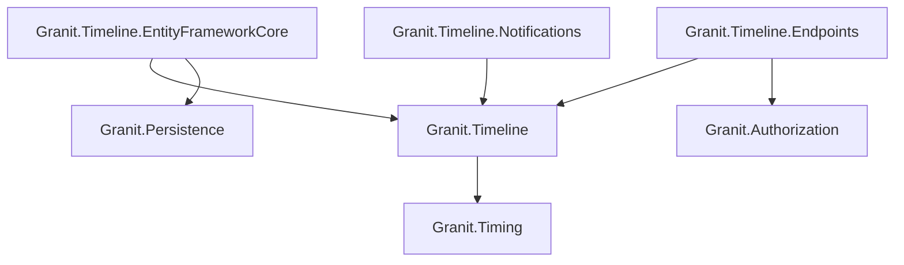
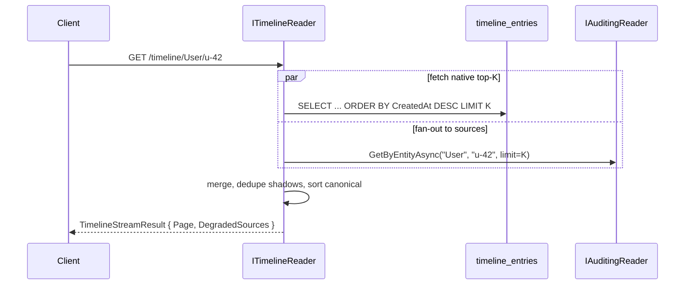
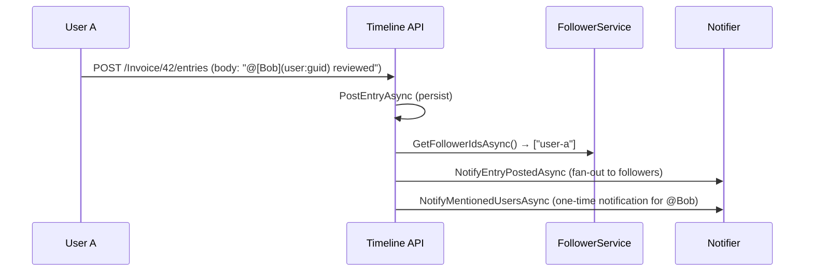

import { Tabs, TabItem, FileTree } from "@astrojs/starlight/components";

Granit.Timeline adds a unified activity stream (Odoo-style chatter) to any entity —
comments, internal notes, system logs, threaded replies, file attachments, and a
follow/notify pattern.

## Package structure

<FileTree>
- Granit.Timeline/ Core stream engine, in-memory default, Unicode-emoji reactions on `TimelineEntry`
  - Granit.Timeline.EntityFrameworkCore Durable persistence (PostgreSQL)
  - Granit.Timeline.Endpoints Minimal API routes, permissions
  - Granit.Timeline.Notifications Follow/notify via Granit.Notifications
  - Granit.Timeline.Auditing Federated bridge — project audit entries into the stream
  - Granit.Timeline.AI Audit-trail summarization + anomaly detection

</FileTree>

| Package | Role | Depends on |
|---------|------|------------|
| `Granit.Timeline` | `ITimelined`, `ITimelineReader/Writer`, `ITimelineSource`, stream DTOs, Unicode-emoji reactions (👍 ❤️ 🎉 …) on entries — any well-formed Unicode emoji sequence, validated server-side (see [ADR-040 §5 — closed enums by reference to an upstream standard](/dotnet/architecture/adr/040-three-tier-metadata-architecture/#closed-enums-by-reference-to-an-upstream-standard)) | `Granit.Timing` |
| `Granit.Timeline.EntityFrameworkCore` | Durable persistence for entries + attachments + reactions | `Granit.Timeline`, `Granit.Persistence` |
| `Granit.Timeline.Endpoints` | REST API, permission policies | `Granit.Timeline`, `Granit.Authorization` |
| `Granit.Timeline.Notifications` | Notification-backed follower/notifier bridge | `Granit.Timeline` |
| `Granit.Timeline.Auditing` | Federated bridge — projects `Granit.Auditing` entries into the stream so audited changes show up on the affected entity's timeline | `Granit.Timeline`, `Granit.Auditing` |
| `Granit.Timeline.AI` | Summarize long audit trails into a digest; detect unusual activity patterns | `Granit.Timeline`, `Granit.AI` |

## Dependency graph



---

## Setup

<Tabs>
<TabItem label="Development (in-memory)">

```csharp
[DependsOn(typeof(GranitTimelineModule))]
public class AppModule : GranitModule { }
```

In-memory stores for entries and followers. No database required.

</TabItem>
<TabItem label="Production (EF Core + Endpoints + Notifications)">

```csharp
[DependsOn(
    typeof(GranitTimelineEntityFrameworkCoreModule),
    typeof(GranitTimelineEndpointsModule),
    typeof(GranitTimelineNotificationsModule))]
public class AppModule : GranitModule { }
```

```csharp
builder.AddGranitTimelineEntityFrameworkCore(
    opts => opts.UseNpgsql(connectionString));

// Map endpoints in the app pipeline
app.MapGranitTimeline();
```

</TabItem>
</Tabs>

## Marking entities as timelined

Add the `ITimelined` marker interface to any entity that should have an activity stream:

```csharp
public class Invoice : FullAuditedEntity, ITimelined
{
    public string InvoiceNumber { get; set; } = string.Empty;
    public decimal Amount { get; set; }
    public InvoiceStatus Status { get; set; }
}
```

The entity type name is derived from the CLR type name by convention (`"Invoice"`),
or can be overridden with `[Timelined("custom-name")]`.

## Posting entries

```csharp
public class InvoiceApprovalHandler(ITimelineWriter timeline)
{
    public async Task HandleAsync(
        InvoiceApproved evt, CancellationToken cancellationToken)
    {
        // System log — immutable, cannot be deleted (ISO 27001)
        await timeline.PostEntryAsync(
            "Invoice",
            evt.InvoiceId.ToString(),
            TimelineEntryType.SystemLog,
            $"Invoice approved by **{evt.ApprovedBy}** for amount {evt.Amount:C}.",
            cancellationToken: cancellationToken).ConfigureAwait(false);
    }
}
```

Entry bodies support Markdown formatting. The `@mention` syntax
(`@[Display Name](user:guid)`) triggers one-time mention notifications (capped at
10 per entry) when the Endpoints module processes the entry.

## TimelineStreamEntry (DTO)

```csharp
public sealed record TimelineStreamEntry
{
    public required Guid Id { get; init; }
    public required DateTimeOffset OccurredAt { get; init; }
    public required TimelineStreamEntryType EntryType { get; init; }
    public string? AuthorId { get; init; }
    public string? AuthorName { get; init; }
    public string Body { get; init; } = string.Empty;
    public IReadOnlyList<TimelineAttachmentInfo> Attachments { get; init; } = [];
    public Guid? ParentEntryId { get; init; }

    // Federation
    public TimelineEntryOrigin Origin { get; init; } = TimelineEntryOrigin.Native;
    public string SourceKey { get; init; } = TimelineSourceKeys.Native;
    public string? SourceId { get; init; }

    // Edit tracking
    public DateTimeOffset? EditedAt { get; init; }
}
```

`Origin` discriminates entries that live in the native `timeline_entries` table
(`Native`) from those projected by an `ITimelineSource` contributor (`External`).
`SourceKey` carries the contributor name (`"auditing"`, `"workflow"`, …) — soft
contract, contributors register their own. Reactions, replies, and edits only
target `Native` rows; an `External` entry must first be **anchored** to materialize
a native shadow row (see below).

| Entry type | Description | Deletable | Visibility |
|-----------|-------------|-----------|------------|
| `Comment` | Human-authored comment visible to all users | Yes (soft-delete, GDPR) | All users with `Timeline.Entries.Read` |
| `InternalNote` | Staff-only internal note | Yes (soft-delete, GDPR) | Requires `Timeline.InternalNotes.Read` |
| `SystemLog` | Auto-generated audit entry | No (immutable, ISO 27001) | All users with `Timeline.Entries.Read` |

## REST API endpoints

All endpoints are prefixed with `/api/{version}/timeline`.

| Method | Path | Description | Permission |
|--------|------|-------------|------------|
| `GET` | `/{entityType}/{entityId}` | Paginated activity stream (newest first), merged across registered `ITimelineSource` contributors | `Timeline.Entries.Read` |
| `POST` | `/{entityType}/{entityId}/entries` | Post a comment, note, or system log | `Timeline.Entries.Create` |
| `PATCH` | `/{entityType}/{entityId}/entries/{entryId}` | Edit own comment/note within `TimelineOptions.EditWindow` (default 15 min) | `Timeline.Entries.Create` + ownership |
| `POST` | `/{entityType}/{entityId}/anchor` | Materialize a native shadow row for an external entry (idempotent) so reactions/replies can target it | `Timeline.Entries.Create` |
| `DELETE` | `/{entityType}/{entityId}/entries/{entryId}` | Soft-delete an entry (GDPR) — owner or admin | `Timeline.Entries.Create` + ownership or `Timeline.Entries.Manage` |
| `POST` | `/{entityType}/{entityId}/follow` | Subscribe current user as follower | `Timeline.Followers.Manage` |
| `DELETE` | `/{entityType}/{entityId}/follow` | Unsubscribe current user | `Timeline.Followers.Manage` |
| `GET` | `/{entityType}/{entityId}/followers` | List follower user IDs | `Timeline.Entries.Read` |

The GET stream endpoint sets the `X-Timeline-Degraded-Sources` response header
(comma-separated source keys) when one or more contributors timed out or threw
under the default `DegradeGracefully` policy. Beyond `TimelineOptions.MaxPage`
(default 10) the endpoint returns `400 timeline-depth-exceeded` so a misbehaving
client can't deepen federated pagination indefinitely.

## Federated stream — ITimelineSource

Any module can contribute entries to the unified stream by implementing
`ITimelineSource`. The reader merges native rows with every registered
contributor under a canonical sort (`OccurredAt DESC`, native wins ties,
`SourceKey ASC`, `Id ASC`) and applies per-source timeouts.

```csharp
public interface ITimelineSource
{
    string SourceKey { get; } // regex ^[a-z][a-z0-9_-]{0,63}$

    Task<IReadOnlyList<TimelineStreamEntry>> GetEntriesAsync(
        string entityType, string entityId, int limit, CancellationToken ct);

    Task<TimelineStreamEntry?> GetEntryAsync(
        string entityType, string entityId, string sourceId, CancellationToken ct);
}
```

The framework ships `Granit.Timeline.Auditing` — register the module and every
`AuditEntry` targeting an `ITimelined` entity shows up in that entity's
timeline as an `External`-origin `SystemLog`:

```csharp
[DependsOn(
    typeof(GranitTimelineEntityFrameworkCoreModule),
    typeof(GranitTimelineAuditingModule))]
public class AppModule : GranitModule { }
```



### Anchor — making external entries interactive

Reactions and threaded replies always target a native `TimelineEntry.Id`. To
attach interaction to an `External`-origin entry, the client first calls
`POST /timeline/{entityType}/{entityId}/anchor` with the source key + source id.
The server materializes a **shadow row** with a deterministic v5 GUID derived
from `(TenantId, EntityType, EntityId, SourceKey, SourceId)` and returns it:

```http
POST /api/v1/timeline/User/u-42/anchor
{ "sourceKey": "auditing", "sourceId": "9c40…" }

200 OK
{ "entryId": "e2c4…" }
```

Anchoring is **idempotent**: the deterministic Id means concurrent callers
converge on the same row. The shadow snapshots the source's body, author,
and `OccurredAt` at anchor time — if the audit log later purges its row, the
shadow keeps the snapshot so reactions remain meaningful (audit retention
independence).

:::note[Shadow rows preempt their source]
Once a shadow exists for `(SourceKey, SourceId)`, the reader drops the
matching projection from the source's emit and renders the shadow instead.
Edits to a shadow body are still rejected (see edit gates below) — the snapshot
is immutable, only reactions/replies layer on top.
:::

## Edit-own-message

`PATCH /timeline/{entityType}/{entityId}/entries/{entryId}` lets the author
revise the body of a comment or internal note within a configurable window.
The writer enforces **four gates** server-side; the front-end mirrors them to
hide the affordance but the writer is the source of truth.

```ts
canEdit = entry.origin === "Native"
       && entry.entryType !== "SystemLog"
       && entry.authorId === currentUser.id
       && (now - entry.occurredAt) < TimelineOptions.EditWindow
```

| Gate failure | `Reason` returned in `extensions["reason"]` |
|---|---|
| Shadow row or live external projection | `ExternalOrigin` |
| Native `SystemLog` | `SystemLog` |
| Caller is not the author | `NotAuthor` |
| `TimelineOptions.EditWindow` elapsed (or set to `TimeSpan.Zero`) | `WindowExpired` |

Successful edits set `TimelineEntry.EditedAt` (surfaced as `EditedAt` on
`TimelineStreamEntry`) and raise `TimelineEntryEditedEvent` — useful for
invalidating AI summary caches or replicating into the audit trail. No
permission separate from `Timeline.Entries.Create` is required; ownership +
window do the gating. A moderator who wants to "correct" someone else's
comment soft-deletes and reposts under their own name (chain-of-custody clean).

## TimelineOptions

```csharp
public sealed class TimelineOptions
{
    public int MaxPage { get; set; } = 10;
    public TimeSpan SourceTimeout { get; set; } = TimeSpan.FromSeconds(2);
    public SourceFailurePolicy OnSourceFailure { get; set; }
        = SourceFailurePolicy.DegradeGracefully;
    public TimeSpan EditWindow { get; set; } = TimeSpan.FromMinutes(15);
}
```

| Option | Default | Purpose |
|---|---|---|
| `MaxPage` | `10` | Federated pagination depth cap. Beyond it, `GET` returns `400 timeline-depth-exceeded`. |
| `SourceTimeout` | `2 s` | Per-source timeout. Slower sources are dropped (Degrade) or rethrown (Throw). |
| `OnSourceFailure` | `DegradeGracefully` | Drop + report via `X-Timeline-Degraded-Sources`. Set `ThrowAll` in dev/test to fail loud. |
| `EditWindow` | `15 min` | `TimeSpan.Zero` disables edit entirely. |

### Permissions

| Permission | Description |
|-----------|-------------|
| `Timeline.Entries.Read` | View activity streams and audit history |
| `Timeline.Entries.Create` | Post comments and internal notes |
| `Timeline.Entries.Manage` | Admin: soft-delete any entry regardless of ownership |
| `Timeline.InternalNotes.Read` | View staff-only internal notes (filtered by default) |
| `Timeline.Followers.Manage` | Follow/unfollow entities |

## Follow/notify pattern



:::note[Security — no auto-follow on @mention]
Mentioned users receive a **one-time notification** but are **not** automatically
subscribed as followers. This prevents forced subscription attacks and complies
with GDPR consent requirements. Mentions are capped at 10 per entry.
:::

Without `Granit.Timeline.Notifications`, the follower service uses an in-memory store
and the notifier is a no-op (`NullTimelineNotifier`). Installing the Notifications
package replaces both with notification-backed implementations that leverage
`Granit.Notifications` for multi-channel delivery (email, push, SignalR).

## Attachments

Timeline entries support file attachments via `ITimelineWriter.AddAttachmentAsync()`,
referencing blob IDs managed by `Granit.BlobStorage`:

```csharp
await timeline.AddAttachmentAsync(
    entryId,
    blobId: uploadResult.BlobId,
    fileName: "scan.pdf",
    contentType: "application/pdf",
    sizeBytes: 245_000,
    cancellationToken).ConfigureAwait(false);
```

## Public API summary

| Category | Key types | Package |
|----------|-----------|---------|
| Modules | `GranitTimelineModule`, `GranitTimelineEntityFrameworkCoreModule`, `GranitTimelineEndpointsModule`, `GranitTimelineNotificationsModule`, `GranitTimelineAuditingModule` | Timeline |
| Timeline core | `ITimelined`, `ITimelineReader`, `ITimelineWriter`, `ITimelineSource`, `ITimelineFollowerService`, `ITimelineNotifier` | `Granit.Timeline` |
| Federation | `TimelineStreamResult`, `TimelineEntryOrigin`, `TimelineSourceKeys`, `TimelineDepthExceededException` | `Granit.Timeline` |
| Edit | `TimelineEntryNotEditableException`, `TimelineEntryNotEditableReason`, `TimelineEntryEditedEvent` | `Granit.Timeline` |
| Options | `TimelineOptions { MaxPage, SourceTimeout, OnSourceFailure, EditWindow }` | `Granit.Timeline` |
| DTOs | `TimelineStreamEntry`, `TimelineStreamEntryType`, `TimelineAttachmentInfo`, `PostTimelineEntryRequest`, `UpdateTimelineEntryBodyRequest`, `AnchorTimelineEntryRequest/Response` | `Granit.Timeline*` |
| Permissions | `TimelinePermissions.Entries.{Read,Create,Manage}`, `.InternalNotes.Read`, `.Followers.Manage` | `Granit.Timeline.Endpoints` |
| Extensions | `AddGranitTimeline()`, `AddGranitTimelineEntityFrameworkCore()`, `AddGranitTimelineAuditing()`, `MapGranitTimeline()` | — |

## See also

- [React companion: Timeline](/frontend/business/timeline/) — the `@granit` packages that consume this module from React
- [Notifications module](/dotnet/infrastructure/notifications/) — Multi-channel notification engine used by Timeline.Notifications
- [Persistence module](/dotnet/data/persistence/) — EF Core interceptors, query filters
- [Blob Storage module](/dotnet/data/blob-storage/) — File storage for timeline attachments
- [Observability module](/dotnet/operations/observability/) — Audit logging
- [Presence module](/dotnet/infrastructure/presence/) — show who is currently viewing this entity alongside its activity stream
