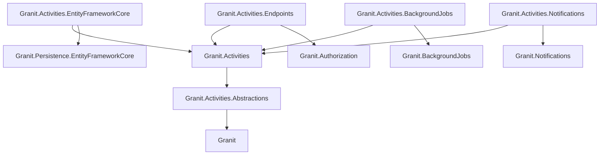
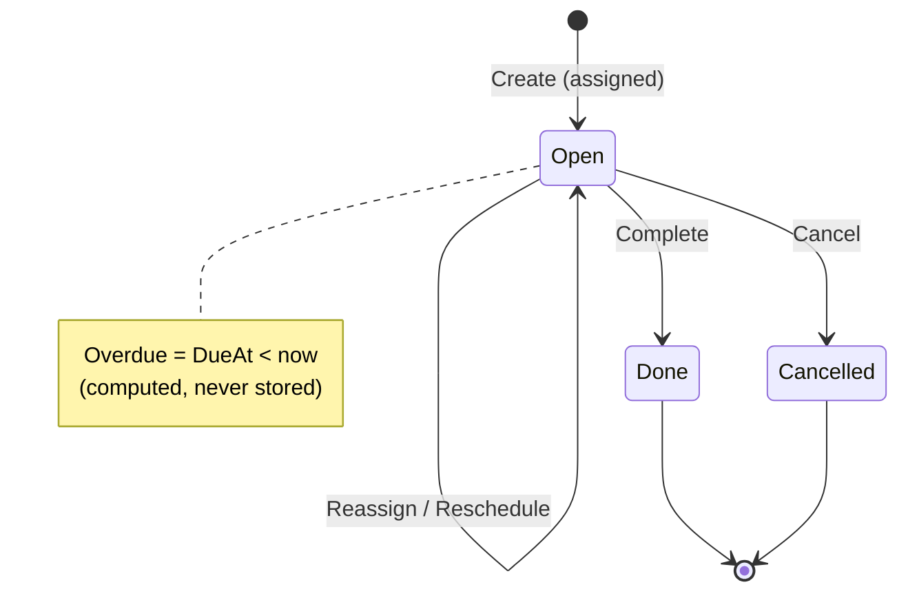

import { Tabs, TabItem, Aside, Steps, FileTree, Badge } from "@astrojs/starlight/components";

`Granit.Activities` is the framework's task and to-do engine. An **Activity** is a
cross-entity polymorphic to-do: a due-dated, assigned unit of work pinned to any
entity in the system — an `Appointment` follow-up assigned to a `Doctor`, a
callback on an `Invoice`, an onboarding checklist item on a `Patient`. It is the
future-facing peer of [`Granit.Timeline`](/dotnet/building-blocks/timeline/),
which records the past. Both share the same `(EntityType, EntityId)` polymorphic
shape, so any aggregate hosts activities without taking a dependency on this module.

## Why this module exists

Task lists were previously re-invented per feature — each with its own table,
lifecycle, overdue logic, and reminder job. `Granit.Activities` consolidates the
to-do abstraction into one aggregate so:

- Any entity hosts tasks via the polymorphic `(EntityType, EntityId)` key — no FK
  churn, no per-host table.
- Lifecycle is a single, small state machine (Open → Done / Cancelled) that every
  consumer reasons about identically.
- Overdue detection and day-before reminders ship as recurring background jobs
  that no application has to write.
- One cross-entity calendar spans every host type the caller can read.

## Package structure

<FileTree>

- Granit.Activities.Abstractions/ Activity types, provider hook, registry contract (lightweight)
- Granit.Activities/ Activity aggregate, lifecycle, reader/writer contracts, query/export/metrics
  - Granit.Activities.EntityFrameworkCore EF Core persistence — isolated DbContext, EfCore reader/writer
  - Granit.Activities.Endpoints Minimal API — CRUD, lifecycle transitions, cross-entity calendar, permissions
  - Granit.Activities.BackgroundJobs Recurring overdue scan (every 5 min) + daily reminder scan
  - Granit.Activities.Notifications Routes Assigned / Reminder / Overdue events to the assignee

</FileTree>

| Package | Role | Depends on |
|---------|------|------------|
| `Granit.Activities.Abstractions` | `ActivityType`, `IActivityTypeProvider`, `IActivityRegistry`, `StandardActivityTypes` | `Granit` |
| `Granit.Activities` | `Activity` aggregate, `IActivityReader`/`IActivityWriter`, query + export + metric definitions | `Granit.Activities.Abstractions`, `Granit.QueryEngine`, `Granit.DataExchange`, `Granit.Analytics` |
| `Granit.Activities.EntityFrameworkCore` | Isolated `ActivitiesDbContext`, `EfCoreActivityReader`/`EfCoreActivityWriter`, query source | `Granit.Activities`, `Granit.Persistence.EntityFrameworkCore` |
| `Granit.Activities.Endpoints` | CRUD + lifecycle API, cross-entity calendar, permissions, host authorization | `Granit.Activities`, `Granit.Authorization`, `Granit.Validation`, `Granit.Workspaces` |
| `Granit.Activities.BackgroundJobs` | `MarkOverdueJob` (`*/5 * * * *`) + `SendRemindersJob` (`0 8 * * *`) recurring scans | `Granit.Activities`, `Granit.BackgroundJobs` |
| `Granit.Activities.Notifications` | `ActivityAssigned`/`Reminder`/`Overdue` handlers + templates + notification definitions | `Granit.Activities`, `Granit.Notifications`, `Granit.Templating` |

## Dependency graph



---

## Core concepts

### Polymorphic host

`Activity` is polymorphic on `(EntityType, EntityId)` — the wire name of the host
entity plus its primary key. The activity carries no navigation property to the
host, so `Granit.Sales`, `Granit.Identity`, or your own module can host activities
without either side referencing the other. An `Appointment` and a `Patient` both
host activities through the exact same shape.

### Activity types

An `ActivityType` is an immutable descriptor — a stable wire `Name`, an `Icon`, a
localization `DisplayKey`, and an optional `DefaultDurationMinutes` for
time-blocked types. The framework ships a starter catalog in
`StandardActivityTypes`:

| Type | Icon | Default duration |
|------|------|------------------|
| `ToDo` | `check-square` | point-in-time |
| `Call` | `phone` | point-in-time |
| `Meeting` | `calendar` | 30 min |
| `Email` | `mail` | point-in-time |

Modules contribute domain-specific types through `IActivityTypeProvider` — the
same IoC-contributor pattern used across the framework. `Granit.Sales` can add a
`"Quote"` type and `Granit.Identity` an `"Onboarding"` type without either
depending on the other; both pull only `Granit.Activities.Abstractions`.

```csharp
public sealed class ClinicalActivityTypeProvider : IActivityTypeProvider
{
    public IEnumerable<ActivityType> Provide() =>
    [
        new ActivityType(
            Name: "AppointmentFollowUp",
            Icon: "stethoscope",
            DisplayKey: "Activity:AppointmentFollowUp"),
        new ActivityType(
            Name: "LabReview",
            Icon: "flask",
            DisplayKey: "Activity:LabReview",
            DefaultDurationMinutes: 15),
    ];
}

services.AddActivityTypeProvider<ClinicalActivityTypeProvider>();
```

At construction, `IActivityRegistry` aggregates every registered provider's
contributions into a single catalog keyed by `Name`. Duplicate names fail boot.
`Activity.Create` and `Reassign` validate the type against the registry at the
factory boundary — a type from an unloaded provider is rejected, never silently
persisted.

<Aside type="note">
Types from providers a host does not load simply never appear. Entities that opt
into a subset via `AllowedTypes(...)` on their `EntityDefinition` never see the
missing options.
</Aside>

### Multi-tenancy

`Activity` is `IMultiTenant`, and Activities is a **tenant-only** module. The
`AddGranitActivitiesEntityFrameworkCore` wiring honors the active
`TenantIsolationStrategy` (`SharedDatabase`, `DatabasePerTenant`,
`SchemaPerTenant`) and wires the audit, soft-delete, and lifecycle interceptors
automatically. All reads are tenant-scoped by the standard EF Core query filter.

---

## Lifecycle

The state machine is deliberately small — three states, two terminal. **Overdue
is a computed view** (`DueAt < now && Status == Open`), never a persisted state,
so there is no fourth column to keep in sync.



Activities are **append-only**: once `Done` or `Cancelled`, every write
(`Complete`, `Cancel`, `Reassign`, `Reschedule`) throws
`InvalidOperationException`. There is no re-open — model a follow-up as a new
activity.

```csharp
// Doctor Alice books a follow-up call on an Appointment, due in three days.
var followUp = await writer.CreateAsync(
    entityType: "Granit.Scheduling.Appointment",
    entityId: appointmentId,
    type: StandardActivityTypes.Call.Name,
    assignedToUserId: doctorAliceId,
    dueAt: clock.Now.AddDays(3),
    createdByUserId: currentUserId,
    description: "Review post-op recovery with the patient.",
    cancellationToken: cancellationToken);

// The workload shifts — hand it to Doctor Bob and push the date out a day.
await writer.ReassignAsync(followUp.Id, doctorBobId, cancellationToken);
await writer.RescheduleAsync(followUp.Id, clock.Now.AddDays(4), cancellationToken);

// Bob completes it.
await writer.CompleteAsync(followUp.Id, doctorBobId, clock.Now, cancellationToken);
```

---

## Setup

<Steps>

1. **Add the EF Core store** (host application builder):

   ```csharp
   builder.AddGranitActivitiesEntityFrameworkCore(o =>
       o.UseNpgsql(builder.Configuration.GetConnectionString("Default")));
   ```

   This registers `ActivitiesDbContext`, `IActivityReader`/`IActivityWriter`, and
   the QueryEngine source over `Activity`.

2. **Register the runtime module** — the registry, standard types, query / export
   / metric definitions:

   ```csharp
   builder.Services.AddGranitActivities();
   ```

3. **Depend on the modules** you need. Endpoints, background jobs, and
   notifications are opt-in:

   ```csharp
   [DependsOn(
       typeof(GranitActivitiesEndpointsModule),
       typeof(GranitActivitiesBackgroundJobsModule),
       typeof(GranitActivitiesNotificationsModule))]
   public class AppModule : GranitModule { }
   ```

4. **Map the endpoints** and enable calendar cache invalidation:

   ```csharp
   app.MapGranitActivities();
   ```

   ```csharp
   builder.Services.AddGranitActivitiesCalendarCacheInvalidation();
   ```

</Steps>

<Aside type="caution">
`AddGranitActivitiesCalendarCacheInvalidation()` wires the lifecycle-event
handlers that evict the calendar cache on every `Activity` change. Call it once,
after `AddGranitActivitiesEntityFrameworkCore()`. Skip it and calendar responses
go stale for up to the cache TTL (default 1 minute).
</Aside>

Contribute custom activity types after `AddGranitActivities()`:

```csharp
builder.Services.AddActivityTypeProvider<ClinicalActivityTypeProvider>();
```

---

## API surface

### Readers and writers

`IActivityReader` and `IActivityWriter` are the code-facing CQRS pair, backed by
`EfCoreActivityReader` / `EfCoreActivityWriter`.

```csharp
public interface IActivityReader
{
    Task<Activity?> GetByIdAsync(Guid id, CancellationToken cancellationToken = default);

    Task<IReadOnlyList<Activity>> ListAsync(
        ActivityListFilter filter, int skip, int take,
        CancellationToken cancellationToken = default);

    Task<int> CountAsync(ActivityListFilter filter, CancellationToken cancellationToken = default);

    // Overdue-scan job: Open, past DueAt, OverdueNotifiedAt is null.
    Task<IReadOnlyList<Activity>> GetOverdueAwaitingNotificationAsync(
        DateTimeOffset asOf, CancellationToken cancellationToken = default);

    // Reminder job: Open activities due within a day window.
    Task<IReadOnlyList<Activity>> GetOpenDueWithinAsync(
        DateTimeOffset dayStart, DateTimeOffset dayEnd,
        CancellationToken cancellationToken = default);
}
```

`ActivityListFilter` is an all-optional record — combine any subset of host
(`EntityType` + `EntityId`), assignee, status, and a half-open `DueAt` window:

```csharp
// Doctor Bob's open inbox, due this week, oldest first.
var inbox = await reader.ListAsync(
    new ActivityListFilter(
        AssignedToUserId: doctorBobId,
        Status: ActivityStatusFilter.OpenOrOverdue,
        DueAtFrom: weekStart,
        DueAtTo: weekEnd),
    skip: 0, take: 20, cancellationToken);
```

`ActivityStatusFilter.OpenOrOverdue` is the inbox shortcut — it maps to
`Status == Open` (overdue rows are simply open rows past their due date).

The writer mirrors the aggregate behaviors; each method loads the row, invokes the
domain method, and persists in a single `SaveChanges`:

```csharp
public interface IActivityWriter
{
    Task<Activity> CreateAsync(string entityType, Guid entityId, string type,
        Guid assignedToUserId, DateTimeOffset dueAt, Guid? createdByUserId = null,
        string? description = null, CancellationToken cancellationToken = default);

    Task CompleteAsync(Guid activityId, Guid completedByUserId, DateTimeOffset at,
        CancellationToken cancellationToken = default);
    Task CancelAsync(Guid activityId, Guid cancelledByUserId, DateTimeOffset at,
        CancellationToken cancellationToken = default);
    Task ReassignAsync(Guid activityId, Guid newAssigneeUserId,
        CancellationToken cancellationToken = default);
    Task RescheduleAsync(Guid activityId, DateTimeOffset newDueAt,
        CancellationToken cancellationToken = default);
    Task MarkOverdueNotifiedAsync(Guid activityId, DateTimeOffset at,
        CancellationToken cancellationToken = default);
}
```

### HTTP endpoints

`MapGranitActivities()` returns a `RouteGroupBuilder` mounted under `activities`
(configurable via `Activities:Endpoints:RoutePrefix`). The whole group requires
`Activities.Activities.Read`; write endpoints layer stricter permissions on top.

| Method | Path | Permission |
|--------|------|-----------|
| `GET` | `/activities` | `Read` (+ `ReadOthers` to list peers) |
| `GET` | `/activities/{id}` | `Read` |
| `POST` | `/activities` | `Manage` |
| `POST` | `/activities/{id}/complete` | `Execute` |
| `POST` | `/activities/{id}/cancel` | `Manage` |
| `PUT` | `/activities/{id}/assignee` | `Reassign` |
| `PUT` | `/activities/{id}/due-date` | `Manage` |
| `GET` | `/activities/calendar` | `Read` |

The actor and timestamp for lifecycle transitions are resolved server-side — from
the authenticated principal and `IClock` — so clients cannot impersonate a user or
backdate a completion. Completing or cancelling a terminal activity returns
`409 Conflict`.

<Aside type="note">
List results are additionally filtered by `IActivityHostAuthorizationProvider`:
activities pinned to hosts the caller cannot read are dropped, and a single
`GET /activities/{id}` on an unreadable host returns `404` (not `403`) so the host
id stays non-enumerable. Modules with sensitive hosts register a stricter provider
for their `EntityType`.
</Aside>

### Cross-entity calendar

`GET /activities/calendar` returns a single stream of calendar items spanning
every host type the caller can read, within a time window. The window is capped at
`MaxCalendarRangeDays` (default 90) and requires `To > From`. Time-blocked types
project an end via `DueAt + DefaultDurationMinutes`; point-in-time types surface as
a single instant. Responses are cached per (tenant, permission hash, window,
filters) with per-tenant eviction, and honor `If-None-Match` (`304 Not Modified`).

---

## Notifications

`Granit.Activities.Notifications` routes three lifecycle events to the assignee via
`Granit.Notifications`, rendering embedded HTML templates through
`Granit.Templating`. Each is delivered on the Email and In-App channels by default,
and every one is user-opt-out-able.

| Notification | Type name | Severity | Fired by |
|--------------|-----------|----------|----------|
| Activity Assigned | `activity.assigned` | Info | Aggregate factory (create + reassign) |
| Activity Reminder | `activity.reminder` | Info | Daily reminder job (day before due) |
| Activity Overdue | `activity.overdue` | Warning | Overdue scan job (past due) |

Apps override any template at runtime through the `Granit.Templating` admin API —
the DB-backed resolver runs ahead of the embedded default.

## Background jobs

`Granit.Activities.BackgroundJobs` ships two recurring scans, auto-discovered by
`Granit.BackgroundJobs` via the `[RecurringJob]` attribute:

| Job | Cron | Behavior |
|-----|------|----------|
| `MarkOverdueJob` | `*/5 * * * *` | Emits `ActivityOverdueEvent` for open, past-due activities not yet notified |
| `SendRemindersJob` | `0 8 * * *` | Emits `ActivityReminderDueEvent` for activities due tomorrow |

The overdue scan is idempotent: `Activity.OverdueNotifiedAt` is stamped after the
event fires, so a given activity is notified at most once per overdue cycle even if
the job re-runs within its polling window. The reminder scan needs no stamp — the
daily cron plus the day-window query naturally dedupe within the cadence. Hosts
that want a per-tenant reminder time override the cron at registration.

---

## Permissions

All permissions live under the `Activities` group. The provider is auto-discovered
by `GranitAuthorizationModule`.

| Permission | Grants |
|------------|--------|
| `Activities.Activities.Read` | List own activities + get by id |
| `Activities.Activities.ReadOthers` | List activities assigned to other users |
| `Activities.Activities.Manage` | Create, cancel, reschedule |
| `Activities.Activities.Reassign` | Move work to a different user |
| `Activities.Activities.Execute` | Complete (typically held by the assignee) |

`ReassignAsync` and `ReadOthers` are deliberately separate gates so least-privilege
roles can act on their own workload without moving work onto — or reading the
inbox of — other users.

---

## Integration events

Published via the Wolverine outbox from `Granit.Activities`:

| Event | When |
|-------|------|
| `ActivityAssignedEto` | Activity created (assigned) |
| `ActivityReassignedEto` | Assignee changed on an open activity |
| `ActivityRescheduledEto` | Due date changed on an open activity |
| `ActivityCompletedEto` | Activity marked Done |

Local domain events (`ActivityAssignedEvent`, `ActivityCompletedEvent`,
`ActivityCancelledEvent`, `ActivityReassignedEvent`, `ActivityRescheduledEvent`,
`ActivityOverdueEvent`, `ActivityReminderDueEvent`) drive in-process handlers such
as the notification bridge and the calendar cache invalidator.

---

## See also

- [Timeline](/dotnet/building-blocks/timeline/) — the past-facing peer (audit, comments, mentions) that shares the polymorphic host shape
- [ADR-046 — Activities vs Timeline split](/dotnet/architecture/adr/046-activities-vs-timeline/) — the rationale for two peer modules and the three-state, computed-overdue lifecycle
- [Parties](/dotnet/business/parties/) — a common activity host (customer / patient / doctor)
- [Reference Data](/dotnet/business/reference-data/) — lookup tables for related domain enums
