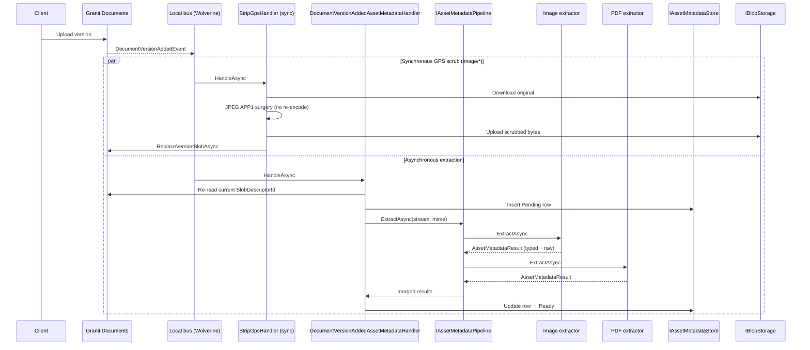
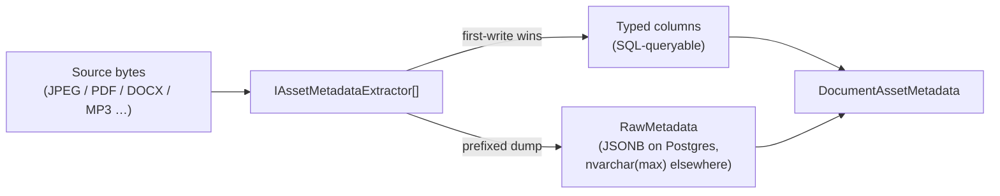

import { Aside } from "@astrojs/starlight/components";

`Granit.Documents.AssetMetadata` extracts the descriptive metadata buried in
every uploaded document — EXIF for photos, the PDF info dictionary, Office
core / extended properties, audio ID3 tags, video container metadata — and
makes it queryable. Hosts ship a digital-asset-management (DAM) experience
without writing a parser; the framework brings the providers and the storage
shape.

## Why a dedicated metadata module

`Granit.Documents` stores the bytes and `Granit.Documents.Renditions` derives
visual previews. Neither surfaces the **descriptive** layer: the camera that
shot a photo, the page count of a PDF, the author of a Word file, the ID3 tags
on an MP3. Without it, you cannot search by camera model, filter by author,
group by capture date, or compute a GDPR data-subject export. Bolting on an
ad-hoc extractor per host means three teams reinvent EXIF parsing in
incompatible ways and discover the JSONB-vs-typed-columns trade-off on their
own.

The metadata module solves it once: one contract, six provider packages, a
single storage shape, and a synchronous GPS scrub that meets the GDPR /
ISO 27001 A.12.4.1 minimisation requirement before the original bytes land in
cold storage.

## Architecture

`Granit.Documents.AssetMetadata` ships the contract, the pipeline, and the
typed-projection aggregate. Provider packages plug a single
`IAssetMetadataExtractor` per source family. The persistence and HTTP layers
live in companion packages, mirroring the Documents and Renditions split.

Core abstractions:

- `IAssetMetadataExtractor` — `Name`, `CanHandle(string sourceContentType)`,
  `ExtractAsync(Stream, string, CancellationToken)`. One implementation per
  source family. Multiple extractors can claim the same MIME — the pipeline
  runs every one and merges the results.
- `IAssetMetadataPipeline` — sequential dispatcher; each extractor sees the
  source stream rewound to position 0 and contributes one
  `AssetMetadataResult`.
- `AssetMetadataResult` — record with `RawMetadata` (verbatim dump under an
  extractor-specific prefix) plus init properties for the typed projection
  fields (`Width`, `CameraMake`, `PageCount`, `Title`, `DurationMs`, …).
- `IAssetMetadataStore` — persistence abstraction; the EF Core companion owns
  the `documents_asset_metadata` table keyed on `(DocumentVersionId)`.
- `DocumentAssetMetadata` aggregate with lifecycle
  `Pending` → `Extracting` → `Ready` / `Failed`, plus domain events
  `AssetMetadataExtractedEvent` and `AssetMetadataFailedEvent`.



## Provider matrix

Each provider package contributes one `IAssetMetadataExtractor` and a single
NuGet dependency. Architecture tests pin the boundary: only the listed
package may reference the underlying library.

| Source MIME family | NuGet dependency | License | Typed columns populated |
| --- | --- | --- | --- |
| `image/*` (JPEG, PNG, WebP, …) | `MetadataExtractor` | Apache-2.0 | `Width`, `Height`, `CameraMake`, `CameraModel`, `LensModel`, `Iso`, `FNumber`, `ExposureTimeMs`, `TakenAt`, `GpsLatitude`, `GpsLongitude`, `GpsAltitude` |
| `application/pdf` | `PdfPig` | Apache-2.0 | `PageCount`, `Title`, `Author`, `Subject`, `Keywords`, `Producer` |
| OOXML (`.docx`, `.xlsx`, `.pptx`) | `DocumentFormat.OpenXml` | MIT | `PageCount` (Word + PowerPoint), `Title`, `Author`, `Subject`, `Keywords`, `Revision`, `LastModifiedBy` |
| `audio/*`, `video/*` | `TagLibSharp` | LGPL-2.1 (dynamic link) | `DurationMs`, `Codec`, `Bitrate`, `Width`, `Height` (video), `Artist`, `Album`, `TrackNumber`, `Genre`, `Title`, `TakenAt` |

Legacy Office binary formats (`.doc`, `.xls`, `.ppt`) are explicitly out of
scope — the OOXML reader does not parse them, and the legacy-format readers
on NuGet are LGPL with a less clean dynamic-link story than TagLibSharp.

<Aside type="note">
With no extractor registered the pipeline still runs — the row simply lands
`Ready` with `ExtractorCount = 0`. Provider packages plug in independently;
opting out of audio/video metadata is as simple as not referencing
`Granit.Documents.AssetMetadata.AudioVideo`.
</Aside>

## Storage model — indexed projection + raw archive

Cloudinary, Bynder, and Adobe AEM Assets converged on the same shape, and
`Granit.Documents.AssetMetadata` adopts it: every well-known field lifts to a
**typed column** so SQL can filter and sort on it, while the full extractor
payload is preserved verbatim in a single **raw archive** column.



Trade-offs of the alternatives that were considered and rejected:

- **Blob-only** (store the raw dump, project nothing): unsearchable. The admin
  UI cannot render "every photo shot with a Canon EOS R5" without a
  full-table scan plus per-row JSON parsing.
- **Column-only** (typed columns, drop the raw dump): forensics impossible.
  When an extractor improves and exposes a new tag six months from now,
  there is no historical payload to backfill from.
- **Indexed projection + raw archive** (the chosen shape): admin grids stay
  fast because they filter / sort on indexed typed columns; one-off forensic
  queries fall back to JSONB. Re-extraction is a backfill job, not a forced
  re-upload.

When multiple extractors populate the same typed column (image + video both
supply `Width` / `Height`), **first-write wins**. Order of plug-in matters
only for clashes — for distinct fields the merge is associative.

### Cross-database — Postgres, SQL Server, SQLite

`RawMetadata` is persisted as a portable text column (`text` on Postgres,
`nvarchar(max)` on SQL Server, `TEXT` on SQLite). Hosts on Postgres flip the
column to `jsonb` in their own migration to unlock GIN indexes and JSON-path
operators; the framework ships no migrations and no per-provider branching.

The EF Core companion runs against all three providers — see the integration
test suite in `tests/Granit.Documents.EntityFrameworkCore.Tests.Integration`
for the Postgres reference and the in-memory SQLite tests for the typed-
projection round trip.

## GDPR GPS scrub on upload

Photo uploads carry GPS coordinates by default. Most hosts do not need them
and most users do not realise their phone embedded them. The metadata module
strips GPS from the **original** bytes synchronously, before the asynchronous
extractor runs.

`StripGpsHandler` (shipped in `Granit.Documents.AssetMetadata.Imaging`)
subscribes to `DocumentVersionAddedEvent` and runs in the local bus. For
`image/jpeg` sources it:

1. Downloads the original blob through a presigned URL.
2. Walks the JPEG APP1 segment, finds the EXIF TIFF directory, and rewrites
   the GPS-IFD pointer tag (`0x8825`) to a benign unknown tag id. **Every
   other IFD entry stays at the same byte offset**, so the rest of EXIF
   (`Make`, `Model`, `DateTimeOriginal`, ISO, …) and the embedded ICC colour
   profile are untouched.
3. Re-uploads the scrubbed bytes via `IBlobStorage.InitiateUploadAsync` plus
   presigned PUT plus `ConfirmUploadAsync`.
4. Calls `IDocumentService.ReplaceVersionBlobAsync` to atomically swap the
   `DocumentVersion.BlobDescriptorId`, rebalance the tenant quota, and emit
   `DocumentBlobScrubbedEvent` for the ISO 27001 A.12.4.1 audit trail.

The scrub is **strictly no re-encode**. Pixels are bit-identical to the
source — APP1 segment surgery, not a Magick.NET round-trip. The descriptor
row for the original blob is soft-deleted (bytes erased, audit trail
preserved for the 3-year retention window).

### Race with the asynchronous extractor

Both the scrub handler and the F17.4 background extractor subscribe to the
same `DocumentVersionAddedEvent`. Wolverine local-vs-distributed queue
ordering is not guaranteed, so the extractor cannot trust the snapshot
`BlobDescriptorId` carried by the event. `AssetMetadataGenerationService`
**re-reads** `DocumentVersion.BlobDescriptorId` from the current row before
opening the source stream — the extractor always sees the post-scrub bytes
regardless of dispatch order.

### Opt-out

Hosts with a legitimate GPS-retention requirement (real-estate, journalism,
mapping) flip `GranitAssetMetadataOptions.StripGpsOnUpload` to `false`.
Both the scrub handler and the projection-side GPS drop short-circuit.

## Endpoints

| Method | Path | Permission | Purpose |
| --- | --- | --- | --- |
| `GET` | `/documents/{id}/metadata` | `Documents.Documents.Read` | Current-version metadata. |
| `GET` | `/documents/{id}/versions/{versionId}/metadata` | `Documents.Documents.Read` | Version-specific metadata. |

The response carries every typed column at the top level plus the verbatim
extractor payload under `rawMetadata` (keyed `{extractor}:{tag}` —
`exif:Make`, `pdf:Producer`, `office:Author`, `audio:Artist`, …). Both
endpoints return 404 when the document is missing, excluded by the tenant
filter, or extraction has not produced a row yet.

Cross-folder document listing rides the standard
[query engine](/dotnet/building-blocks/query-engine/) at `GET /documents/query` —
the metadata endpoints stay focused on the per-version read.

## Configuration

`GranitAssetMetadataOptions` is bound under `Documents:AssetMetadata`:

| Option | Default | Effect |
| --- | --- | --- |
| `StripGpsOnUpload` | `true` | Run the synchronous GPS scrub on `image/*` uploads. |
| `MaxConcurrentExtractions` | `4` | Pipeline-wide cap on simultaneous async extractions. |
| `ExtractionTimeout` | `00:00:30` | Hard timeout for a single extractor invocation. |

Minimal host wiring for the full extractor chain:

```csharp
builder.AddGranitDocuments();
builder.AddGranitDocumentsEntityFrameworkCore(opts => opts.UseNpgsql(connString));
builder.AddGranitDocumentsAssetMetadata();
builder.AddGranitDocumentsAssetMetadataEntityFrameworkCore(opts => opts.UseNpgsql(connString));

// Provider packages — drop the ones you do not need.
builder.Services.AddGranitDocumentsAssetMetadataImaging();
builder.Services.AddGranitDocumentsAssetMetadataPdf();
builder.Services.AddGranitDocumentsAssetMetadataOffice();
builder.Services.AddGranitDocumentsAssetMetadataAudioVideo();

builder.Services.AddGranitDocumentsAssetMetadataBackgroundJobs();

app.MapGroup("/api")
   .MapGranitDocuments()
   .MapGranitDocumentsAssetMetadata();
```

## Observability

- **Meter** `Granit.Documents.AssetMetadata` (`AssetMetadataMetrics`) — four
  instruments: `granit.documents.asset_metadata.extracted.count`,
  `granit.documents.asset_metadata.failed.count`,
  `granit.documents.asset_metadata.gps_scrubbed.count`, and the histogram
  `granit.documents.asset_metadata.extraction.duration_ms`. Tags:
  `tenant_id`, `source_content_type`, `extractor` (where applicable).
- **ActivitySource** `Granit.Documents.AssetMetadata`
  (`AssetMetadataActivitySource`) — every pipeline run, extractor call, and
  GPS scrub is a span named `asset_metadata.{operation}` with the same tag
  triplet.

Both are auto-registered through `GranitActivitySourceRegistry`.

## Architecture boundary tests

`tests/Granit.ArchitectureTests/AssetMetadataArchitectureTests` pins six
invariants checked on every PR:

- Only `Granit.Documents.AssetMetadata.Imaging` references `MetadataExtractor`.
- Only `Granit.Documents.AssetMetadata.Pdf` references `PdfPig` from the
  metadata packages.
- Only `Granit.Documents.AssetMetadata.Office` references `DocumentFormat.OpenXml`.
- Only `Granit.Documents.AssetMetadata.AudioVideo` references `TagLibSharp`.
- The base `Granit.Documents.AssetMetadata` package references no provider
  package — the contract stays free of provider-specific types.
- Every `*MetadataExtractor` class declares `: IAssetMetadataExtractor` (source
  grep over the four provider packages).

## See also

- [Documents](/dotnet/business/documents/) — the parent aggregate, ACL,
  quota, and trash semantics. Asset metadata sits one level below: every
  version has zero or one metadata row.
- [Documents — Renditions](/dotnet/business/documents-renditions/) — the
  sibling derivative pipeline. Renditions produce visual previews;
  Asset Metadata produces searchable descriptive fields. Both consume
  `DocumentVersionAddedEvent`; the F17 extractor re-reads
  `BlobDescriptorId` to converge with the F17.9 GPS scrub regardless of
  dispatch order.
- [ADR-052 — Granit.Documents module](/dotnet/architecture/adr/052-documents-module/).
