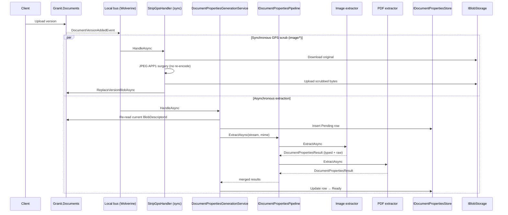
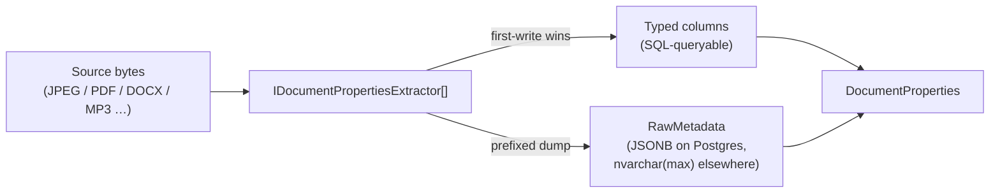

import { Aside } from "@astrojs/starlight/components";

`Granit.Documents.Properties` extracts the descriptive metadata buried in
every uploaded document — EXIF for photos, the PDF info dictionary, Office
core / extended properties, audio ID3 tags, video container metadata — and
makes it queryable. Hosts ship a digital-asset-management (DAM) experience
without writing a parser; the framework brings the providers and the storage
shape.

<Aside type="caution" title="Renamed module">
This module shipped as `Granit.Documents.AssetMetadata` until it was renamed to
`Granit.Documents.Properties`. Every package, type, option key, and metric was
renamed with it. Hosts upgrading from the old name must rename their package
references, swap `IAssetMetadataExtractor` for `IDocumentPropertiesExtractor`,
and move configuration from `Documents:AssetMetadata` to `Documents:Properties`.
</Aside>

## Why a dedicated properties module

`Granit.Documents` stores the bytes and `Granit.Documents.Renditions` derives
visual previews. Neither surfaces the **descriptive** layer: the camera that
shot a photo, the page count of a PDF, the author of a Word file, the ID3 tags
on an MP3. Without it, you cannot search by camera model, filter by author,
group by capture date, or compute a GDPR data-subject export. Bolting on an
ad-hoc extractor per host means three teams reinvent EXIF parsing in
incompatible ways and discover the JSONB-vs-typed-columns trade-off on their
own.

The properties module solves it once: one contract, four provider packages, a
single storage shape, and two synchronous scrubs — GPS and personal data —
that meet the GDPR Art. 5(c) / ISO 27001 A.12.4.1 minimisation requirement
before the original bytes land in cold storage.

## Architecture

`Granit.Documents.Properties` ships the contract, the pipeline, and the
typed-projection aggregate. Provider packages plug a single
`IDocumentPropertiesExtractor` per source family. The persistence and HTTP
layers live in companion packages, mirroring the Documents and Renditions
split.

Core abstractions:

- `IDocumentPropertiesExtractor` — `Name`, `CanHandle(string sourceContentType)`,
  `ExtractAsync(Stream, string, CancellationToken)`. One implementation per
  source family. Multiple extractors can claim the same MIME — the pipeline
  runs every one and merges the results.
- `IDocumentPropertiesPipeline` — sequential dispatcher; each extractor seeks
  the source stream back to position 0 before consuming and contributes one
  `DocumentPropertiesResult`.
- `DocumentPropertiesResult` — record with `RawMetadata` (verbatim dump under an
  extractor-specific prefix) plus init properties for the typed projection
  fields (`Width`, `CameraMake`, `PageCount`, `Title`, `DurationMs`, …).
- `IDocumentPropertiesStore` — persistence abstraction; the EF Core companion
  owns the properties table keyed on `(DocumentVersionId)`.
- `DocumentProperties` aggregate with lifecycle `Pending` → `Extracting` →
  `Ready` / `Failed` (`DocumentPropertiesStatus`), plus domain events
  `DocumentPropertiesExtractedEvent` and `DocumentPropertiesFailedEvent`.



## Provider matrix

Each provider package contributes one `IDocumentPropertiesExtractor` and a
single NuGet dependency. The package boundary is structural: the underlying
library is referenced by exactly one provider package.

| Source MIME family | NuGet dependency | License | Typed columns populated |
| --- | --- | --- | --- |
| `image/*` (JPEG, PNG, WebP, …) | `MetadataExtractor` | Apache-2.0 | `Width`, `Height`, `CameraMake`, `CameraModel`, `LensModel`, `Iso`, `FNumber`, `ExposureTimeMs`, `TakenAt`, `GpsLatitude`, `GpsLongitude`, `GpsAltitude` |
| `application/pdf` | `PdfPig` | Apache-2.0 | `PageCount`, `Title`, `Author`, `Subject`, `Keywords`, `Producer` |
| OOXML (`.docx`, `.xlsx`, `.pptx`) | `DocumentFormat.OpenXml` | MIT | `PageCount` (Word + PowerPoint), `Title`, `Author`, `Subject`, `Keywords`, `Revision`, `LastModifiedBy` |
| `audio/*`, `video/*` | `TagLibSharp` | LGPL-2.1 (dynamic link) | `DurationMs`, `Codec`, `Bitrate`, `Width`, `Height` (video), `Artist`, `Album`, `TrackNumber`, `Genre`, `Title`, `TakenAt` |

Legacy Office binary formats (`.doc`, `.xls`, `.ppt`) are explicitly out of
scope — the OOXML reader does not parse them, and the legacy-format readers
on NuGet are LGPL with a less clean dynamic-link story than TagLibSharp.

<Aside type="note">
With no extractor registered the pipeline still runs — the row simply lands
`Ready` with no typed columns populated. Provider packages plug in
independently; opting out of audio/video metadata is as simple as not
referencing `Granit.Documents.Properties.AudioVideo`.
</Aside>

## Storage model — indexed projection + raw archive

Cloudinary, Bynder, and Adobe AEM Assets converged on the same shape, and
`Granit.Documents.Properties` adopts it: every well-known field lifts to a
**typed column** so SQL can filter and sort on it, while the full extractor
payload is preserved verbatim in a single **raw archive** column.



Trade-offs of the alternatives that were considered and rejected:

- **Blob-only** (store the raw dump, project nothing): unsearchable. The admin
  UI cannot render "every photo shot with a Canon EOS R5" without a
  full-table scan plus per-row JSON parsing.
- **Column-only** (typed columns, drop the raw dump): forensics impossible.
  When an extractor improves and exposes a new tag six months from now,
  there is no historical payload to backfill from.
- **Indexed projection + raw archive** (the chosen shape): admin grids stay
  fast because they filter / sort on indexed typed columns; one-off forensic
  queries fall back to JSONB. Re-extraction is a backfill job, not a forced
  re-upload.

When multiple extractors populate the same typed column (image + video both
supply `Width` / `Height`), **first-write wins**. Order of plug-in matters
only for clashes — for distinct fields the merge is associative.

### Cross-database — Postgres, SQL Server, SQLite

`RawMetadata` is persisted as a portable text column (`text` on Postgres,
`nvarchar(max)` on SQL Server, `TEXT` on SQLite). Hosts on Postgres flip the
column to `jsonb` in their own migration to unlock GIN indexes and JSON-path
operators; the framework ships no migrations and no per-provider branching.

Properties is a tenant-only satellite of Documents: its `DbContext` registers
through `AddGranitIsolatedDbContext` and inherits the parent module's
per-tenant isolation strategy (shared database, database-per-tenant, or
schema-per-tenant).

## GDPR scrubs on upload

Photo uploads carry GPS coordinates by default, and Office and PDF documents
carry author and last-editor names. Most hosts do not need either, and most
users do not realise their tooling embedded them. The properties module strips
both from the **original** bytes and from the projection, before and during the
asynchronous extractor run.

### GPS scrub

`StripGpsHandler` (shipped in `Granit.Documents.Properties.Imaging`)
subscribes to `DocumentVersionAddedEvent` and runs in the local bus. For
`image/jpeg` sources it:

1. Downloads the original blob through a presigned URL.
2. Walks the JPEG APP1 segment, finds the EXIF TIFF directory, and rewrites
   the GPS-IFD pointer tag (`0x8825`) to a benign unknown tag id. **Every
   other IFD entry stays at the same byte offset**, so the rest of EXIF
   (`Make`, `Model`, `DateTimeOriginal`, ISO, …) and the embedded ICC colour
   profile are untouched.
3. Re-uploads the scrubbed bytes via `IBlobStorage.InitiateUploadAsync` plus
   presigned PUT plus `ConfirmUploadAsync`.
4. Calls `IDocumentService.ReplaceVersionBlobAsync` to atomically swap the
   `DocumentVersion.BlobDescriptorId`, rebalance the tenant quota, and emit
   `DocumentBlobScrubbedEvent` for the ISO 27001 A.12.4.1 audit trail.

The scrub is **strictly no re-encode**. Pixels are bit-identical to the
source — APP1 segment surgery, not a Magick.NET round-trip. The descriptor
row for the original blob is soft-deleted (bytes erased, audit trail
preserved for the 3-year retention window).

`ImageMetadataExtractor` also drops the GPS columns from the typed projection
and from the raw archive — defence in depth for blobs the scrubber could not
reach (uploads that predate the module, non-JPEG formats).

### Personal-data scrub

With `StripPersonalDataOnUpload` enabled (the default), the pipeline drops
PII-bearing keys from `RawMetadata` and nulls the matching typed columns —
`Author`, `Artist`, `LastModifiedBy` — after every extractor run. The
substring allow-list (`author`, `owner`, `artist`, `copyright`, `creator`,
`contact`, `byline`, `credit`, `serial`, `cameraownername`, `lastmodifiedby`)
is curated in `PersonalDataKeyMatcher`.

Hosts that legitimately need attribution (DAM, photo-journalism, asset
licensing) flip the flag off and accept the residual PII risk.

### Race with the asynchronous extractor

Both the scrub handler and the background extractor subscribe to the same
`DocumentVersionAddedEvent`. Wolverine local-vs-distributed queue ordering is
not guaranteed, so the extractor cannot trust the snapshot `BlobDescriptorId`
carried by the event. `DocumentPropertiesGenerationService` **re-reads**
`DocumentVersion.BlobDescriptorId` from the current row before opening the
source stream — the extractor always sees the post-scrub bytes regardless of
dispatch order.

## Endpoints

| Method | Path | Permission | Purpose |
| --- | --- | --- | --- |
| `GET` | `/documents/{id}/metadata` | `Documents.Documents.Read` | Current-version metadata. |
| `GET` | `/documents/{id}/versions/{versionId}/metadata` | `Documents.Documents.Read` | Version-specific metadata. |

The response carries every typed column at the top level plus the verbatim
extractor payload under `rawMetadata` (keyed `{extractor}:{tag}` —
`exif:Make`, `pdf:Producer`, `office:Author`, `audio:Artist`, …). Both
endpoints return 404 when the document is missing, excluded by the tenant
filter, or extraction has not produced a row yet.

Cross-folder document listing rides the standard
[query engine](/dotnet/building-blocks/query-engine/) at `GET /documents/query` —
the properties endpoints stay focused on the per-version read.

## Configuration

`GranitDocumentPropertiesOptions` is bound under `Documents:Properties`:

| Option | Default | Effect |
| --- | --- | --- |
| `StripGpsOnUpload` | `true` | Run the synchronous GPS scrub on `image/*` uploads and drop GPS from the projection. |
| `StripPersonalDataOnUpload` | `true` | Drop PII keys from `RawMetadata` and null the `Author` / `Artist` / `LastModifiedBy` columns. |
| `MaxConcurrentExtractions` | `4` | Pipeline-wide cap on simultaneous async extractions (range 1–64). |
| `ExtractionTimeout` | `00:00:30` | Best-effort hard timeout for a single extractor invocation. |

Options are validated with data annotations at startup — an out-of-range
`MaxConcurrentExtractions` fails the host rather than degrading silently.

<Aside type="note">
`ExtractionTimeout` is best-effort. The underlying extractors
(MetadataExtractor, PdfPig, OpenXml, TagLibSharp) are synchronous, so a
timed-out call keeps running on a thread-pool thread until its synchronous
core returns. The orchestration unblocks through a linked
`CancellationTokenSource` and moves to the next document; the timeout is
recorded on `granit.documents.properties.timeout.count`.
</Aside>

Minimal host wiring for the full extractor chain:

```csharp
builder.Services.AddGranitDocuments();
builder.AddGranitDocumentsEntityFrameworkCore(opts => opts.UseNpgsql(connString));

builder.Services.AddGranitDocumentsProperties();
builder.AddGranitDocumentsPropertiesEntityFrameworkCore(opts => opts.UseNpgsql(connString));

// Provider packages — drop the ones you do not need.
builder.Services.AddGranitDocumentsPropertiesImaging();
builder.Services.AddGranitDocumentsPropertiesPdf();
builder.Services.AddGranitDocumentsPropertiesOffice();
builder.Services.AddGranitDocumentsPropertiesAudioVideo();

builder.Services.AddGranitDocumentsPropertiesBackgroundJobs();
builder.Services.AddGranitDocumentsPropertiesEndpoints();

app.MapGroup("/api")
   .MapGranitDocuments()
   .MapGranitDocumentsProperties();
```

`AddGranitDocumentsPropertiesEntityFrameworkCore` should be called after
`AddGranitDocumentsEntityFrameworkCore` so the parent `DbContext` and its
events are already wired.

## Observability

- **Meter** `Granit.Documents.Properties` (`DocumentPropertiesMetrics`) — six
  instruments: `granit.documents.properties.extracted.count`,
  `granit.documents.properties.failed.count`,
  `granit.documents.properties.timeout.count`,
  `granit.documents.properties.gps_scrubbed.count`,
  `granit.documents.properties.personal_data_stripped.count`, and the
  histogram `granit.documents.properties.extraction.duration`. Tags:
  `tenant_id`, `source_content_type`, `extractor` (where applicable).
- **ActivitySource** `Granit.Documents.Properties`
  (`DocumentPropertiesActivitySource`) — every pipeline run, extractor call,
  and scrub is a span with the same tag triplet.

The activity source registers itself through `GranitActivitySourceRegistry` in
`GranitDocumentsPropertiesModule.ConfigureServices`.

## Package boundaries

The provider isolation is enforced structurally — each third-party parser is
referenced by exactly one package, and the base contract package references
none of them:

- `MetadataExtractor` → only `Granit.Documents.Properties.Imaging`.
- `PdfPig` → only `Granit.Documents.Properties.Pdf`.
- `DocumentFormat.OpenXml` → only `Granit.Documents.Properties.Office`.
- `TagLibSharp` → only `Granit.Documents.Properties.AudioVideo`.
- `Granit.Documents.Properties` references only `Granit.Documents` — the
  contract stays free of provider-specific types.

The repo-wide suite in `tests/Granit.ArchitectureTests` (layer dependency,
module convention, and naming rules) applies to these packages like every
other business module.

## See also

- [Documents](/dotnet/business/documents/) — the parent aggregate, ACL,
  quota, and trash semantics. Properties sits one level below: every
  version has zero or one properties row.
- [Documents — Renditions](/dotnet/business/documents-renditions/) — the
  sibling derivative pipeline. Renditions produce visual previews;
  Properties produces searchable descriptive fields. Both consume
  `DocumentVersionAddedEvent`; the extractor re-reads `BlobDescriptorId` to
  converge with the GPS scrub regardless of dispatch order.
- [ADR-052 — Granit.Documents module](/dotnet/architecture/adr/052-documents-module/).
