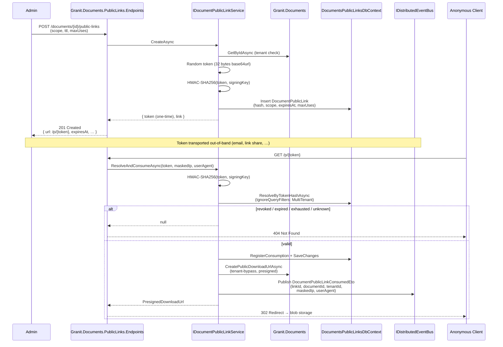

import { Aside } from "@astrojs/starlight/components";

`Granit.Documents.PublicLinks` issues opaque, token-signed URLs that let an
unauthenticated client download or preview a specific document for a bounded
window. The framework owns the token model (random + HMAC-SHA256 at rest),
the TTL / max-uses / revocation semantics, the rate limiter, and the
consumption integration event. Hosts subscribe to the event for persistent
audit logs or SIEM forwarding.

## Why a dedicated public-links module

`Granit.Documents` requires authenticated, permission-gated access. Plenty of
legitimate flows need the opposite: send a contract to a client who has no
account, share an invoice over email, embed a one-shot preview in an
unauthenticated portal. Bolting that on per host produces three incompatible
token schemes, three sets of leak vectors, and three audit gaps.

The public-links module solves it once:

- Random 32-byte opaque token returned to the caller once at create time —
  the database stores only an HMAC-SHA256 hash.
- TTL with a host-configurable cap, optional max-uses counter, hard revocation.
- Anonymous endpoints return **404 for every failure mode** (invalid, expired,
  revoked, exhausted, unknown) — no information disclosure.
- Fixed-window rate limiter keyed on `SHA-256({ip}|{token})` so the token
  never sits plaintext in the partition table.
- Every consumption raises a `DocumentPublicLinkConsumedEto` integration event
  with the masked client IP (/24 for IPv4, /48 for IPv6) and User-Agent —
  enough for forensics, GDPR-compliant by default.

## Architecture

Three packages, mirroring the Documents / Renditions / AssetMetadata split:

- `Granit.Documents.PublicLinks` — domain (`DocumentPublicLink` aggregate),
  `IDocumentPublicLinkService`, options, permissions, events, localization.
- `Granit.Documents.PublicLinks.EntityFrameworkCore` — isolated
  `DocumentsPublicLinksDbContext`, unique index on `TokenHash`, anonymous
  resolution path that bypasses the multi-tenant filter.
- `Granit.Documents.PublicLinks.Endpoints` — admin endpoints (authenticated)
  and anonymous endpoints (`/p/{token}` and `/p/{token}/preview`), opt-in
  rate limiter, masked client context capture.

Architecture boundaries are pinned by `DocumentsPublicLinksArchitectureTests`
(11 tests): no `Microsoft.AspNetCore.*` in the base package, no EF Core in
endpoints, no Wolverine refs in either, and **no `Token` / `TokenHash`
public member** outside an audited allowlist (`PublicLinkToken`,
`DocumentPublicLink`, `PublicLinkTokenFactory`,
`DocumentPublicLinkCreationResult`). Integration events, response DTOs, and
`[LoggerMessage]` templates are forbidden from naming either field.



The 302 redirect keeps the API path stateless — bytes never traverse the
application tier; the storage backend serves them directly with a
short-lived presigned URL.

## The token model

`PublicLinkToken` is a `SingleValueObject<string>` wrapping a 32-byte
base64url-encoded random string. `PublicLinkTokenFactory.GenerateRandom()`
uses `RandomNumberGenerator.GetBytes` (CSPRNG). `ComputeHash(token, pepper)`
is HMAC-SHA256.

The raw token is **returned exactly once** in the create response. The
database stores only the 32-byte HMAC digest in a unique-indexed `bytea`
column. The pepper (`GranitDocumentsPublicLinksOptions.SigningKey`) comes
from Vault in production. An empty pepper at create time throws an
`InvalidOperationException` — the framework refuses to mint tokens that
would be trivially collidable.

There is no token rotation flow: when you need to invalidate a token,
revoke the link. Issuing a new link gives you a fresh token.

## Storage model

```text
documents_public_links
─────────────────────────────────────────────────────────────────
  id                uuid       primary key
  document_id       uuid       FK Granit.Documents.documents.id
  tenant_id         uuid?      FK tenants.id (IMultiTenant)
  token_hash        bytea(32)  UNIQUE — HMAC-SHA256(token, pepper)
  scope             text       Download | View
  expires_at        timestamptz
  max_uses          int?       null = unlimited
  current_uses      int        default 0
  revoked_at        timestamptz?
  revoked_by        uuid?
  revocation_reason text?      max 500
  created_at, created_by, last_modified_at, last_modified_by, …
```

Indexes:

- **Unique** on `token_hash` — anonymous resolution is a single equality lookup.
- `(document_id, revoked_at)` for the admin listing endpoint.
- `(tenant_id, expires_at)` for batch cleanup jobs (host-owned).

The anonymous resolution path calls `IgnoreQueryFilters(GranitFilterNames.MultiTenant)`
because the request has no tenant context — the link carries its own
`TenantId` and the downstream `CreatePublicDownloadUrlAsync` bypasses the
filter on the `documents` table the same way. Every other read on the table
honours the multi-tenant filter.

## Endpoints

| Method | Route | Surface | Permission |
| --- | --- | --- | --- |
| `POST` | `/documents/{id}/public-links` | Admin | `DocumentsPublicLinks.PublicLinks.Create` |
| `GET` | `/documents/{id}/public-links` | Admin | `DocumentsPublicLinks.PublicLinks.Read` |
| `DELETE` | `/public-links/{id}` | Admin | `DocumentsPublicLinks.PublicLinks.Revoke` |
| `GET` | `/p/{token}` | Anonymous | — (token-signed) |
| `GET` | `/p/{token}/preview` | Anonymous | — (token-signed) |

The admin group lives under the configurable `RoutePrefix` (default
`documents`). The anonymous group lives under `AnonymousRoutePrefix`
(default `p`). Both prefixes are exposed on
`DocumentsPublicLinksEndpointsOptions` and overridable per host.

The OpenAPI tag is `Documents - Public Links` (also configurable). The
endpoints attach all five OpenAPI metadata elements (`WithName`,
`WithSummary`, `WithDescription`, `Produces` / `ProducesProblem`,
`WithTags`).

### Failure-mode envelope

The anonymous endpoints return **404** for every link-validation failure
— invalid hash, expired, revoked, max-uses exhausted, document missing,
document not active. No body distinguishes the cases. The admin endpoints
behave conventionally (404 only when the link or document doesn't exist;
403 when permissions don't match; 422 on validation failure).

## Rate limiting

`AddGranitDocumentsPublicLinksRateLimiter` registers a named ASP.NET Core
fixed-window policy (`granit-documents-public-links`). The window is one
minute; the permit limit is `RateLimitPerMinute` from options (default 60).
The partition key is the hex-encoded SHA-256 of `"{client_ip}|{token}"` —
the token never appears verbatim in the partition table.

```csharp
builder.Services.AddGranitDocumentsPublicLinksRateLimiter(builder.Configuration);
// …
app.UseRateLimiter();
```

The endpoint extension attaches `RequireRateLimiting(PolicyName)` metadata
on the anonymous group unconditionally; the policy metadata is harmless
when the host doesn't wire `UseRateLimiter`, so framework consumers
opt in by call site rather than by feature flag.

## Consumption audit

Every successful redemption publishes a `DocumentPublicLinkConsumedEto`
**after** the consumption row is durably persisted, so a Wolverine-outbox
host commits the message atomically with the `current_uses` increment:

```csharp
public sealed record DocumentPublicLinkConsumedEto(
    Guid LinkId,
    Guid DocumentId,
    Guid? TenantId,
    DateTimeOffset ConsumedAt,
    int CurrentUses,
    string? ClientIpMasked,
    string? UserAgent) : IIntegrationEvent;
```

The IP is masked to /24 (IPv4) or /48 (IPv6) by `IpAddressAnonymizer`
before it reaches the event — meets GDPR data-minimisation without losing
the geolocation precision needed for fraud forensics. The User-Agent is
passed through verbatim.

The framework ships **no persistent audit table**. Hosts subscribe to the
integration event from their audit module, SIEM forwarder, or a Wolverine
handler in the application:

```csharp
public sealed class PublicLinkAuditHandler
{
    public static Task HandleAsync(
        DocumentPublicLinkConsumedEto evt,
        IPublicLinkAuditLog log,
        CancellationToken ct) =>
        log.AppendAsync(evt, ct);
}
```

This keeps retention policy, redaction rules, and SIEM routing out of the
framework. Domain events (`DocumentPublicLinkCreatedEvent`,
`DocumentPublicLinkRevokedEvent`, `DocumentPublicLinkConsumedEvent`) are
raised through the aggregate in addition to the integration ETOs — local
handlers (metrics, projections) can subscribe in-process without paying
the outbox round-trip.

## Configuration

```json
{
  "Granit": {
    "Documents": {
      "PublicLinks": {
        "DefaultTtl": "7.00:00:00",
        "MaxTtl": "90.00:00:00",
        "DefaultMaxUses": null,
        "RateLimitPerMinute": 60,
        "SigningKey": "<bound from Vault — 32+ bytes>"
      }
    }
  }
}
```

`SigningKey` is the HMAC pepper. Bind it from Vault via the standard
`VaultSharp` integration — never commit it. The service refuses to mint
tokens when the key is empty.

## Permissions

Three permissions under the `DocumentsPublicLinks` group:

- `DocumentsPublicLinks.PublicLinks.Create`
- `DocumentsPublicLinks.PublicLinks.Read`
- `DocumentsPublicLinks.PublicLinks.Revoke`

Localized in all 18 supported cultures (`Granit.Documents.PublicLinks/Localization/`).
The anonymous endpoints carry no permission — they are gated by token
possession alone.

## Diagnostics

- Meter `Granit.Documents.PublicLinks` with counters
  `granit.documents.public_links.links.created`,
  `granit.documents.public_links.links.revoked`,
  `granit.documents.public_links.links.consumed`.
- `ActivitySource` `Granit.Documents.PublicLinks` registered via
  `GranitActivitySourceRegistry`.
- All log calls go through `[LoggerMessage]`; templates reference
  `LinkId` / `DocumentId` only — never `Token` or `TokenHash`.

## Security posture

| Concern | Mitigation |
| --- | --- |
| Token disclosure at rest | Only HMAC-SHA256(token, pepper) stored — irreversible without the Vault pepper. |
| Token disclosure in logs | Architecture test forbids `Token` / `TokenHash` in `[LoggerMessage]` templates. |
| Token disclosure on integration events | Architecture test forbids public `Token` / `TokenHash` on ETOs and response DTOs. |
| Brute-force enumeration | Random 32-byte token (256 bits) + per-IP fixed-window rate limit + 404 on all failures. |
| Information disclosure on miss | Anonymous endpoints return identical 404 for invalid / expired / revoked / exhausted / unknown links. |
| Cross-tenant access | Anonymous resolution bypasses the tenant filter intentionally; the link carries its own `TenantId` and the presigned URL inherits it. |
| Replay after revocation | `RevokedAt` is checked on every resolution; revocation takes effect at the next request. |
| GPS / PII in served bytes | Out of scope — see [Documents — Asset Metadata](/dotnet/business/documents-asset-metadata/) for the synchronous GPS scrub on upload. |

## Architecture boundary tests

`DocumentsPublicLinksArchitectureTests` (11 tests) pin:

1. Base package has no `Microsoft.AspNetCore.*` reference.
2. Base package has no `Microsoft.EntityFrameworkCore` reference.
3. Base package has no `WolverineFx*` reference.
4. EFC package has no `Microsoft.AspNetCore.*` reference.
5. EFC package has no `WolverineFx*` reference.
6. Endpoints package has no `Microsoft.EntityFrameworkCore` reference.
7. Endpoints package has no `WolverineFx*` reference.
8. No public `Token` / `TokenHash` member outside the audited allowlist.
9. No `[LoggerMessage]` template mentions `Token` or `TokenHash`.
10. Every `*PublicLinkService` implementation implements
    `IDocumentPublicLinkService`.
11. The base aggregate exposes no public setter for token-bearing state.

`DocumentPublicLink` is exempted from `Query` / `Export` / `Metric` pairing
(`[INFRA]` — anonymous link entity surfaced via dedicated endpoints, no
admin grid or business KPI surface).

## Related

- [Documents](/dotnet/business/documents/) — the underlying document /
  version / blob domain.
- [Documents — Renditions](/dotnet/business/documents-renditions/) — derived
  previews; complementary surface to public links.
- [Documents — Asset Metadata](/dotnet/business/documents-asset-metadata/) —
  GPS scrub and descriptive-metadata extraction.
- [ADR-017 — DDD aggregate / value-object strategy](/dotnet/architecture/adr/017-ddd-aggregate-value-object-strategy/) —
  the aggregate-root rules `DocumentPublicLink` follows.
